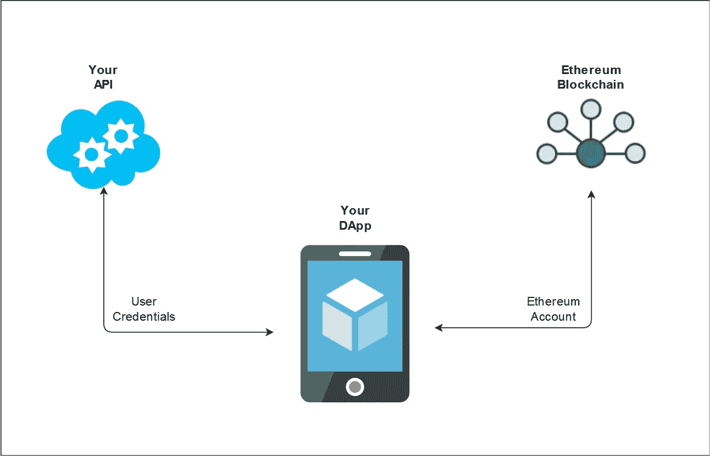
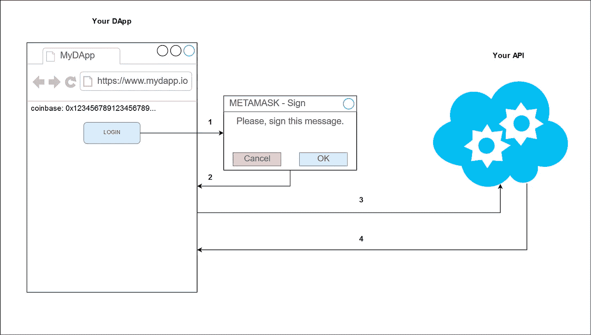
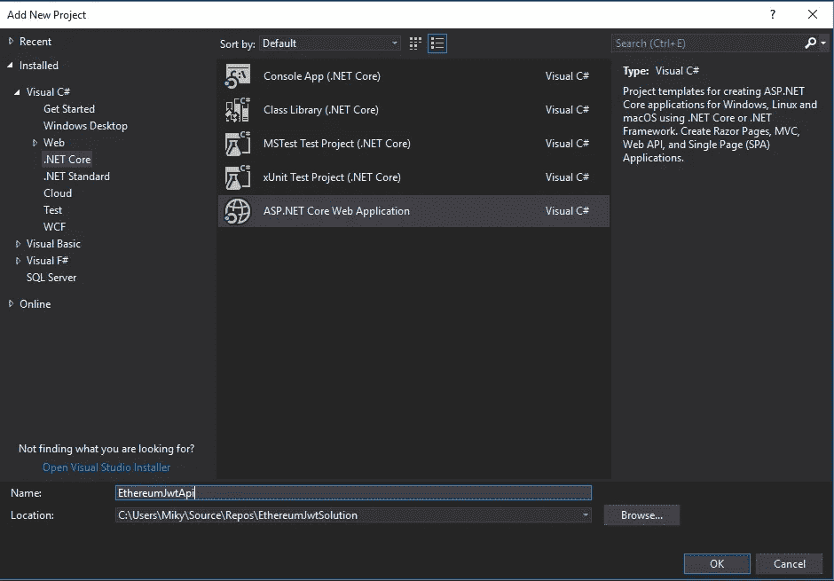
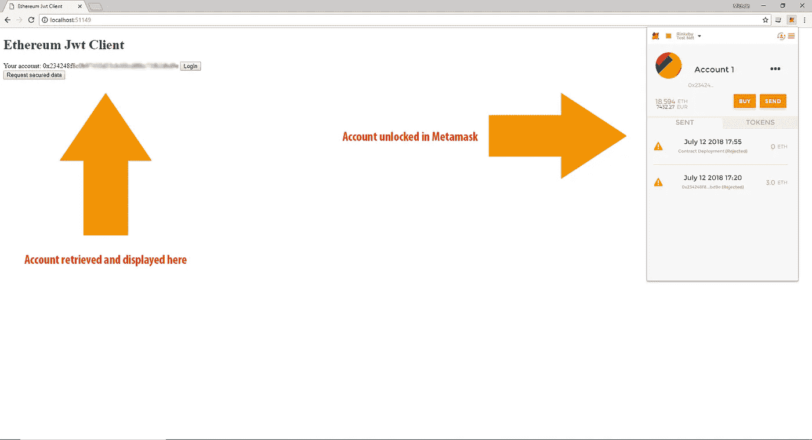
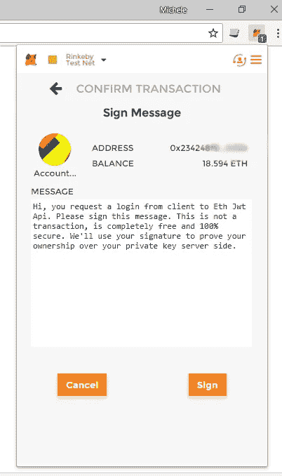
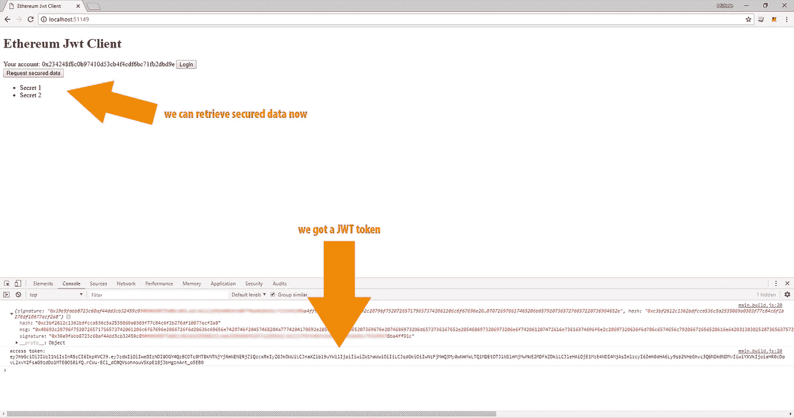

# 使用以太坊区块链保护 Asp.Net 核心 2 API

> 原文：<https://medium.com/coinmonks/secure-asp-net-core-2-api-with-ethereum-blockchain-88001d5ddb6?source=collection_archive---------2----------------------->

# 问题是

分散式应用程序(DApp)的一个常见设计不仅依赖于以太坊区块链，还依赖于 API 层。在这种情况下，DApp 通过用户的以太坊帐户与智能合约交互，并通过交换用户凭证而颁发的 JWT 令牌与 API 层交互。

A typical DApp architecture

目标是**使用以太坊账户作为用户凭证**来请求 JWT 令牌。

一种可能的最简单的方法是请求用户在以太坊上用额外的随机生成的数据进行交易，然后在发布 JWT 之前检查交易和随机数据。这种方法有几个副作用:

1.  用户必须进行交易并支付 ***气体*** 进行简单的认证。
2.  用户必须等待 12-120 秒(基于消耗的气体)才能完成认证过程。
3.  在以太坊区块链，每个用户的所有登录操作都变成了不变的公开。

这种方式是不实际的，并且具有几个用户体验限制，我们需要一种方式来让用户证明她/他拥有与她/他想要用来登录的帐户相关的私钥，而(当然)不要求私钥并且不要求她/他进行交易。

# 解决方案

这篇教程的灵感来自 Metamask 团队成员 [Dan Finlay](/@danfinlay) 的[帖子](/metamask/the-new-secure-way-to-sign-data-in-your-browser-6af9dd2a1527)。基本上，您的 DApp 可以提示用户使用他的私钥签署文本消息。这个签名操作不会生成事务，它由 Metamask 插件透明地处理(顺便说一句，您的帐户需要解锁)。签名后，帐户、消息和签名将被发送到 API 令牌端点。身份验证方法首先通过一个接受签名和普通消息作为输入的函数，从签名中推断出帐户(即公钥)。如果计算出的以太坊地址等于用户提供的账户，则为该账户发放一个 JWT 令牌。

值得注意的是，整个身份验证流程不需要询问用户名/密码或 OAuth 外部服务。用来验证用户身份的机制与以太坊用来保证区块链以太坊安全性的机制相同。这要归功于 Go Ethereum (Geth)通过 Metamask 插件提供的**web 3 . personal . sign**JSON RPC。

服务器端调用对应的 JSON RPC 从签名中检索帐户:**web 3 . personal . ecrecover**。在本教程中，我们将构建一个 Asp.Net Core 2 项目作为 API 层，并构建一个简单的 HTML/javascript 客户端作为 DApp 来实际演示这个认证过程。

Authentication flow

1.  从 DApp 用户点击登录按钮。这需要 Metamask 提供的 web3 对象。
2.  Metamask 要求用户通过**web 3 . personal . sign**JSON RPC 对消息进行签名。
3.  签名被发送到 API 层，API 层通过**web 3 . personal . ecrecover**JSON RPC 验证账户。
4.  一旦通过验证，API 层就发布 JWT。

# 先决条件

1.  为 Chrome 或 Firefox 安装 [Metamask 插件](https://metamask.io/)。这个插件“*为你的浏览器带来以太坊*。实际上，Metamask 提供了一个 [**web3**](https://github.com/ethereum/web3.js/) 对象，用于从您的 DApp 与以太坊区块链进行交互，保管您的私钥并管理浏览器内的事务。
2.  可选。运行一个 [Geth](https://github.com/ethereum/go-ethereum) 节点。我将向您展示两种从签名中恢复以太坊帐户的方法，其中一种方法要求您的 API 层针对 Geth 节点调用 JSON RPC。
    注意: **Infura** 目前还不够，因为他们不允许大部分 web3.personal.* JSON RPC。出于开发目的，运行 Geth 节点非常简单。在生产环境中，由于安全问题，运行 Geth 节点不是一项简单的任务。最好的办法是依靠由 [AWS](https://aws.amazon.com/it/blockchain/templates/) 或 [Azure](https://azure.microsoft.com/en-us/solutions/blockchain/) 提供的区块链即服务(BaaS)栈。
3.  开发栈: **Visual studio 2017** 和节点包管理器( **NPM** )。
4.  以太坊/Asp 基础知识。Net 核心/前端开发，JWT 认证流程基础知识。

# 我们开始吧！

打开 Visual Studio 2017，创建 EthereumJwtSolution 并添加两个**Asp.Net Core 2 Web 应用**项目: **EthereumJwtApi** 和 **EthereumJwtClient** 。为两个项目选择空的项目脚手架。

Create two Asp.Net Core 2 Web Application

**EthereumJwtClient** 只是一个 HTML/Javascript 客户端。我们将在 Asp.Net 核心之上构建客户端应用程序，以便在 IIS Express 上轻松运行。

为了保护某个安全端点，我们需要准备 EthereumJwtApi 来创建和处理 JWT 令牌。这项任务非常简单，因为 Asp.Net Core 2 有一个内置的 JWT 机制，可以随时插入我们的应用中。打开 *Startup.cs* ，修改 *ConfigureServices* 方法:

然后修改*配置*的方法:

我们告诉我们的 API 应用程序使用 **JWT 认证**服务。为了与我们的客户合作，我们还需要配置一个 **Cors** 策略。我们在 *appsetting.json* 中定义 JWT 配置设置:

为测试目的创建一个简单的可能的安全端点:

*TokenController.cs* 将处理 JWT 请求和相关的令牌问题:

这是一个典型的 JWT 控制器，其核心方法*认证*和*认证 2* 尚未实现。一旦实现，他们将做同样的工作:从签名中恢复以太坊地址，并检查它是否等于客户端提供的以太坊地址。

*LoginVM* 代表客户端提供的用户凭证， *UserVM* 代表“*服务器端*”登录用户:

*Authenticate* 方法将把**签名**和**消息**属性作为 **ecRecover** 函数的输入，而 *Authenticate2* 方法将把**签名**和 **Hash** 属性作为替代。我稍后会解释不同之处。

# 客户

正如我们所说，我们的 DApp 是一个简单的 HTML/ES6 客户端。我们将在 Asp.Net Core 2 之上构建客户端，以便利用 **IIS Express** 和 **Visual Studio IDE** 。因此， *Startup.cs* 类中的 *Configure* 方法将是:

使 DApp 成为一个 **NPM** 项目，并安装使用 ES6 Javascript 标准的先决条件。这不是强制性的，请随意使用您自己的堆栈来构建您的 DApp。

从项目文件夹运行 Powershell，并运行以下 NPM 命令:

为了配置 webpack/babel，使用以下配置创建 *webpack.config.js* 文件:

我们已经指示 webpack 将 *src/main.js* 文件构建到 */www/js/main.build.js* 。

安装以太坊特定包:

Web3 是一个 javascript 包装器，它简化了针对以太坊区块链的 JSON RPC 调用。**以太坊 js-util** 提供了一些以太坊特有的实用工具。

让我们构建一个非常简单的 HTML 页面。我们需要一个登录按钮和另一个按钮来从我们的 API 层加载一些安全数据:

正如我们在 *webpack.config.js* 文件中指定的那样，DApp 逻辑将驻留在 src/main.js 文件中。 *src/main.js* 文件将是:

1.  **coinbase** 和 **accessToken** 是分别存储用户以太坊账号和 JWT 令牌的全局变量。
2.  **init** 函数从 Metamask 提供的提供者中初始化 web3 对象，然后它尝试检索用户的帐户(coinbase)。这需要您在 Metamask 中解锁您的帐户签名。
3.  **require** 函数只是一个包装 *hxr* 对象的包装器，使 ajax 能够轻松调用 API 层。
4.  **load_data_btn** click 处理程序对 API 层安全端点进行 ajax 调用。这需要有效的 accessToken 才能工作，否则，API 层将使用 401 HTTP 响应进行响应。
5.  **login_btn** 点击是一个两步功能。首先，它要求用户签署任意消息。签名后，它将帐户、签名、普通消息和带前缀的哈希发送到令牌端点。

注意 **web3.personal.sign** 将十六进制格式(0x…)的普通字符串的字节数组作为输入。

正如我们所说的，在服务器端，我们将使用两种不同的方法从签名中恢复公钥:一种方法是使用**web 3 . personal . ecrecover**JSON RPC(对应的**web 3 . personal . sign**)；在另一个例子中，我们将使用一个底层的 **ecrecover** 离线函数。根据文档， **web3.personal.sign** 使用底层的 **sign** 函数来签署一个散列的带前缀的消息，因此，为了使用底层的 **ecrecover** 对应函数，我们也需要计算这个散列并将其发送到令牌端点。

运行这两个应用程序，并使用安装了 Metamask 附加组件的浏览器导航到客户端。请记住，为了将 *src/main.js* 文件构建到 *js/main.build.js* 中，您需要从 Powershell 运行 **webpack** 命令。如果一切正常，客户端将检索 coinbase，您将看到您的帐户显示在页面上:

The working DApp index page

如果您现在点击请求数据按钮，您将得到一个 401 HTTP 响应。如果您单击登录按钮，Metamask 将提示您一个签名请求:

Metamask sign prompt

签名后，处理程序将对令牌端点进行 ajax 调用。在这一阶段，身份验证方法不会检查任何签名，因此端点将始终颁发 JWT 令牌。一旦收到 JWT 令牌，客户机就能够通过 ajax 调用安全端点。如果您现在单击请求数据按钮，您将收到 200 HTTP 响应和您的数据有效负载:

We got a JWT token so we are able to make authorized api call

# 从签名中检索以太坊帐户

到目前为止， **EthereumJwtApi** 是一个简单的 Asp.Net JWT 核心样本，因为它没有提供任何有效的认证方法。

令牌控制器的关键部分是两种身份验证方法及其从签名中检索以太坊帐户的能力。为了做到这一点，你需要安装**尼瑟姆。Web3** NuGet 包。尼日坊是以太坊的. Net 实现。

*认证*方法简单地对 **web3.personal.ecrecover** 函数进行 JSON RPC 调用:

**亲:**

1.  **web3.personal.sign** 是 **web3.personal.sign** 的对应物，所以你不需要担心它的底层实现。

**CONS:**

1.  需要自己的 Geth 节点。不支持奇偶校验，Infura 不允许 web3.personal.* JSON RPC。

*Authenticate2* 方法展示了一种替代方式，它使用底层 **ecrecover** 函数的离线实现:

**亲:**

1.  不需要 JSON RPC 调用就能工作。消息签名者。EcRecover 是**尼瑟姆**提供的离线功能。

CONS:

1.  你需要注意 web3.personal.sign 的实现，以便正确地恢复帐户。因此，在客户端，我们相应地计算了带前缀的消息哈希。

# 结论

现在你有了知识和一个主干项目来用以太坊保护你的 Asp.Net 核心 2 API。只有几个注意事项:

1.  **web3 1.0.0** 处于测试阶段， **web3.personal.sign** 的实现可能会随着时间的推移而变化。请确保在您可以维护的代码库上使用这种身份验证方法。
2.  也许 Infura 可以在这几天决定允许**web 3 . personal . ecrecover**；-)