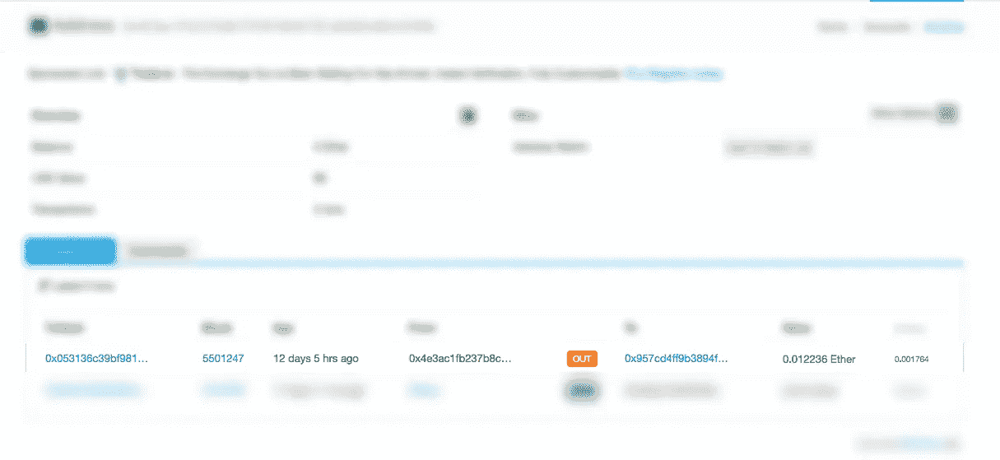
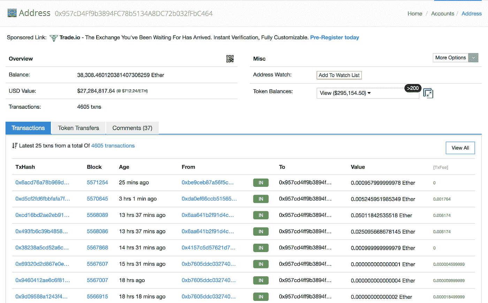

# 保护您的以太坊节点 RPC 免受黑客攻击

> 原文：<https://medium.com/coinmonks/securing-your-ethereum-nodes-from-hackers-8b7d5bac8986?source=collection_archive---------1----------------------->

> 保护计算机系统传统上是一场智慧之战:入侵者试图找到漏洞，设计者试图封闭它们。—戈瑟

最近一个朋友的以太坊节点被“黑”了，他存放在 Geth 钱包里的以太通过一个暴露的 RPC 端口命令被转移走了，转移可以在下面看到。



Friends Account

下图显示了黑客账户最近的转账情况



Hacker’s Account

与大多数比特币客户端不同，默认情况下，大多数以太坊客户端 RPC 没有密码保护。

尽管如此，保护以太坊节点 RPC 的方法有很多种。

这些方法包括:

1.  为帐户选择强密码
2.  使用 Nginx 作为反向代理和 HTTP 基本认证
3.  使用 UFW 设置防火墙

> [发现并回顾最佳区块链 api 和节点产品](https://coincodecap.com/category/blockchain-node-and-api)

**安装以太坊客户端**

以太坊有两大客户端 Parity 和 Geth。安装任何一个都可以很好地与以太坊网络交互。

您可以按照以下文章进行安装:

*   [https://github . com/以太坊/go-以太坊/wiki/Installing-Geth](https://github.com/ethereum/go-ethereum/wiki/Installing-Geth)
*   [https://wiki.parity.io/Setup](https://wiki.parity.io/Setup)

# **配置您的节点**

## **千万不要这样做！！！**

在 GETH 节点上启用 RPC 访问时，不应该在帐户未锁定的情况下允许外部访问 RPC。例如

```
$ geth — rpc — rpcaddr 0.0.0.0 — rpcport 8545 — rpcapi “db, eth, net, web3, personal” — ipcapi “admin,eth,debug,personal,web3” — unlock <addrs>
```

你基本上是允许外部访问你的以太坊账户，当你解锁你的账户时，攻击者可以很容易地转移你钱包里的以太。

由于这个错误，人们被黑客攻击的例子

*   [https://以太坊. stack exchange . com/questions/3887/如何降低你的以太坊钱包被黑的几率？UTM _ medium = organic&UTM _ source = Google _ rich _ QA&UTM _ campaign = Google _ rich _ QA](https://ethereum.stackexchange.com/questions/3887/how-to-reduce-the-chances-of-your-ethereum-wallet-getting-hacked?utm_medium=organic&utm_source=google_rich_qa&utm_campaign=google_rich_qa)
*   还有我的朋友:)

# **保护您的以太坊节点**

# **1。为帐户选择强随机密码**

在奇偶校验或 Geth 上创建帐户时，选择一个强而随机的密码。用户可以从以下站点生成密码:

1.  [https://passwordsgenerator.net/](https://passwordsgenerator.net/)
2.  [https://lastpass.com/generatepassword.php](https://lastpass.com/generatepassword.php)
3.  [https://www.random.org/passwords/](https://www.random.org/passwords/)

# **2。使用 Nginx HTTP 基本认证**

**安装 Nginx**

你需要在你的服务器上安装和配置 Nginx，你可以按照这篇 Nginx 文章中的[来做。](https://www.digitalocean.com/community/tutorials/how-to-install-nginx-on-ubuntu-14-04-lts)

**设置 HTTP Auth 基本凭证** 在这一步中，您将为运行该节点的用户创建一个密码。

该密码和关联的用户名将存储在您指定的文件中。密码将被加密，文件名可以是您喜欢的任何名称。

```
$ sudo htpasswd -c /etc/nginx/.htpasswd nginx
```

您可以检查新创建的文件的内容，以查看用户名和散列密码。

```
$ cat /etc/nginx/.htpasswd
```

**更新 Nginx 配置**

现在我们已经创建了 HTTP 基本身份验证凭证，下一步是更新 Nginx 配置以查看它。

```
$ sudo nano /etc/nginx/sites-available/default
```

更新文件以包含这些内容

```
server {
 listen 80;
 listen [::]:80;
 # ADDED THESE TWO LINES FOR AUTHENTICATIONauth_basic “Protected Ethereum client”;auth_basic_user_file /path/to/passwords; 
 server_name example.com; location / {
      proxy_pass [http://localhost:8545/](http://localhost:3000/);
      proxy_set_header Host $host; }}
```

**测试**

要应用这些更改，首先要重新加载 Nginx。

```
$ sudo service nginx reload
```

您现在可以在以下位置访问 RPC url

http://<username>:<password>@ my domain . com</password></username>

**改进**

你也可以安装一个免费的 SSL 证书，可以从 letsencrypt 获得，你可以在这里找到教程。[链接此处](https://www.digitalocean.com/community/tutorials/how-to-secure-nginx-with-let-s-encrypt-on-ubuntu-16-04)

# **3。使用 UFW 设置防火墙**

UFW 或简单防火墙是 iptables 的一个接口，旨在简化防火墙的配置过程。

**安装 UFW**

```
$ sudo apt-get install ufw
```

**设置默认策略**

```
$ sudo ufw default deny incoming
$ sudo ufw default allow outgoing
```

**允许以太坊网络端口**

我们还将启用以太网，这样我们的节点就可以与公共区块链网络进行通信和同步。

以太坊网络端口是 30303，

```
$ sudo ufw allow **30303**
```

**启用 RPC 端口**

我们将只允许从我们信任的节点连接到我们的以太坊客户端。以太坊端口的默认 RPC 端口是 8545。

```
**$** sudo ufw allow from <IP addr> to any port 8545
```

例如，如果我的外部服务器 IP 地址是 192.148.16.1

```
$ sudo ufw allow from 192.148.16.1 to any port 8545
```

如果您使用不同于 8545 的 RPC 端口，那么应该指定它。

**启用 UFW**

为了让 UFW

```
$ sudo ufw enable
```

**允许其他连接**

您也可以根据需要启用其他端口，例如

**HTTP —端口 80**

HTTP 连接是未加密的 web 服务器使用的连接，可以使用以下命令:

```
$ sudo ufw allow http
```

您的防火墙现在应该配置为允许连接到以太坊 RPC 和网络端口。请确保允许您的服务器需要的任何其他传入连接，同时限制任何不必要的连接，以便您的服务器能够正常工作并且安全。

# **结论:**

安全是区块链生态系统中的一个主要话题。到处都有黑客想偷走你的硬币。

在外面注意安全。

# **延伸阅读:**

[](https://www.digitalocean.com/community/tutorials/how-to-set-up-a-firewall-with-ufw-on-ubuntu-14-04) [## 如何在 Ubuntu 14.04 上用 UFW 设置防火墙| DigitalOcean

### UFW，或简单防火墙，是 iptables 的接口，旨在简化…

www.digitalocean.com](https://www.digitalocean.com/community/tutorials/how-to-set-up-a-firewall-with-ufw-on-ubuntu-14-04)  [## ufw 允许来自特定端口上的特定 IP

### ufw 是 Debian 和 Ubuntu 中友好的命令行防火墙工具。我将向您展示如何创建一个特定的规则…

scottlinux.com](https://scottlinux.com/2011/10/10/ufw-allow-from-specific-ip-on-specific-port/)  [## 网络端口、文件和目录-以太坊维基

### 此页面包含以太坊软件常用的文件和目录的默认位置:

theethereum.wiki](https://theethereum.wiki/w/index.php/Network_Ports,_Files_And_Directories#Network_Listening_Port_2) 

[https://www . digital ocean . com/community/tutorials/how-to-secure-nginx-with-let-s-encrypt-on-Ubuntu-16-04](https://www.digitalocean.com/community/tutorials/how-to-secure-nginx-with-let-s-encrypt-on-ubuntu-16-04)

[https://www . Li node . com/docs/we B- servers/nginx/use-nginx-reverse-proxy/](https://www.linode.com/docs/web-servers/nginx/use-nginx-reverse-proxy/)

> 加入 Coinmonks [电报频道](https://t.me/coincodecap)和 [Youtube 频道](https://www.youtube.com/c/coinmonks/videos)获取每日[加密新闻](http://coincodecap.com/)

## 另外，阅读

*   [复制交易](/coinmonks/top-10-crypto-copy-trading-platforms-for-beginners-d0c37c7d698c) | [加密税务软件](/coinmonks/crypto-tax-software-ed4b4810e338)
*   [网格交易](https://coincodecap.com/grid-trading) | [加密硬件钱包](/coinmonks/the-best-cryptocurrency-hardware-wallets-of-2020-e28b1c124069)
*   [密码电报信号](http://Top 4 Telegram Channels for Crypto Traders) | [密码交易机器人](/coinmonks/crypto-trading-bot-c2ffce8acb2a)
*   [有哪些交易信号？](https://coincodecap.com/trading-signal) | [比特斯坦普 vs 比特币基地](https://coincodecap.com/bitstamp-coinbase)
*   [ProfitFarmers 回顾](https://coincodecap.com/profitfarmers-review) | [如何使用 Cornix 交易机器人](https://coincodecap.com/cornix-trading-bot)
*   [如何在势不可挡的域名上购买域名？](https://coincodecap.com/buy-domain-on-unstoppable-domains)
*   [印度的加密税](https://coincodecap.com/crypto-tax-india) | [altFINS 审查](https://coincodecap.com/altfins-review) | [Prokey 审查](/coinmonks/prokey-review-26611173c13c)
*   [最佳加密交易所](/coinmonks/crypto-exchange-dd2f9d6f3769) | [印度最佳加密交易所](/coinmonks/bitcoin-exchange-in-india-7f1fe79715c9)
*   [开发人员的最佳加密 API](/coinmonks/best-crypto-apis-for-developers-5efe3a597a9f)
*   最佳[密码借贷平台](/coinmonks/top-5-crypto-lending-platforms-in-2020-that-you-need-to-know-a1b675cec3fa)
*   杠杆代币的终极指南