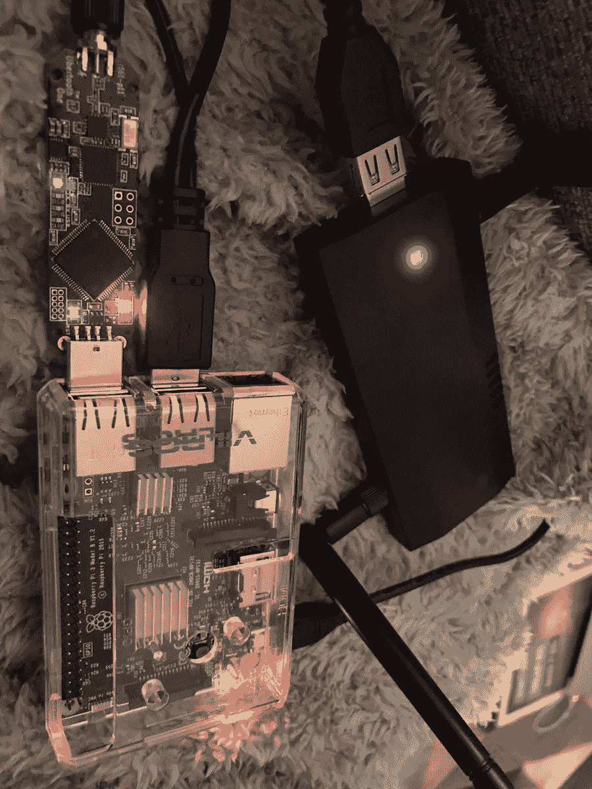

# R-PI 的安全性测试

> 原文：<https://medium.com/coinmonks/security-testing-on-a-r-pi-4c0c37658218?source=collection_archive---------3----------------------->

让 Windows 和英特尔靠边站吧……这个新世界属于 Linux 和 ARM。x86 的日子(yuk！)正在退去，命令行再次为王！

Raspberry Pi (R-PI)是一个很棒的设备，我在演示中用它和 Ubuntu 一起使用。我现在有很多新的演示即将推出，它们将比过去更加深入。除此之外，我们还有一些新的研究…