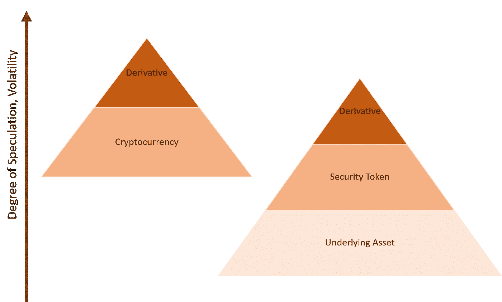
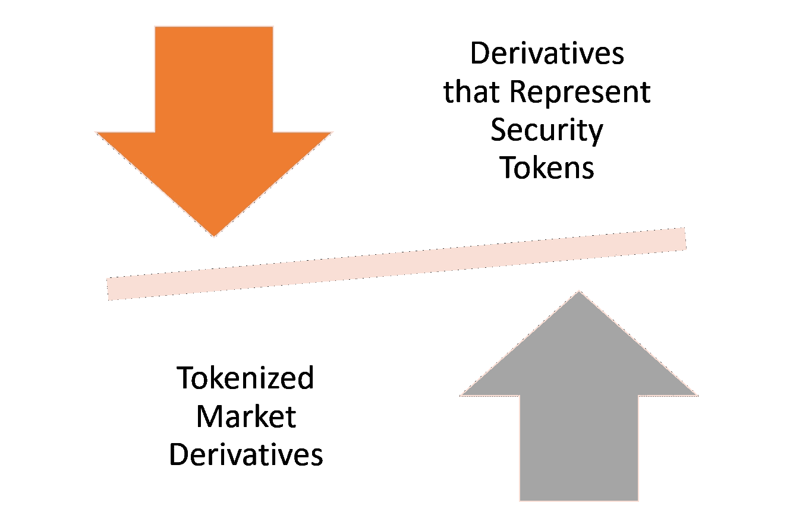

# 安全令牌衍生品即将推出

> 原文：<https://medium.com/coinmonks/security-token-derivatives-are-coming-8439555e7e5a?source=collection_archive---------3----------------------->

几天前，我和一群基金经理进行了一次非常有趣的讨论，内容是关于安全令牌在新一代加密资产衍生品中所扮演的角色。辩论中出现了许多有趣的观点，我想在今天的帖子中总结其中一些。

金融衍生品长期以来一直是新兴加密资产领域中缺失的元素。尽管在芝加哥商品交易所和芝加哥期权交易所推出比特币期货提高了人们对加密衍生品未来的很多期望，但它的采用受到了限制。当然，像 Firmo.network 或 T2 Variabl 这样的项目看起来非常可靠，但是它们仍然需要努力成为主流。在我看来，加密资产一直缺乏构建广泛采用的市场衍生品所需的一些基本构件。安全令牌的出现可能会填补一些缺失的空白，并为第一代基于加密资产的主流衍生品打开大门。

# 为什么密码资产衍生品至今失败了？

有许多因素导致了加密资产衍生品的缺乏，但在我看来，有两个因素对这一市场动态至关重要。第一，加密衍生品代表了在已经不稳定的加密资产之上的第二层不稳定和投机。想想看，推动加密货币价格的主要因素是新闻和市场投机，没有简单的方法来预测这两者中的任何一个。如果我们在此基础上添加一个数学模型，我们实际上是在另一个投机/波动工具上添加了一个投机/波动工具。绝对有可能，但不是开始使用加密衍生品的最有吸引力的想法。

第二个因素是，为了提供一个流动性强、充满活力的生态系统，既懂金融衍生品又懂加密货币的投资者数量很少。利用衍生产品的投资者数量只是市场的一小部分。从那些了解加密资产的群体来看，这是一个非常小的数字。到目前为止，这是我们的目标市场。

# 安全令牌是衍生品吗？

你可以提出这样的论点，任何形式的证券都可以被认为是一种衍生工具，其价值来源于基础资产的表现。然而，传统的衍生模型包括其他方面，如时间约束、义务对称性或结算模型，这些都不太符合证券令牌的特征。目前，让我们假设有一些证券代币可以表现得像衍生品，而其他代币的交易更像一级资产类别。

# 衍生品和证券代币

安全令牌作为一种新的资产类别的出现可能是可行的加密衍生品出现的缺失成分。有几个因素证明了这一假设，包括以下一些因素:

1) **监管:**从代币到交易所，证券代币将成为受监管的载体，为投资者提供充分的保护。基于这些资产的衍生品可能会对传统金融市场产生更大的吸引力。

2) **稳定的基础资产:**基于房地产资产、艺术品或私人公司股票的证券代币，其行为应与基础资产相关，具有相对可预测性。在这些证券令牌的基础上构建衍生品，在可预测/稳定的资产之上增加了一层数学投机，这是金融市场理解的模型。

3) **价格可预测性:**作为对前一点的补充，基于证券代币的衍生品将自动受益于当今存在的许多预测和评估替代资产类别(如房地产)价格或私人公司市场估值的机制。这应该会增加这种新金融产品在传统投资者眼中的吸引力。

4) **扩大投资者足迹:**基于证券代币的衍生模型将允许量化投资者利用他们目前在这一新资产类别中使用的产品和工具。从这个角度来看，我认为安全令牌衍生品将吸引一批新的投资者，他们一直远离比特币期货和其他加密衍生品的投机。

# 我们可能会看到什么类型的安全令牌衍生物？

随着证券代币市场的发展，短期内可能会出现几种衍生产品。有趣的是，我相信我们将会看到代表证券代币的一代衍生工具模型，以及第一批代币化的市场衍生工具。

**代表证券代币的衍生工具:**这些是对基础证券代币价格进行投机的数学模型，可以代表替代资产，如房地产、艺术品、私人股份、钻石或许多其他资产。

**代表市场衍生品的安全令牌:**我们可以将一切都令牌化，因此有理由为代表期权或期货等市场衍生品的令牌做准备。

什么类型的安全令牌衍生物将在第一波中出现？这里有一些想法:

a) **远期期货模型:**根据金融市场中的远期或期货衍生品模型，我们可以设想智能合同，该合同规定了在指定的未来时间以事先商定的价格买卖证券的标准。如果在集中交易所交易，这种证券令牌衍生工具可以遵循期货模型，如果在分散交易所交易，则遵循远期模型。

b) **期权模型:**期权为证券代币衍生品提供了另一个强大的灵感。在这种模式下，证券权标的期权的所有者有权利但没有义务在特定的日期以特定的价格购买或出售基础证券权标的。

c)**ETF 模型:**关于交易所交易基金(ETF)是否是衍生品的争论超出了本文的范围，但毫无疑问，ETF 模型对于证券来说是非常可行的。我们可以设想类似 ETF 的证券代币，代表一组基础资产的价值，如房地产租赁、贷款或不同公司的私人股份。

d) **互换模型:**像金融市场中的互换模型一样，我们可以设想证券代币衍生产品，它们交换由两种不同的证券代币产生的股息或现金流，以作为针对未来市场条件的对冲或保险。

随着证券代币的出现，还有许多其他类型的衍生工具也变得重要起来。这个市场的发展需要时间，但至少，现在我们有了一种新形式的加密资产(安全令牌)，似乎为加密衍生产品的主流采用提供了正确的基础。

