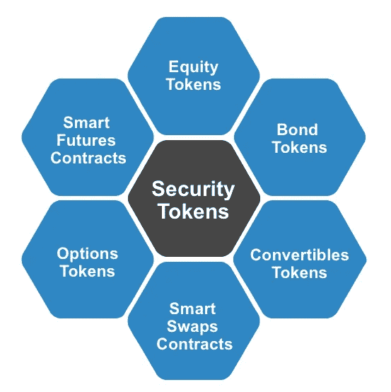

# 安全令牌:一般理解

> 原文：<https://medium.com/coinmonks/security-tokens-a-general-understanding-880bf6cec152?source=collection_archive---------5----------------------->

## ***这些代币是什么类型的，有什么历史，有什么好处？***

Photo by [Andre Francois](https://unsplash.com/@silverhousehd?utm_source=medium&utm_medium=referral) on [Unsplash](https://unsplash.com?utm_source=medium&utm_medium=referral)

当谈到描述数字资产的类型时，您可能听说过或在报纸上读到过“加密货币”或“公用令牌”这样的词。加密货币暗示了充当货币的愿望——想想[比特币](https://coinmarketcap.com/currencies/bitcoin/)、[莱特币](https://coinmarketcap.com/currencies/litecoin/)、 [Monero](https://coinmarketcap.com/currencies/monero/) ，甚至稳定币[戴](https://coinmarketcap.com/currencies/dai/)。至于[实用令牌](/coinmonks/utility-tokens-a-general-understanding-f6a5f9699cc0)，我之前的帖子解释了它们是什么，以及它们如何在密码圈内运行。

安全令牌是另一种类型的数字资产，或者我喜欢称之为加密资产，最近受到了相当多的关注。

安全令牌本质上是任何已经有价值的资产的一部分的数字合同，如房地产、车辆或艺术品。安全令牌也是金融证券的数字合同。安全令牌可以采取以下任何类型的金融证券的形式:

Different types of security tokens

上图显示了 cryptosphere 现在是如何考虑安全令牌的，但是围绕安全令牌的对话已经经历了几个阶段。

**围绕安全令牌的对话历史**

最初，关于安全令牌的讨论围绕着 ico 是否会被 SEC 视为证券。许多区块链公司过去和现在都在通过 ico 发行代币，以避免将代币注册为证券。大卫·戈鲍德的这篇文章[很好地概述了 ico 的监管情况，尽管它有点过时。](/cryptos-today/icos-and-the-saft-why-what-and-how-9dee58cc0059)

关于证券令牌的讨论随后转向将风险资本和/或私募股权基金令牌化，以向其有限合伙人提供流动性，这些有限合伙人通常会将其资本冻结 7 至 10 年。[区块链资本对这种方法进行了试验](https://www.wsj.com/articles/after-ico-experiment-blockchain-capital-reverts-to-standard-vc-fund-structure-1521767213)，但又回到了标准结构，因为他们的有限合伙人不具备处理其令牌化投资的自我托管能力。

最近的讨论焦点(也是我认为最有趣的焦点)集中在区块链公司发行证券代币(如股权代币)筹集资本与发行公用事业代币之间。 [Documo](https://www.documo.com/investors/eto) 是一家公司进行股票代币发行(ETO)的例子。注意:不是为 Documo 背书，只是把他们列为例子。我希望看到越来越多的公司通过证券代币融资，无论是通过 eto 还是债务代币发行(dto)。

**安全令牌的优势**

我可以重写一个关于安全令牌为持有者提供的所有好处的解释，或者我可以承认其他人已经为我们写出了这些好处。我承认是后者。 [Stephen McKeon](https://medium.com/u/d1b00c9f1ea7?source=post_page-----880bf6cec152--------------------------------) 写了一篇名为“[安全令牌论题](https://hackernoon.com/the-security-token-thesis-4c5904761063)的伟大文章，它详细解释了我下面的好处列表。是的，我从他的帖子里拿了名单。

全天候市场

部分所有权

快速结算

直接成本的减少

增加流动性和市场深度

自动化合规

资产互操作性

扩大安保合同的设计空间

**结论**

通过证券代币筹集资本将成为该领域的标准，这将迫使该领域的投资者重新考虑公用代币的基本价值。我的下一篇文章将探讨[为什么区块链公司需要采用证券代币作为筹集资金的标准](/@joel_4033/the-argument-for-security-tokens-part-1-of-3-4bef6b8d8622)。

希望你在读完这篇文章后对安全令牌有更好的理解。我不是第一个写安全令牌的人。见下面进一步阅读的链接:

安全令牌有哪些常见问题？ ( [凯尔梅](https://medium.com/u/accec573e85e?source=post_page-----880bf6cec152--------------------------------))

[ICO 101:公用令牌 vs .安全令牌](https://strategiccoin.com/ico-101-utility-tokens-vs-security-tokens/)

2018 年是安全令牌年吗？(乔·李金德，投资媒体)

**免责声明。这篇文章仅供参考。本帖表达的观点不是，也不应被理解为投资建议。本文件不是购买或出售此处提及的任何资产的要约，也不是要约邀请。这篇文章中的所有观点都是我个人的，不以任何方式代表 [CMX 资本](http://www.cmx-capital.com)或关联公司的观点。**

