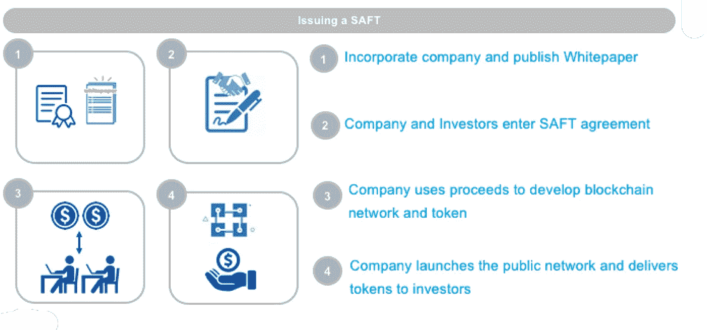

# 安全令牌:当前的障碍和安全令牌充满希望的未来

> 原文：<https://medium.com/coinmonks/security-tokens-current-roadblocks-and-the-promising-future-of-security-tokens-d3721ae1ba1f?source=collection_archive---------2----------------------->

* *注:我不是律师。这不是法律建议。

自 2018 年初 crypto 崩溃以来，叙事已经从 ico 转向安全令牌。围绕安全代币的许多炒作都集中在它们扰乱投资者和证券发行者当今运营方式的潜力上。虽然我同意安全令牌具有创造巨大价值的潜力，但重要的是要记住，我们仍处于安全令牌 1.0 浪潮的早期阶段。

在这篇文章中，我将看看我们是如何走到今天这一步的，讨论一些当前的挑战，然后谈谈我们的前进方向。

**从比特币到 ICO 的** 起初只有比特币。而获得比特币的唯一途径就是开采比特币(或者从开采过比特币的人那里购买)。这是在比特币基地的 Mt.Gox 或我们现在拥有的任何其他交易所出现之前。

随着比特币越来越受欢迎，其他硬币和代币出现了，交易所也纷纷效仿，为它们提供必要的流动性。第一个 ICO (Mastercoin)于 2013 年发行，一年后以太坊于 2014 年通过比特币筹集资金，到 2017 年，通过 ICO 筹集了数亿美元。

KYC 和白名单在一开始并不需要加入 ICOs。当 SEC 在 2017 年 7 月发布 [DAO 报告](https://www.sec.gov/news/press-release/2017-131)时，这种情况发生了变化，该报告称数字资产*可以*为证券。SEC 的发现使得代币发行者更加自觉地避免非法活动。一些项目通过合并美国司法管辖区之外的地方(新加坡、马耳他等)来应对。)并阻止美国参与者，而其他人则进行私下销售，类似于从天使投资人和风投那里进行的传统融资。Protocol Labs 和库利·LLP 将这种私人筹款模式标准化，随后出现了“ [SAFT](https://saftproject.com/#saft-whitepaper) ”(未来代币的简单协议)。

那么，SAFT 到底是什么？

SAFT SAFT 就像是 YCombinator 的安全合约，只不过是象征性的。SAFT 最好分两个阶段来理解:1)作为安全性的“功能前阶段”,以及 2)网络启动时公用令牌的“发行后阶段”。

SAFT 本身开始是一种证券，通过适当的证券豁免(注册。D 506c)。一旦网络启动，公用事业代币将交付给 SAFT 持有者，代币可用于公开交易。

SAFT 的主要前提是，预功能的公用令牌(即，在没有建成网络的情况下存在的令牌)最有可能是证券，而已经功能化的公用令牌不太可能是证券。这是因为在一个功能网络中流通的代币很可能能够独立于某个中心方的行为来维持价值——将其从 [Howey 测试](https://www.coinist.io/the-howey-test-the-sec-and-ico/)的部分中豁免，该测试将安全定义为“仅通过其他人的努力”才有价值的东西。

**SAFT 如何工作的高级概述:**

Overview of Issuing a SAFT

《SAFT》的根本问题在于，它提出了一种非常特别——尽管很聪明——的方式，让区块链代币能够融入 SEC 的框架。换句话说，SEC 会不会同意还是个未知数。因此，后功能“实用令牌”是否是一种证券仍不确定。

SEC 尚未直接对 SAFT 模式发表评论。然而，他们正在审查使用了[这款](https://venturebeat.com/2018/03/03/sec-subpoenas-show-the-saft-approach-to-token-sales-is-a-bad-idea/)的 ico。这表明 SEC 认为根据 SAFT 模型发行的代币实际上可能是证券。

那么项目如何合法地做到这一点呢？如果你一开始就声明它是安全的呢？

**输入安全令牌** 尽管自 2017 年以来就一直在谈论资产令牌化和安全令牌，但大部分讨论都被所有的 ICO 宣传所掩盖。自从 ICO 模型崩溃后，人们对安全令牌重新产生了兴趣。

由于代币是否是证券的不确定性，安全代币的概念不仅对发行者，而且对投资者都非常有吸引力。sto(安全代币发行)最初被宣传为“安全和可持续”的投资方式。现在，安全令牌和实用令牌被互换使用，将它们包装在一个单一的叙述中。然而，重要的是要记住，早期围绕安全令牌的讨论集中在资产、股权等的令牌化上。

第一个安全令牌 BCAP 是由区块链资本发行的。这象征着他们的风险基金。不久之后，我们看到其他项目如 tZERO 和 SPiCE VC 也发行了 sto。所有这三个项目都有一个共同点:它们都是*而不是*发行安全令牌在基于区块链的网络中工作。

安全令牌可能对行业有益，但这并不意味着一切都应该“令牌化”。将安全令牌与在开放区块链网络中使用的实用令牌相结合会变得非常复杂。

让我解释一下。

**实用令牌与安全令牌** 实用令牌原本是用来访问某种服务或实用程序的；这类似于购买一个查克奶酪或戴夫&巴斯特的令牌，让你玩街机游戏。然而，随着 ico 的出现，公用事业代币成为投资者出于投机目的购买的筹资机制，而不是为了交换商品或服务。这就是问题所在——每当资本通过代币筹集时，代币很可能会被归类为证券。

另一方面，安全令牌意味着被归类为证券——它们只是代表资产(股票、房地产、衍生品等)的数字包装(令牌)。).因此，这些证券只能*在*通过 ATS(替代交易系统)在拥有经纪自营商许可证的交易所交易。比方说，你是 Chuck-e-Cheese 的早期投资者。我们能去那里用我们的股票玩街机游戏吗？当然不是，将底层安全作为一种工具根本没有意义。

最明显的原因就是规章制度。根据不同的监管豁免，有大量关于证券交易的规则。例如，对于 Reg D 506(c)发行(大多数项目在此注册)，项目只能从合格的投资者那里筹集资本，证券有锁定期限制。将证券转化为公众可用的公用事业代币违反了监管法律。如果这种令牌在没有经纪自营商许可证的交易所变得可用，经纪交易可能作为未注册的交易所运营——这发生在最近 [SEC 对 EtherDelta](https://www.sec.gov/news/press-release/2018-258) 提起指控时。

考虑这种令牌模型的一种方式是将其视为两个独立的事件:1)筹集资金，以及 2)发行旨在在网络内使用的令牌。后者不应是一种担保，因为其最初目的是实际使用。因此，它不应该以任何方式参与筹款活动。资本筹集本身应该通过安全令牌完成，安全令牌本身不应该在网络上使用或交易(交易必须在豁免规则的范围内)。当然，这完全取决于项目使用的免税类型(即 Reg A、Reg CF、Reg D、Reg S)。我假设项目处于最广泛使用的豁免之下:Reg D 产品。

一些项目创建了安全令牌最终成为公用令牌(类似于 SAFT)的结构，而其他项目创建了两个不同的令牌—一个用于权益，另一个用于公用。

最大的问题是 SEC 将如何执行后者？

StartEngine 的 Howard Marks 写了一篇关于双令牌 ICO 的文章，作为避免上述困境的一种方法。他提出的解决方案是 RATE(代币和股权的真实协议)，他说“*允许一个公司发行两个代币，一个作为股权，由公司的资本表表示，按照证券法发行。第二个令牌是作为额外津贴提供给投资者的。*

第二个令牌——“额外津贴”——本质上是通过 airdrop 提供的实用令牌。

马克斯在另一篇文章中承认，第二个令牌的安全与否分类是有问题的。它可能是一种证券，取决于某些因素(如在交易所上市)。为了区分这两者，需要明确区分安全令牌和实用令牌。换句话说，持有证券代币的合格投资者不应该与那些在公共交易所购买证券的投资者混在一起，进行某种公用事业交易。维护这样一个有围墙的花园绝对不容易。

所有这些使得安全令牌和实用令牌的共存非常微妙。我还没有看到一个和谐运行的双重令牌结构的例子。

现在我们已经讨论了双重令牌设计的障碍，让我们看看我们在证券令牌化中的位置。

**证券令牌化:发行平台和交易所** 安全令牌生态系统仍处于萌芽状态，因为基础设施仍在建设中，投资者无法使用。生态系统本身大约有一年的历史，所以这并不奇怪。这个生态系统可以简化为几个部分——一级发行和二级交易。

一级发行只是一级市场，它指的是发行安全令牌的平台(如 Polymath、Securitize、Swarm、Harbor 等)。二级市场的二级交易是允许证券代币交易的交易所。其中包括 tZero、OpenFinance 等。关于这些令牌化平台需要注意的一点是，它们并不完全是自助式的。简而言之，你不能指望在没有咨询律师的情况下使用它们。

在发行安全令牌和令牌进入二级市场之间会发生很多事情，但让我们保持简单明了。其中包括:

*   KYC/白名单
*   转让限制
*   上限表管理
*   锁定
*   符合不同的监管豁免(更不用说国际法律)
*   融入交易所
*   监护

传统上，这些事情由法规遵从性和管理专业人员团队手动处理。现在，平台正在尝试“自动化合规”，他们必须处理所有曾经由专业人士处理的事情。

一些平台具有处理上述问题的特性。无论不支持什么，发行者必须自己解决。

令牌发放、KYC/白名单和 exchange 集成完成后，我们需要将注意力转向能够回答以下问题:

*   隐私是如何处理的？
*   系统如何处理红利？
*   股票分割怎么办？
*   当发生合并或收购时会发生什么？
*   股票投票呢？
*   优先股和普通股是如何处理的？

由于我们还处于早期，许多这些还没有被集成到平台的功能中。所有与传统证券相关的幕后工作都需要用数字证券来解决。这还没有发生。然而，在我们开始考虑上述问题之前，有一个巨大的难题需要解决，那就是流动性。

**流动性** 流动性让市场变得高效。买了东西却不能在未来出售是荒谬的。安全令牌交换(tZERO 和 OpenFinance 等)。)并不完全实用——open finance 仍处于测试阶段，而 tZero 仍在开发中。

证券代币市场的流动性将是最难实现的事情之一，因为这需要时间。正如脸书不会一夜之间拥有 10 亿用户一样，要获得足够的流动性和市场深度所需的投资者数量，需要大量的营销和教育。

一些专门用于证券代币的流动性池已经出现。例子包括 Bancor、BnkToTheFuture、Blocktrade、Templum 等。像比特币基地和波洛涅克斯这样的消费者密码交易所也在获得经纪自营商许可证，允许他们进行证券交易。Bakkt 最近宣布计划建立自己的交易所。鉴于所有这些活动，如果这些公司最终建立了一个单独的安全令牌交易所，我不会感到惊讶。

**安全令牌的未来** 我相信你已经听过无数次安全令牌的所有好处(即细分化、快速结算、全球化等。)，但最让我兴奋的是投资工具的创意捆绑/解绑。让我们以房地产投资信托基金为例。你可以投资一个你感兴趣的房地产，而不是像现在一样投资一大堆公司。将此扩展到股票，想象一下，如果你可以直接投资 YouTube(而不是谷歌)或 Instagram(而不是脸书)。对投资者来说，这种能力将会改变游戏规则。

**结论** 尽管这个生态系统还很年轻，仍在发展中，但安全代币有着不可思议的发展潜力，为一种全新的投资和融资方式铺平了道路。越来越多的利益相关者决心建立连接金融界和区块链技术的基础设施。我预计，证券代币不仅会吸引对冲基金、私募股权和风险投资，还会带来以前只对机构和知名天使投资者开放的交易流程一无所知的合格投资者。

如果你喜欢这篇文章，请给它几个“掌声”,这样其他人就可以找到它了！如果你想及时了解我的帖子，请点击关注按钮。

> [直接在您的收件箱中获得最佳软件交易](https://coincodecap.com/?utm_source=coinmonks)

