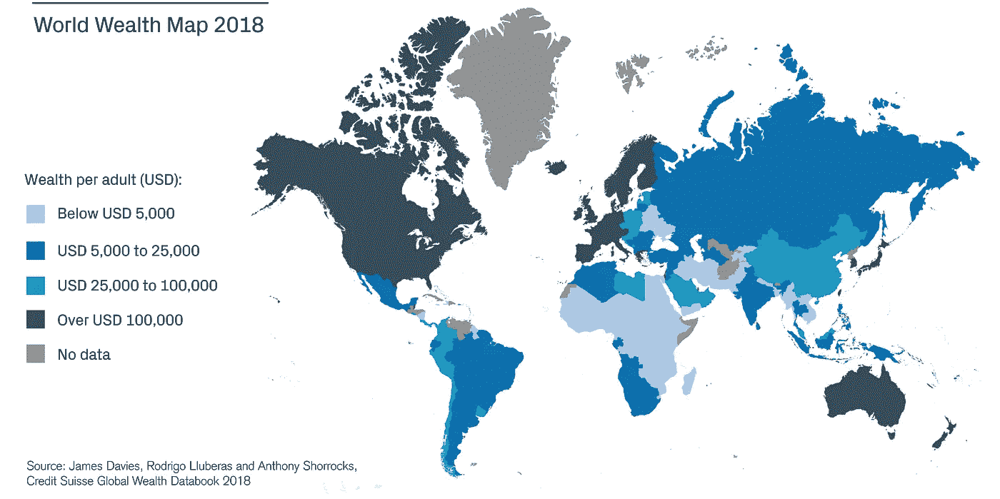

# 安全令牌—可编程治理和财富创造

> 原文：<https://medium.com/coinmonks/security-tokens-programmable-governance-wealth-creation-2dd269558607?source=collection_archive---------7----------------------->

[Source : Credit Suisse Research Institute](https://www.credit-suisse.com/corporate/en/articles/news-and-expertise/global-wealth-report-2018-us-and-china-in-the-lead-201810.html)

虽然 2017 年是 ICOs 和 Lambos 的一年，但 2018 年可能会因为许多事情而被记住。一个主要的吸引眼球的产品是安全令牌(STO)。

安全令牌如何被推到聚光灯下的故事与 ICO 骗局如何扩散的故事交织在一起。

批评者喜欢指出，骗子可以像 STO 一样轻而易举地重新标记他们的 ICO，并像往常一样继续诈骗业务。当然，某些国家的控制意味着诈骗者肯定会将他们在 STO 的诈骗活动建立在规则宽松的国家。

然而，香料资本风投公司的联合创始人卡洛斯·多明戈在这句话中简洁地总结了 sto 的吸引力和诱惑

> “不可避免的是，安全代币将像比特币改变货币一样改变股权，因为它们为所有者提供了直接、流动的经济利益和加快的收益交付。每种类型的所有权都可以被令牌化，这是一个巨大的数万亿美元的可寻址市场。”

# 可编程的东西

*代币可以被编程做什么？*

令牌可以被编程为从各种角度表现。

## 技术等级令牌:

*   参与协议协商一致机制
*   操作区块链的权限
*   允许用户参与激励机制

## 传输层和应用层令牌:

*   行使权利
*   考虑到效用
*   值分布
*   提供合法身份

## 治理层:

*   向令牌持有者提供公司章程中的法律地位
*   代币持有者有权行使自己的选择权。
*   链外和链上治理

> 所以正如上述特征所示，不存在“安全令牌”这种东西。

由于上面列出的一些特征模仿了现实世界的金融工具，即证券，那些表现出这些特征的特定代币被称为**【安全代币】**。

**安全令牌中可编程治理的示例**

1.遵守 KYC 协议

2.反洗钱合规

3.遵守 CFT 协议

4.对公司章程/路线图/法律相关问题的投票权

5.对添加/删除网络基础设施相关问题的投票权

6.托管账户的设立、操作和关闭

7.身份验证

8.各种审计—发起、参与、查看、结束

9.资产登记

10.资产生命周期管理

11.收入的归属和分配

12.资产评估和信息发布

13.代表与股权相关的权利

14.资本注入，持有资产的公司的资本表结构的修改

15.法律地位和代表权

16.反映与令牌相关的基础资产/公司的负债风险

17.反映与令牌相关的基础资产/公司的风险敞口

18.管理基础资产的所有权和权利向另一个实体的转移

19.在标记化的生态系统中充当抵押品

因此，安全令牌“允许”访问和参与商品和资产的所有权生态系统。并且由于参与所有权，由于部署货物/资产而获得的货币收益被引导回到安全令牌的持有者。

因此，通过持有证券代币的方式，部分所有权创造了获得货币收益的可能性，与传统证券的投资-持有-清算相比，以一种更容易、更少摩擦的机制，可以更容易的方式进行清算。

> 部分所有权是分形的

所有权结构在非常基本的层面上有相似之处。比如作为 LP 投资 VC/PE 基金的保险公司/养老基金。保险公司/养老基金可以通过每月投入他们的保险费/养老金缴款来追踪到投资它的人

令牌化的所有权最终将粒度引入了所有权模型。

# 资产所有权——历史和未来

从历史上看，一个普通人(与王室无关)不可能“拥有”一家公司或一项资产。

在 18 世纪和 19 世纪，随着合伙制以及后来的普通股，这种情况发生了变化。

股权机制真正爆发了财富创造，结合工业革命创造了一种新的财富创造和分配形式。(阅读更多关于这一过程和演变的背景故事:[https://hacker noon . com/the-case-for-the-区块链-as-a-a-wealth-creator-eab 28 cf 5 cf 87？gi=7eb68c6cb28c](https://hackernoon.com/the-case-for-blockchain-as-a-wealth-creator-eab28cf5cf87?gi=7eb68c6cb28c)

然而，在超过两个世纪的时间里，股票不能被分割成更小的部分。它是公司中最不可分割的所有权单位。随后出现了房地产投资信托基金、共同基金和交易所交易基金，它们将股票包装起来，使持股者能够“类似”获得所有权和利润分配

所有不是自然赋予我们的东西(即人造的)都有所有权。

一些自然事物被认为是资产，因此被人类“拥有”和消费(例如土地、贵金属、食物和牲畜等)

人类“拥有”的每一类资产都被交易过。人类“拥有”的每一种资产类别都有股票、衍生品和基金

尽管如此，仍然存在巨大的差距，在这些差距中，参与所有这些不可思议的财富的机会并没有平等地到达每个人手中。这些间隙是由许多摩擦点造成的。

令牌化将资产所有权从以下因素造成的摩擦中分离出来:

1.国家的地理边界。对于一个墨西哥公民来说，拥有存在于新加坡的资产是一个困难和充满摩擦的过程。这种摩擦降低了财富被分配到墨西哥的可能性

2.不进行 24x7 交易且一周仅交易 5 天的市场所施加的时区限制。

3.至少需要 24 小时的结算时间

除此之外，它还提供了粒度和将份额细分为微小部分的能力，并以整个份额的一小部分成本拥有这一微小部分

> 区块链提供了以难以想象的规模创造财富的平台和技术。安全令牌是我们这一代的变革推动者。

作者: [Suraz Kottakki](https://www.linkedin.com/in/suraz)

*最后说一句关于* [*创世纪区块控股*](http://www.genbvc.com/) *:*

[***Genesis Block Holdings***](http://www.genbvc.com/)**是一家区块链风险投资公司、cryptoquant 对冲基金和矿业公司，专注于投资区块链生态系统内的项目。我们专注于将资本、网络和专业知识的力量带给前沿技术团队，以解决世界上最大的问题**

**在任何情况下，本网站上的任何材料都不应被视为出售或购买任何单个公司或投资基金的权益、代币或硬币的要约。任何此类要约或邀约将仅通过与特定基金或个人相关的保密私募发行备忘录单独进行，除其他要求外，这些基金或个人符合美国联邦或其他国际证券法规定的特定资格，并且通常在金融事务方面经验丰富，因此他们能够评估预期投资的价值和风险**

*如果你觉得这是有帮助的，请为我们鼓掌，分享给你的朋友，并随时在[genbvc.com](http://genbvc.com/)给我们发短信。点击这里查看我们的电报频道[点击这里>](https://t.me/genesisblockholdings) 关注我们的博客[点击这里>](/@genblockfund)*

> *[直接在您的收件箱中获得最佳软件交易](https://coincodecap.com/?utm_source=coinmonks)*

**