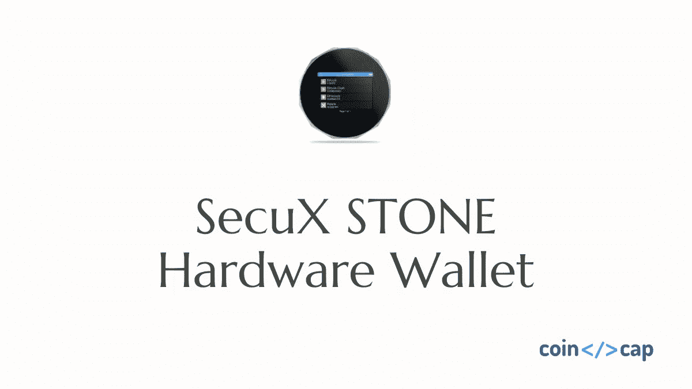

# SecuX STONE 五金钱包回顾| 2020

> 原文：<https://medium.com/coinmonks/secux-stone-hardware-wallet-review-15-discount-coupon-2020-7577032faa6e?source=collection_archive---------0----------------------->

在本文中，我们将回顾一下[**SecuX STONE**](https://blog.coincodecap.com/go/secuxtech)**硬件钱包。**

**过去几年的黑客攻击历史表明，大多数投资者都知道采用硬件钱包来保存他们的加密资产。**

****

**一劳永逸，要想在交易所里摆脱黑客窃取你的加密货币，就是要让他们彻底下线。**

**尽管所有的加密货币都只不过是区块链上的一组数字，交易数据哈希在区块链探索者上透明而匿名地揭示了加密货币的数量。**

**真正的密码资产持有者是使用私钥转移到另一个地址(交易)的唯一用户。**

**许多硬件钱包为用户提供离线存储或无接触使用场景，以便将他们的加密资产从交易所转移到硬件钱包。**

**一旦完成，用户就可以舒一口气睡个好觉了。此外，它还可以支持用户对另一个地址进行对等交易，或者管理他们的加密帐户，等等。**

**然而，在设备上操作它们的加密资产有很大不同，每个硬件钱包都有其独特的专有固件来执行设备。**

**从理论上讲，发送/接收钱包上的加密资产的程序越复杂，对黑客行为的防范就越安全，例如网络攻击、恶意软件、中间人黑客、对设备的物理攻击、窃取钱包、网络钓鱼网站等。**

**你可以想象设计一个[全面的硬件钱包](/coinmonks/the-best-cryptocurrency-hardware-wallets-of-2020-e28b1c124069)它应该考虑所有的潜在和可能的场景，粗心的用户将会表现出来，狡猾的黑客可能会在任何时候偷偷摸摸地绕过硬件钱包持有者。有没有机会得到一个真正安全又简单易用的硬件钱包？**

****

# **用户友好的 UX**

**[**SecuX STONE**](https://blog.coincodecap.com/go/secuxtech) 最吸引人的特点是 2.8 英寸彩色触摸屏。**

**与其他[知名品牌的硬件钱包](/coinmonks/the-best-cryptocurrency-hardware-wallets-of-2020-e28b1c124069)不同，我可以直观地在面板上指尖创建账户，添加硬币/代币，发送资金，并在屏幕上一目了然地查看完整地址。**

**收货地址可以显示为二维码！不值得一提的是，设备的 1 个页面上可以显示 4 个帐户。**

**这是我所有加密资产的清晰视图！当我使用一个现代的 3C 小工具时，我对自己感到更开心了！。我注意到，我可以重命名我在投资组合中的每个加密帐户，每次闲置一段时间后，屏幕键盘都会随机重新分配，以便设备 PIN 访问投资组合。这无疑是一个很用心的设计，以防偷窥狂窃取用户的资金。(SecuX mobile iOS 应用暂时不支持重命名资产账户。)**

****

# **实地查核**

**我开始了解为什么在石头上需要一个大屏幕。当我准备向我的同事发送资金进行测试时，设备在与手机配对时显示即时选项，我需要输入正确的选项以确认配对是否正确。**

**然后，我可以使用移动摄像头捕捉收件人地址，而无需键入长字母和数字，之后我必须看到设备上的实际地址与主机设备上的地址完全相同。**

**稍后，我必须在自己的[石头钱包](https://blog.coincodecap.com/go/secuxtech)上点击确认发送。这种行为是严格的，可能一生一次，有恶意软件安装在你的朋友或同事的手机上，你只是把它作为一个随机的主机设备，它可以创建另一个收件人地址，诱使发件人将资金转移到黑客的钱包。他们称之为中间人攻击。**

****

# **帐户可恢复性**

**我不会对 [SecuX STONE](https://blog.coincodecap.com/go/secuxtech) 完全符合 BIP32、BIP39 和 BIP44 感到惊讶，它们能够从标准的 12、18 或 24 字密码短语中恢复现有帐户。这意味着你可以很容易地把你的硬件钱包换成另一个来自 Bitcoin.org 的同一个门户网站的钱包，甚至每周换一次市场上的新型号。**

# **隐藏钱包**

**一个 [SecuX STONE 硬件钱包](https://blog.coincodecap.com/go/secuxtech)可以从其微控制器单元(MCU)中随机生成一个私钥，这是您保存您在区块链上持有的所有加密硬币/令牌的独特密钥。另一个密钥可以从设备/仪表板/设置/隐藏钱包中生成，如果您愿意创建一个选项。**

****

# **军用级安全元件**

**[SecuX STONE](https://blog.coincodecap.com/go/secuxtech) 配备英飞凌固态闪存 CC EAL5+安全芯片，保护用户的钱包 PIN 和私钥。**

**这样的安全级别甚至高于大多数银行系统，以防止来自恶意黑客的任何网络和物理攻击。同时，在 MCU、安全芯片和钱包应用程序之间有 SecuX STONE 专有的秘密通道，以最严格的认证进行通信，以确保从 PIN/KEY 生成到交易完成的加密资产零概率泄漏。**

****

# **Chrome OS 网络应用**

**如今，谷歌 Chrome 无疑占据了近 70%的网络浏览器市场。 [SecuX STONE](https://blog.coincodecap.com/go/secuxtech) 采用了一种 web 应用程序，旨在通过主机设备、PC 或移动设备被动管理硬件钱包。**

**它类似于访问区块链的云门户，您可以在任何时间从任何地方通过区块链的节点检索您的所有加密资产。与此同时，Brave 和 Opera 浏览器建立在与 [SecuX STONE crypto 硬件钱包](https://blog.coincodecap.com/go/secuxtech)兼容的 Chrome 操作系统上。**

# **跨平台钱包**

**[SecuX STONE](https://blog.coincodecap.com/go/secuxtech) 兼容台式机、笔记本电脑、Chromebook、平板电脑、手机上运行的 Windows OS、Chrome OS、Mac OS、Linux、Android、iOS 等主流操作系统的大部分主机设备。**

**即使我使用的是 Windows 7 电脑，我仍然可以下载 Windows 7 驱动程序并流畅运行。(W10 暂时不支持 OTG 和蓝牙)**

****

# **电池寿命**

**通常大屏幕配有大电池，因此 STONE V20 和 W20 也是如此。它们都嵌入了一个 600 毫安时的可充电锂聚合物电池，大约需要 2 小时。拆箱后完全充电。**

**您可以连续使用大约 7 小时。，并应持续约 6 个月的冷藏。期间，您可以随时查看启动石头时的帐户余额。**

****

# **硬币支持和帐户可扩展性**

**SecuX Technology 的官方声明宣称, [SecuX STONE](https://blog.coincodecap.com/go/secuxtech) 可以存储多达 500 个加密账户，尽管他们的设备只支持 10 种加密货币，包括比特币 BTC、以太坊 ETH、莱特币 LTC、Ripple XRP、比特币现金 BCH、Dash coin DASH、Dogecoin DOGE、Stellar XLM、DigiByte DGB、Groestlcoin GRS 以及所有以太坊 ERC-20 代币(Tether USDT、Binance BNB 等。)暂时。**

**这意味着，如果我可以手动添加 ERC-20 令牌逐一多达近 500 个帐户混合各种 ERC-20 令牌。对我来说最大的好处是，我可以随时在设备上回忆我的余额，即使它处于离线模式。**

**(SecuX Mobile iOS 应用程序现在支持 BTC、BCH、瑞士联邦理工学院、瑞士联邦理工学院、XRP、DGB、GRS 和所有 ERC-20 代币)**

****

# **零脆弱性**

**在 SecuX 的官方网站上，360∘comprehensive 的多层盾牌设计明确表达了 [SecuX STONE](https://blog.coincodecap.com/go/secuxtech) 从一个简单的概念出发，将所有细节都考虑在内。**

**硬件钱包从一开始就存在各种可能的漏洞，如供应链、工程设计、生产流程、生产过程到仓库存储、防篡改标签包装、物流等等。**

**从某种意义上说，最坚不可摧的硬件钱包的诞生是为了防止用户的加密资产受到病毒植入、物理入侵、网络黑客、克隆交换、中间人恶意软件等的侵害。**

****

# **赛克斯石的利弊**

## **赞成的意见**

*   **跨平台操作系统兼容性**
*   **用户友好的 UX**
*   **加密资金存储的高级安全性**
*   **不妥协的交易过程**
*   **个性化钱包和账户可扩展性**
*   **持久耐用的移动设备和平衡检查。**

## **骗局**

*   **较少硬币支持**
*   **放在牛仔裤口袋里有点大(为了更大的屏幕，这是一个折衷)**

# **结论**

**我强烈推荐 [SecuX STONE](https://blog.coincodecap.com/go/secuxtech) 为所有类型的加密货币持有者提供加密硬件钱包，除非你有大量的备用硬币。根据 SecuX 团队的说法，目前的硬币和代币是“天然”支持的。也许这个概念减缓了研发过程中添加更多硬币和代币的速度。然而，我尊重他们对设计的坚持和一致性。例如，我可以从本地支持钱包发送我的恒星流明，而无需通过链接图标进行域重定向。硬币持有者从通用 UI 硬件钱包交易资产非常方便。**

## ****还有，读****

*   **最好的比特币[硬件钱包](/coinmonks/the-best-cryptocurrency-hardware-wallets-of-2020-e28b1c124069?source=friends_link&sk=324dd9ff8556ab578d71e7ad7658ad7c)**
*   **最好的[加密税务软件](/coinmonks/best-crypto-tax-tool-for-my-money-72d4b430816b)**

****