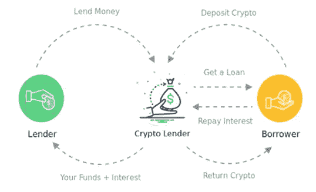
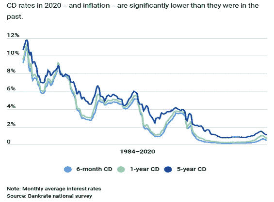
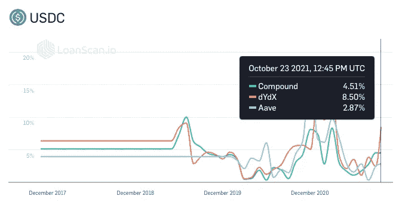
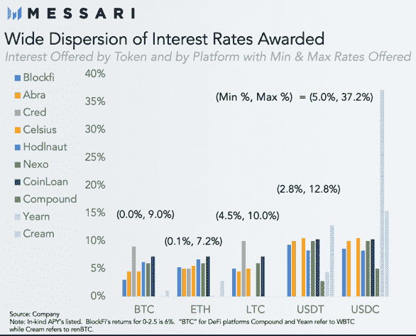
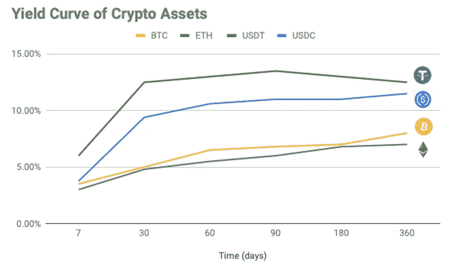
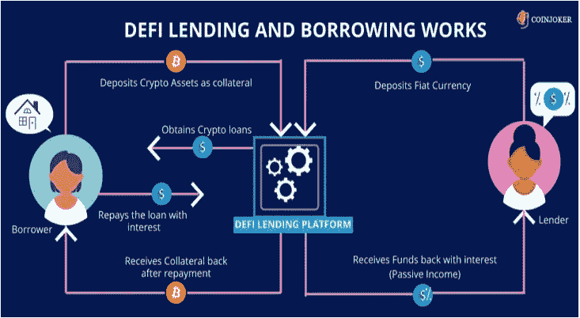
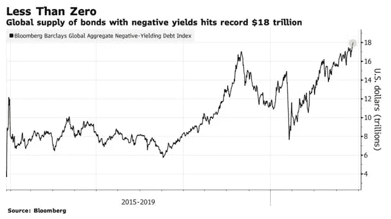

# 在密码市场寻求收益

> 原文：<https://medium.com/coinmonks/seeking-yield-in-the-crypto-market-858ec3455d11?source=collection_archive---------3----------------------->

## *本文强调了加密市场中新兴的固定收益投资机会。我们仔细研究了在集中式和分散式网络中，加密货币借贷活动增加所产生的不同收益选择。*

Source: istockphoto.com

*最新更新:2021 年 10 月*

## **密码借贷发展**

在 2017 年之前，信用交易加密的概念在加密领域并不常见。投资 crypto 就像投资商品一样，价格上涨是盈利的唯一来源。当衍生品交易所开始提供杠杆加密合约时，比特币矿工成为衍生品的频繁用户。与传统大宗商品生产商一样，矿商利用衍生品合约锁定新铸造硬币的未来价值，并对冲价格下跌。自从 2017 年 12 月 [CBOE 和 CME 开始交易比特币期货合约](https://www.reuters.com/article/us-bitcoin-futures-contracts-idUSKBN1E10KC)以来，**衍生品市场开始产生比特币和美元的隐含利率，这促进了加密借贷市场的快速发展。**

2018 年，加密货币领域开始从一个为个人设计的市场转变为一个机构可以访问的市场。自那以后，衍生品交易量增长了 25 倍，而买卖价差下降了 10 倍[1]。机构开始可以选择通过更复杂的交易基础设施和托管解决方案来运营。市场从一个手动的、昂贵的、以比特币命名的网络发展成为一个完全电子化的、经济高效的、稳定的、以比特币为主导的生态系统。

随着加密货币领域变得更加制度化，其贷款市场也是如此。借贷活动开始迅速发展，为顶级加密货币(如比特币、以太币)和受欢迎的 stablecoins(如 Tether 和 USDC)带来了产生收益的固定收益市场。借贷市场降低了做市商的资本成本，使得流动性更便宜，利差更小。今天，贸易公司可以在稳定的硬币和比特币借贷市场获得超过 100 亿美元的资金[2]，资金来源来自零售和机构。

Illustration of Crypto Lending Process [3]

# **固定收益市场出现**

加密贷款市场的发展导致了更有效的资本成本，使所有市场参与者受益。机构交易者可以获得更紧的利差，散户可以获得更高的收益率。在传统银行提供接近于零的储蓄利率的环境下，这只会推动投资者在其他替代资产类别中寻找收益。

在过去的几年里，有大量的资本涌入这个生态系统。例如，全球加密贷款和交易公司 Genesis 自 2018 年 3 月开始运营以来，其贷款总额大幅增长至 660 亿美元。与上一季度相比，2020 年第四季度机构加密贷款人的平均贷款规模增长了 538%，从 59 万美元增至 320 万美元[4]。分散贷款协议中锁定的总价值(TVL)为这个等式增加了 1000 亿美元的流动性[5]。这种需求的快速涌入巩固了密码空间进一步发展的情况。

Average CD Rates: 1984–2020 [6]

USDC Rates, Source: LoanScan [7]

# **专业密码借贷平台**

随着借贷需求的快速增长，新一波借贷平台正在兴起。这些平台大多支持定期存款贷款模式，即在特定时间内以预定利率接受资金。这对长期投资者来说是一个很好的选择，因为他们可以在持有加密资产的同时继续产生收益。市场上既有托管借贷平台，也有非托管借贷平台，借贷期限多种多样。

有一些全球贷款平台已经建立了良好的声誉，并走在了发展曲线的前面。加密投资者可以通过将资产借给 BlockFi、Matrixport 或 Amber Group 等平台来获得收益。

## ***区块链***

BlockFi 允许用户将硬币存入他们的网络钱包，并相应产生利息。该平台支持主要的加密货币，在发布时为 BTC、瑞士联邦储蓄银行和 USDC 存款提供高达 4.5%、5.5%和 8.25%的存款利率(利率受市场波动影响)[8]。硬币可以随时存入和取出，每月支付一次利息。每月提取一次，免收提取费。BlockFi 由知名风险基金支持，管理着超过 150 亿美元的资产。加密资金由 Gemini 信托公司所有，该公司是 GUSD 发行人，受纽约州金融服务局监管。

## ***矩阵导出***

Matrixport 是一款支持各种加密货币的 iOS 和 Android 钱包应用。除了主要的加密货币，Matrixport 还提供 20 多种替代货币。在本文发表时，他们为联邦理工学院、BTC、USDC 和总督的存款分别提供了高达 5%、4%、12%和 7%的利率。付款按月进行，硬币也可以随时存入和取出。贷款利率每周都在变化。2021 年 4 月的最新审计表明，该平台托管了 100 亿美元的资产[10]。这些资金由 Cactus 托管，Cactus 是一家受监管的香港信托公司，品牌为 Matrixport。

## ***琥珀组***

Amber 于 2017 年由一群前摩根士丹利机构交易员成立。总部设在香港，该公司在世界各地的经营与其他办事处在台北，首尔和温哥华。它为机构客户提供市场领先的固定利率产品、收益率提升和风险管理工具。收益率提升产品类似于传统世界中的**双币存款合同**，其中过大的收益率来自期权市场。Amber 目前服务于 200 多家机构客户，并在美国 FinCen 和加拿大 FINTRAC 下注册。它的专长是提供定制的投资产品，最高可达 16%的年利率，灵活的赎回时间表，以及资本效率的交叉保证金功能[11]。资金由 Fireblocks 和 Bitgo 担保。

随着需求的增加，总会有新的参与者进入借贷领域。我们预计，在不久的将来，传统银行将成为强有力的竞争者。

Interest Rates Comparison [Source: Messari.com]

Yield Curve of Crypto Assets, Source: Tokenomy [Oct 2021]

**进入 DeFi——获得收益的创新方式**

DeFi 或分散金融使用区块链的智能合约(最常见的是以太坊)来完全绕过传统的集中式金融中介，如银行、经纪公司或交易所。这使得世界上任何人只要有一部连接互联网的智能手机，就可以获得金融服务。 **DeFi 应用包括借入资金、获得贷款、将资金存入流动性池或交易复杂的金融产品，所有这些都无需征得任何人的许可或在任何地方开立账户。虽然 DeFi 协议是一个非常新的概念，但它为密码投资者提供了一种从各种来源获取收益的创新方式。**

Defi Lending and Borrowing Platform [Source: Coinjoker 12]

在 DeFi 协议上，Yield 可以通过几种流行的方式获得，本文将在下面重点介绍其中的三种。

## *1。流动性挖掘*

DeFi 的第一个应用是分散交换(DEX)。建立 dex 是为了允许以对等和非托管的方式自动交换加密资产。为使 DEX 有效运行，需要足够的流动性。**市场参与者可以将加密资产存入流动性池，并赚取一部分交易费用以及平台令牌作为回报。赚取平台代币以换取你的流动性的过程因此被称为*流动性挖掘*。**自动做市商是一种智能合约，它为投资者创造了一个流动性池，投资者可以通过支付一定费用来存放他们的密码。顶级流动性池提供商包括 Uniswap、Balancer、Curve 或 Kyber Network。[13]

## *2。高产农业*

另一个受欢迎的 DeFi 应用是分散贷款，储户可以通过加密存款获得收益，而借款人将为他们的贷款支付利息。最初，所有协议都需要寻找新的存款来源，因此它们提供高收益来吸引加密储户。**赚取存款利息一般被称为*收益农业*。聪明的密码持有者会使用不同的协议来最大化他们的收入潜力。例如，一个“高产农民”将一些 USDC 放入 DeFi 贷款协议，并借出一些 USDT。然后，农民可以将 USDT 存入另一个 DeFi 协议中，以获得进一步的奖励。这就是产量耕作的精髓。术语*收益农业*和*流动性开采*有时可以互换使用，因为某些协议在支付给储户的收益之外奖励他们自己的平台令牌(也称为“治理令牌”)，以激励更多的流动性。**

虽然在 DeFi 空间中寻找产量目前更多的是一个手动过程，但它正在逐渐变得自动化。这一趋势是由自动帮助农民寻找支付最高利息的协议的算法引领的。一个显著的例子是渴望金融。[14]

## **3。打桩**

在区块链网络中，出现了新一波协议，这些协议在利益证明(PoS)机制中运行，以比比特币的工作证明(PoW)共识算法更节能的方式促进共识并保持去中心化。**这些 PoS 协议的利益相关者只需在加密钱包中持有(或“持有”)协议令牌，以维持协议的操作和安全性，作为回报，他们会以更多平台令牌的形式获得收益。**

对于被动投资者来说，浏览多种 PoS 协议也是一项繁重的工作。像 Staked (staked.us)这样的实体使用户能够将资产锁定到他们的个人加密钱包中，并从 30 多个协议中获得收益，平均收益在 10%左右。股权证明正稳步受到欢迎，现在约占总加密市值的 15%。顶级 PoS 名称，如 Ethereum2.0、Polkadot、Cardano、Tezos、Solana 等。引领了 2020 年的加密发展空间。[15]

在生态系统中，所有的 DeFi 协议都有不同的目的，但对产量捕获的关注是将所有人联系在一起的共同主线。虽然收益会带来好处，但它可能会变化无常，尤其是在相对年轻且不断发展的生态系统中。智能合约风险、网络安全风险、技术风险今天依然存在。在最新的 Massari 研究报告中，它指出，尽管流动性挖掘模型为流动性提供者提供了**短期激励**，但它在协议的资产负债表上创造了**永久费用**。因此，项目意识到他们需要更好的系统来确保可持续的流动性，同时为投资者提供长期激励[16]。聪明的投资者会将他们的投资敞口逐步纳入这些协议，从而随着时间的推移积累利润。

## **宏观经济背景支撑着这个秘密论题**

2020 年开始了一个由 COVID 引发的全球危机时期，投资者对传统投资组合保持谨慎。随着经济前景黯淡，超低利率政策，以及更多的政府刺激措施正在推高通胀预期，传统的固定收益市场不再能够像以往那样为投资者提供足够的回报。128 万亿美元的固定收益市场(其中 18 万亿美元[收益为负](https://corporatefinanceinstitute.com/resources/knowledge/credit/negative-yielding-bonds/))可能需要重新分配部分资本，以优化投资回报。正如对冲基金传奇人物雷伊·达里奥最近在他对比特币的看法中所分享的那样，“*我们生活的新范式，许多政府债券不再提供相同的回报或多样化特征，货币面临更大的贬值风险，可能会比其他情况下更快地推动替代性财富储存的发展。*【17】

Negative-Yielding Debt is on the Rise [18]

机构投资者已经在将资产配置到比特币中，将其视为一种数字价值储存手段，以对冲法定货币贬值和资产价格通胀。这一趋势可能会继续推高比特币价格。这些投资者开始利用加密固定收益市场，并推动其进一步发展成为一个更成熟、更有活力的金融市场，这只是一个时间问题。世界各国政府监管稳定资本和 CBDC 倡议的到来也将加速这一进程。我们可以预计，在可预见的未来，传统银行将开始开发处理加密资产托管的专业技术，并提供交易和贷款服务。

## **结论**

选择正确的平台并理解每种产品的细微差别对于投资成功至关重要。随着加速的技术基础设施和宽松的合规环境的到位，加密固定收益领域可能会在未来几十年蓬勃发展。

关于作者:克里斯蒂安·谢(Christian Hsieh)是加密金融服务平台 [Tokenomy](https://tokenomy.com) 的首席执行官

## **参考文献:**

1.[加密市场结构 3.0](https://arjun.af/crypto-market-structure) ，Arjun Balaji，2020 年 10 月

2.[利息收入和借贷是比特币的杀手级应用](https://www.forbes.com/sites/leeorshimron/2020/05/26/exploding-past-10b-interest-income-and-lending-are-bitcoins-first-killer-apps/?sh=74c7e04c3320)，福布斯，2020 年 5 月

3.[加密借贷](https://crowdfunding-platforms.com/crypto-lending)，P2P 借贷

4.[数字资产市场报告](https://info.genesistrading.com/hubfs/Genesis%20-%20Quarterly%20Reports/Genesis%20Q4%20Report.pdf)，Genesis，2020 年第 4 季度

5.[锁定在违约贷款](https://defipulse.com/)中的总值，违约脉冲

6.[历史存款利率](https://www.bankrate.com/banking/cds/historical-cd-interest-rates/)，Bankrate，2020 年 1 月

7. [USDC 利率](https://loanscan.io/earn/historical?interval=max)，LoanScan，2021 年 10 月

8.[利率](https://blockfi.com/rates/)，BlockFi，2021 年 1 月

9.挣得

10.[亚洲最大的新银行 Matrixport 的数字资产达到 100 亿美元](https://www.prnewswire.com/news-releases/asias-largest-crypto-neobank-matrixport-hits-10b-in-digital-assets-301265422.html)，美通社，2021 年 4 月

11.[琥珀集团](https://www.ambergroup.io/about)

12.[分散借贷协议指南](https://www.cryptoexchangescript.com/defi-lending-borrowing-platform-development)，Coinjoker，2020 年 10 月

13.[2020 年十大流动性池提供商](https://coingape.com/liquidity-pool-providers/)，Coingape，2021 年 2 月

14.[产量农业排名](https://coinmarketcap.com/yield-farming/)，CoinMarketCap，2021 年 1 月

15.[2020 年股权证明大于 ETH 2.0](https://www.coindesk.com/proof-of-stake-bigger-eth-2-0)，Coindesk，2020 年 12 月

16.[是什么推动了 DeFi 的创新](https://messari.io/article/beyond-defi-2-0-what-is-driving-defi-s-current-innovation)，马萨里，2021 年 10 月

17.[我对比特币的看法](https://www.bridgewater.com/research-and-insights/ray-dalio-what-i-think-of-bitcoin)，雷伊·达里奥，2021 年 1 月

18.[全球负收益率债务创下 18 万亿美元纪录](https://www.bloomberg.com/news/articles/2020-12-11/world-s-negative-yield-debt-pile-at-18-trillion-for-first-time)，彭博，2020 年 12 月

*关于记号学*

*[*符号化*](https://tokenomy.com) *团队对加密固定收益市场前景感到兴奋，并构建了一个易于使用的加密资产管理平台，以帮助投资者了解这一独特的资产类别。通过 Tokenomy Earn，投资者可以获得顶级贷款人、赌注提供商和托管合作伙伴提供的各种收益赚取机会，而无需在不同平台上注册多个账户。用户可以在一个地方以安全可靠的方式轻松管理他们的所有资产，并调整从定期存款到赌注项目的投资组合分配。**

> *加入 coin monks[Telegram group](https://t.me/joinchat/EPmjKpNYwRMsBI4p)学习加密交易和投资*

## *另外，阅读*

*   *什么是[闪贷](https://blog.coincodecap.com/what-are-flash-loans-on-ethereum)？*
*   *最好的[密码交易机器人](/coinmonks/crypto-trading-bot-c2ffce8acb2a) | [网格交易](https://blog.coincodecap.com/grid-trading)*
*   *[3 商业评论](/coinmonks/3commas-review-an-excellent-crypto-trading-bot-2020-1313a58bec92) | [Pionex 评论](/coinmonks/pionex-review-exchange-with-crypto-trading-bot-1e459d0191ea) | [Coinrule 评论](https://blog.coincodecap.com/coinrule-review-a-perfect-trading-bot)*
*   *[AAX 交易所评论](/coinmonks/aax-exchange-review-2021-67c5ea09330c) | [德里比特评论](/coinmonks/deribit-review-options-fees-apis-and-testnet-2ca16c4bbdb2) | [FTX 交易所评论](/coinmonks/ftx-crypto-exchange-review-53664ac1198f)*
*   *[n ave 零点回顾](/coinmonks/ngrave-zero-review-c465cf8307fc) | [Phemex 回顾](/coinmonks/phemex-review-4cfba0b49e28) | [PrimeXBT 回顾](/coinmonks/primexbt-review-88e0815be858)*
*   *[Bybit Exchange 审查](/coinmonks/bybit-exchange-review-dbd570019b71) | [Bityard 审查](https://blog.coincodecap.com/bityard-reivew) | [CoinSpot 审查](https://blog.coincodecap.com/coinspot-review)*
*   *[3 commas vs crypto hopper](/coinmonks/3commas-vs-pionex-vs-cryptohopper-best-crypto-bot-6a98d2baa203)|[赚取加密利息](/coinmonks/earn-crypto-interest-b10b810fdda3)*
*   *最好的比特币[硬件钱包](/coinmonks/the-best-cryptocurrency-hardware-wallets-of-2020-e28b1c124069?source=friends_link&sk=324dd9ff8556ab578d71e7ad7658ad7c) | [BitBox02 回顾](/coinmonks/bitbox02-review-your-swiss-bitcoin-hardware-wallet-c36c88fff29)*
*   *[总帐 vs n 平均](https://blog.coincodecap.com/ngrave-vs-ledger) | [总帐 nano s vs x](https://blog.coincodecap.com/ledger-nano-s-vs-x)*
*   *[加密复制交易平台](/coinmonks/top-10-crypto-copy-trading-platforms-for-beginners-d0c37c7d698c) | [比特码复制交易](https://blog.coincodecap.com/bityard-copy-trading)*
*   *[Vauld 评论](https://blog.coincodecap.com/vauld-review) | [YouHodler 评论](/coinmonks/youhodler-4-easy-ways-to-make-money-98969b9689f2) | [BlockFi 评论](/coinmonks/blockfi-review-53096053c097)*
*   *最好的[加密税务软件](/coinmonks/best-crypto-tax-tool-for-my-money-72d4b430816b) | [CoinTracking 评论](/coinmonks/cointracking-review-a-reliable-cryptocurrency-tax-software-5114e3eb5737)*
*   *最佳[加密借贷平台](/coinmonks/top-5-crypto-lending-platforms-in-2020-that-you-need-to-know-a1b675cec3fa) | [杠杆代币](/coinmonks/leveraged-token-3f5257808b22)*
*   *[莱杰纳米 S vs 特雷佐 one vs 特雷佐 T vs 莱杰纳米 X](https://blog.coincodecap.com/ledger-nano-s-vs-trezor-one-ledger-nano-x-trezor-t)*
*   *[block fi vs Celsius](/coinmonks/blockfi-vs-celsius-vs-hodlnaut-8a1cc8c26630)|[Hodlnaut 评论](https://blog.coincodecap.com/hodlnaut-review)*
*   *[Bitsgap 审查](/coinmonks/bitsgap-review-a-crypto-trading-bot-that-makes-easy-money-a5d88a336df2) | [Quadency 审查](/coinmonks/quadency-review-a-crypto-trading-automation-platform-3068eaa374e1)*
*   *[埃利帕尔泰坦评论](/coinmonks/ellipal-titan-review-85e9071dd029) | [赛克斯斯通评论](https://blog.coincodecap.com/secux-stone-hardware-wallet-review)*
*   *[DEX Explorer](https://explorer.bitquery.io/ethereum/dex)|[w](https://explorer.bitquery.io/graphql)|[local bitcoins 评论](https://blog.coincodecap.com/localbitcoins-review)*
*   *最佳[区块链分析](https://bitquery.io/blog/best-blockchain-analysis-tools-and-software)工具| [赚比特币](https://blog.coincodecap.com/earn-bitcoin)*
*   *[加密套利](/coinmonks/crypto-arbitrage-guide-how-to-make-money-as-a-beginner-62bfe5c868f6)指南:新手如何赚钱*
*   *最佳[加密制图工具](/coinmonks/what-are-the-best-charting-platforms-for-cryptocurrency-trading-85aade584d80) | [最佳加密交易所](/coinmonks/crypto-exchange-dd2f9d6f3769)*
*   *了解比特币的[最佳书籍有哪些？](/coinmonks/what-are-the-best-books-to-learn-bitcoin-409aeb9aff4b)*

> *[直接在您的收件箱中获得最佳软件交易](/coinmonks/newsletters/coinmonks)*

**