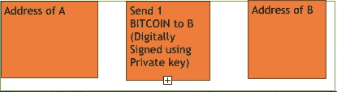
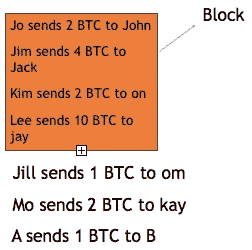
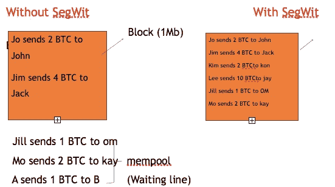

# 简化隔离见证。

> 原文：<https://medium.com/coinmonks/segregated-witness-simplified-b0e56103750f?source=collection_archive---------5----------------------->

自 2017 年 8 月比特币网络实施隔离见证(SegWit)以来，加密货币世界正在热议一个新词。许多加密货币专家都宣称 SegWit 是解决比特币问题的灵丹妙药。随着世界对这项新技术越来越着迷，许多人想知道它意味着什么。这篇文章涵盖了你需要知道的关于隔离证人的一切。所以让我们开始吧。

**隔离证人(SegWit):**

在我们看隔离见证的定义之前，让我们回顾一下比特币的历史，以便更好地理解 SegWit。

**区块链:**

比特币开发于 2009 年，是一个分散的平台，可以在不需要中央监管机构的情况下进行点对点交易。所有的交易都在区块链上进行。简单来说，区块链是一个存储所有比特币交易数据和比特币本身(从技术上讲——没有比特币，实际上，它只是区块链网络中的所有账户余额)的网络。

让我们了解一下，在比特币区块链交易的幕后有一个例子。

a 想给 b 发 1 个比特币。

对于常规的法定货币(纸币)在线交易，A 应该有一个账号、交易密码(或 PIN)来发送钱，当然还有他银行账户中的钱。A 还需要 B 的银行账号。

类似地，为了发送比特币，A 需要一个地址(类似于银行账户)、一个私钥(与交易密码或 PIN 相同)来对交易数据进行数字签名，并且 A 还需要 B 的地址(类似于银行账户)。

因此，当 A 向 B 发送 1 个比特币时，这些信息会被区块链网络验证。为了让您更好地理解，下面举例说明了哪些信息会进入网络。

**交易验证:**

**区块链交易验证:**

正如我们之前了解到的，比特币不受中央监管。那么谁来验证交易？答案是比特币矿工。谁是矿工？矿工可以是任何人。使用功能强大的计算机验证比特币交易的，可以是你，也可以是我。矿工得到了什么回报？矿工每成功验证一次交易，就会获得比特币奖励。

让我们看看如何在区块链上验证交易。

所以矿工首先检查 A 是否有足够的资金，即 1 个比特币(如前所述，比特币数据和比特币本身的所有信息都存储在区块链网络中。)

现在问题来了，矿工们怎么知道 A 有多少比特币？

简单。利用交易数据上的数字签名和 A 的地址，矿工们在他们的电脑上运行不同的算法，以连接到区块链网络中 A 的比特币储存地。如果 A 有所需的比特币，那么根据交易数据(向 B 发送 1 个比特币)，比特币被转移到 B。

这就是在区块链上验证交易的方式。

既然我们已经清楚了交易的构成以及如何验证，让我们来了解一下隔离见证。

**什么是隔离证人(SegWit)**

SegWit 由 Pieter Wuille 博士制定。隔离意味着分离，见证意味着数字签名。隔离见证是通过将数字签名与原始数据隔离来增加块大小限制的过程。

**这意味着什么？**

如前所述，任何交易都包含数字签名和原始数据，即发送方和接收方的地址以及交易数据。segwit 进程将数字签名从数据中分离出来，并在接近事务结束时将其移动到一个结构中，以减小事务的大小，因为数字签名占据了 65%的事务空间。

**为什么是赛格维特:**

好了，现在让我们来理解为什么在区块链实现 SegWit 来增加块的大小。

在深入研究之前，让我们先了解一下什么是块。

对于要验证的任何交易，需要将其输入到块中。

原来的比特币块大小只有 1 Mb。

由于比特币的流行，其在支付中的使用越来越多，导致大量交易堆积起来进行验证(如前所述，要验证任何交易，首先需要将其添加到块中)。

如你所见，A 的交易被放在等待队列中(在加密货币字典中也称为 Mempool)。并且只有一个事务可以进入当前块。如果 A 希望他的交易被快速验证，他必须支付比在他前面排队的人更高的交易费用。这样，他的交易在其他两个交易之前被记录在块中，并得到验证。

这些插队导致交易费用上涨，矿商从中获利，而比特币实际用户的交易所则亏损。

为了解决这一可伸缩性问题，隔离见证进程通过删除数字签名(占事务量的 65 %)并将其添加到事务的末尾，在不实际增加块大小(1Mb)的情况下增加了块大小限制(添加到块中的事务数)。

**隔离见证的优势:**

*   **可扩展性—** 块大小限制的增加会增加每秒验证的事务数量。
*   **延展性-** 由于数字签名与输入分离，黑客无法在不取消数字签名的情况下更改交易，从而无法更改数据和窃取比特币。

> [在您的收件箱中直接获得最佳软件交易](https://coincodecap.com/?utm_source=coinmonks)

**赛格维特 Vs 赛格维特 2x:**

segwit 进程增加了块大小限制，但没有增加块的实际大小(1Mb)。而建议的 SegWit2X 将块大小从目前的 1Mb 增加到 2 Mb。

SegWit 于 2017 年 8 月 24 日在比特币区块链中作为软分叉实现。提议的 SegWit2x 是比特币区块链的硬分叉。SegWit2x 无法实现，因为没有支持者。

**采用隔离见证的平台:**

隔离见证于 2017 年 8 月 24 日在比特币区块链实施。SegWit 也已经在 Litecoin、DigiByte 和 Vertcoin 等货币中实现。

**Click to learn more about blockchains**