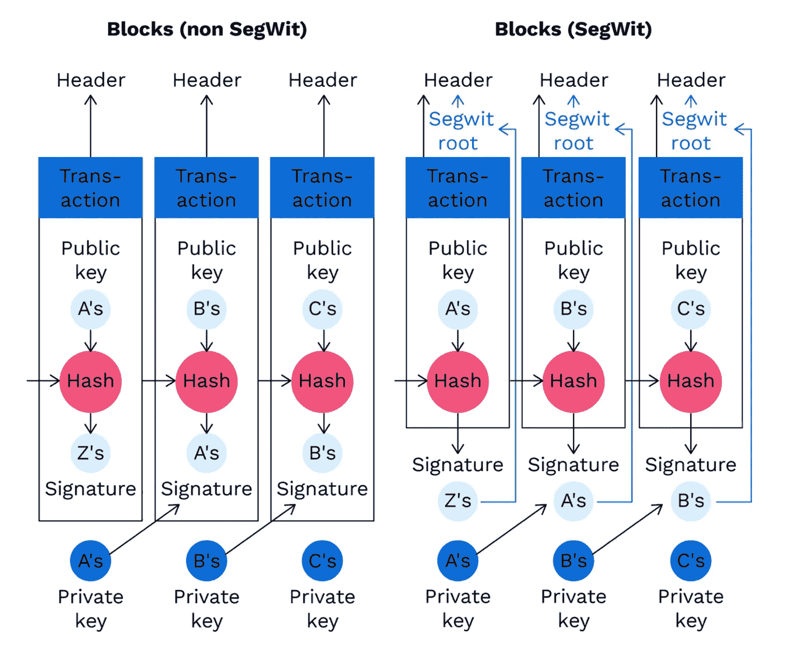
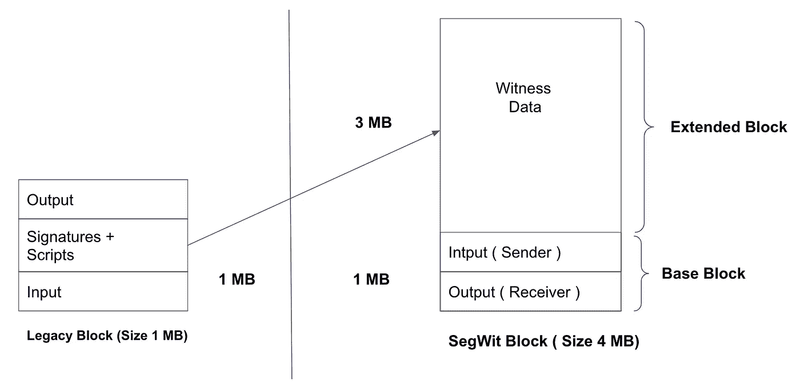

# SegWit 深度概述

> 原文：<https://medium.com/coinmonks/segwit-depth-overview-719ca5af56c9?source=collection_archive---------2----------------------->

***简介:*** *在本文中，我将对 SegWit 进行深度概述。以及 SegWit 如何帮助比特币实现可扩展性。Pieter Wuille 在 2015 年的一次比特币会议上首次介绍了 SegWit 的想法。*

*seg wit(Segregated wit)是改变比特币交易数据结构的* ***协议升级*** *。它于 2017 年 8 月 23 日* ***在比特币上推出，并被定性为比特币链条中的一个软叉，随后被比特币矿工和用户广泛接受。***

## **什么是 SegWit？**

**SegWit** 是如何通过从[比特币交易](https://www.investopedia.com/terms/j/jobsgrowth.asp)中移除签名数据来增加[区块链](https://www.investopedia.com/terms/b/blockchain.asp)上的[块](https://www.investopedia.com/terms/b/block-bitcoin-block.asp)大小限制的。当事务的某些部分从块中移除时，这释放了空间或容量来将更多的事务添加到链中。

*   首先也是最关键的，SegWit 固定了事务的可延展性。
*   增加比特币的区块大小，以增加更多交易。
*   SegWit 引入了两种新的脚本类型——发送和接收比特币——以及一种名为 [Bech32](https://river.com/learn/terms/b/bech32/) 的新编码方案。



## **什么是交易延展性？**

事务可延展性是指一个事务拥有多个有效的[txid](https://river.com/learn/terms/t/txid/)的能力。有关更多信息，请查看此[链接](https://en.bitcoin.it/wiki/Transaction_malleability)。

## Segwit 是如何工作的？

1.  ***块大小增加:*** Segwit 提出比特币块是如何构造的。**非 segwit** 块也称为遗留块，具有 1MB 空间。在 1MB 块内，输入数据，输出&签名等。

*   另一方面，Segwit 块大小高达 4MB。这是因为它由基本事务块和扩展块组成。所以 Segwit 就像比特币现金一样，确实是块大小增加。



Legacy vs SegWit Block

**SegWit 块结构实现了两个主要目标。**

*   Segwit 块结构将数字签名移出基本事务块。因此，如果有人更改交易上的签名，不会影响交易 id。这实际上解决了事务的可伸缩性问题。
*   它最小化了块中的基本事务数据。由于见证数据占事务大小的 65%,将它移到基本事务块之外可以让更多的事务适合 1MB 的块。

**2。Segwit 是软叉:**所以 SegWit 只是一个格挡增加。所以你可能会想，为什么不把块大小增加到 4 MB 呢？在这种情况下，开发人员只是避免硬分叉。

比特币特别说明了块大小不能超过 1MB。于是比特币开发者找到了没有硬分叉的解决方案。在现有协议下，具有另一个 3MB 的“扩展”的 1MB 块的解决方案仍然是可接受的。

因此，传统节点可以接受 1 MB 的数据块，Segwit 节点可以接受 1MB 的扩展数据块，总计 4 MB。这叫做软叉。

**3。测量块:**

传统块按大小测量，SegWit 块按重量测量。

SegWit 交易分为两部分:

*   **交易**的一部分:交易的**见证**被归类为*交易*的一部分。
*   **非交易部分:**除**见证**外的所有其他交易部分均归类为*非交易部分*。

一个简单的公式定义了任何交易的权重:

```
3*(non-segwit-part-of-transaction) + 1*(segwit-part-of-transaction)
```

但是，首先，让我们看看数学方程块测量。

```
legacy_block_size = **∑**(size_of_non-segwit-data_of_each_transaction)segwit_block_size = legacy_block_size + **∑**(size_of_segwit-data_of_each_transaction)
```

对于一个块， **non_segwit_weight** 和 **segwit_weight** 定义为

```
non_segwit_weight = 3***∑**(size_of_non-segwit-data_of_each_transaction)segwit_weight = 1***∑**(size_of_segwit-data_of_each_transaction)block_weight = non_segwit_weight + segwit_weigh
```

为了使块在链上有效

```
legacy_block_size <= 1 MBblock_weight <= 4MBU
```

## 赞成者&反对者

**优点:**

1.  **比特币交易更快:** SegWit 让比特币区块链更轻。它允许处理更多的交易，而不会增加比特币区块链的整体规模。
2.  **比特币交易更便宜。更高的交易速度意味着更低的交易费用。然而，比特币交易费用可能高得令人难以置信，因此社区应该欢迎任何降低交易费用的变化。**
3.  **交易延展性已成为过去:** SegWit 是比特币协议中一个重大问题的简单而有创意的解决方案。

**缺点:**

1.  **SegWit 造成了比特币社区的分裂:**围绕 SegWit 的分歧造成了几次硬分叉。其中最著名的是比特币现金(BCH)。
2.  **足够多的节点没有使用它:**很多矿工不喜欢 SegWit。较低的费用影响了他们的利润，他们也不喜欢支持证人数据侧链，这不提供任何费用收入。

## **结论**

SegWit 的实施标志着比特币区块链网络的重大升级。它被引入可扩展的比特币网络，以供大众采用。此外，将数字签名或见证从事务块中分离出来，可以实现几个优点，比如更小的事务大小、可延展性修复等等。但同时，许多方式不接受 SegWit，因为扣除收入。比特币交易的可扩展性需要更多的 R&D 来修复几个问题，尽管 SegWit 可以在短时间内修复可扩展性。

参考

1.  [https://www . bit panda . com/academy/en/lessons/what-is-seg wit-separated-wit-and-how-it-work/](https://www.bitpanda.com/academy/en/lessons/what-is-segwit-segregated-witness-and-how-does-it-work/)
2.  [https://www . econ stor . eu/bitstream/10419/230576/1/1693601958 . pdf](https://www.econstor.eu/bitstream/10419/230576/1/1693601958.pdf)
3.  [https://river.com/learn/what-is-segwit/](https://river.com/learn/what-is-segwit/)
4.  [https://medium . com/@ AK shay _ 111 meher/seg wit-block-size-and-block-weights-f 5864 a 6133 fc](/@akshay_111meher/segwit-block-size-and-block-weights-f5864a6133fc)

[](/coinmonks/segregated-witness-simplified-b0e56103750f) [## 简化隔离见证。

### 自从隔离见证(SegWit)实施以来，加密货币世界就被一个叫做 SegWit 的新词所充斥

medium.com](/coinmonks/segregated-witness-simplified-b0e56103750f) [](/coinmonks/crypto-trading-bot-c2ffce8acb2a) [## 最佳免费加密交易机器人——前 16 名比特币交易机器人[2021]

### 2021 年币安、比特币基地、库币和其他密码交易所的最佳密码交易机器人。四进制，位间隙…

medium.com](/coinmonks/crypto-trading-bot-c2ffce8acb2a)