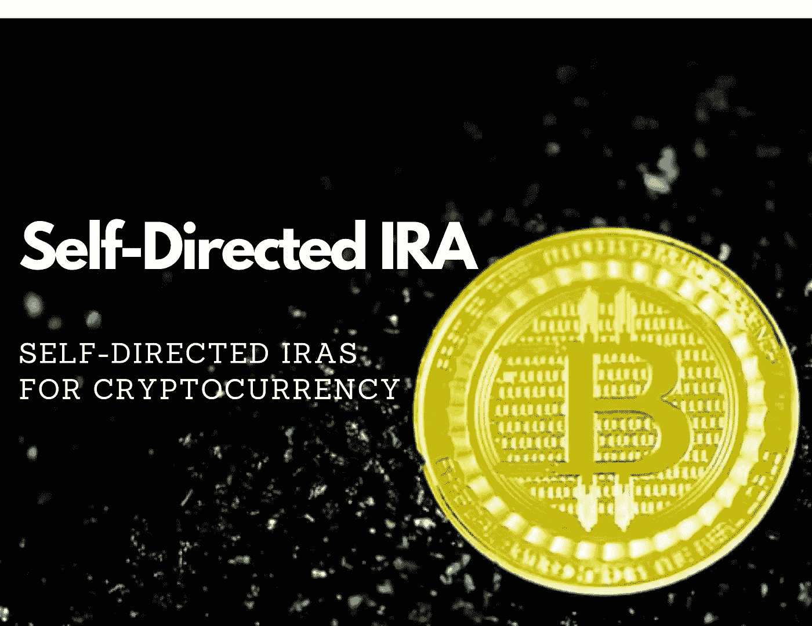

# 面向加密的自主个人退休帐户—您需要知道的！

> 原文：<https://medium.com/coinmonks/self-directed-iras-for-crypto-what-you-need-to-know-c6d87e09ba7a?source=collection_archive---------3----------------------->

Photo — [Executium](https://unsplash.com/@executium?utm_source=medium&utm_medium=referral)

## 自我导向的个人退休帐户如何帮助减少您的加密货币税。

如果你在过去几年中购买、出售或以其他方式交易了加密货币，那么很有可能 ***你需要缴纳资本利得税*** 。

这是因为加密货币被许多税务机关归类为'**资本资产'**…