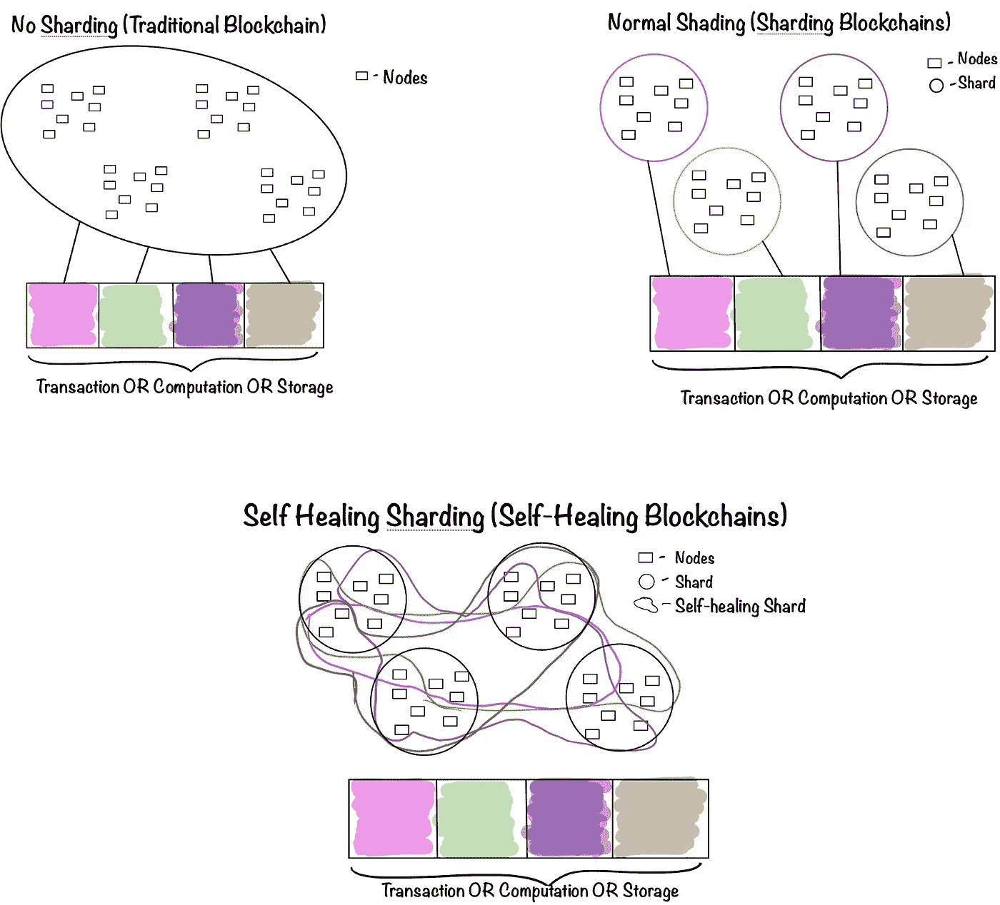

# 自愈区块链

> 原文：<https://medium.com/coinmonks/self-healing-blockchains-are-the-future-5c8ac8275f8c?source=collection_archive---------4----------------------->

全世界都在急切地等待下一代高性能的公共免许可区块链。这种区块链应该能够在工业上扩展所有分散的应用。迄今为止，世界/加密社区见证了:

● *P2P 区块链网络使用所有节点来验证交易、进行计算和存储。比如比特币、以太坊……(传统区块链)*

*●共享交易、计算和存储的 P2P 区块链网络。比如 Zilliqa，以太坊 2.0，和谐……(分片区块链)*

分片技术允许区块链无限和可持续的可伸缩性。可扩展性问题是阻碍主流区块链面向大众的唯一问题。分片技术是区块链可伸缩性问题的唯一解决方案。

在本文中，我们将讨论困扰分片技术的问题。此外，如何自我修复的区块链碎片是唯一的解决办法！

## **我们为什么需要分片技术？**

有了，

●全球每秒钟产生超过数十亿笔交易(支付、物联网、供应链等。),

●每秒超过六亿次计算

●每秒生成和存储超过 2.5 万亿字节的数据，这项工作需要在节点之间进行拆分。这种分工被称为分片技术。分片可以应用于事务、计算和存储。

困扰分片技术的问题有

● P2P 网络问题，如互联网连接问题、断电、数据丢失等等…

●全球各地的节点一直处于在线和离线状态。

●与传统方法相比，分片区块链的数据可用性和数据一致性较差。

●当一个分片中的所有节点离线时，属于该分片的数据将永远丢失。

这里的罪魁祸首是 P2P 网络的不可预测性！P2P 网络的这种不可预测性降低了验证、计算和存储的性能。

注意:今天提供的大多数分片技术都是在许可的区块链网络上，这些网络已经保证了高 P2P 性能。但是世界需要一个没有许可的区块链网络来确保真正的去中心化。因此需要自愈分片技术。

## **介绍自愈分片**

由于 P2P 网络的不可预测性，为了保证分片性能的一致性，引入了自愈机制。

从图中可以看出，当普通分片中的一个分片离线时，属于该分片的所有数据都将永远丢失。但是在自我修复分片中，如果一个分片离线，数据仍然可用，网络继续运行。一旦碎片的节点重新联机，它们将更新视图并存储它们应该存储的数据。

## 具体怎么做？

●事务/计算/存储被分成很小的部分，每个部分都有自己的碎片，没有两个事务/计算/存储(数据)有相同的碎片。

●换句话说，不是将数据分配给特定的碎片，而是将碎片分配给特定的数据，以便没有两个数据具有相同的碎片。

●确保碎片的地理分布，以便能够克服局部中断。

●将分片信息本身分发到另一个分片的分散链上。

## 属性:

●为了保持无限的网络容量，所有节点上都复制了非常少量的信息。

●为了确保自动修复，节点使用相同的信息、公式和算法。

●这种机制允许任何节点在几毫秒内进行自我修复。要深入了解自愈机制，请参考 [Uniris 黄皮书。](https://uniris.io/assets/yellowpapers/UNIRIS-YellowPaper-Season1-Network.pdf)

[Uniris](https://uniris.io/) 是自愈机制的先驱，也是第一个实现它的区块链。

*如果你想了解更多关于自我修复机制或我们的信息，请给我们留言:team@uniris.io*

本文作者是 Uniris 研发主管阿克谢·库玛尔·坎迪。

*如果你觉得有用，推荐或分享。*

> [直接在您的收件箱中获得最佳软件交易](https://coincodecap.com/?utm_source=coinmonks)

