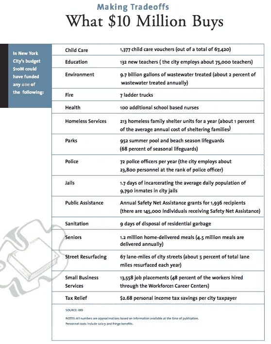

# 使用智能合同自我修复街道。

> 原文：<https://medium.com/coinmonks/self-repairing-streets-using-smart-contracts-c1dac20cfce1?source=collection_archive---------9----------------------->

*不涉及激光卡车或神奇沥青。*

## TLDR:跳到十分钟的结尾。

***更新 2018 年 4 月:*** *高兴地宣布，我们正在与* [*神权的****SOUQ****app*](https://cryptocracy.io/)*进行原型去中心化、社区供电的街道维护。*

从 2014 年开始，我一直在研究美国城市街道是如何维护的。我没有土木工程学位，不是工会成员，也没有修补过路面坑洼。我只是另一个自称为公共技术专家的人，他或许天真地认为，有一种更好的方式可以管理我们最大的共享公共资产——我们的街道，同时协调我们如何合作过渡到一个日益自动化的世界，在这个世界中，公民的未来分布更加均匀。

# 基本原理

互联网在早期被称为信息高速公路是有道理的。数万亿比特(1 和 0)从一个集线器高速传输到另一个集线器，标志着数字时代的到来。这些数字网络类似于数万亿个原子(你、我和其他东西)在我们的街道和高速公路上运输的方式。

网络引发了一股不可阻挡的力量`1s`和`0s`影响和控制你、我和其他人的行为和活动👫+🚚。

无处不在的宽带、廉价硬件、机器学习和去中心化记录保存的新范式(*区块链*)，正在预示着又一个拐点的到来。有人称之为新工业革命。

在不久的将来，这个难以辨别的时间点将涉及达到并超过人类决策的峰值，即机器比人类做出更多操作决策的时间点。这不同于机器人自动化，比机器人自动化更不明显，也更深远。

> 在一个即使在最好的情况下也很难进行真实性测试的领域，在这个领域，不真实性是可以假设的，人工智能的接管可能被证明是不可检测的。哈珀杂志。2016 年 4 月

城市作战是现实测试特别困难的地方，并且因为各种错误的原因而受到限制。我称之为现实测试。我认为我们的城市应该成为更好的大规模探索真理的实验室。在这个时代，真理可以威胁最好的科学，获得基本真理是至关重要的。

我们已经看到了新工业力量在发挥作用的信号，它极大地影响了我们辨别真相的能力。

这篇文章试图阐明街道维护操作*(一个字面上的事实)*如何在确保公平结果的同时利用比特和原子被重新想象。

除了追求字面上的地面真理，我们还能从哪里开始呢？

# 软件吞噬街道

自动驾驶技术的到来引发了一系列情绪，从幻想到怀疑到恐惧。

汽车和电脑，20 世纪的旗舰产业，汇聚起来影响我们 21 世纪的[公民未来](/@bryan/exploring-civic-futures-55f5141a5477)。为了实现期望的市场潜力和增长图，我们的街道将不可避免地需要遵守。

我想反复强调这一点，但这里有一些来自[彭博/阿斯彭关于驯服自动驾驶汽车的倡议报告的精彩图表:城市入门](http://bbhub.io/dotorg/sites/2/2017/05/TamingtheAutonomousVehicleSpreadsPDF.pdf)，这是我曾短暂参与的一个项目。

虽然也有令人信服的愿景来创建“智能街道”和布满传感器的道路，但我没有看到它们在当地街道上被采用。或许在高速公路上，那里的经济似乎更合理。正如电动汽车在 19 世纪晚期被证明是一种可能性，但直到 20 世纪晚期才被实现一样，智能街道运动也是如此。它需要一个滑稽的执行冠军，他目前正在火星上做着愚蠢无聊的事情。

在那之前，我们必须处理常规街道，以及如何最好地维护它们，同时还要适应自动化浪潮。

Thomas Parker Electric Car 1895

(L) Integrated Roadways. (R) Solar Roadways.

这些未来是否最终对我们的同事有利，取决于我们在面对迭代和反向传播比特网络时如何集体行动，这些网络太复杂，我们任何一个人都无法理解。

今天，城市主要依靠原子(*人类决定*)来保持其他原子*(你、我和其他东西)*的运动。公务员和军队工程师拖着沥青、修补坑洼和油漆路面标志的图像，构成了一幅英雄般的庞大和野蛮的原子在工作的肖像。

不为所动的自主未来将最终迫使原子的这种勇敢让步于比特的精确。然而，为了公共利益，可能有机会利用比特和原子之间的这种紧张和权力动态。

# 自我管理的街道网格

A simplified street grid with numbered street segments. (Author’s squiggles)

我先说区块链技术和数字货币在货币交易层面实现了*机构*。与区块链的大多数事情一样，这需要进一步的解包:

***…货币交易层面的代理***意指互联网上的任何- *物*都可以独立行动，与互联网上的其他*物*进行货币消费或价值交换

让我们进一步分析一下:

*   **区块链**允许网络中的每个实体维护一些**【地面真相】**信息的安全副本。这个基本事实包括关于它自己和网络上其他一切的信息。对该基本事实的修改通过**共识机制** *(对变更说是或否)进行验证。*这是中央记录过时的原因。
*   一个**智能契约**最简单的形式是一个`if this then that`规则，当满足该规则时，涉及某种价值的交换。

当这些元素通过区块链在互联网上聚集在一起时，结果是一个能够独立交换价值并以反映公平感的方式安全地维护地面真相的网络。至少在原则上，这是我们期望区块链支持的应用程序所要完成的。

我们被告知*自由市场*应该做同样伟大的事情……但那不是为了这项事业。

我在这里阐述的是一系列步骤，设想比特如何控制街道的维护，并允许公平的自治未来，同时牢记现有的公共机构*(英雄的原子)。*

# 每个街区一个钱包

或者钱包。

A street with monetary agency.

一个重新构想的、用于街道维护的自我调节系统包括每条街道(*或街道段*)被分配一些货币机构，即代表其花钱的能力。

是时候说出真相了！

*   纽约的十年资本支出计划包括投资 16 亿美元和重铺至少 7640 英里车道的承诺。
*   这意味着每年至少投资 1.6 亿美元来重铺至少 764 英里的车道，并承诺在 2018 年和 2019 年重铺 1300 英里的车道。
*   在 2016 财年，[根据市长管理报告](http://www.ibo.nyc.ny.us/iboreports/understandingthebudget.pdf)，纽约市重铺了 1，239.4 英里车道的纽约市街道，平均成本为每英里车道 149，102 美元，总计约 1.8 亿美元。
*   1 英里中心车道= 20 个纽约街区。假设每条街道平均有 3 条车道。也就是说，每 20 个街区有 3 个车道英里。
*   所以去年，纽约市重铺了 1239.4 英里的车道；这相当于 8，263 个街区重铺了路面，或者说在本财政年度每天重铺 23 个街区。这是一个令人印象深刻的壮举！

**1 center-lane mile is counted as 2 lane-miles if a street has 2 lanes. New York City 6,500 center-lane miles, thats ~20,000 lane miles assuming an average of 3 lanes per street.**

纽约市还有一个独特的缺点，那就是与人行道相比，它的电、气和水设施都是在街道上。这意味着每次发生煤气泄漏或电力维修时，街道都需要开放。

这是一种神经官能症，简单明了。我在我自己的街道上追踪过它，仅仅 3 个月后，我们的街道重新开放以修复一些下水道。其他邪恶的东西也可能在这里发挥作用。

下面是通过纽约独立预算办公室看到的 1000 万美元在纽约[买了什么的简单视图。去年我们在街道维护上已经超支 2000 万美元。与纽约 850 亿美元的预算相比，这可能只是沧海一粟。](http://www.ibo.nyc.ny.us/iboreports/understandingthebudget.pdf)

**然而，我们可以做得更好，少花钱多办事。**

[Priorities. $20 million would buy the city 416 homeless family shelters vs 44 city blocks worth of streets paved.](http://www.ibo.nyc.ny.us/iboreports/understandingthebudget.pdf)

在私人资本以效率的名义涌入并控制我们的街道之前，我们还要等多久？

> 苹果公司为您带来的 54 街和 59 街之间的第五大道，门票 5 美元。iPhone X 机主免费使用。

你说永远不会发生？

[NYT’s BottomLine Nation illustrates how smaller cities and towns are witnessing a quiet takeover of water and ambulance services by private equity. Are our streets next?](https://www.nytimes.com/series/private-equity-bottom-line-nation)

[**Keith Mozee(洛杉矶)**](https://www.linkedin.com/in/keith-mozee-666a8831) **和** [**Galileo Orlando(纽约市)**](https://www.linkedin.com/in/galileo-orlando-397655b0/) 是美国最大的两个城市的街道维护主管，他们与交通专员和他们的市长一起，帮助决定如何维护大约 50，000 英里的柏油路。我邀请他们和我们一起梦想。这个梦想不需要军用级激光货车或具有神奇自愈性能的沥青。只是一些敏锐的、有公共意识的极客站在屏幕前，愿意尝试新事物。

(L) Military-grade laser vans that survey, at extremely high precision & costs, only small sections of the city’s street grid every few years (R) [Self healing asphalt ; prove me wrong and deliver this for 20,000 lane miles of street.](https://www.ted.com/talks/erik_schlangen_a_self_healing_asphalt)

# 关于分散街道维护的 10 步建议。

1.  每个街道或标准城市街区都被分配了一个数字钱包，其中包含一些预定义的纳税人的钱。
2.  数字街道状况调查*(不是挡风玻璃调查！)*在每一个城市街区实时上演。 [**我们的 SQUID 项目展示了如何使用开源技术以低成本实现这一点。**](https://www.streetsdatacollaborative.org/technical-overview/) 这些调查可以由专用市政车队或能够传输**地面实况**街道状况数据的私人车辆进行。*(这些车辆也可以为此服务获得补偿)*
3.  这些实时调查数据可以存储在 city{block}链上，以跟踪当前的街道状况。
4.  随着时间的推移，由于不同的街道段磨损不同，每个街道段都内置了一个**智能合同**，这样一旦它低于某个“平滑度或质量阈值”，它就会发出一个“**维修请求”**。`if my condition < smoothness threshold then issue a **Request for Repair(RFR)**`
5.  路面修复公司可以对这些通过算法生成的 RFR 出价。
6.  中标修复的公司必须在一些普遍可接受的参数(时间、成本等)范围内完成街道修复。在此期间，针对该维修公司的任何投诉都可以附加到其个人资料中，并影响未来的投标。
7.  受影响的路段在维修期间关闭。
8.  一旦修复完成，道路将开放，并由通过道路的车辆重新测量。
9.  前“n”次调查确定修理工作是否成功。然后，街道部分将商定的$$$记入路面维修公司的贷方，或者在工作质量差的情况下扣除。
10.  如果街道能够在某些社区区域内交换资金，则全市街道维护可以平均分配。因此，公共资金的分配更加公平有效，这是基于字面上的基本事实共识机制。

这可能会是这样的结果:

> 我们选择在这十年中登上月球，做其他事情，不是因为它们容易，而是因为它们困难，因为这个目标将有助于组织和衡量我们最好的能量和技能，因为这个挑战是我们愿意接受的，是我们不愿意推迟的，是我们打算赢得的，也是其他挑战。—JFK 1962 年 9 月 12 日。