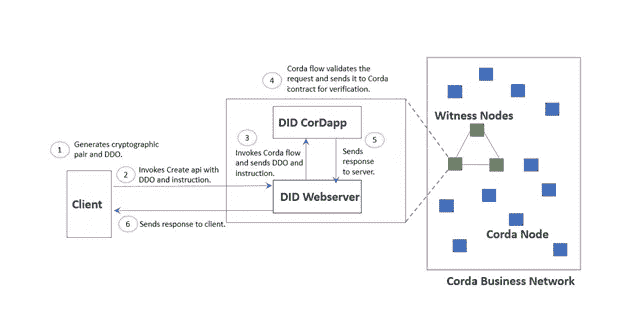

# Corda 上的自我主权身份

> 原文：<https://medium.com/coinmonks/self-sovereign-identity-on-corda-6b4bf4513583?source=collection_archive---------0----------------------->

**简介**

这篇博客旨在向读者介绍在 Corda 网络上本地实现自我主权身份的概念。这项工作的实现是开源的，可以在 [R3 市场](https://github.com/persistentsystems/corda-did-method)上免费获得，任何人都可以使用或构建。

自我主权身份(SSI)是一种管理[数字身份](https://whatis.techtarget.com/definition/digital-identity)的模式，在这种模式下，个人对自己的身份拥有唯一的所有权，并且能够控制自己的个人数据。当今的大多数身份管理系统要么是孤立的，要么是联合的。在孤岛模型中，用户使用用户名和密码向服务进行身份验证，用户名和密码是在向服务注册的过程中创建的。用户名和用户密码的散列保存在服务器端的数据库中。每个应用程序都有自己的用户名和密码数据库。孤立的身份仅对该应用程序和创建用户名的实体有效。因此，用户必须为他与之交互的每个应用程序或网站创建新的用户名和密码。在这种类型的系统中，用户很难记住跨不同应用程序使用的所有用户名/密码。因此，许多用户在多个应用程序中使用相同的用户名和密码。如果任何应用程序中发生数据泄露，都可能导致用户的身份受到威胁，从而使攻击者能够使用相同的用户名和密码组合控制多个应用程序。

联合身份系统克服了使用孤岛式身份认证模型根据需要为每个网站创建单独的用户名和密码的困难。联合模式允许用户通过联合身份提供者在多个应用程序和网站中使用单一用户名和密码。这涉及到一个身份提供者(IDP ),它在其数据库中集中管理用户的身份。第三方应用程序可以通过将用户重定向到 IDP 登录来确定用户的身份。一旦通过 IDP 认证，用户就可以继续使用应用程序的服务。上述方法使用户无需拥有多个用户名和密码。这种方法的问题是 IDP 保存所有的用户信息。如果一个 IDP 被黑客攻击，所有相关的帐户也可能受到危害。身份提供者还可以跟踪用户与哪些应用程序进行交互。如果身份提供商决定删除/阻止用户的帐户，他将无法使用联合身份登录应用程序并与之交互。

自我主权认同试图用上述方法解决问题。为了理解自主权身份如何工作，我们必须首先理解 PKI(公钥基础设施)的概念，因为自主权身份系统利用 PKI 来识别网络上的各方。

PKI 系统使用密钥对(一个私钥和一个公钥)。用公钥加密的消息只能用相应的私钥解密，用私钥签名的消息只能用相应的公钥验证。PKI 系统有认证机构(ca)来识别公共/私有密钥对的所有者。这个证书颁发机构是集中式的，如果它错误地颁发了一个证书或被黑客攻击，就会导致重大问题。例如，欺诈网站可以从受损的 CA 获得证书，并伪装成合法网站。

自主权身份系统建立在区块链上，其作用类似于分散的认证机构，从而减少对大型中央实体的依赖。在这个生态系统中，关于用户身份的数据只存储在他的设备上，并由他使用私钥单独控制。用户在他的设备(最好是移动设备)上生成密钥对，以及将用于唯一标识用户的分散标识符(DID)。DID 和公共密钥然后被注册在区块链网络上。希望找到 DID 的公共密钥的任何一方可以简单地查询区块链并检索公共密钥。请参考此[链接](/metadium/introduction-to-self-sovereign-identity-and-its-10-guiding-principles-97c1ba603872)了解更多信息。

**科达做了方法概述**

Corda DID 方法是 Corda 分类帐上自我主权身份的实现。它允许创建、更新、查找和删除分散的身份。在实现这些方法时，Corda DID 方法遵循了 [w3 分布式标识符规范 1.0 版](https://www.w3.org/TR/did-core/)指南。

身份注册表用于维护属于特定 DID 的公钥列表。每当用户想要验证一方的签名或加密要发送给一方的消息时，他可以通过获取与该方的 DID 相关联的公钥来这样做。

Corda DID 方法提供了一个 REST 接口，支持用户设备/钱包与 Corda 自主身份解决方案之间的通信。钱包可以使用 REST APIs 来创建它们的身份，读取、替换或添加密钥到它们的身份，以及删除身份。

**架构**

Corda DID 方法定义了充当网络上信任锚的“见证节点”,只有见证节点可以在网络上创建、更新和删除身份。希望与见证节点交互的其他方必须使用见证节点的 web 服务器的 REST APIs 来进行交互。

图 1 显示了一个创建身份用例的 Corda DID 方法和工作流的架构。为了创建身份，客户端首先在其设备上本地生成一个密钥对。该设备还生成基于 [RFC4122](https://www.ietf.org/rfc/rfc4122.txt) 的唯一标识符，该标识符随后与 DID 前缀组合，并用作用户的标识符。

示例**did:corda:org-PVT:3d F6 b0a 1–6b 02–4053–8900–8 c 36 b 6d 35 fa 1**

创建一个 DID 文档(DDO ),并将之前与 DID 一起生成的公钥嵌入到该文档中。创建一个指令有效载荷，其中包含 Corda 后端创建身份所需的命令。使用私钥对包含公钥的 DID 文档(DDO)进行签名，并将其嵌入指令中。

文档和指令随后被发布到 REST API，API 将调用 Corda 流来创建身份。Corda 流将交易发送到网络上的所有见证节点，并且 Corda 智能合约使用嵌入在文档中的公钥来验证文档上的签名，并且将 DID 链接到公钥的条目被记入分类帐。



**Figure-1 : Architecture**

REST APIs 的签名将在下面的小节中展示。

**做了**

DID 或分散标识符用于唯一识别网络上的用户(密钥对的所有者)。由于没有集中的数据库来跟踪所有的身份，我们需要确保标识符在以分散的方式生成时是唯一的。为此，Corda DID 方法通过标准 [RFC4122](https://www.ietf.org/rfc/rfc4122.txt) 使用 UUID。​

DID 具有格式 **did: <平台> : <网络> : <唯一 _ 标识符>**

Corda 的 DID 如下所示:

**did:corda:livenet:3d F6 b0a 1–6b 02–4053–8900–8 c 36 b 6d 35 fa 1**

“did”部分指定它是一个分散的标识符。

“corda”部分指定可以使用 Corda DID 方法解决。

Corda DID 方法允许您在自定义网络中运行设置。在上面的例子中，它是 Corda 测试网络，用字符串“livenet”表示。

唯一标识符是基于 [RFC4122](https://www.ietf.org/rfc/rfc4122.txt) 的 UUID。

**DID 文件**

Corda DID 方法中使用的 DID 文档如下所示

文档对象的主要目的是提供与 DID 相关的公钥。在上面的例子中，我们可以看到存储在这个文档中的公钥是一个 ECDSA 密钥，它是使用 base58 编码的。公共密钥数据结构是一个数组，指示用户可以拥有与单个 DID 相关联的多个密钥。DID 文档存储在分类帐中。

**指令**

钱包/持有者将通过 REST API 与 Corda DID 层通信，因此确保调用这些 API 的用户的身份是至关重要的。为了实现这一点并保持分散，我们使用了指令对象。

以身份创建为例

1.持有者生成一对密钥(公钥和私钥)。

2.持有人按照上一节所示创建单据。

3.然后，持有者将创建一个指令对象，并在文档上包括一个签名。

4.然后，这将被发布到 API 服务器，然后传递到 Corda 流，最终传递到 Corda 合同，然后 Corda 合同根据文档中的公钥验证指令上的签名。如果验证成功，则创建身份。

在更新或删除的情况下，从分类账中查询当前文件以获取公钥，从而与指令上的签名相匹配。

示例:

```
{
    “action”​ :​ “create”​ ,​
    “signatures”​ :​ [
        { “id”​ :​ “ did:corda:tcn:2ce7cef6–6948–4d71-a6ab-dbd8096050fb#keys-1”​ ,​
            “type”​ :​ “Ed25519Signature2018”​ ,​
            “signatureBase58”​ :​“2M12aBn5ijmmUyHtTf56NTJsUEUbpbqbAgpsvxsfMa2KrL5MR5rGb4dP37QoyRWp94kqreDMV9P4K3QHfE6 7ypTD”
        }
    ]
}
```

在上面的例子中，我们看到了包含一个动作和一组签名的指令对象。签名包括签名的类型和签名上使用的编码以及编码的签名。

**API**

API 遵循标准的 REST 格式。有用于创建、读取、更新和删除的 API。下面是几个例子。

**创造**

```
curl -X PUT \ [http://example.org/did:corda:tcn:a609bcc0-a3a8-11e9-b949-fb002eb572a5](http://example.org/did:corda:tcn:a609bcc0-a3a8-11e9-b949-fb002eb572a5) \
-H ‘content-type: multipart/form-data’​ \​
-F instruction=’{​
    “action”: “create”,
    “signatures”: [
        {
            “id”: “did:corda:tcn:a609bcc0-a3a8–11e9-b949-fb002eb572a5#keys1”,
            “type”: “Ed25519Signature2018”,
            “signatureBase58”: “2M12aBn5ijmmUyHtTf56NTJsUEUbpbqbAgpsvxsfMa2KrL5MR5rGb4dP37QoyRWp94kqreDMV9P4K3QHfE6 7ypTD”
        }
    ]
}’ \​
-F document’= {​
    “@context”: “https://w3id.org/did/v1",
    “id”: “did:corda:tcn:a609bcc0-a3a8–11e9-b949-fb002eb572a5”,
    “created”:”2019–07–11T10:27:27.326Z”,
    “publicKey”: [
        {
        “id”: “did:corda:tcn:a609bcc0-a3a8–11e9-b949-fb002eb572a5#keys-1”,
        “type”: “Ed25519VerificationKey2018”,
        “controller”: “did:corda:tcn:a609bcc0-a3a8–11e9-b949-fb002eb572a5”,
        “publicKeyBase58”: “GfHq2tTVk9z4eXgyNRg7ikjUaaP1fuE4Ted3d6eBaYSTxq9iokAwcd16hu8v”
        }
    ]
}’
```

回应:

●对于带有格式良好的指令、格式良好的文档、有效签名和未使用 id 的请求，API 将以状态 200 进行响应。

●对于带有变形指令或变形文档或至少一个无效签名的请求，API 将以状态 400 进行响应。

●对于 DID 已被采用的请求，API 将以状态 409 进行响应。

**更新**

```
curl -X POST \ [http://example.org/did:corda:tcn:a609bcc0-a3a8-11e9-b949-fb002eb572a5](http://example.org/did:corda:tcn:a609bcc0-a3a8-11e9-b949-fb002eb572a5) \
-H ‘content-type: multipart/form-data’​ \​
-F instruction=’{​
    “action”: “update”, 
    “signatures”: [
        {
            “id”:”did:corda:tcn:a609bcc0-a3a8–11e9-b949-fb002eb572a5#keys-1",
            “type”:”Ed25519Signature2018",
            “signatureBase58”: ”57HQXkem7pXpfHnP3DPTyLqSQB9NuZNj7V4hS61kbkQA28hCuYtSmFQCABj8HBX2Am Dss13iDkNY2H3zqRZsYnD4"
        },
        {
            “id”:”did:corda:tcn:a609bcc0-a3a8–11e9-b949-fb002eb572a5#keys-2",
            “type”:”Ed25519Signature2018",
            “signatureBase58”: ”26kkhZbQLSNvEKbPvx18GRfSoVMu2bDXutvnWcQQyrGxqz5VKijkFV2GohbkbafPa2WqV ad7wnyLwx1zxjvVfvSa”
        }
    ]
}’ \​
-F document’= {​
    “@context”: “https://w3id.org/did/v1",
    “id”: “did:corda:tcn:a609bcc0-a3a8–11e9-b949-fb002eb572a5”,
    “created”:”2019–07–11T10:27:27.326Z”,
    “updated”:”2019–07–11T10:29:15.116Z”,
    “publicKey”: [
        {
            “id”: “did:corda:tcn:a609bcc0-a3a8–11e9-b949-fb002eb572a5#keys-2”,
            “type”: “Ed25519VerificationKey2018”,
            “controller”: “did:corda:tcn:a609bcc0-a3a8–11e9-b949-fb002eb572a5”,
            “publicKeyBase58”: “GfHq2tTVk9z4eXgyHhSTmTRf4NFuTv7afqFroA8QQFXKm9fJcBtMRctowK33”
        }
    ]
}’
```

回应:

如果更新成功，API 将以状态 200 响应。

对于 ID 未知的请求，API 将以状态 404 进行响应。

对于不正确有效负载的其他情况(不匹配的签名、格式错误的文档、指令等), API 将以状态 400 进行响应。).

**改为**

```
curl -X GET [http://example.org/did:corda:tcn:a609bcc0-a3a8-11e9-b949-fb002eb572a5](http://example.org/did:corda:tcn:a609bcc0-a3a8-11e9-b949-fb002eb572a5)Response:{
    “@context”​:​”https://w3id.org/did/v1"​,
    “id”​:​”did:corda:tcn:a609bcc0-a3a8–11e9-b949-fb002eb572a5"​,
    “created”​:​”2019–07–11T10:27:27.326Z”​,
    “publicKey”​:[
        {
​            ”id”​:​”did:corda:tcn:a609bcc0-a3a8–11e9-b949-fb002eb572a5#keys-1"​,
​            ”type”​:​”Ed25519VerificationKey2018"​,
            ​”controller”​:​”did:corda:tcn:a609bcc0-a3a8–11e9-b949-fb002eb572a5"​,
​            ”publicKeyBase58"​:​”GfHq2tTVk9z4eXgyNRg7ikjUaaP1fuE4Ted3d6eBaYSTxq9iokAwcd16hu8v”
        }
    ]
}
```

回应:

●对于 ID 已知的请求，API 将以状态 200 进行响应。

●对于 ID 未知的请求，API 将以状态 404 进行响应。

●对于 ID 格式不正确的请求，API 将以状态 400 进行响应。

**删除**

```
curl -X DELETE \ [http://example.org/did:corda:tcn:a609bcc0-a3a8-11e9-b949-fb002eb572a5](http://example.org/did:corda:tcn:a609bcc0-a3a8-11e9-b949-fb002eb572a5) \
-H ‘content-type: multipart/form-data’​ \​
-F instruction=’{​
    “action”: “delete”,
    “signatures”: [
        {
            “id”:”did:corda:tcn:a609bcc0-a3a8–11e9-b949-fb002eb572a5#keys-2",
            “type”:”Ed25519Signature2018",
            “signatureBase58”:
”26kkhZbQLSNvEKbPvx18GRfSoVMu2bDXutvnWcQQyrGxqz5VKijkFV2GohbkbafPa2WqV ad7wnyLwx1zxjvVfvSa”
        }
    ]
}’
```

反应

●如果删除成功，API 将以状态 200 响应。

●对于 ID 未知的请求，API 将以状态 404 进行响应。

●对于不正确有效负载的其他情况(不匹配的签名、格式错误的指令等), API 将以状态 400 进行响应。).

**潜在应用**

Corda DID 方法实现可以作为一项服务在 Corda 业务网络上运行。开发人员可以试验 did，并将其整合到 Corda 业务应用程序中，从而实现新的功能，如客户端签名和验证。在 Corda 分类帐中，最终用户可以被表示为 DID，这为依赖于最终用户与 Corda 交互的应用程序提供了新的可能性。智能合同可以进行检查，以验证来自用户钱包中相应私钥的某些有效负载的数字签名。