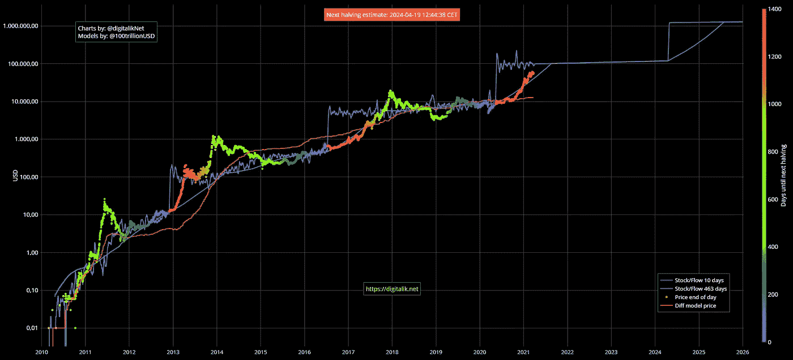
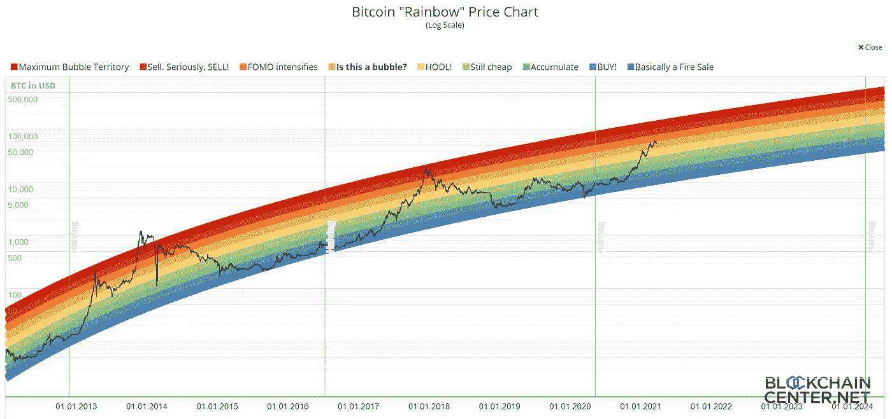
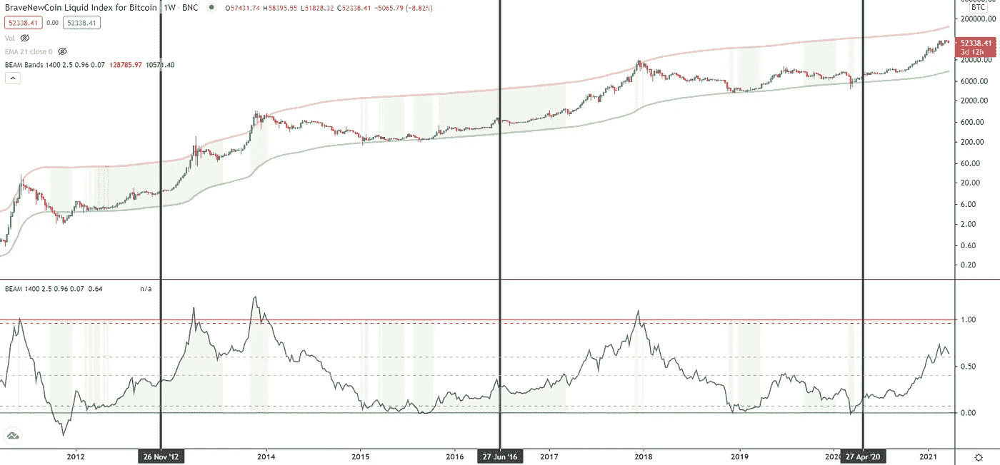
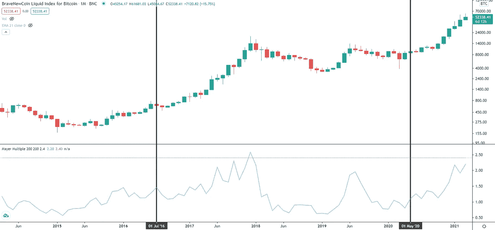
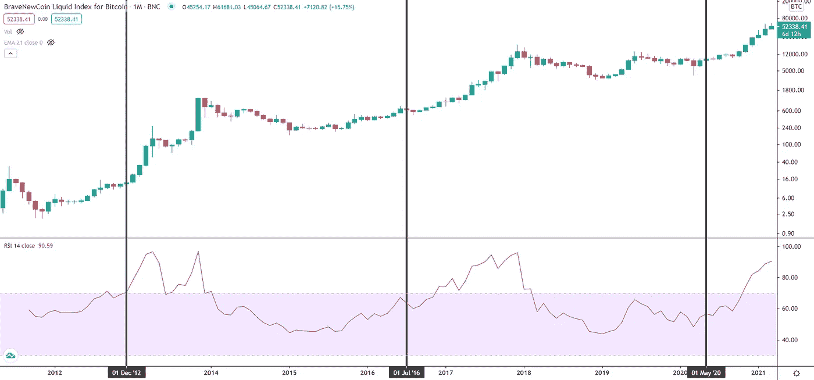
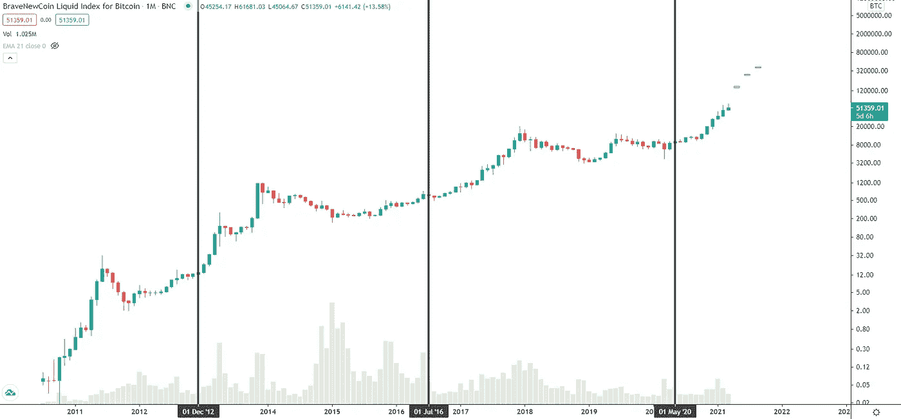

# 基于成功的指标，在顶部出售比特币

> 原文：<https://medium.com/coinmonks/selling-bitcoin-at-the-top-based-on-successful-indicators-120af60f7a7?source=collection_archive---------2----------------------->

## 免责声明:这不是财务建议。行动风险自担。

Photo by [Nick Chong](https://unsplash.com/@nick604?utm_source=medium&utm_medium=referral) on [Unsplash](https://unsplash.com?utm_source=medium&utm_medium=referral)

市场时机是每个人都想征服的困难挑战。比特币更是如此。虽然，如果历史押韵，也有一线希望出售顶端。

我将提出一些有趣的指标，这些指标指出了 2017/2018 年最后一个牛市周期中的价格顶部。这些指标给了我一种当前周期何时见顶的感觉。

我的策略是基于 5 种不同的方法，每一个指标都比前一个指标提出了更高的价格目标。都在上次比特币价格找顶中发挥了重要作用。这些方法是:

*   **库存到流量模型(S2F)**
*   **比特币彩虹图**
*   **光束指示器**
*   **迈耶倍数**
*   **月度 RSI**

我将指导你完成这些措施。

所有这些模型都指向 2021 年比特币价格的各种新趋势。使用此类指标时，关键的理解是:

> “所有的模型都是错误的，但其中一些是有用的”
> 
> —乔治·博克斯

所以你应该意识到:这些模型最终可能被证明是错误的。在那之前，让我们看看他们，因为他们确实很有见地。

每个模型都描绘了每比特币至少 10 万美元的目标！

## PlanB 著名的库存到流动模型

到目前为止，最流行的是股票到流量模型(S2F)，它首先由 PlanB 应用于比特币，后来扩展到跨资产版本(S2FX)。前一个经典 S2F 基于在减半周期中开采的比特币数量(流量)和现有比特币(股票)之间的关系，因为它也用于开采黄金。

我们可以在网站上找到 digitalik.net 的生动插图。下面是它的截图。

为了让这个更容易理解，我建议你看看比特币的浅蓝色曲线和多色价格图。浅蓝色曲线代表每个减半周期的库存-流量值。正如 PlanB 所说，预计比特币在每个周期都会逼近这条线。

更多详情见 [PlanB 原文](/@100trillionUSD/modeling-bitcoins-value-with-scarcity-91fa0fc03e25)。

跟随价格历史，五彩比特币价格应该会达到这个预期的 S2F 模型，短暂超调，之后最终回撤回到浅蓝色线。

这让我们看到了更多的指标，这些指标可能会决定比特币在 10 万美元的收敛水平上能走多远。

## 比特币彩虹图

> ***2021 年 4 月/5 月的目标是 14 万美元***

如果比特币彩虹图是正确的，比特币的牛市只会再持续 4-6 周。为什么？让我们来看看下面的图表，它是由 Bitcointalk 成员“trolololo”首先展示的。

现场版可以在[Blockchaincenter.net](https://www.blockchaincenter.net/bitcoin-rainbow-chart/)的网站上找到

这个五彩缤纷的模型用对数回归计算出一个不同感情阶段的通道，从“甩卖”达到“最大泡沫领地”。

衡量过去比特币从橙色区域(我们在 2020 年 3 月底所处的位置)上涨到彩虹的红色泡沫区域所需的时间，我们可以预计不会超过一个月的抛物线上涨。对你来说，这可能听起来很悲观，但是我们发现价格从 60，000 美元左右上涨了 100%多一点到达红色区域。

太看空？好吧，我们继续下一个更大的目标。

## 光束指示器

> ***目标 2021 年 6 月 27.5 万美元***

光束指标无疑让我们对未来几个月更加乐观。计算 BEAM 不像对数回归那样简单，对数回归适用于彩虹图。这种光束指示器根据适应周期长度的移动平均值的计算，将比特币周期分成不同的区域。在 Tradingview 上，BEAM 作为一个指示器可用，相应的结果如下图所示。

有三个不同的区域，即绿色购买区、灰色霍德林区和红色销售区。可以看出，就当时积累的机会而言，不同的区域在上一个周期中非常准确且有利可图。

这个公式在参考网站上有最好的解释。

最后，我预计该指标将再次达到至少 1 的值，这将打印另一个红色区域以出售 BEAM 比特币顶部。通过分析我们达到 1 所需的时间，BEAM 指出，直到 2021 年 6 月爆发事件之前，还有三个月的牛市，而根据这一指标，我预计每比特币的价格为 275，000 美元。

如果价格上涨不会就此结束，我们可以找到更多进一步上涨潜力的理由，例如，Mayer 倍数。

## 迈尔倍数

> ***2021 年 6 月/7 月的目标是 275，000 美元***

为了证实 BEAM 的假设，我还参考了 Mayer 倍数，并在 2021 年 6 月或 7 月的更大时间框架内找到了同等价格目标。

如下图所示，在一个月的时间框架内，Mayer 倍数在 2017 年的抛物线中达到顶点，值约为 2.6。

该指标是如何计算的？如[网站](https://mayermultiple.info/)所述，梅耶尔乘数将当前比特币价格除以 200 天移动平均线。

到 2021 年 3 月底，我们的交易价格是 2.2 的倍数，所以我假设价格区间与 2017 年 9 月相似。这导致了 2021 年 6 月底或 7 月底左右的预估高点，同时与当前价格的偏差不低于+400%！

还没有足够的 Hopium？

## 每月 RSI

> ***2021 年 8 月目标 40 万美元***

看起来你现在变得有点贪婪了……但这是我这次牛市的最终目标。它基于每月的相对强度指数(RSI)，这通常是顶部的信号，RSI 值约为 96。下图说明了这一点。

2021 年 3 月底的 RSI 值显示 91，就像 2017 年 7 月一样，也就是说，牛市已经准备好再持续 5 个月，最终达到每比特币 40 万美元的不可思议的目标！这使得比特币的市值几乎和黄金市值一样高。

> *真巧，想想比特币在价值存储方面至少和黄金一样伟大。*

## 包起来

将所有这些目标放在一张长期对数图上，我会建议:也许所有这些价格水平都不是低挂的水果，但它们看起来相当合适，同时尊重所有的机构买家。

> **加油，比特币！**
> 
> 加入 Coinmonks [电报集团](https://t.me/joinchat/EPmjKpNYwRMsBI4p)，了解密码交易和投资

## 此外，请阅读

*   [什么是融资融券](https://blog.coincodecap.com/margin-trading)
*   最佳[密码交易机器人](/coinmonks/crypto-trading-bot-c2ffce8acb2a) | [网格交易](https://blog.coincodecap.com/grid-trading)
*   [3 commas Review](/coinmonks/3commas-review-an-excellent-crypto-trading-bot-2020-1313a58bec92)|[Pionex Review](/coinmonks/pionex-review-exchange-with-crypto-trading-bot-1e459d0191ea)|[coin rule Review](/coinmonks/coinrule-review-2021-a-beginner-friendly-crypto-trading-bot-daf0504848ba)
*   [AAX 交易所综述](/coinmonks/aax-exchange-review-2021-67c5ea09330c) | [衍生工具综述](/coinmonks/deribit-review-options-fees-apis-and-testnet-2ca16c4bbdb2) | [FTX 交易所综述](/coinmonks/ftx-crypto-exchange-review-53664ac1198f)
*   [n rave 零点回顾](/coinmonks/ngrave-zero-review-c465cf8307fc) | [Phemex 回顾](/coinmonks/phemex-review-4cfba0b49e28) | [PrimeXBT 回顾](/coinmonks/primexbt-review-88e0815be858)
*   [by bit Exchange Review](/coinmonks/bybit-exchange-review-dbd570019b71)|[bit yard Review](/coinmonks/bityard-review-7d104239be35)|[coin spot Review](https://blog.coincodecap.com/coinspot-review)
*   [3 commas vs crypto hopper](/coinmonks/3commas-vs-pionex-vs-cryptohopper-best-crypto-bot-6a98d2baa203)|[赚取加密利息](/coinmonks/earn-crypto-interest-b10b810fdda3)
*   最好的比特币[硬件钱包](/coinmonks/the-best-cryptocurrency-hardware-wallets-of-2020-e28b1c124069?source=friends_link&sk=324dd9ff8556ab578d71e7ad7658ad7c) | [BitBox02 回顾](/coinmonks/bitbox02-review-your-swiss-bitcoin-hardware-wallet-c36c88fff29)
*   [莱杰 vs n 格拉夫](/coinmonks/ledger-vs-ngrave-zero-7e40f0c1d694) | [莱杰 nano s vs x](/coinmonks/ledger-nano-s-vs-x-battery-hardware-price-storage-59a6663fe3b0)
*   [密码本交易平台](/coinmonks/top-10-crypto-copy-trading-platforms-for-beginners-d0c37c7d698c)
*   [CoinLoan 评论](/coinmonks/coinloan-review-18128b9badc4) | [YouHodler 评论](/coinmonks/youhodler-4-easy-ways-to-make-money-98969b9689f2) | [BlockFi 评论](/coinmonks/blockfi-review-53096053c097)
*   最好的[加密税务软件](/coinmonks/best-crypto-tax-tool-for-my-money-72d4b430816b) | [硬币追踪评论](/coinmonks/cointracking-review-a-reliable-cryptocurrency-tax-software-5114e3eb5737)
*   最佳[加密借贷平台](/coinmonks/top-5-crypto-lending-platforms-in-2020-that-you-need-to-know-a1b675cec3fa) | [杠杆令牌](/coinmonks/leveraged-token-3f5257808b22)
*   [block fi vs Celsius](/coinmonks/blockfi-vs-celsius-vs-hodlnaut-8a1cc8c26630)|[Hodlnaut 评论](/coinmonks/hodlnaut-review-best-way-to-hodl-is-to-earn-interest-on-your-bitcoin-6658a8c19edf)
*   [Bitsgap 评审](/coinmonks/bitsgap-review-a-crypto-trading-bot-that-makes-easy-money-a5d88a336df2) | [Quadency 评审](/coinmonks/quadency-review-a-crypto-trading-automation-platform-3068eaa374e1) | [Bitbns 评审](/coinmonks/bitbns-review-38256a07e161)
*   [埃利帕尔泰坦评论](/coinmonks/ellipal-titan-review-85e9071dd029) | [赛克斯斯通评论](/coinmonks/secux-stone-hardware-wallet-review-15-discount-coupon-2020-7577032faa6e)
*   [本地比特币评论](/coinmonks/localbitcoins-review-6cc001c6ed56) | [加密货币储蓄账户](https://blog.coincodecap.com/cryptocurrency-savings-accounts)
*   最佳[区块链分析](https://bitquery.io/blog/best-blockchain-analysis-tools-and-software)工具| [赚比特币](/coinmonks/earn-bitcoin-6e8bd3c592d9)
*   [加密套利](/coinmonks/crypto-arbitrage-guide-how-to-make-money-as-a-beginner-62bfe5c868f6)指南| [如何做空比特币](/coinmonks/how-to-short-bitcoin-568a2d0b4ae5)
*   最佳[加密制图工具](/coinmonks/what-are-the-best-charting-platforms-for-cryptocurrency-trading-85aade584d80) | [最佳加密交易所](/coinmonks/crypto-exchange-dd2f9d6f3769)
*   [如何在印度购买比特币？](/coinmonks/buy-bitcoin-in-india-feb50ddfef94) | [瓦济克斯审查](/coinmonks/wazirx-review-5c811b074f5b)
*   [印度比特币交易所](/coinmonks/bitcoin-exchange-in-india-7f1fe79715c9) | [比特币储蓄账户](/coinmonks/bitcoin-savings-account-e65b13f92451)
*   [CoinDCX 评论](/coinmonks/coindcx-review-8444db3621a2) | [加密保证金交易交易所](https://blog.coincodecap.com/crypto-margin-trading-exchanges)

> [直接在您的收件箱中获得最佳软件交易](/coinmonks/newsletters/coinmonks)

