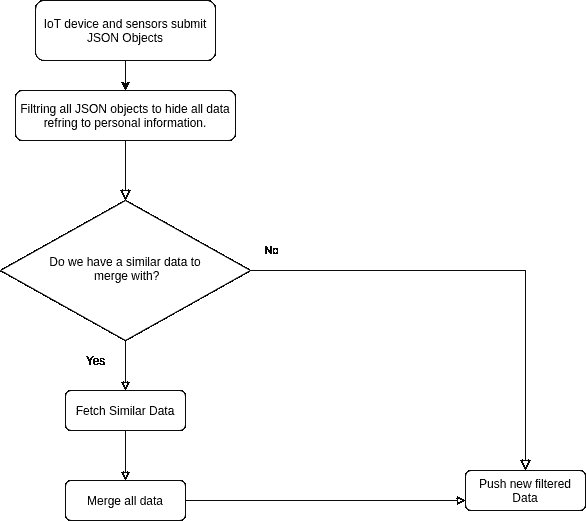

# 在 IOTA 数据市场上出售敏感数据

> 原文：<https://medium.com/coinmonks/selling-sensitive-data-on-iota-data-marketplace-d57e6780d159?source=collection_archive---------1----------------------->

自从隔离以来，在我做毕业设计的时候，我发现了 IOTA [数据市场](https://data.iota.org/)平台。我想为什么数据来源如此匮乏？为什么企业和不同的机构希望对他们的数据保密，尽管已经证明为了数据分析师研究数据的目的而共享数据对社会中的每个人都有好处？最重要的是，我们如何鼓励这些公司分享他们的数据？

因此，我们需要一种从不同来源收集敏感数据的方法，同时保持数据完整性，并且不会将信息暴露给未经授权的个人。

# 问题是

机构投入了大量的精力和资源来收集数据，同时，他们不喜欢分享自己的数据，因为他们担心一些竞争对手可能会使用这些数据并对他们实施反策略。例如，工厂不会分享他们产品供应链或生产线的数据。医院也一样，他们不愿意分享病人的数据，因为这是他们的隐私。为了解决这个问题，我们需要一种匿名和安全的方式来共享数据。如果我们克服了这个问题，我们将拥有丰富的可信数据来源，有助于实施公共政策...等等。

# 解决方案

在这篇文章中，我将介绍两个案例:第一个案例是在同一领域工作的机构，因此他们拥有相似的信息，面临相同的挑战。比如医疗保健、金融和分解机构。因此，我们将过滤数据，使其匿名，然后将所有相似的数据相互合并。

第二种情况是由在独特领域工作的机构组成，通常他们不喜欢分享他们的数据。因此，我们将提供一些用户可以在不访问数据的情况下实现的操作。

## 第一个案例

我们使用数据过滤器来实现数据过滤过程，以封装/隐藏涉及特定机构的所有信息。然后，a 对所有相似的机构数据进行合并处理。

## 用例示例

例如，如果我们有三个工厂想要以匿名方式共享他们的数据。所有工厂都有自己的传感器和物联网设备来共享数据。


数据封装模块收集数据，然后将其封装和合并，最后发布到 IOTA 数据市场供数据分析师使用。这个例子可以应用于医院或同一领域的任何其他机构。我们可以在下面的小范围内实现这个图表。

# 让我们实现一个实际的例子

为了阐述我的想法，我做了一个简单的 Github 要点。我试图尽可能简单地实现它。我们假设我们在一个机构内有我们的物联网设备，我们将数据部署到数据市场，我们的原型作为它们之间的中间件来过滤数据。物联网设备向我们的 Github gist 发送 JSON 对象。



根据上面的流程图，我将创建一个简单的应用程序来过滤数据，合并数据，然后推送和下载 filtred JSON 对象。

## 让我们编码

我只用了 30 分钟就做出了这个例子。我使用 IOTA [文档](https://docs.iota.org/docs/core/1.0/getting-started/get-started-js)让我的代码尽可能的干净&清晰。

我到底要创造什么？

一个将[尾事务](https://docs.iota.org/docs/getting-started/0.1/transactions/bundles)、类别和数据作为参数的函数，类似这样。

```
//dataset to be filtred
const inputData = {'name':'Patient X','id':'YYYYY','age':23,'institution_name':'institution X','institution_id':'IDIDIDID','Result':'Important Info To save','dates':'Important dates to save them','Medicines':'Important medicines to take'}// 1.tail transcation to check for old data// 2\. Data category// 3\. Data to be filtred 
main('DWAOSLKHKMC9AQKYAL9PQSISXNDAAJGYXIPYTZVZHQCZGZAIPTVRN9OFFFZIISYIQOTWQWPI9WHGJN999','hospitals',inputData);
```

我们需要包含我们的 npm 模块并初始化 IOTA 节点

```
// IOTA global
const Iota = require('@iota/core');const Extract = require('@iota/extract-json');const Converter = require('@iota/converter');// Connect to a nodeconst iota = Iota.composeAPI({provider: 'https://nodes.devnet.iota.org:443'});const depth = 3;const minimumWeightMagnitude = 9;// Define a seed and an address.// These do not need to belong to anyone or have IOTA tokens.// They must only contain a mamximum of 81 trytes// or 90 trytes with a valid checksumconst address ='HEQLOWORLDHELLOWORLDHELLOWORLDHELLOWORLDHELLOWORLDHELLOWORLDHELLOWORLDHELLOWOR99D';const seed ='PUEOTSEITFEVEWCWBTSIZM9NKRGJEIMXTULBACGFRQK9IMGICLBKW9TTEVSDQMGWKBXPVCBMMCXWMNPDX';
```

对于这个例子，过滤和迁移功能将以一种简单的方式实现。

```
const filterAndMerge = (oldDataSet,dataset)=>{const filter = ['name','id','age','institution_name','institution_id'];for (let index = 0; index < filter.length; index++) {delete dataset[filter[index]];}let newData = {};if (Object.keys(oldDataSet).length) {newData = Object.assign(oldDataSet, dataset);}return newData;}
```

获取和推送数据的功能与文档完全相同。我只是把`.then()`换成了`await`

```
//IOTA metods
const fetch = async(tailTransactionHash)=>{
// Get the transaction objects in the bundle
const bundle = await iota.getBundle(tailTransactionHash)
// Extract and parse the JSON messages from the transactions' `signatureMessageFragment` fields
const data = JSON.parse(Extract.extractJson(bundle));
return data;
}
const pushData = async(dataCategory,filtredDataset)=>{
const message = JSON.stringify({dataCategory:dataCategory, dataset:filtredDataset});
// Convert the message to trytes
const messageInTrytes = Converter.asciiToTrytes(message);
// Define a zero-value transaction object// that sends the message to the addressconst transfers = [{value: 0,address: address,message: messageInTrytes}];// Create a bundle from the `transfers` array
// and send the transaction to the nodeconst trytes = await iota.prepareTransfers(seed, transfers);const bundle =  await iota.sendTrytes(trytes, depth, minimumWeightMagnitude);return bundle[0].hash;}
```

最后，我们将创建主函数。主要功能步骤与上述流程图相同。

```
const main = async(tailTransaction,category,data)=>{// check if this data category already exisitconst oldData = await fetch(tailTransaction);let newData;if (oldData.dataCategory === category) {newData = filterAndMerge(oldData,data);}else{newData = filterAndMerge({},data);}console.log(newData)const hash = await pushData(newData);console.log(hash);return hash;}
```

现在你应该有类似的东西:

```
// IOTA globalconst Iota = require('@iota/core');const Extract = require('@iota/extract-json');const Converter = require('@iota/converter');// Connect to a nodeconst iota = Iota.composeAPI({provider: 'https://nodes.devnet.iota.org:443'});const depth = 3;
const minimumWeightMagnitude = 9;
// Define a seed and an address.// These do not need to belong to anyone or have IOTA tokens.// They must only contain a mamximum of 81 trytes// or 90 trytes with a valid checksumconst address ='HEQLOWORLDHELLOWORLDHELLOWORLDHELLOWORLDHELLOWORLDHELLOWORLDHELLOWORLDHELLOWOR99D';const seed ='PUEOTSEITFEVEWCWBTSIZM9NKRGJEIMXTULBACGFRQK9IMGICLBKW9TTEVSDQMGWKBXPVCBMMCXWMNPDX';//IOTA metods
const fetch = async(tailTransactionHash)=>{// Get the transaction objects in the bundleconst bundle = await iota.getBundle(tailTransactionHash)// Extract and parse the JSON messages from the transactions' `signatureMessageFragment` fieldsconst data = JSON.parse(Extract.extractJson(bundle));return data;} const pushData = async(dataCategory,filtredDataset)=>{
const message = JSON.stringify({dataCategory:dataCategory, dataset:filtredDataset});// Convert the message to trytes
const messageInTrytes = Converter.asciiToTrytes(message);// Define a zero-value transaction object
// that sends the message to the address
const transfers = [
{value: 0,address: address,message: messageInTrytes
}];// Create a bundle from the `transfers` array
// and send the transaction to the nodeconst trytes = await iota.prepareTransfers(seed, transfers);const bundle =  await iota.sendTrytes(trytes, depth, minimumWeightMagnitude);return bundle[0].hash;}const filterAndMerge = (oldDataSet,dataset)=>{
const filter = ['name','id','age','institution_name','institution_id'];for (let index = 0; index < filter.length; index++) {delete dataset[filter[index]];}let newData = {};if (Object.keys(oldDataSet).length) {newData = Object.assign(oldDataSet, dataset);}return newData;}const main = async(tailTransaction,category,data)=>{
// check if this data category already exisit
const oldData = await fetch(tailTransaction);
let newData;if (oldData.dataCategory === category) {newData = filterAndMerge(oldData,data);}else{newData = filterAndMerge({},data);}console.log(newData)const hash = await pushData(newData);console.log(hash);return hash;}const inputData = {'name':'Patient X','id':'YYYYY','age':23,'institution_name':'institution X','institution_id':'IDIDIDID','Result':'Important Info To save','dates':'Important dates to save them','Medicines':'Important medicines to take'}main('DWAOSLKHKMC9AQKYAL9PQSISXNDAAJGYXIPYTZVZHQCZGZAIPTVRN9OFFFZIISYIQOTWQWPI9WHGJN999','hospitals',inputData);
```

让我们运行代码，我们将得到这样的输出

```
node index.js 
{ dataCategory: 'hospitals',
  dataset: '{pateientA:patientB,patientC:patientD}',
  Result: 'Important Info To save',
  dates: 'Important dates to save them',
  Medicines: 'Important medicines to take' }
HEDNKESCWPFNVGJBE99XNRZHHSYTRNZYRZXSVWHLQASANSWVKONYRNB9N9HCMHFIZIARDGARMKUCZS999
```

## 第二种情况

在我看来，第二种情况更有趣，所以我将在另一篇文章中重点讨论它。如果我们对它们使用数据过滤器，一些数据可能是无用的，或者有暴露机构身份的风险。因此，我们将使用一个黑盒，数据安全地保存在其中。然后，我们可以在黑盒中实现选择的操作来获得输出。大概就是这样。


## 下一步做什么？

我计划大规模实施这个项目。为 IOTA 数据市场创建一个插件，鼓励以安全的方式共享数据。这就是我写这篇文章的原因，我想知道有多少人对数据完整性感兴趣。如果我开始一个开源项目，社区会有兴趣贡献吗？我为全面实施创建了一个提案。如果有人感兴趣，我可以与她/他分享。

接下来的步骤将是:

1.  我曾经在我所有的区块链项目中实施 [IPFS](https://ipfs.io/) 作为分散存储。最近 IOTA 推出了存在证明( [POE](https://docs.iota.org/docs/proof-of-existence/1.0/overview#) )我也打算试试。这对于验证过滤的数据可能是有用的。
2.  过滤和迁移过程应该保持数据匿名，同时以更好的方式对数据集进行排序和分析。我们可能需要一些算法来实现这一点。
3.  机构认证和授权。
4.  与 IOTA 数据市场集成。
5.  如果机构根本不想共享他们的数据，应该增加一个外部安全层。或者，如果我们将数据集匿名化，数据集就没有用了。因此，我们上传机器学习模型，并在黑盒(其中包含机密数据)内进行操作，我们只分享结果。

我欢迎任何对开源世界感兴趣的人加入我的行列。如果你感兴趣，可以发邮件到 yehiatarek67@gmail.com 和我联系

## **同样，阅读**

*   [顶级 DeFi 项目](/coinmonks/defi-future-10-promising-projects-in-the-defi-world-ff2b697ab006)
*   最好的[硬件钱包](/coinmonks/the-best-cryptocurrency-hardware-wallets-of-2020-e28b1c124069?source=friends_link&sk=324dd9ff8556ab578d71e7ad7658ad7c)
*   开发人员的最佳加密 API