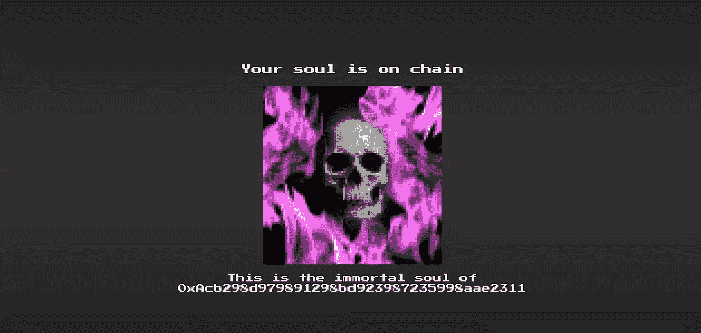

# 用 NFTs 出卖你的灵魂

> 原文：<https://medium.com/coinmonks/selling-your-soul-with-nfts-d0e1efd25d23?source=collection_archive---------1----------------------->

任何在 crypto 呆过一段时间的人都会在他们的灵魂中感受到这一点。无论是错过价格上涨的 FOMO，还是因为没有预测到泡沫破裂而后悔，或者只是每天在 BTC 无休止的过山车中穿梭的压力，我们都把自己的一部分交给了无情的野兽。

你已经在和区块链一起出卖灵魂了，为什么不把它变成 NFT 呢？

Photo by [Mathew Schwartz](https://unsplash.com/@cadop?utm_source=medium&utm_medium=referral) on [Unsplash](https://unsplash.com?utm_source=medium&utm_medium=referral)

# 不可替换令牌

以太坊的长期粉丝会知道 NFTs 的所有事情，这是一种独特的小收藏品，几年前随着 [CryptoKitties](https://www.cryptokitties.co/) 突然进入每个人的雷达，并从此成为许多与 DeFi 无关的 dapp 的支柱。

对于门外汉来说，NFT 就像普通的区块链代币，除了每一个都是独立和独特的。你有 5 个特定的数字物品，而不仅仅是一些硬币的 5 英镑余额，然后以与交易普通代币相同的安全方式交易这些特定的物品。在前面提到的 CryptoKitties 中，这些标记是猫，此后出现了几个类似 Neopet 的 dapps。它们还被用作交易卡游戏中的[卡，以及艺术品销售，可能还有一些这位不够酷的不知名作者不知道的更古怪的东西。](https://godsunchained.com/)

NFT 的关键是每一个都是独一无二的，理想情况下(像任何令牌一样)应该代表对某人有价值的东西。对我们来说，有什么比我们自己不朽的灵魂更独特、更有价值呢？

# 以太灵魂

于是[以太灵魂](https://www.ethersouls.xyz/)的想法诞生了。这个 dapp 允许任何人铸造一个代表他们自己灵魂的 NFT，永远铸造在以太坊区块链。每个地址只能做一次，所以你可能要格外小心那些私钥，你不想你的灵魂落入坏人之手…

灵魂是按照 ERC-721 标准制作的不可替代的代币。这是书呆子的说法，因为你将能够在大多数钱包里展示它，如果你敢，还可以在 NFT 市场上交易它。

# 科技产品

对于那些想知道内幕的 Eth 开发人员来说，该契约是 ERC-721 标准的完整实现，包括元数据和可枚举扩展。唯一的项目特有函数是`separate`。这是一种非付费的造币功能，它将身体与灵魂分开，并铸造了一个令牌供其居住。

新代币的`tokenId`只是投给一个`uint`的`msg.sender`。这意味着每个`tokenId`都是唯一且确定的，并且允许在前端更容易的元数据功能，而不需要后端来监视 mint 事件。

## 复活节彩蛋

我在代码中添加了一个小复活节彩蛋，任何关注`Transfer`事件的人都可能注意到了……我觉得这个项目需要一个人的灵魂，并把它作为一个代币，所以这些代币应该由给了以太坊灵魂的人来分发。因此，每当有一个新的灵魂诞生时，它首先会进入某个 [Vb](https://etherscan.io/address/0xab5801a7d398351b8be11c439e05c5b3259aec9b) 节点，然后他会非常优雅地将这个灵魂交给请求这个灵魂的以太坊用户。

# 小心……

我希望你喜欢我的 dapp，但我必须警告你。我听说过一个说话圆滑的家伙，带着一把干草叉和一条尖尖的尾巴，他经常在十字路口闲逛，想买点人们的以太币。我不知道他为什么想要我的，我只想说，现在我可以发挥出色的吉他。