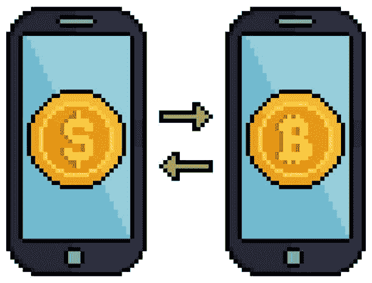
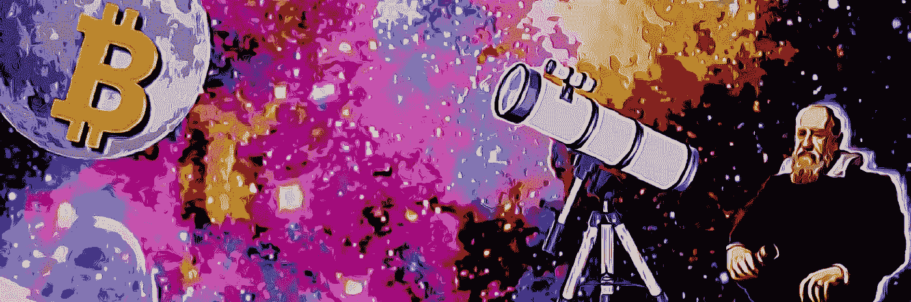

# 货币与国家的分离

> 原文：<https://medium.com/coinmonks/separation-of-money-and-state-435c84a6c1a5?source=collection_archive---------6----------------------->

## 数字黄金的发现引发了一场科学革命

对于人类来说，经历世界观的改变是一件罕见的事情。上一次这样的事件发生在中世纪末期。随着望远镜和印刷机的发展，人们知道了地球绕着太阳转，而不是相反。这些发现导致人们越来越不信任当时的权力:教会。随着这些旧制度的崩溃，这一黑暗时期结束了。在随后的黄金时代，自由、科学和贸易占主导地位，一个重生和繁荣的时代随之而来。
今天，我们站在人类历史上一场新革命的前夕。货币的科学革命:比特币。绝对稀缺货币 T4 的发明是一个范式转变，是凯恩斯经济学领域的一个异常现象。这项技术能够摧毁旧的权力结构，将权力归还给主权个人。一场**数字文艺复兴**，导致了金钱与国家的分离。

## 科学革命的结构

科学哲学家托马斯·库恩(Thomas S. Kuhn)于 1962 年在其著作《科学革命的结构》(The Structure of Scientific Revolutions)中提出了一个框架来描述和识别科学革命。库恩描述了科学不是线性运动的，而是为了进步而每隔一段时间经历一次革命。我们区分科学进步的两个阶段。第一种被称为**正常科学**，在这种科学中，新的发现是在流行的世界观(模型/理论)的基础上做出的，也被称为**范式**。在正常的科学中，通过在当前的思维框架中寻找“拼图”来采取渐进的步骤。然而，随着时间的推移，观察到了在当前范式下无法解释的现象，即所谓的**异常**。这些逐渐积累，造成了范式的危机，对更好的模型的需求增加了。这是**革命科学**的阶段。这个第二阶段经常伴随着新理论的支持者和旧理论的捍卫者之间的激烈斗争。这场斗争的产生是因为双方都立足于试图解释现实的对比模型。观点是**不可通约的。**

一个成功的范例是一个“更好”解释世界的模型。这表现在新技术开发中更高的可预测能力和适用性。例如，爱因斯坦能够预测重力可以弯曲光线，这要归功于他的相对论。此外，新知识将用于全球定位系统卫星和核能等应用。
新的范式通常是由创造性的、与众不同的人提出来的，他们并没有一生都沉浸在旧的体系中。因此，他们对整体有了更新鲜的看法，自然会有更多“跳出框框”的想法。旧的模式很难改变。而且往往只有在最后一批信徒真正死去的时候才会消失。
在一个新的范式被接受后，这个过程会以正常的科学重新开始，并且可以在新的和改进的框架内采取步骤来解决难题。

我们可以从库恩身上学到的最重要的一课是，我们目前的世界观有到期日，总有一天我们会经历一场危机，在这场危机中我们不得不寻找更好的视角。认为我们现在处于理解的巅峰是任何文明的傲慢，因为我们只能追溯到人们持有劣等观点的历史。但这一时刻也将有一天成为历史，人们会惊讶地回顾它。

## 政教分离

500 年前发生的一个众所周知的范式转变是从地心说转向日心说，即视角从地球转向太阳作为空间的中心。这一转变是由于望远镜的发明。这种新仪器使得不符合罗马天主教会思想的观察成为可能。当时罗马天主教会仍然拥有很大的权力，并谴责一切破坏这种权力的人和事。

**印刷机**
印刷是黑暗时代末期天文知识传播的重要催化剂。1440 年，戈德史密斯[约翰内斯·古腾堡](https://en.wikipedia.org/wiki/Johannes_Gutenberg)发明了印刷机，使得大规模发行书籍成为可能。它取代了手稿(手写文件)，大大降低了拥有一本书的成本。这项发明将改变社会，新的中产阶级可以提高他们的文化水平。这将导致宗教改革和教会权力的进一步瓦解。例如，印刷圣经的分发质疑了教会的权威，因为人们现在能够自己解释上帝的话语。结果是对赎罪券的批评，因为在上帝的圣书中没有提到它。

## 日心说

另一本出版后引起轰动的书是数学家 [**尼古拉·哥白尼**](https://en.wikipedia.org/wiki/Nicolaus_Copernicus)(1473-1534)的《天体运行论》。这本书是在他去世前出版的，因为他确信它会引起大混乱。他不会错，几十年后，一位来自意大利的天文学家同事将不得不捍卫他的立场，并感受到教会的压力。

太阳位于太空中心的发现是一个经典的范式转变。随着时间的推移，地心模型创造了许多异常现象，包括从地球的角度看行星令人费解的逆行运动。整个模型非常复杂，也不是非常优雅，并且留下了许多未解之谜。此外，它的预测能力远远不够。新的范式将带来一个更优雅的模型，解释行星的逆行运动，并将成为进行天文预测的更好工具。

由于天文仪器的突破:T8 望远镜，哥白尼的日心说模型直到下个世纪才被重视。1608 年由荷兰人汉斯·利珀谢获得专利，但次年被意大利人伽利略·伽利雷(1564-1642)复制。伽利略会有各种各样的新发现，包括月亮不是圆的，美第奇星的存在，更好的说法是木星的卫星。这些观察结果将在 1610 年出版的小册子《Sidereus Nuncius》中发表，该小册子将由出版社广泛发行。伽利略还开创了实验再现性的先例，并鼓励其他天文学家验证他的发现。

Galileo Galilei

最初的批评和怀疑并没有持续很久。起初，这些观察结果被认为是透镜缺陷而不予考虑。当时可验证性仍然很低，因为很少有望远镜在流通。但是随着时间的推移，伽利略从其他科学家那里获得了越来越多的支持，比如证实了他的观察结果的约翰尼斯·开普勒。
在小册子出版之前，教会只接受了日心说模型，认为它是数学的和假设的。然而,“Sidereus Nuncius”的版本提出了日心说模型作为事实，而不是假设。这样一来，伽利略就把自己置于上帝书面话语的对立面，因此与教会发生了冲突。这将导致 1616 年的 [**罗马宗教裁判所**](https://en.wikipedia.org/wiki/Roman_Inquisition) 中，天文学家不得不在神圣学院面前为自己辩护。结果，伽利略受到审查，并被禁止讨论日心说。哥白尼的书*“De revolution ibus orbi um coelestium”*也将被禁止，该模型将被贴上愚蠢和荒谬的标签。

这位天文学家将远离这场争论很长一段时间。他感觉到了哥白尼所害怕的:来自教皇的报复。但在 1632 年教皇乌尔班八世就职时，他又一次大胆尝试，因为他是这位前红衣主教的朋友。伽利莱发表了*[*Dialogo sopra I due massimi sistemi del mondo*](https://en.wikipedia.org/wiki/Dialogue_Concerning_the_Two_Chief_World_Systems)*为日心说模型辩护。尽管他和教皇是朋友，但在 1633 年，他被指控散发异端邪说的恶臭，并被判处终身软禁，他的书也被禁止。伽利略在被定罪后似乎说出了传说中的话:*“Eppur si muove”*(然而她动了)。教会可以要求他收回他的话，但在现实中，地球将继续围绕太阳转，而不是相反。在当时，印刷机和望远镜的发明是改变社会和世界观的创新。知识的分散使得教会越来越难以维持其信誉。这最终意味着政教分离，权力将转移到个人手中。对这种知识和思想持开放态度的国家会比那些仍然坚持教会教条的竞争者更有优势。在新教国家，这种知识找到了肥沃的土壤，将从中获益。**

****比特币:货币体系的望远镜** 重要的技术可以给社会带来巨大的变化。除了望远镜和印刷机，火药、电力、汽车和互联网也彻底改变了世界。但是印刷术和日心说的发现改变了人们的想法。通过测试和验证，放弃教条式的思维，转向更科学的思维和实践。**

****

**credits: [DerGigi](https://twitter.com/dergigi)**

**回顾这段历史，你可能会想，当前的范式是什么，我们错误地相信了什么。100 年后人们回过头来看时会说:‘天哪，那些人怎么了？’。他们没有看到这一点。教会和国家的分离是通过媒体和望远镜实现的。金钱和国家之间的分歧将在本世纪得到解决。这方面的催化技术是数字印刷机(互联网)和数字黄金(也称为比特币)的发现。**

**互联网:数字印刷机
我们正处于一个信息以前所未有的规模传播的时代，在这个时代，世界各地的个人可以以光速几乎免费地相互交流。像维基百科、YouTube 和 Twitter 这样的网站让我们可以用最少的精力接触到大量的人。因此，知识和思想比以往任何时候都传播得更快。这台数码印刷机比它的前身好得多。互联网在其短暂的存在中已经极大地改变了我们的社会。手机银行、视频通话、远程办公都是以前不可能实现的事情。原则上，远程工作使独立于地点的工作成为可能。数字游牧民利用了这一点，他们前往便宜且温暖的地方，在那里他们花的钱更多，但仍能完成工作。**

****比特币:看待金钱的新视角**
几十年前就有人预言互联网会改变今天的社会。在《主权个体》(1998)中，戴维森和里斯-莫格认为，随着人们越来越少地被束缚在自己的地理位置上，微芯片将逐渐削弱国家的权力。他们还预言了不可控的网络现金的发明，个人可以与世界上任何人匿名交易不受国家控制的非主权货币。此外，这些主权个人不再依赖政府资金，而政府资金每年都会因通货膨胀而贬值。由于通胀是支付不断上升的政府赤字的一种重要方式，政府将会慢慢地驱使其公民转向网络现金的避难所。**

**作者们能够预测网络现金并没有那么了不起，因为历史已经表明，几乎所有的法定(无担保政府货币)货币系统都不会永远存在，软货币的购买力总是会下降。同样，在 2009 年中本聪推出比特币之前，数字货币已经研究了 40 多年。
Satoshi 的发明诞生于金融危机，意在解决法定货币的问题，包括信任、通货膨胀和隐私。⁴法定货币是一种不安全的系统，因此并不稀缺，因为政府总是可以印刷更多，侵蚀货币的价值，导致其储蓄功能的丧失。此外，现金越来越少，匿名交易越来越难。**

****

**比特币是一种去中心化的货币，其货币供应量高达 2100 万 T2。这种分散化确保了没有人能够控制货币，因此无法改变规则。通过引入硬币总量的硬性限制，最终通胀率将为 0%。因此，比特币永远不会贬值，只会随着用户的增加而增值(按菲亚特的说法)。**

****不信任。验证！** 比特币的设计为我们当前的货币体系带来了新的视角。人们可以说比特币是望远镜，通过它我们可以更好地看到现实，就像伽利略用他的仪器获得了更好的天空照片一样。他看到地心说是不真实的，忍不住说出持有错误观点的真相。其他科学家通过他们自己的望远镜亲眼所见，验证了伽利略看到的东西。**

****

**Credits: [1971bubble](https://twitter.com/1971Bubble)**

**在比特币中我们说:*“不要相信。验证！”*。任何人都可以在他们的电脑上运行该软件，并确认数字稀缺是真的。你不必相信，你可以自己去看。这是透明的钱。这种透明性与遗留系统形成了鲜明的对比。为什么纸币数量没有硬性限制？
与复杂的地心模型相比，日心说模型是完美的，其中一切都以美丽的椭圆围绕太阳旋转，与不透明的菲亚特系统相比，比特币也是完美的。过去，教会决定了范式，而不是接受它在本质上的真实面目，现在，政府和央行决定了货币和经济的运行方式。他们讨厌比特币，因为数字黄金遵循自然规律。
比特币暴露了菲亚特体系最大的异常，即通货膨胀和不断上涨的物价。在一个技术进步只会降低价格的世界里，我们目前生活在一个所有价格都在上涨的世界里。这是货币供应量增加的直接结果。这让我们的储蓄贬值，让最接近印钞机的当局受益。**

## **21 世纪的范式转变**

**国家曾经对其公民发挥作用，但这个机构的信誉正在下降，部分原因是它所花的钱贬值了。比特币是一种新的范式，它成为个人而非国家的工具。它使用户能够再次储蓄，并将其工作安全地储存在政府无法稀释的货币中。**

**大多数人从未真正思考过金钱到底是什么，以及它是如何运作的。他们一生都沉浸在法定货币体系中，很难理解如果你在硬通货中存钱，它会做什么。但是当时的伽利略，**，现在已经为我们制造了这枚硬硬币。
许多人最初会将比特币视为镜头中的一个缺陷，但少数人已经接受了这一新范式，并确信比特币是有史以来最棒的货币。他们体验到精心设计的货币是如何增值的，这增加了他们的购买力。其他人将首先经历一个危机时刻，然后才能看到比特币的用处。****

****正如教会抵制日心说一样，国家也抵制比特币。然而，聪明的个人和国家将会采用比特币并从中获益，他们可以大声说出“Eppur si muove”。因为否认比特币就等于相信地球依然是天的中心。也许 20 年后我们可以回顾这段时间，看到我们已经从货币黑暗时代觉醒，现在可以在健全的货币标准下重建世界，即比特币标准。****

## ****参考****

1.  ******科学革命的结构** —托马斯·库恩(1962)
    [https://folk.ntnu.no/krill/bioko-references/Kuhn%201962.pdf](https://folk.ntnu.no/krill/bioko-references/Kuhn%201962.pdf)****
2.  ******主权个体** —戴维森&里斯-莫格
    [https://all reading world . com/The-Sovereign-Individual-by-James-dale-Davidson-pdf-download/](https://allreadingworld.com/the-sovereign-individual-by-james-dale-davidson-pdf-download/)****
3.  ****[**比特币史前史**—s . van HEU veln](/coinmonks/bitcoin-prehistory-english-65148be2163f) [https://medium . com/coin monks/bit coin-Prehistory-English-65148 be 2163 f](/coinmonks/bitcoin-prehistory-english-65148be2163f)****
4.  ******比特币白皮书**—https://nakamotoinstitute.org/bitcoin/中本聪(2008)**** 

> ****加入 Coinmonks [电报频道](https://t.me/coincodecap)和 [Youtube 频道](https://www.youtube.com/c/coinmonks/videos)了解加密交易和投资****

## ****另外，阅读****

*   ****[OKEx 评论](/coinmonks/okex-review-6b369304110f) | [Kucoin 交易机器人](/coinmonks/kucoin-trading-bot-automate-your-trades-8cf0ca2138e0) | [期货交易机器人](/coinmonks/futures-trading-bots-5a282ccee3f5)****
*   ****[AscendEx Staking](https://blog.coincodecap.com/ascendex-staking)|[Bot Ocean Review](https://blog.coincodecap.com/bot-ocean-review)|[最佳比特币钱包](https://blog.coincodecap.com/bitcoin-wallets-india)****
*   ****[霍比评论](https://blog.coincodecap.com/huobi-review) | [OKEx 保证金交易](https://blog.coincodecap.com/okex-margin-trading) | [期货交易](https://blog.coincodecap.com/futures-trading)****
*   ****[Godex.io 审核](/coinmonks/godex-io-review-7366086519fb) | [邀请审核](/coinmonks/invity-review-70f3030c0502) | [BitForex 审核](https://blog.coincodecap.com/bitforex-review)****
*   ****[Crypto.com 费用](/coinmonks/binance-fees-8588ec17965) | [僵尸加密审查](/coinmonks/botcrypto-review-2021-build-your-own-trading-bot-coincodecap-6b8332d736c7) | [替代品](https://blog.coincodecap.com/crypto-com-alternatives)****
*   ****[有哪些交易信号？](https://blog.coincodecap.com/trading-signal) | [Bitstamp vs 比特币基地](https://blog.coincodecap.com/bitstamp-coinbase) | [买索拉纳](https://blog.coincodecap.com/buy-solana)****
*   ****[ProfitFarmers 点评](https://blog.coincodecap.com/profitfarmers-review) | [如何使用 Cornix 交易机器人](https://blog.coincodecap.com/cornix-trading-bot)****
*   ****[MXC 交易所评论](/coinmonks/mxc-exchange-review-3af0ec1cba8c) | [Pionex vs 币安](https://blog.coincodecap.com/pionex-vs-binance) | [Pionex 套利机器人](https://blog.coincodecap.com/pionex-arbitrage-bot)****
*   ****[我的密码交易经验](/coinmonks/my-experience-with-crypto-copy-trading-d6feb2ce3ac5) | [比特币基地评论](/coinmonks/coinbase-review-6ef4e0f56064)****
*   ****[CoinFLEX 评论](https://blog.coincodecap.com/coinflex-review) | [AEX 交易所评论](https://blog.coincodecap.com/aex-exchange-review) | [UPbit 评论](https://blog.coincodecap.com/upbit-review)****
*   ****[AscendEx 保证金交易](https://blog.coincodecap.com/ascendex-margin-trading) | [Bitfinex 赌注](https://blog.coincodecap.com/bitfinex-staking) | [bitFlyer 点评](https://blog.coincodecap.com/bitflyer-review)****