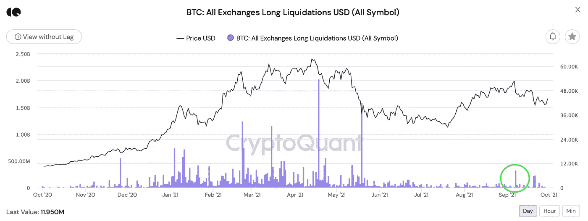
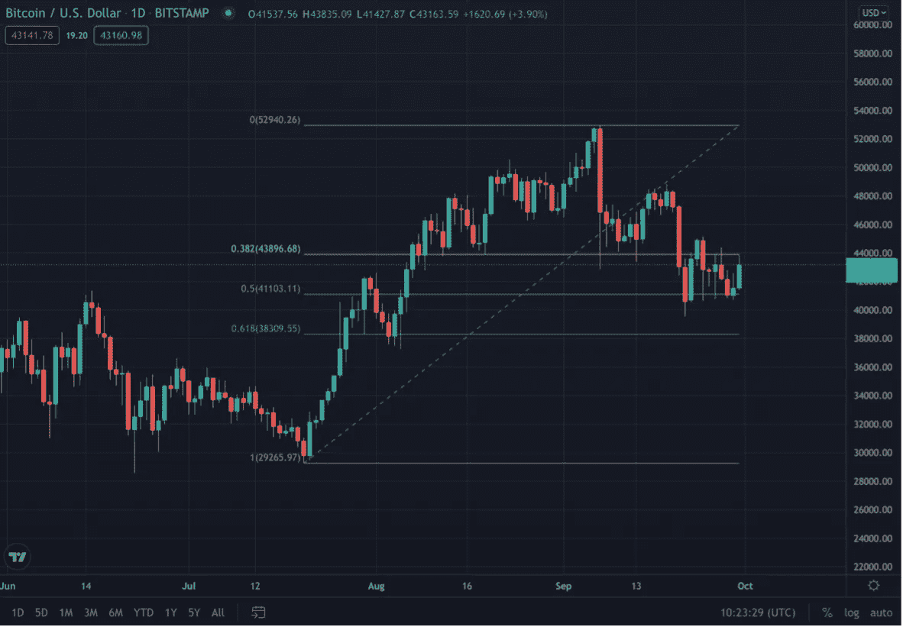
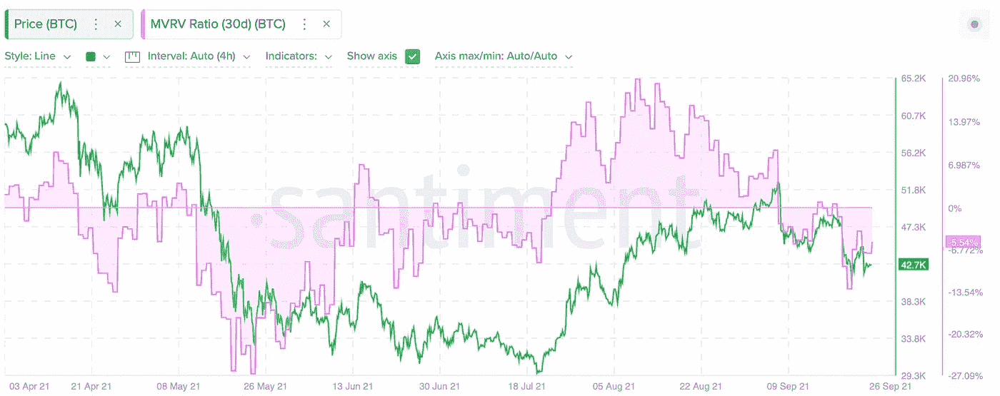

# 2021 年 9 月—加密新闻更新

> 原文：<https://medium.com/coinmonks/september-2021-crypto-news-update-540295811f14?source=collection_archive---------7----------------------->

## 您对数字资产世界的每月简报

> *条乘*

**

*Photo: [Blessing Ri](https://unsplash.com/@blessingeffect) | Unsplash.com*

*在本月的杂志中:*

*   ***9 月回顾** *-去杠杆
    -中国对加密的禁令
    - BTC 概况**
*   ***Cardano 智能合约发布***
*   ***加密更新:政府&法规***
*   ***加密更新:交换、定义&稳定密码***
*   ***进一步加密采用***

# ***九月回顾***

*9 月，加密市场面临两次大规模抛售——9 月 7 日和 9 月 20 日——分别抹去了 BTC 价值的 11%和 9%。*

*9 月 7 日的第一次下跌是作为去杠杆化事件发生的，未平仓合约在一天内减少了超过 45%。结果，超过 3.2 亿美元的杠杆式 BTC 多头头寸被平仓。*

*几乎每一次加密市场的重大崩盘都被归咎于强制长期平仓——在投资者的头寸未能达到保证金要求后，强制出售其账户内的资产。在市场下跌期间，经纪人有权通过抛售和平仓来清算投资者的多头保证金头寸。这包括出售投资者账户上的密码，将下跌的价格推得更低。*

**

*Source: CryptoQuant.com*

***在我们最新的** [**研究**](https://medium.datadriveninvestor.com/role-of-derivatives-in-crypto-markets-3ea2c855ef0e) **中，更多关于强制清算对加密市场的影响。***

***9 月 20 日，中国宣布所有的加密活动都是非法的**(过去 12 年中的第 22 次)，这引发了加密市场的第二次暴跌。多家交易所宣布，它们将停止接纳中国客户，并计划在今年年底前放弃现有客户。*

*最初，当前打击加密的框架是在今年 5 月宣布的，但类似的禁令早在 2017 年和 2013 年就已经发布了。5 月份的声明导致 BTC 价格暴跌 30%以上，从当月 59，500 美元的高点跌至 30，000 美元。*

*考虑到这一点，似乎“中国禁止加密”的故事在很大程度上已经在今年早些时候定价了。事实上，自 9 月 21 日触底以来，比特币已经恢复了约 10%的价值。([阅读更多](https://www.reuters.com/world/china/china-central-bank-vows-crackdown-cryptocurrency-trading-2021-09-24/))*

## ***BTC 概述***

*在最近的抛售事件后，BTC 已经稳定下来，现在正在经历一个盘整期，远高于 41，000 美元的斐波那契 50%回撤水平。鉴于系统中的低杠杆率和低 MVRV 水平，市场上似乎没有抛售压力。*

**

*Source: Tradingview.com*

**

*Source: Santiment.net*

*MVRV 比率显示所有 BTC 持有者的平均利润或损失，基于每个令牌上次移动时的价格。负的 30 天 MVRV 比率表明，平均而言，短线 BTC 交易者的投资是亏损的。这也意味着与获利回吐相关的抛售压力相当低。*

# ***卡尔达诺智能合约发布***

*智能合约推出后，Cardano 当天下跌 2%，而区块链所有同行网络上涨 20%。分析师列举了围绕这一事件令人失望的价格走势的几个原因:一方面，智能合约的推出可能已经反映在 ADA 8 月份的反弹中，该月上涨了 100%以上。另一方面，它可能是由发布前不久在 testnet 上发现的并发问题引发的，质疑 Cardano 的可伸缩性。([阅读更多](https://iohk.io/en/blog/posts/2021/09/10/concurrency-and-all-that-cardano-smart-contracts-and-the-eutxo-model/))*

*Cardano 的实际应用可能需要一段时间，因为该平台的可用性和可扩展性还有待提高。卡尔达诺仍然是最积极发展的区块链之一，拥有庞大的支持社区和深刻的分散叙事。([阅读更多](https://cointelegraph.com/news/cardano-s-alonzo-hard-fork-was-a-success-but-real-utility-could-be-a-while))*

# ***密码规则***

*中国在 9 月 20 日宣布加密禁令的同时，**潜在的恒大违约**导致危机蔓延至更广泛的市场和中国金融机构。([阅读更多](https://www.forbes.com/sites/cryptoconfidential/2021/09/27/evergrande-and-chinese-regulators-pummel-crypto-markets/?sh=633a6bc5743c))*

*在 9 月 21 日至 22 日的 FOMC 会议期间，美联储已经确认他们将在 11 月开始缩减债券规模，但仍取决于经济复苏和加息时间表的数据。此外，美联储的点阵图将预测延长至 2024 年，显示了实现最终利率的更渐进的加息步伐。短期内，加息的速度不太可能超过通胀的变化率，总体上应被视为经济好转的信号。总体而言，会议被视为比预期略显鹰派，尽管缩减购债规模的宣布被推迟至 11 月。然而，BTC 价格在会后几乎没有变化，表明加密交易员仍然不相信美联储会很快转向鹰派。([阅读更多](https://www.coindesk.com/markets/2021/09/22/tapering-could-come-soon-and-fed-officials-see-interest-rate-hike-next-year/))*

*加里·詹斯勒暗示了 T4 比特币和以太坊期货交易所交易基金 T5 的可能性。SEC 有 45 天的时间来确认、拒绝或推迟申请，将多个申请人的决定日期定在 10 月初左右。([阅读更多](https://www.coindesk.com/policy/2021/09/29/gensler-reiterates-support-for-futures-based-bitcoin-etfs/))*

*美联储主席杰罗姆·鲍威尔:美国没有禁止比特币和加密的计划。([阅读更多](https://www.nasdaq.com/articles/federal-reserve-chair-jerome-powell%3A-u.s.-has-no-plans-to-ban-bitcoin-and-crypto-2021-09))*

***萨尔瓦多**用火山能量开采首枚比特币。([阅读更多](https://www.coindesk.com/policy/2021/10/01/el-salvador-mines-first-bitcoin-with-volcanic-energy/))萨尔瓦多在正式采用世界上最受欢迎的加密货币作为法定货币的前一天购买了 400 枚比特币，价值约 2090 万美元([阅读更多](https://www.cnbc.com/2021/09/07/el-salvador-buys-400-bitcoin-ahead-of-law-making-it-legal-currency.html))，并在整个 9 月份的崩溃中继续购买，目前共持有 700 枚比特币。*

*古巴中央银行现在承认比特币等加密货币。([阅读更多](https://www.cnbc.com/2021/08/27/cubas-central-bank-now-recognizes-cryptocurrencies-like-bitcoin.html))*

*随着加密货币慢慢走向全球，乌克兰成为最新一个将比特币合法化的国家。([阅读更多](https://www.cnbc.com/2021/09/08/ukraine-legalizes-bitcoin-and-cryptocurrencies.html))*

# ***DEFI，交易所& STABLECOINS***

***以太坊的**日发行刚刚第一次负增长，继烧钱的网络大修之后。([阅读更多](https://markets.businessinsider.com/news/currencies/ethereum-daily-issuance-negative-ether-burn-eip1559-deflationary-2021-9))*

*最大的数字收藏品市场 **OpenSea** 的一名员工在网站上推广 NFT 之前，利用内部消息购买了 NFT。([阅读更多](https://www.bbc.com/news/technology-58585342?utm_source=Zerocap+Newsletter&utm_campaign=0883f042fe-EMAIL_CAMPAIGN_2021_09_20_10_13&utm_medium=email&utm_term=0_ed73fcb77b-0883f042fe-362654302))*

*随着美国讨论风险委员会审查，Stablecoins 面临打击。([阅读更多](https://www.bloomberg.com/news/articles/2021-09-11/stablecoins-face-crackdown-as-u-s-discusses-risk-council-review?utm_source=Zerocap+Newsletter&utm_campaign=0883f042fe-EMAIL_CAMPAIGN_2021_09_20_10_13&utm_medium=email&utm_term=0_ed73fcb77b-0883f042fe-362654302))*

*监管机构调查流行的加密交换。([阅读更多](https://www.kitco.com/news/2021-09-03/DeFi-targeted-as-regulators-probe-popular-crypto-exchange-Uniswap.html))*

*美国市场监管机构瞄准比特币基地贷款产品。([阅读更多](https://www.reuters.com/technology/sec-threatens-sue-coinbase-over-crypto-lending-programme-2021-09-08/))*

*币安放弃澳洲的加密期货和期权。([阅读更多](https://finance.yahoo.com/news/binance-drops-crypto-futures-options-104033074.html?utm_source=Zerocap+Newsletter&utm_campaign=f6fdf17505-EMAIL_CAMPAIGN_2021_09_27_10_19&utm_medium=email&utm_term=0_ed73fcb77b-f6fdf17505-362654302))*

*超过 60 家韩国加密交易所将暂停服务。([阅读更多](https://www.reuters.com/technology/over-60-skorean-crypto-exchanges-set-suspend-services-next-week-2021-09-17/?utm_source=Zerocap+Newsletter&utm_campaign=0883f042fe-EMAIL_CAMPAIGN_2021_09_20_10_13&utm_medium=email&utm_term=0_ed73fcb77b-0883f042fe-362654302))*

*一家 **FTX** 公司在直布罗陀和巴哈马获得分布式账本技术(DLT)提供商许可。([阅读更多](https://www.prnewswire.com/news-releases/zubr-an-ftx-company-receives-distributed-ledger-technology-dlt-provider-license-in-gibraltar-301379631.html?utm_medium=email&_hsmi=163154711&_hsenc=p2ANqtz-9_4fKeGTD_5l4OqHHxb2iquNV49ZLc5w1kB_An8xnhRYub3dBg01TxvuNYKBcqMeFPjDrL_oVqJhlCs_FUqwuArQ7DJg&utm_content=163154711&utm_source=hs_email))*

# ***进一步采用加密技术***

*亿万富翁雷伊·达里奥说他拥有比特币，比特币“最大的风险是它的成功”。([阅读更多](https://www.cnbc.com/2021/05/24/billionaire-ray-dalio-i-have-some-bitcoin.html))*

***万事达卡**收购 CipherTrace 以增强加密能力。([阅读更多](https://www.businesswire.com/news/home/20210909005577/en/Mastercard-Acquires-CipherTrace-to-Enhance-Crypto-Capabilities?utm_medium=email&_hsmi=157990817&_hsenc=p2ANqtz-_i7ldqm7LM_xXu9CAYUPrFuxnrkkoi4MMfKJYij_hThf4Swl1fuP8eApSTHrLhxlTbn-2vWHeiwFBea5Ir0MwNcvd-ag&utm_content=157990817&utm_source=hs_email))*

*多亏了闪电网络，BTC 的小费功能在推特上成为可能。目前，这一提示功能仅支持 Strike 应用程序，但提供了一个将 BTC 地址添加到个人资料的选项，以便从其他应用程序接收 BTC。([阅读更多](https://www.cnbc.com/2021/09/23/you-can-now-get-paid-in-bitcoin-to-use-twitter.html))*

*Strike 首席执行官声称，将比特币全球货币网络与 Twitter 上最大的互联网网络之一结合起来，将是一场“长期以来的绝对支付中断”。*

***免责声明***

**私人和机密**

**仅发给收件人**

**本材料严格保密，仅供专业投资者使用(根据开曼群岛金融管理局不时的定义)。未经 JKL Digital Capital Limited(“JKL”)的书面同意，不得出于任何目的复制、重新分发、传递给任何其他人或出版其全部或部分内容，并且必须在 JKL 要求时返还。虽然本材料中包含的信息是从据信可靠的来源汇编的，但 JKL 不代表或保证本材料中包含的信息的准确性、完整性或可靠性。**

**本材料的内容未经任何监管机构审核。建议您对本材料的内容保持谨慎。如果您对本材料的任何内容有任何疑问，您应该获得独立的专业意见。JKL 或其任何关联公司，或其任何或其各自的董事、高级职员、员工和代表都不会对因使用或依赖本材料中包含的任何信息而导致的任何直接、间接或后果性损失承担任何责任或义务。本材料不构成认购或购买任何金融产品的要约或邀请。其目的不是提供任何信贷或其他评估的基础，也不应被视为购买任何金融产品的建议。**

**JKL、其关联公司和/或任何或其各自的高级职员、董事、员工和代表可能不时地在本材料中描述的产品或与产品相关的任何投资中、为其专有账户和/或为其管理的账户和/或为客户拥有重大利益，这可能对产品的价值产生积极或消极的影响。**

> *加入 Coinmonks [电报频道](https://t.me/coincodecap)和 [Youtube 频道](https://www.youtube.com/c/coinmonks/videos)了解加密交易和投资*

## *另外，阅读*

*   *[网格交易机器人](https://blog.coincodecap.com/grid-trading) | [Cryptohopper 审查](/coinmonks/cryptohopper-review-a388ff5bae88) | [Bexplus 审查](https://blog.coincodecap.com/bexplus-review)*
*   *[7 个最佳零费用加密交易平台](https://blog.coincodecap.com/zero-fee-crypto-exchanges)*
*   *[去中心化交易所](https://blog.coincodecap.com/what-are-decentralized-exchanges) | [比特恩斯 FIP](https://blog.coincodecap.com/bitbns-fip) | [Pionex 评论](https://blog.coincodecap.com/pionex-review-exchange-with-crypto-trading-bot)*
*   *[用信用卡购买密码的 10 个最佳地点](https://blog.coincodecap.com/buy-crypto-with-credit-card)*
*   *[加密复制交易平台](/coinmonks/top-10-crypto-copy-trading-platforms-for-beginners-d0c37c7d698c) | [如何在 WazirX 上购买比特币](/coinmonks/buy-bitcoin-on-wazirx-2d12b7989af1)*
*   *[CoinLoan 审核](https://blog.coincodecap.com/coinloan-review)|[Crypto.com 审核](/coinmonks/crypto-com-review-f143dca1f74c) | [火币保证金交易](/coinmonks/huobi-margin-trading-b3b06cdc1519)*
*   *[Bookmap 评论](https://blog.coincodecap.com/bookmap-review-2021-best-trading-software) | [美国 5 大最佳加密交易所](https://blog.coincodecap.com/crypto-exchange-usa)*
*   *最佳加密[硬件钱包](/coinmonks/hardware-wallets-dfa1211730c6) | [Bitbns 评论](/coinmonks/bitbns-review-38256a07e161)*
*   *[新加坡十大最佳加密交易所](https://blog.coincodecap.com/crypto-exchange-in-singapore) | [购买 AXS](https://blog.coincodecap.com/buy-axs-token)*
*   *[投资印度的最佳加密软件](https://blog.coincodecap.com/best-crypto-to-invest-in-india-in-2021) | [WazirX P2P](https://blog.coincodecap.com/wazirx-p2p)*
*   *[加拿大最佳加密交易机器人](https://blog.coincodecap.com/5-best-crypto-trading-bots-in-canada) | [库币评论](https://blog.coincodecap.com/kucoin-review)*
*   *[币安收费](/coinmonks/binance-fees-8588ec17965) | [僵尸加密审查](/coinmonks/botcrypto-review-2021-build-your-own-trading-bot-coincodecap-6b8332d736c7) | [热门审查](/coinmonks/hotbit-review-cd5bec41dafb)*
*   *[Stormgain 评论](https://blog.coincodecap.com/stormgain-review) | [Probit 评论](https://blog.coincodecap.com/probit-review) | [北海巨妖评论](/coinmonks/kraken-review-6165fc1056ac)*
*   *[如何在势不可挡的域名上购买域名？](https://blog.coincodecap.com/buy-domain-on-unstoppable-domains)*
*   *[印度的加密税](https://blog.coincodecap.com/crypto-tax-india) | [altFINS 审查](https://blog.coincodecap.com/altfins-review) | [Prokey 审查](/coinmonks/prokey-review-26611173c13c)*
*   *[Blockfi vs 比特币基地](https://blog.coincodecap.com/blockfi-vs-coinbase) | [BitKan 评论](https://blog.coincodecap.com/bitkan-review) | [期货交易机器人](/coinmonks/futures-trading-bots-5a282ccee3f5)*
*   *[南非的加密交易所](https://blog.coincodecap.com/crypto-exchanges-in-south-africa) | [BitMEX 加密信号](https://blog.coincodecap.com/bitmex-crypto-signals)*
*   *[MoonXBT 副本交易](https://blog.coincodecap.com/moonxbt-copy-trading) | [阿联酋的加密钱包](https://blog.coincodecap.com/crypto-wallets-in-uae)*
*   *[MoonXBT vs Bybit vs 币安](https://blog.coincodecap.com/bybit-binance-moonxbt)*
*   *[Remitano 审查](https://blog.coincodecap.com/remitano-review)|[1 英寸协议指南](https://blog.coincodecap.com/1inch)*
*   *[买 PancakeSwap(蛋糕)](https://blog.coincodecap.com/buy-pancakeswap)|[matrix export Review](https://blog.coincodecap.com/matrixport-review)*