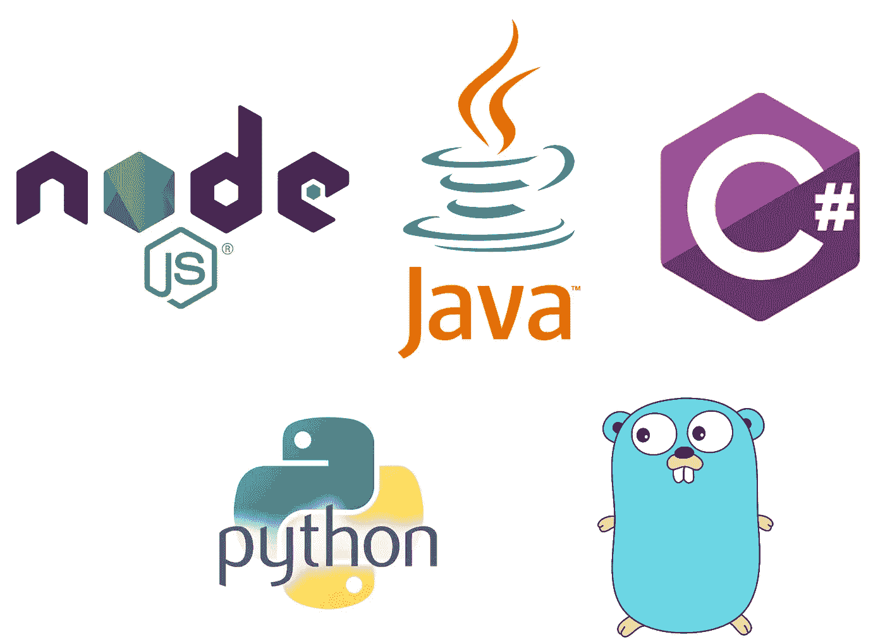

# 使用 AWS Lambda 和 Kotlin 的无服务器应用程序。第一部分

> 原文：<https://medium.com/coinmonks/serverless-application-with-aws-lambda-and-kotlin-part-1-62d12ce7d64f?source=collection_archive---------4----------------------->

# 第 1 部分—无服务器应用和功能即服务简介

本系列文章由 4 部分组成:

1.  无服务器应用和功能即服务简介(您在这里)
2.  [第一滴血:在 AWS Lambda 上用 Kotlin 为 Java 平台编写函数](/@sulevsky/serverless-application-with-aws-lambda-and-kotlin-part-2-26c06dc62099)
3.  [预热优化:在 AWS Lambda 上为 Node.js 平台编写 Kotlin 函数](/@sulevsky/serverless-application-with-aws-lambda-and-kotlin-part-3-f733511f1326)
4.  [使用熟悉的工具:在 AWS Lambda 上使用 Spring Cloud 函数为 Java 平台编写 Kotlin 函数](/@sulevsky/serverless-application-with-aws-lambda-and-kotlin-part-4-b364f9dfd9cd)

我们许多人都记得 2000 年代中期发生的一场革命。它的名字是“**云计算**”。有了云计算，就不需要创建/支持/淘汰基础设施。这使得削减基础设施成本和大幅缩短最小可行产品的时间成为可能。

尽管如此，我们仍然认为应用程序是一堆机器/服务器，甚至是虚拟的。我们正在创建 AWS EC2 实例，设置它们并为我们的应用程序创建一个平台。Docker 简化了这种方法，提供了一个统一的平台。但是我们仍然需要配置它(构建、部署、管理),这需要大量的工作。

但是我们可以从机器/服务器中抽象出。

无服务器平台旨在解决支持基础设施的问题，并将精力集中在对客户重要的功能上。

Evolution of cloud

重要的是，无服务器应用程序的强大的一面是，付款是基于使用量，而不是使用时间(通常)。基本上你只为你使用的东西付费。

因此，无服务器应用非常适合以下情况:

*   负载高度可变的服务——为这类服务提供高性能且昂贵的实例以满足最高负载的一般经验法则，尽管大多数时间实例都没有得到充分利用
*   计划任务
*   构建原型

有两种类型的无服务器应用程序:

*   后端即服务(BaaS) —通常描述具有特定功能的第三方服务，例如用于身份验证的 Auth0 服务或用于数据存储的 Google Firebase
*   功能即服务(FaaS) —由云提供商管理的计算平台，配置简单，无状态

在这篇文章中，我们将把注意力集中在 FaaS。

在 FaaS，应用系统从单个应用程序分离到许多相互作用的功能。功能是一个简单的执行组件，只有一个责任，没有状态。只要函数是无状态和轻量级的，就很容易创建一个新函数或者在不需要的时候关闭它，因此函数的伸缩性很好。

有许多 FaaS 平台提供商:

*   [谷歌的云功能](https://cloud.google.com/functions/)
*   [微软的 Azure 功能](https://azure.microsoft.com/en-us/services/functions/)
*   [Apache OpenWhisk](https://openwhisk.apache.org/) 用于构建具有 FaaS 功能的私有云
*   IBM 基于 OpenWhisk 的解决方案
*   [Webtask.io](https://webtask.io/)
*   [AWS Lambda](https://aws.amazon.com/lambda/)

我们将在 Amazon Lambda 上构建我们的简单应用程序，作为最流行的解决方案。

AWS Lambda 为不同平台提供接口:

*   去
*   C#
*   Java 语言(一种计算机语言，尤用于创建网站)
*   节点. js
*   计算机编程语言

AWS Lambda supported platforms

总结:

*   无服务器应用程序不需要实例管理，因此开发人员可以集中精力开发对用户有价值的功能。
*   无服务器应用程序伸缩性良好。
*   成本基于使用情况，而不是提供的容量。这使得降低具有高度可变负载应用的成本成为可能。