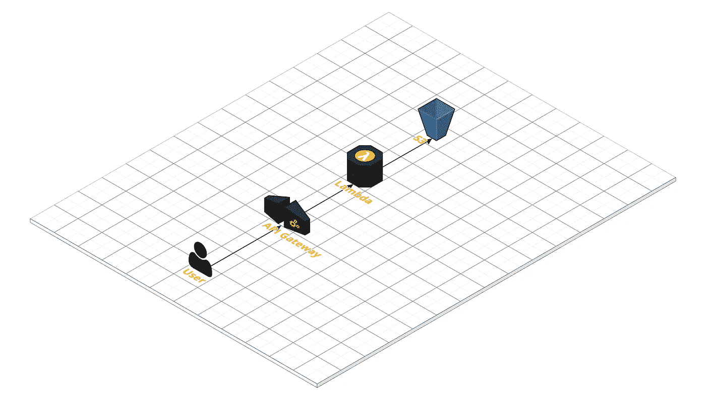
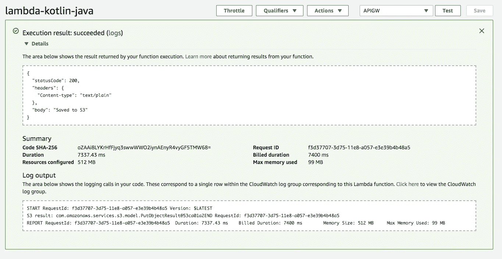
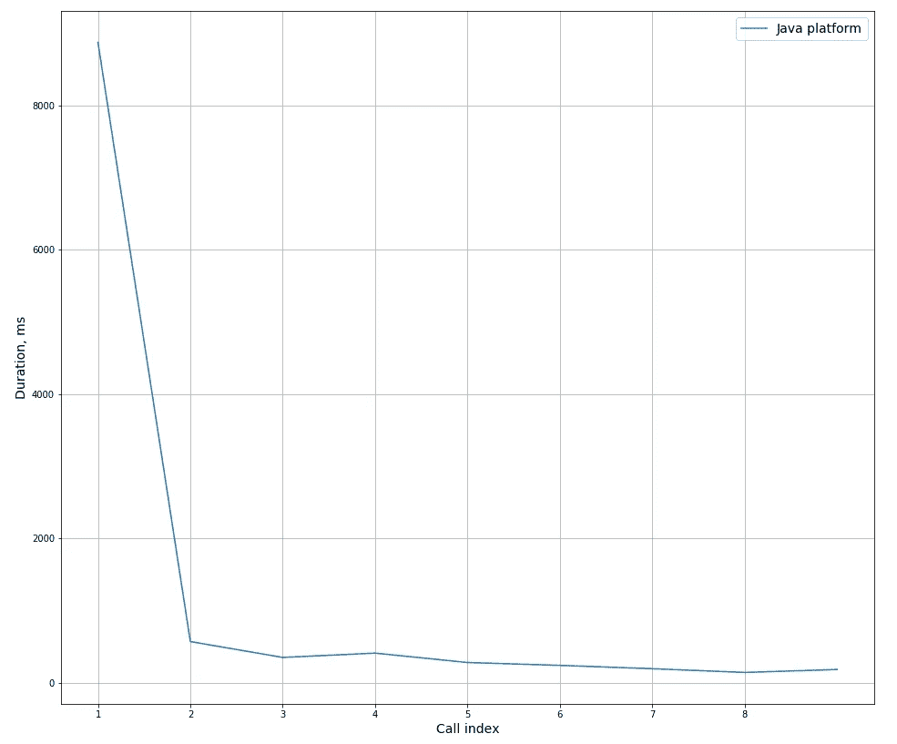

# 使用 AWS Lambda 和 Kotlin 的无服务器应用程序。第二部分

> 原文：<https://medium.com/coinmonks/serverless-application-with-aws-lambda-and-kotlin-part-2-26c06dc62099?source=collection_archive---------3----------------------->

# 第 2 部分—第一滴血:Java + Kotlin + AWS Lambda

本系列文章由 4 部分组成:

1.  [无服务器应用和功能即服务简介](/@sulevsky/serverless-application-with-aws-lambda-and-kotlin-part-1-62d12ce7d64f)
2.  第一滴血:用 Kotlin 为 AWS Lambda 上的 Java 平台编写函数(你在这里)
3.  [预热优化:在 AWS Lambda 上为 Node.js 平台编写 Kotlin 函数](/@sulevsky/serverless-application-with-aws-lambda-and-kotlin-part-3-f733511f1326)
4.  [使用熟悉的工具:使用 AWS Lambda 上的 Spring Cloud 函数为 Java 平台编写 Kotlin 函数](/@sulevsky/serverless-application-with-aws-lambda-and-kotlin-part-4-b364f9dfd9cd)

这部分系列的目的是展示如何使用 Kotlin 编程语言在基于 Java 平台的 AWS lambda 上创建 Lambda 函数。

所有源代码可以从 [**Github**](https://github.com/sulevsky/aws-lambda-java/tree/master/lambda-kotlin-java) 下载

创建和测试功能分为 5 个阶段。

1.  **设置项目**

为了构建和部署工件，我们将使用 Gradle 和插件将 Lambda 函数部署到 AWS Cloud。

首先，我们需要建立一个 Kotlin 项目——添加`kotlin-gradle-plugin`

有了这个设置，我们可以编译和测试用 Kotlin 编写的代码。但是对于部署，我们必须构建一个包含所有依赖项的大容器。使用 Gradle 插件`com.github.johnrengelman.shadow`创建 fat jar 只需一个命令`gradle shadowJar`。

有了这个设置，我们可以编译和测试用 Kotlin 编写的代码。但是对于部署，我们必须构建一个包含所有依赖项的大容器。使用 Gradle 插件`com.github.johnrengelman.shadow`创建 fat jar 只需一个命令`gradle shadowJar`。

基本上，这足以开始开发和测试我们的应用程序。我们可以创建一个 fat jar 并手动将其部署到 AWS Lambda。但是这种解决方案容易出错，并且需要开发人员的时间，所以我们可以用 Gradle 脚本来设置 deploy 以摆脱手工工作。需要两个额外的插件`jp.classmethod.aws`和`jp.classmethod.aws.lambda` **。用于部署和功能调用的任务易于配置。**

[完整的格拉德剧本。](https://github.com/sulevsky/aws-lambda-java/blob/master/lambda-kotlin-java/build.gradle)

**2。** **创建功能**

对于这个例子，我们将创建一个简单的函数。它将负责从 HTTP 请求中读取数据(它需要 API 网关设置)并将数据存储到 S3。当然，这个例子中没有太多的功能，但是它非常适合展示如何引导一个项目。

Dataflow

Kotlin 是一种非常简洁的描述性编程语言。并且非常适合函数实现，因为具有强大的方面，如类型检查、可空性，但比 Java 更具表现力，并且不需要复杂的简单任务的仪式(例如，数据对象的创建是用已经实现了 hashCode()、equals()、toString()方法的数据类来完成的，这与 Java 类不同)。

对于函数创建，我们必须实现`RequestHandler`接口。

`handleRequest()`每次从 API 网关接收到事件时，方法都会执行。

**3。为功能创建角色**

为了使函数可以执行，我们需要创建一个具有适当权限的角色，并将该角色分配给一个函数。我们将授予权限:

*   将数据存储到 S3(必需)
*   将日志写入 Amazon Cloud Watch(很高兴有这样的功能用于调试)

在我们的示例中，角色名为`testDemoRole`，如果您为角色指定了另一个名称，请相应地更新 Gradle 脚本。

**4。部署功能**

对于功能部署，我们必须运行梯度任务部署功能—命令— `gradle deployFunction`。是的，很简单。

**5。测试**

现在我们准备测试功能。第一种选择是用 AWS 控制台调用函数。登录 AWS 控制台，在 Lambda dashboard 中，您可以选择新创建的函数(名称— `[lambda-kotlin-java](https://console.aws.amazon.com/lambda/home?region=us-east-1#/functions/lambda-kotlin-java)`)并测试它。

Testing Lambda function from AWS console

我们必须在基于 API Gateway AWS 代理模板的控制台中配置测试事件。在`body`字段中，我们可以将数据保存在 S3 上。

**4。设置 API 网关**

直接函数调用通常用于 Lambda 通信，但更常见的方法是公开 HTTP 端点进行通信。API 网关的救援！

我们需要在 API Gateway 中创建新的 API，创建资源，创建方法并使用新的 Lambda 连接方法。不要忘记标记**使用 Lambda 代理集成标志**来接收完整的 HTTP 请求，而不仅仅是主体。

Setting up API Gateway to invoke Lambda function

当创建时，系统会询问你是否授予 API 网关调用 Lambda 的权限，不要忘记授予 API 网关调用 Lambda 的权限。成功创建 API 后，我们可以测试 API GW 集成。

Testing Lambda from API Gateway

如果一切设置正确，我们将得到响应代码 200-OK，并在 S3 桶中创建新文件。

Content of file in S3 bucket

测试后，我们应该部署 API 和 AWS 将提供一个调用 API 的 URL。

**5。测试设置**

因此，我们终于可以测试我们简单的无服务器应用程序的完全集成了。

为此，我们应该对 API 网关进行 HTTP 调用(例如使用 Postman ),并检查 S3 上是否存在具有正确内容的文件。

Testing Lambda with Postman

**概要:**

在本文中，我们构建了最简单的无服务器应用程序。我们使用了:

*   用于创建工件以部署到 AWS Lambda、部署和 Lambda 调用的 Gradle
*   基于 Java 平台处理的 AWS lambda
*   内部 lambda 逻辑的 Kotlin
*   API 网关作为 Lambda 的网关，S3 作为文件存储

**额外但重要的信息** 我相信在测试 Lambda 期间，你已经注意到第一次调用比后续调用花费更多的时间——这被称为**冷启动**，它可能相当大。

在我对 512MB 内存和我们刚刚构建的函数的测量中，冷启动通常需要 8 秒以上。

Lambda execution duration on Java platform, RAM 512MB

为了解决这个问题，我们将使用 Kotlin 编写 Lambda 函数，但将其部署在 Node.js 平台上。下一篇文章再见。