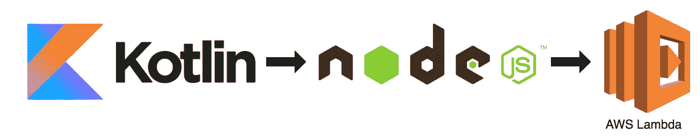
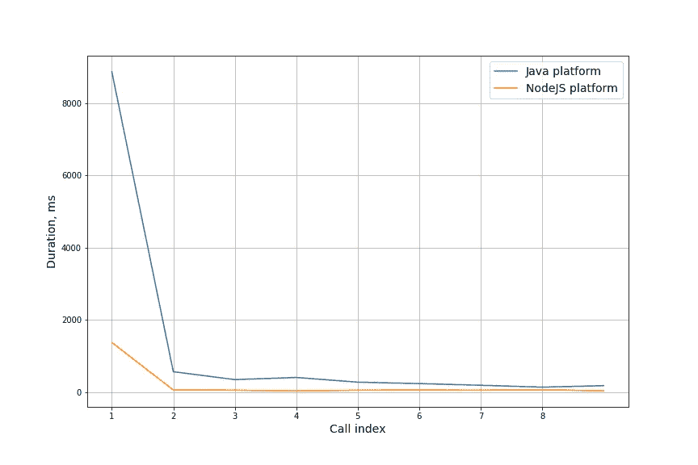

# 使用 AWS Lambda 和 Kotlin 的无服务器应用程序。第三部分

> 原文：<https://medium.com/coinmonks/serverless-application-with-aws-lambda-and-kotlin-part-3-f733511f1326?source=collection_archive---------1----------------------->

# 第 3 部分—提高性能:Kotlin + Node.js+ AWS Lambda

本系列文章由 4 部分组成:

1.  [无服务器应用和功能即服务简介](/@sulevsky/serverless-application-with-aws-lambda-and-kotlin-part-1-62d12ce7d64f)
2.  [第一滴血:在 AWS Lambda 上用 Kotlin 为 Java 平台编写函数](/@sulevsky/serverless-application-with-aws-lambda-and-kotlin-part-2-26c06dc62099)
3.  预热优化:在 AWS Lambda 上用 Kotlin 为 Node.js 平台编写函数(你在这里)
4.  [使用熟悉的工具:使用 AWS Lambda 上的 Spring Cloud 函数为 Java 平台编写 Kotlin 函数](/@sulevsky/serverless-application-with-aws-lambda-and-kotlin-part-4-b364f9dfd9cd)

这部分系列的目的是展示如何使用 Kotlin 编程语言在基于 Node.js 平台的 AWS Lambda 上创建一个函数。

在前一章中，我们已经使用 Kotlin 编程语言部署了一个简单的基于 Java 平台的无服务器应用程序。问题是所谓的**冷启动**——当第一次函数调用花费很长时间时——在我们的例子中是 8 秒，而不是后面调用的 300 毫秒。

tech [博客](https://read.acloud.guru/does-coding-language-memory-or-package-size-affect-cold-starts-of-aws-lambda-a15e26d12c76)中推荐的解决这个问题的方法之一是使用动态类型语言(Python，JavaScript)而不是静态类型语言。但我们还是想用 Kotlin 和它很酷的功能。实际上，Kotlin 在开发过程中提供的类型检查非常有用。

有可能将 Kotlin 代码编译成 JavaScript。有了 KotlinJS，我们将努力使启动更快。

应用程序的想法与上一篇文章相同——从 API 网关接收数据，并将其存储到 S3 桶中。我们仍然希望在 Gradle 中配置部署。

所有源代码都可以从 [Github](https://github.com/sulevsky/aws-lambda-java/tree/master/lambda-kotlin-nodejs) 下载。

1.  **设置项目**

在 Java 示例中，我们构建了一个胖 jar 来包含可部署工件的所有运行时依赖项。在这个例子中，我们将以类似方式创建包含 JS 库的可部署工件(zip 存档)。

要设置 JS 步骤的 gradle 编译，我们需要包含`kotlin2js` gradle 插件，它增加了 gradle 任务`compileKotlin2Js`、`compileTestKotlin2Js`。配置相当简单。

安装依赖项是项目设置的重要部分。首先，我们需要包含`kotlin-stdlib-js`依赖，它在 JS 环境中提供了标准的 Kotlin 特性。

其次，我们需要提供 JS 运行时依赖。在`package.json`中，我们指定它们。

在 gradle 脚本中，我们将创建一个任务来安装依赖项(需要`com.moowork.node`插件)。

打包是用 gradle 的 zip 任务和 aws-gradle 插件完成的。

2.**λ码**

我们的意图是保留业务逻辑与 Java 平台实现中的代码最相似的代码，以尽可能无缝地从 Java 过渡到 Node.js。它需要封装 Kotlin 代码和 JS 的交互。当有许多库时，任务可能会变得困难，但在我们的情况下，只有 AWS S3 SDK 和少量标准 JS 函数(`require`和`process.env`)。在其他方面，切换到 KotlinJS 对 Java/Kotlin 开发人员来说并不困难。

对封装在特定模块中的 JS 函数的调用，业务逻辑不应该与平台特定的函数耦合。

**重要提示**:我并不是说从 Kotlin 到 KotlinJS 的转换将是无缝的，您已经学习了 KotlinJS 的特定概念，如动态类型、外部修饰符、kotlin-js 标准库等。

要实现函数，我们必须创建接收请求对象、上下文和回调参数的函数，并用注释`@JsName`对其进行标记，以便导入。

AWS Lambda 要求指定函数的入口点。让我们创建简单的 JS 文件并指定入口点。

就这样，我们已经建立了一个项目，可以导入 JS 依赖，建立和部署功能到 AWS。

对于开发来说，设置测试特性也是很好的。

3.**测试**

JetBrains 提供了一个库`org.jetbrains.kotlin:kotlin-test-js` 用于在 KotlinJS 中进行测试。正如您在示例中看到的，测试与 JUnit 测试非常相似，这再次简化了 Java/Kotlin 开发人员的开发。

Sample test with `kotlin-test-js`

为了测试，我们需要正确地设置编译、打包和运行测试框架(在我们的例子中是 Jasmin)。

Testing tasks

我们已经为开发、测试和部署准备好了环境。

**一些性能指标**

Function duration on Node.js comparing to Java platform

正如您在我们的测量中所看到的，与 Java 平台相比，Node.js 平台上运行的函数的启动时间要少得多。但是这种改进是有代价的——对于用 Kotlin 编写代码并编译成 JS 的 Java/Kotlin 开发人员来说，需要一些平台知识。

**总结:**

1.  在这个例子中，我们已经为开发管道准备好了**，并且用一个命令`gradle deployFunction`就覆盖了整个构建/测试/部署生命周期**
2.  由于 js 代码的封装，从 Java 过渡到 Node.js 平台应该不需要太多努力
3.  我们的测量显示，与 Java 平台相比，Node.js 上的预热时间更短，在这两个示例中，负责业务逻辑的代码都有很小的变化

> [在您的收件箱中直接获得最佳软件交易](https://coincodecap.com/?utm_source=coinmonks)

