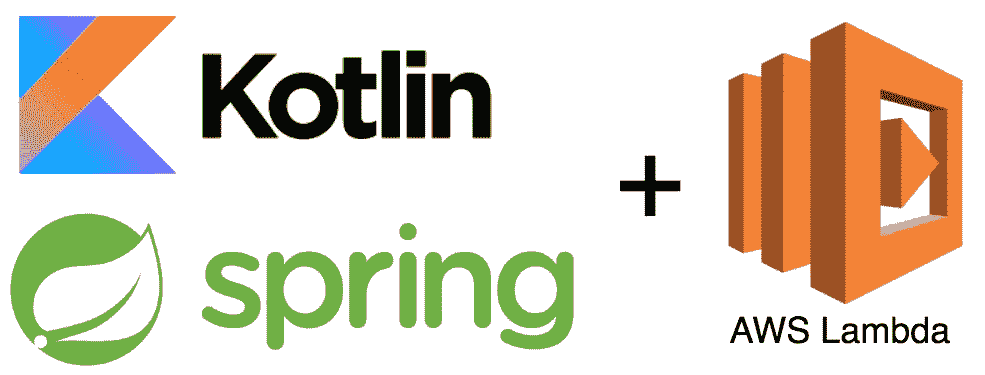
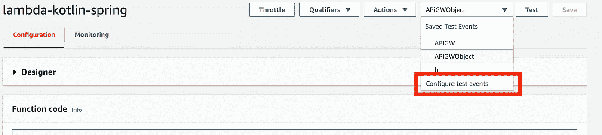
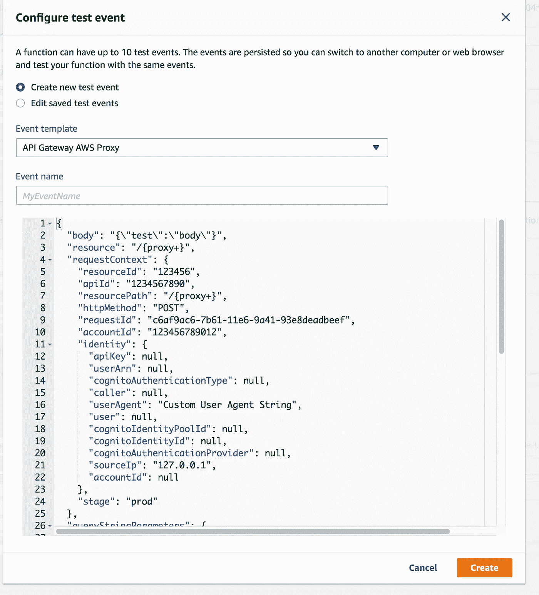
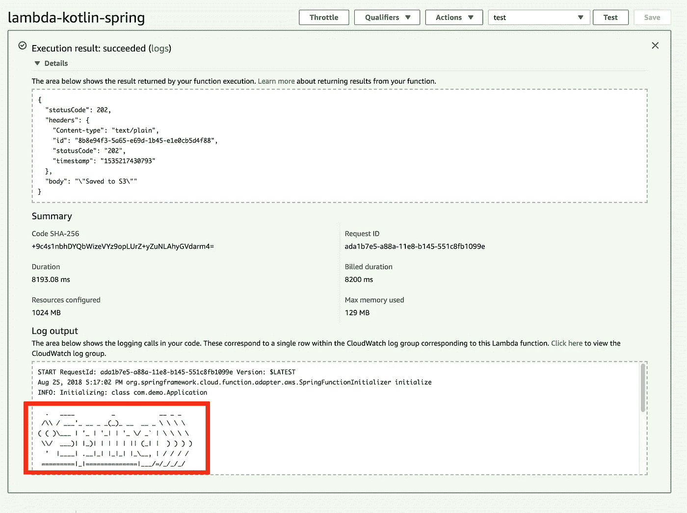
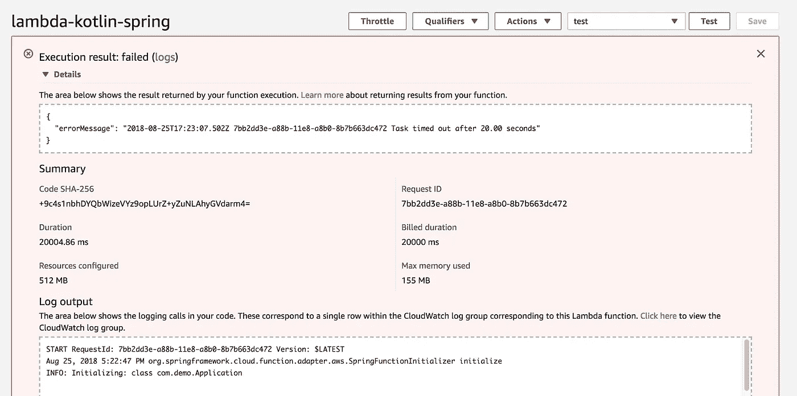
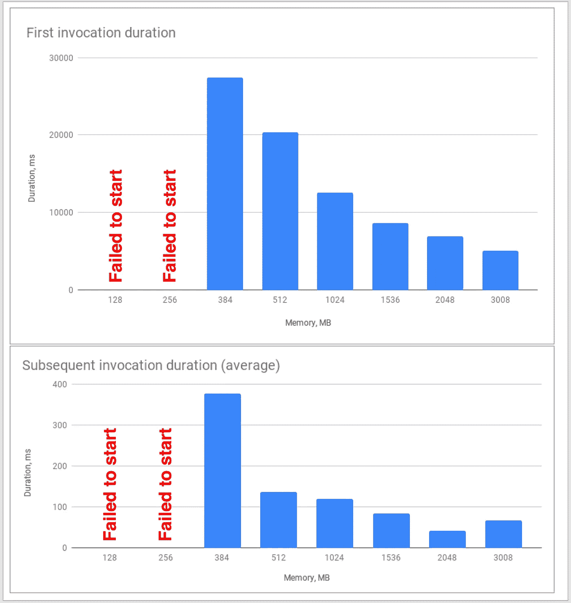

# 使用 AWS Lambda 和 Kotlin 的无服务器应用程序。第四部分

> 原文：<https://medium.com/coinmonks/serverless-application-with-aws-lambda-and-kotlin-part-4-b364f9dfd9cd?source=collection_archive---------3----------------------->



# 第 4 部分——使用熟悉的工具:在 AWS Lambda 上使用 Spring Cloud 函数为 Java 平台编写 Kotlin 函数

本系列文章由 4 部分组成:

1.  [无服务器应用和功能即服务简介](/@sulevsky/serverless-application-with-aws-lambda-and-kotlin-part-1-62d12ce7d64f)
2.  [第一滴血:在 AWS Lambda 上用 Kotlin 为 Java 平台编写函数](/@sulevsky/serverless-application-with-aws-lambda-and-kotlin-part-2-26c06dc62099)
3.  [预热优化:在 AWS Lambda 上为 Node.js 平台编写 Kotlin 函数](/coinmonks/serverless-application-with-aws-lambda-and-kotlin-part-3-f733511f1326)
4.  使用熟悉的工具:在 AWS Lambda 上使用 Spring Cloud 函数用 Kotlin for for Java 平台编写函数(你在这里)

这部分系列的目的是展示如何使用 Kotlin 编程语言和 Spring 框架在基于 Java 平台的 AWS lambda 上创建 Lambda 函数。

所有源代码可以从 [**Github**](https://github.com/sulevsky/aws-lambda-java/tree/master/lambda-kotlin-spring) 下载

Spring Framework 是大多数 Java/Kotlin 开发人员熟知的工具。它简化了应用程序开发，为依赖注入、面向方面编程、自动配置等提供了许多工具。Spring 框架的进一步发展导致了更具体的框架:Spring MVC 是 web 框架，Spring Batch 是为批处理构建管道的框架[以及许多其他的](https://spring.io/projects)。

Spring Cloud Function 是 Spring 保护伞下开发的一个框架。框架帮助开发具有 Spring 特性的 FaaS 应用程序，例如依赖注入、AOP、自动配置。

Spring 对 Kotlin 有很大的支持，并且在最近的版本中部分是用 Kotlin 编写的。

在我们的第三个例子中，我们将构建一个与前面的例子功能相同的应用程序(从 API Gateway 接收数据并存储到 S3)，但是现在使用了 Spring Cloud 函数。

1.  **设置项目**

设置项目与我们为 [Java 平台](/@sulevsky/serverless-application-with-aws-lambda-and-kotlin-part-2-26c06dc62099)构建应用程序的例子非常相似。在这个例子中，我们将构建包含依赖项的 fat jar。用`spring-boot-gradle-plugin`管理的 Spring 依赖项——我们需要将它包含到 gradle 构建脚本中。此外，我们需要添加一个 Spring Cloud 函数依赖项。Spring 为三个流行的 FaaS 提供商 AWS Lambda、Azure 和 OpenWhisk 提供了适配器。因此，我们将在外部构建脚本中添加一个依赖项`org.springframework.cloud:spring-cloud-function-adapter-aws:1.0.0.RELEASE` 。

为了支持 Spring 自动配置，我们将修改构建 fat jar 的`shadowJar`任务。

有了这个构建配置，Spring 的自动配置的所有功能现在都可以为我们所用了！

2.**创建功能**

功能创建包括:

*   创建类型为`Function`、`Consumer`或`Supplier`的 bean

*   引导 Spring Boot 应用程序

3.**配置 AWS Lambda**

部署到 AWS 也是用 Gradle 完成的

如您所见，我们已经配置了一个对应于 Spring 配置的入口点。

```
**class** Handler : SpringBootApiGatewayRequestHandler(Application::**class**.*java*)corresponds tohandler = **"com.demo.Handler"**
```

我们为一项功能配置了更多的内存。

4.**AWS 上的测试**

现在我们可以部署和测试我们的功能了。

部署运行命令`gradle deployFunction`(可以在 Github 上看到配置)。

在 AWS 控制台上，转到 Lambda configuration 并配置新的测试事件，使用 API 网关 AWS 代理(如果您想要完整的组件配置:API 网关和 S3，请参见本系列的第二篇文章)。



如果你触发了一个事件，你会得到输出。



我们已经在用 Kotlin 编写的 AWS Lambda 上设置了 Spring 应用程序。

但是启动时间呢？对于 Java 平台和 Spring 云函数来说，这仍然是一个问题。我们已经配置了 1024MB 的 RAM，如果我们像前面的例子那样设置 512MB 的 RAM，应用程序甚至在 20 秒内都不会启动。



因此，与普通 Java 或 Node.js 函数相比，Spring Cloud 函数需要更多的 RAM 和 CPU。但是，如果你能忍受更长的预热时间和/或所需的额外计算资源，并且你想使用强大的 Spring 生态系统，Spring Cloud Function 是一个很好的解决方案。

我们可以看到我们的应用程序有一些较低的内存和 CPU 限制。如果我们将内存设置为 256 MB 或更少，应用程序将无法启动并抛出 OutOfMemoryError。但是后续调用花费的时间要少得多，并且适合大多数 web 应用程序。



Invocation time depends on provided resources

**结论**:

在这一系列文章中，我们已经开始了用 Kotlin 构建无服务器应用程序的旅程。我们从 Java 平台开始，看到 Kotlin 完全适合在无服务器应用程序中使用。后来，我们通过将 Kotlin 代码编译成 JavaScript 并在 Node.js 平台上运行函数来提高应用程序的性能。在最后一个例子中，我们使用 Spring Cloud 函数作为软件开发的一个很好的工具。这些解决方案各有利弊。但是如果你是一个 Java/Kotlin 开发者，你想使用无服务器平台，你可以根据你的需求和描述的解决方案来证明你的选择。

**参考文献**:

[](https://hackernoon.com/im-afraid-you-re-thinking-about-aws-lambda-cold-starts-all-wrong-7d907f278a4f) [## 恐怕你对 AWS Lambda 冷启动的想法完全错了

### 当我在 API Gateway 的上下文中与人们讨论 AWS Lambda 冷启动时，我经常得到这样的回答…

hackernoon.com](https://hackernoon.com/im-afraid-you-re-thinking-about-aws-lambda-cold-starts-all-wrong-7d907f278a4f) [](https://read.acloud.guru/does-coding-language-memory-or-package-size-affect-cold-starts-of-aws-lambda-a15e26d12c76) [## 语言、内存、封装尺寸如何影响 AWS Lambda 的冷启动？

### 比较使用不同语言、内存分配和部署规模的 AWS Lambda 的冷启动时间…

read.acloud.guru](https://read.acloud.guru/does-coding-language-memory-or-package-size-affect-cold-starts-of-aws-lambda-a15e26d12c76) 

> [在您的收件箱中直接获得最佳软件交易](https://coincodecap.com/?utm_source=coinmonks)

[](https://coincodecap.com/?utm_source=coinmonks)