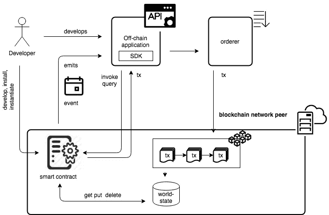
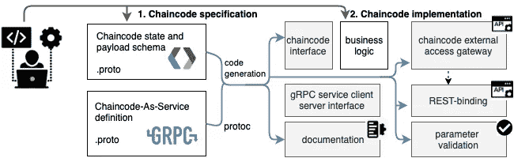
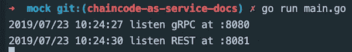
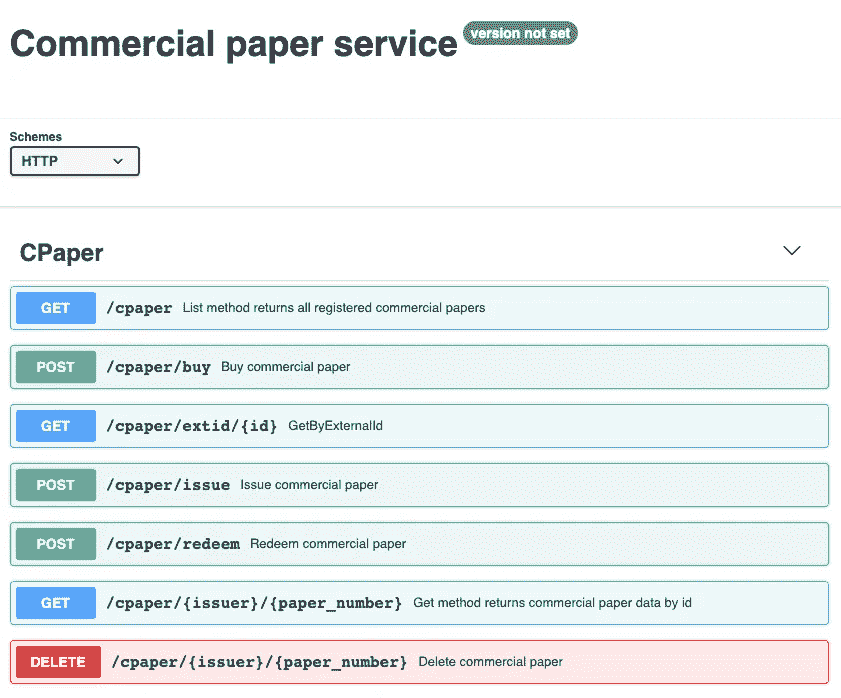
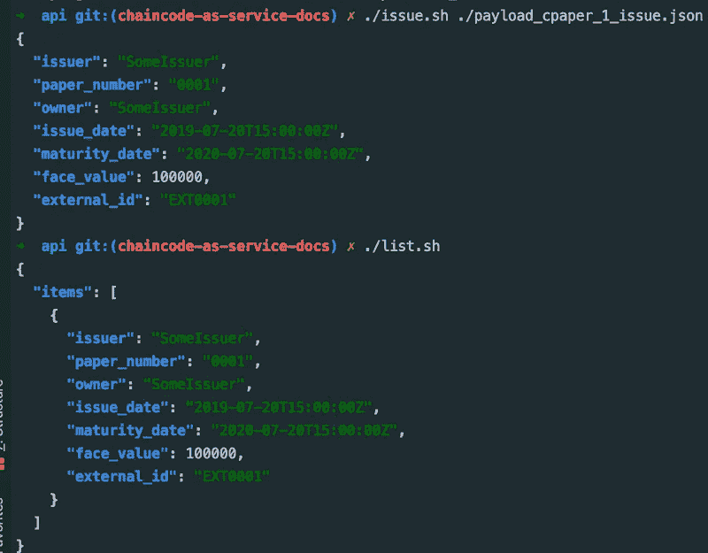

# 面向服务的 Hyperledger 结构应用程序开发

> 原文：<https://medium.com/coinmonks/service-oriented-hyperledger-fabric-application-development-32e66f578f9a?source=collection_archive---------0----------------------->

当前链码开发最佳实践和[应用示例](https://github.com/hyperledger/fabric-samples)利用 JSON 数据模型、简单链码方法路由和`REST` API 架构作为事实上的技术堆栈。本文提出了使用众所周知的规范格式(如[协议缓冲区消息](/coinmonks/hyperledger-fabric-smart-contract-data-model-protobuf-to-chaincode-state-mapping-191cdcfa0b78)和`gRPC`服务定义)进行区块链应用程序开发的方法和工具。

## Hyperledger 结构网络组件

区块链网络由多个组件组成，包括链上(链码)和链下(API、oracles 和其他外部应用程序，与智能合约交互)。



例如，官方[商业票据链码示例](https://hyperledger-fabric.readthedocs.io/en/release-1.4/tutorial/commercial_paper.html)包括智能合约实现和 CLI 工具，用于与部署的с链码进行交互。因为这个应用程序可以用不同的编程语言来实现，所以用一种标准的方法来定义服务接口和消息格式是很重要的。

## 链码开发工具

有许多用 Java、Golang 和 Javascript 编写的用于开发链上和链下应用程序的库:

*   用于构建链外应用的 SDK(Node-js、Java、Golang)
*   链码方法路由库，如[https://github.com/hyperledger/fabric-chaincode-node](https://github.com/hyperledger/fabric-chaincode-node)

# 链码数据模型和接口规范

下一步是使用 [gRPC 接口定义语言(IDL)](https://developers.google.com/protocol-buffers/docs/proto3?hl=ru#services) 标准化区块链应用程序开发的以下方面:

*   链码接口定义
*   链码 SDK 和 API 的创建与代码生成
*   使用代码生成构建链代码文档



提议的方法利用了`gRPC`服务和消息定义的力量。区块链应用开发者可以用高级接口定义语言来表达与 app 的接口，CCKit `cc-gateway` generator 会自动生成:

*   链码服务接口和将服务嵌入链码路由器的帮助器
*   用于外部访问的链码网关(可用作 SDK 或暴露为`gRPC`或`REST`服务)
*   `markdown`格式的链码文件
*   swagger 格式的 REST API 规范

生成所有这些组件后，区块链开发人员只需实现链码业务逻辑，使用`CCKit`功能处理[状态](https://github.com/hyperledger-labs/cckit/tree/main/state)、[访问控制](https://github.com/s7techlab/cckit/tree/master/extensions/owner)或数据[加密。](https://github.com/s7techlab/cckit/tree/master/extensions/encryption)

# 使用 gRPC 生态系统进行链码开发

## gRPC 基础

使用 [gRPC](https://www.grpc.io/docs/guides/concepts/) ，客户端应用程序可以直接调用远程机器上的服务器应用程序的方法，就像它是一个本地对象一样。`gRPC`基于传统远程过程调用(RPC)技术的基础，但在现代技术栈(如 HTTP2、协议缓冲区等)之上实现。以确保最大的互操作性。

像许多 RPC 系统一样，`gRPC`基于定义服务的思想，指定可以远程调用的方法及其参数和返回类型。`gRPC` technology stack 本身支持使用接口定义语言(`IDL`)来指定服务契约的简洁而强大的方式:

*   **消息**定义了输入参数和返回类型的数据结构。
*   服务定义概述了可以远程调用的方法签名

当客户端调用服务时，客户端的`gRPC`库使用协议缓冲区并整理远程过程调用，然后通过 HTTP2 发送。在服务器端，请求被解组，相应的过程调用使用协议缓冲区执行。响应遵循从服务器到客户机的类似执行流程。

用`gRPC`开发服务和客户端的主要优点是，您的服务代码或客户端代码不需要担心解析 JSON 或类似的基于文本的消息格式。进来的是二进制格式，它被解组成一个对象。此外，当我们必须处理多个微服务并确保和维护互操作性时，拥有通过`IDL`定义服务接口的一流支持是一个强大的功能。

## gRPC 服务作为 RESTful HTTP API

使用 Google protocol buffers 编译器[**proto**](https://gist.github.com/vitiko/fe3ce6a19f184271fca644274e417d60)**c**的 [**grpc-gateway**](https://github.com/grpc-ecosystem/grpc-gateway) 插件，可以将`gRPC`服务公开为`REST`服务。它读取 protobuf 服务定义，并生成一个反向代理服务器，将 RESTful HTTP API 翻译成`gRPC`。

# 链码即服务

> *应用，与智能合约交互可以定义并实现为* `*gRPC*` *服务。但是，如果 chaincode 本身以* `*gRPC*` *格式实现服务定义呢？*

## 链码接口

Chaincode 与共享分类帐交互，并为区块链网络定义业务逻辑:一组涵盖通用术语、数据、规则、概念定义和流程的合同(例如，[商业票据](https://hyperledger-fabric.readthedocs.io/en/release-1.4/tutorial/commercial_paper.html)或 [ERC20](/coinmonks/erc20-token-as-hyperledger-fabric-golang-chaincode-d09dfd16a339) 令牌功能)，布局管理交易方之间所有交互的业务模型。

Chaincode 接口非常简单，只包含 2 个方法:

使用`ChaincodeStubInterface` `getArgs`方法 chaincode 实现可以以字节片(数组)的形式访问输入参数。

目前，还没有通过某种定义语言来描述链码接口的标准方法。但是 chaincode 本身可以被认为是类似 RPC 的服务，用`gRPC`接口定义语言(IDL)定义，例如:

由于这个服务定义是强类型的(输入:`string` ad 输出:`string`)而不是宽松的基本链码接口(输入:`[]byte`和输出:`[]byte`)，我们需要将输入`[]byte`转换为目标参数类型的机制，这取决于服务定义。

# 示例:商业票据链码

让我们使用`gRPC`服务定义和代码生成来实现[商业票据](https://github.com/s7techlab/hyperledger-fabric-samples)链码即服务。完整的示例代码可以在[这里](https://github.com/s7techlab/hyperledger-fabric-samples/tree/master/commercial-paper)找到。

## 1.定义数据模型

第一步，我们创建[。proto](https://github.com/s7techlab/cckit/blob/master/examples/cpaper_asservice/schema/schema.proto) 描述您希望存储和输入/输出有效载荷的数据结构。你可以在这里阅读关于链码状态建模[的细节。](/coinmonks/hyperledger-fabric-smart-contract-data-model-protobuf-to-chaincode-state-mapping-191cdcfa0b78)

## 2.创建服务定义

链码接口可以用 gRPC [服务](https://github.com/s7techlab/cckit/blob/master/examples/cpaper_asservice/service/service.proto)符号描述。使用`grpc-gateway`选项，我们还可以为链码 REST-API 定义映射。

`grpc-gateway`是谷歌协议缓冲编译器`protoc`的一个插件。它读取 protobuf 服务定义，并生成一个反向代理服务器，将 RESTful HTTP API 翻译成 gRPC。这个服务器是根据服务定义中的`google.api.http`注释生成的。

## 3.代码生成

链码即服务网关生成器允许从`gRPC`服务定义生成辅助组件。

安装发电机:

```
GO111MODULE=on go install https://github.com/hyperledger-labs/cckit/gateway/protoc-gen-cc-gateway
```

对于文件生成，安装[协议生成文档](https://github.com/pseudomuto/protoc-gen-doc):

```
*go get -u github.com/pseudomuto/protoc-gen-doc/cmd/protoc-gen-doc*
```

要生成验证代码，请安装 [ProtoBuf 验证器编译器](https://github.com/mwitkow/go-proto-validators):

```
*go get github.com/mwitkow/go-proto-validators/protoc-gen-govalidators*
```

生成链码辅助代码的命令可以在 [Makefile](https://gist.github.com/vitiko/4f260dc1600c96765c4e6f8c88f72507#file-block5-makefile) 中找到

*   `-I`标志定义数据模式源的来源([)。模式](https://gist.github.com/examples/cpaper_asservice/schema)或[服务定义](https://gist.github.com/examples/cpaper_asservice/service)
*   `go_out`标志为`protobuf`结构和`gRPC`服务客户端和服务器设置输出路径
*   `govalidators_out`标志为`protobuf`参数验证器设置输出路径
*   `grpc-gateway_out`标志为`gRPC`服务的 REST-API 代理设置输出路径
*   `swagger_out`标志设置 REST API swagger 规范的输出
*   `doc_out`标记以降价格式设置文档的输出

最后`cc-gateway_out`标志为构建链上(chaincode)和链下(外部应用)区块链网络组件的辅助代码设置输出路径:

*   链码服务到链码接口映射器
*   链码网关— `gRPC`链码对外访问的服务实现

## 链码实现

Chaincode 服务实现必须符合接口，由服务定义 [CPaperChaincode](https://github.com/s7techlab/cckit/blob/master/examples/cpaper_asservice/service/service.pb.cc.go) 生成:

对于简单的情况，如`Commercial Paper`链码，服务充当`Create-Read-Update-Delete` (CRUD)应用:

*   在链码状态下创建商业票据条目(`Issue`方法)
*   从链码状态读取(`List`、`Get`、`GetByExternalId`方法)
*   更新商业票据条目(`Buy`、`Redeem`方法)
*   删除商业票据条目(`Delete`方法)

使用`CCKit` [状态](https://github.com/s7techlab/cckit/tree/master/state)包装器与实体映射，实现应该[相当简单明了](https://github.com/s7techlab/cckit/blob/master/examples/cpaper_asservice/chaincode.go#L57):

链码实现还必须包含[状态和事件映射](https://github.com/s7techlab/cckit/blob/master/examples/cpaper_asservice/chaincode.go#L60):

然后，利用生成的[registrastpaperchaincode](https://github.com/s7techlab/cckit/blob/master/examples/cpaper_asservice/service/service.pb.cc.go#L58)功能，将链码服务实现嵌入到链码方法路由器中:

# 构建区块链网络层的组件

## 链码服务到链码 stubbinterface 映射器

在`gRPC`服务定义链码之上生成的服务映射器允许将链码服务实现嵌入到 [CCKit 路由器](https://github.com/s7techlab/cckit/tree/master/router)中，利用中间件功能转换输入和输出数据。

例如，[商业票据即服务](https://github.com/s7techlab/cckit/blob/master/examples/cpaper_asservice/service/service.pb.cc.go)生成的代码包含`RegisterCPaperChaincode`方法，该方法将链码`Issue`方法映射到链码服务实现:

## 链代码调用服务

[链码调用服务](https://github.com/s7techlab/cckit/blob/master/gateway/service/chaincode.go)定义了 gRPC 服务，用于通过 3 种方法从外部应用程序与智能合同交互:

*   `Query` ( `ChaincodeInput`)返回(`ProposalResponse`)
*   `Invoke` ( `ChaincodeInput`)返回(`ProposalResponse`)
*   `Events` ( `ChaincodeLocator`)返回(`ChaincodeEvent`)

本服务由`Chaincode gateway`使用，也可作为`gRPC`服务或`REST` API 单独展示。`CCKit`包含基于 [hlf-sdk-go](https://github.com/s7techlab/hlf-sdk-go) 的链码服务[实现](https://github.com/s7techlab/cckit/blob/master/gateway/service/chaincode.go)、用于构建链外 Hyperledger Fabric 应用的非官方软件开发工具包(sdk)以及基于 [Mockstub](https://gist.github.com/testing) 的[测试版本](https://github.com/s7techlab/cckit/blob/master/gateway/service/mock.go)。

## 链码网关

[Chaincode gateway](https://github.com/s7techlab/cckit/blob/master/gateway/chaincode.go) 使用 Chaincode 服务与部署的 chaincode 进行交互。它知道通道和链码名称，但不知道链码方法签名。

Chaincode gateway 支持[选项](https://github.com/s7techlab/cckit/blob/master/gateway/opt.go)，用于在 Chaincode 调用期间提供瞬态数据，以及加密/解密数据。

使用`gRPC`服务定义，我们可以为特定的链码生成网关，例如`Commercial Paper`。该网关可用作:

*   `gRPC`服务
*   用于其他服务(oracle、API 等)的链码 SDK
*   `REST`通过 [grpc 网关](https://github.com/grpc-ecosystem/grpc-gateway)的服务

例如，[为](https://gist.github.com/examples/cpaper_asservice/service/service.pb.cc.go)[商业票据示例](https://gist.github.com/examples/cpaper_asservice)生成的链码网关如下所示:

使用生成的链码网关你可以很容易地建立外部链码应用。例如，要创建 [API](https://github.com/s7techlab/cckit/blob/master/examples/cpaper_asservice/bin/api/mock/main.go) 应用程序，您需要为 HTTP 反向代理服务器创建入口点，并在`gRPC`服务器中使用生成的网关:

提供的 API [示例](https://github.com/s7techlab/cckit/blob/master/examples/cpaper_asservice/bin/api/mock/main.go)使用模拟链码调用服务，但是为了与真实的 Hyperledger Fabric 网络对等体进行交互，您只需要将链码调用服务更改为使用 SDK 实现，例如 [hlf-sdk-go](https://github.com/s7techlab/cckit/blob/master/gateway/service/chaincode.go) 。

您可以使用命令运行提供的示例

> # CD examples/cpaper _ as service/bin/API/mock
> 
> #去运行 main.go



商业票据服务 [REST-API 规范](https://github.com/s7techlab/cckit/blob/master/examples/cpaper_asservice/service/service.swagger.json)以
[swagger](https://swagger.io) 格式生成:



然后你可以使用 API [的使用示例和样本负载](https://github.com/s7techlab/cckit/tree/master/examples/cpaper_asservice/bin/api):



`grpc-gateway`会自动将 http 请求转换为`gRPC`调用，将 JSON 有效负载输入到 protobuf，调用 chaincode 服务，然后将返回值从 protobuf 转换为 JSON。您也可以将此服务作为纯 gRPC 服务使用。可以用生成的
[gRPC 客户端](https://github.com/s7techlab/cckit/blob/master/examples/cpaper_asservice/service/service.pb.go#L93)调用 Chaincode 方法。[服务](https://github.com/s7techlab/cckit/blob/master/examples/cpaper_asservice/service/service.md)和[模式](https://github.com/s7techlab/cckit/blob/master/examples/cpaper_asservice/schema/schema.md)文档也是自动生成的。

# 结论

提供的工具允许指定链码数据模型和接口，然后以一致的方式生成用于构建`on-chain`(链码)和`off-chain` (API、Oracles、SDK 等)应用的代码。