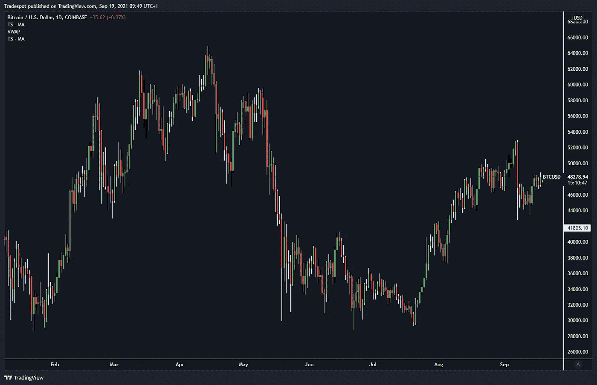

# 会议 1:贸易工具——制图、烛台和交换

> 原文：<https://medium.com/coinmonks/session-1-tools-of-the-trade-charting-candlesticks-exchanges-81575207fabb?source=collection_archive---------4----------------------->

BTCUSD 1D

# 介绍👋

欢迎来到新的 [**密码启**](https://cryptokaidojo.com/) **交易概要**。一系列简单易懂的书面指南，帮助你学习从图表和技术分析到风险管理和交易执行的所有交易基础。

以下是我们将在未来几周讨论的主题示例。因为这个…