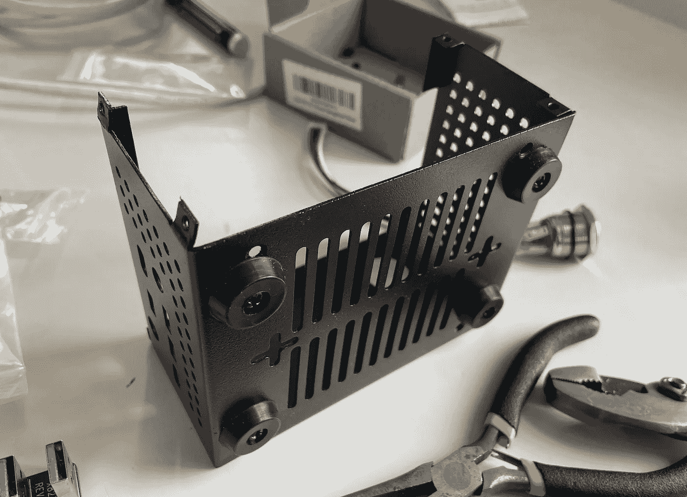

# 用 Umbrel 建立一个比特币节点，很难

> 原文：<https://medium.com/coinmonks/set-up-a-bitcoin-node-with-umbrel-the-hard-way-b8af3e8652e2?source=collection_archive---------0----------------------->


*披露:当我继续修补我的设置并再次检查我的命令时，我发现了一些错误，特别是在对 X735 进行故障排除时，我对文件夹结构的注意。请你自己做研究，明白我还在学习中。*

# **比特币对比特币**

在我们深入讨论之前，我想先认识一下比特币和比特币的区别。我在写作过程中肯定会犯错误，但我会尽力而为。大写的比特币是加密货币——不大写的比特币是协议。个人与比特币互动，互相发送比特币。

我希望通过认识到我意识到了这种不同，马克西人会放过我。现在，在这篇文章中，我继续修补比特币和比特币的正确大写。

# **运行满节点**

Umbrel 有一个平滑的音高。看一眼他们的网站，你就会迫不及待地建立一个比特币节点。在可以“成为比特币”的情况下，为什么还要“购买比特币”？！

最初，当我向家人或朋友解释我有兴趣建立一个比特币节点时，他们认为我会盈利。比起支持比特币节点，人们更熟悉挖掘比特币。

我稍微研究了一下不同之处，结果发现了正方形和长方形的情况。所有挖掘器都是节点，但不是所有节点都是挖掘器。运行一个节点意味着你以信息安全的形式为网络提供支持。你不是在竞争验证交易并以比特币的形式获得奖励，你只是在托管和分享一份比特币区块链。只要总有一个节点具有链的历史，比特币交易历史是完整的，其他节点可以重新同步交易历史。

我的一个好朋友问我本质上是不是在做社区服务。我认为通过为网络提供支持，运行一个节点就是为社区提供服务。尽管运行一个节点也有一些自私的原因。当您运行自己的节点时，您可以连接您的钱包并通过您的节点路由交易，以确保不会发生与您的交易相关的恶意操作。

我还遇到了关于运行完整节点还是部分节点的讨论。当我意识到完整节点更好，因为它维护了所有事务的全面历史记录时，我没有花太多时间来研究这种区别。让我们以正确的方式，过度，没有修剪。

根据我的阅读和观察，Umbrel 让设置一个比特币节点变得非常简单。如此简单(在我建立 Umbrel 之前写这篇文章，所以希望我不会食言)，以至于我想给自己创造一个额外的挑战。

看看他们的网站…他们让它看起来非常简单，太简单了…

[https://getumbrel.com/](https://getumbrel.com/)

# **设置节点**

Umbrel 在他们的网站上提供了一个部件列表，以开始使用 Raspberry Pi 4。太棒了，我过去用过一台 Pi 3，现在它正在积灰。如果能让它恢复工作就好了。

让我们来看看完整的列表:

> 树莓 Pi 4
> 
> 1TB 固态硬盘
> 
> 固态硬盘盘柜
> 
> 16GB+ microSD
> 
> 电源
> 
> 以太网电缆
> 
> 情况

为了省钱，让我们再来看看这个列表:

> 树莓派 4(我有一个树莓派 3)
> 
> 1TB 固态硬盘(我确定我有一个硬盘，可能不是固态的)
> 
> 固态硬盘外壳(我必须这样做吗？我觉得很懒)
> 
> 16GB+ microSD(刚找到一个 8GB 的，试试那个吧)
> 
> 电源(我有一个树莓 Pi 3)
> 
> 以太网电缆(我必须这样做吗？我的路由器不适合其他设备)
> 
> 案例(我有一个树莓 Pi 3)

太棒了，我会用我有的材料免费建立一个节点。接受挑战。

回到列表。

列出的所有项目都很合理，唯一昂贵的是树莓 Pi 4 和 SSD，如果事情不像 Umbrel 网站和 Twitter feed 看起来那样顺利，这两个项目将为未来的项目保留价值。

我们正在谈论大约 250 美元开始。和往常一样，当我开始以 crypto 的名义四处砸钱时，我会把它框定为学习成本。花几百美元来了解比特币的实际工作方式是值得的，如果我从 2017 年开始听说的这个闪电东西有价值的话。

我的一个在 Umbrel 上运营一个节点的朋友提到了一些关于在彼此之间建立闪电通道的事情。谁知道呢。希望当一切都准备好并开始运作的时候，我能更好地理解这意味着什么。现在，让我们模仿。

# **节点构建示例**

当你看着 [@getumbrel](https://twitter.com/getumbrel) 的 Twitter feed 时，你会看到大量的构建。

老实说，很多人似乎在使用 Umbrel 设置节点，这真的令人印象深刻。YouTube 上有大量的指南和视频。再次，看看他们的网站。设计很重要，Umbrel 为一个漂亮的界面建造了一个光滑的入口。

你可以说我势利或者混蛋，但是这些系统看起来有点乱，让我很沮丧。其中大多数都使用了 Umbrel 提供的列表中的链接。在我写这篇文章的时候，清单上的一些商品甚至已经卖完了。同样，入口匝道令人印象深刻。乌姆贝尔显然吸引了我和其他人的兴趣。

Pi and SSD are clearly separate and connected via cables

设置节点时需要的最大部分是 Raspberry Pi 4 和 SSD。Umbrel 建议为每一个购买单独的外壳，并通过 USB 连接它们。这是最经济的选择，但你节省的材料成本是你为外观付出的代价。

@niteshbalusu11, I’m sorry but I can’t condone this cable management

我不想成为一个混蛋。通过创建一个节点， [@niteshbalusu11](https://twitter.com/niteshbalusu11) 做了一件很好很重要的事情。我只包括他的帖子，因为这是我在滚动 Umbrel Twitter feed 寻找例子时看到的第一个帖子之一，我很嫉妒他有足够的空间在地板上留下一个完整的比特币节点。我的公寓并没有那么宽容(我们将回到这一点)。

然而，像下面这样的帖子开始让我头脑发热。我能找到一个包含所有部件的外壳吗？

Custom Enclosure for the Raspberry Pi


The SSD is still sitting to the side!

我已经有 10 多年没造过电脑了，但我知道肯定有一家厂商能提供组装整个系统所需的零件。上一次我订购 Pi 时，我对售后配件的数量感到震惊。扩展板、触摸屏、传感器套件，应有尽有。

我想要的只是一个能装下 Pi 和 SSD 的箱子。

# **外壳选项**

事实证明，你不能在亚马逊上搜索“Raspberry Pi 4 SSD enclosure”或“Raspberry Pi 4 SSD case ”,然后单击添加到购物车。

有几个项目立即出现。Geekworm 和 Argon 提供的服务。这两种方式似乎都符合我的要求。


Geekworm Raspberry Pi 4 X825-C6


Argon ONE M.2 Case for Raspberry Pi 4

氩的情况下使用了不同的固态硬盘的形式因素比我熟悉的，再次外观不适合我。


External USB Bridge from SSD to Raspberry Pi

Argon 的整体外形很小，老实说，它可能比 Geekworm box 的*外观更好。*

Argon box 与带有 B-Key 或 B+M Key 的 M.2 SATA SSD 配合使用。这种固态硬盘外形对我来说是新的，我不想做这项研究只是为了有一个星际迷航寻找比特币节点。我非常喜欢 Geekworm 选项的外观。这是一种丑陋，但它并不试图超过它是什么。这是一些电脑主板的金属外壳，它让我想起了 2010 年我塞进一个简单的黑色电脑外壳的 Hackintosh。

除了外观，我注意到 Geekworm 路线包括使用一些扩展板来让所有东西一起工作。


Now we’re talking

这是我的挑战。对于那些经常摆弄硬件的人来说，这就像是在公园里散步。但是我从来没有玩过硬件，我总是对我看到其他人完成的堆叠板项目着迷。

我总是很兴奋用我的双手把一些东西放在一起，这给了我一个绝佳的机会。

在看了一些建造的视频和阅读了一些关于各种板和箱子之间的兼容性之后，我把我的亚马逊购物车放在了一起。

# **最终名单**


Amazon Order

最后，我用我放在房子周围的东西，把钱扔了出去。嗯，事实上我的父母有一些剩余的亚马逊信用，并好心赞助这个建设，谢谢妈妈。

我们正在研究的是:

> 树莓 Pi 4
> 
> 1TB 固态硬盘
> 
> Geekworm X825 V2.0 SSD 扩展板
> 
> Geekworm X735 V2.5 电源管理扩展板
> 
> 32GB microSD
> 
> 电源
> 
> Geekworm X825-C8 外壳

注意，我们省略了以太网电缆。我真的不想把这个东西插到我的路由器上。

# 公寓和路由器是怎么回事？


Not great, Bob

没人想让自己的比特币节点溅上培根油。我讨厌对我的调制解调器和路由器这样做，但在那个空间里我只能控制这么多。这是公寓中唯一可用的同轴电缆连接，该单元没有与任何其他以太网连接硬连线。

老实说，这是一个挂机阻止我开始这个项目。我不想给厨房的窗台增加更多的杂物，也不想让这个节点遭受潜在的烹饪灾难。

从这里，我看到了几条潜在的前进道路。我可以设置一个带有以太网端口的 wifi 扩展器，并将其插入其中，或者我可以进一步了解 Raspberry Pi 4 的 wifi 功能。

wifi 延长线价格昂贵，在公寓这样小的空间里，从概念上来说是不必要的，而且可能会对现有网络造成更多干扰。

由于树莓 Pi 4 支持 wifi，我希望有一个工作。

有了乌姆贝尔，事情又变得简单了。


[https://umbrelinfo.gitlab.io/troubleshooting.html#using-wifi-instead-of-ethernet](https://umbrelinfo.gitlab.io/troubleshooting.html#using-wifi-instead-of-ethernet)

# **建筑准备**

我喜欢视频教程。很自然地，我在 YouTube 上搜索了一下，发现了一个来自 Geekworm 的官方视频，展示了如何将这个工具包放在一起。

Turn the volume up to max and do not turn it off

看了这个视频多次，包括倒带具体片段，我完全失去了理智。正如评论指出的，这首歌会让你发疯。


Same. Though I choose not to mute. Why?

抛开围绕音乐的深刻争论，这个视频还有一个不太理想的因素。它展示了如何执行多个构建，因此包括在没有 X735 的情况下进行构建，然后拆除以添加 X735。基本上，如果我直接看完这个视频，我会用一种方法构建它，然后把它拆开来构建整体。它有一些有用的信息标题，但我又看了看，看是否能找到一个更简单的视频。

这让我想起了 PE4Doers 的一个视频。

This video rocks

这个视频移动得更有条不紊，建造者讲述了他正在做的事情，他直接跟随建造，没有做需要返工的部分。这些小提示和小技巧也很有帮助——了解常见的陷阱并牢记它们会很有帮助。

我注意到这是一个系列的第二个视频，所以我看了看前一个视频。YouTube 可以是这样一个兔子洞。我喜欢这家伙的频道。他值得更多的观点，泵的数字！

YouTuber thumbnails are undefeated

在找到 PE4Doers 的视频之前，我试图根据 Geekworm 的视频来画出这些联系。


Connections between hardware pieces

我们可以看到，从构造的角度来看，这实际上非常简单。我们的固态硬盘将通过 SATA 连接插入 X825 主板。X825 将通过 USB 桥连接到 Raspberry Pi 4。X735 板将使用 40 引脚连接器置于 Raspberry Pi 之上。我们将使用从 X735 到 X825 的连接来为 SSD 供电。专用电源按钮连接到 X735。

我要再次感谢大卫·里维拉，他让我们明白了这个特定的构建是多么简单。我还是忘不了极客视频里的音乐。

# **软件设置**


这个大概连一节都不需要。我按照 Umbrel 网站上的说明下载了 Umbrel OS 和 Balena Etcher。然后我用 Balena Etcher 把 Umbrel OS 的磁盘映像刷新到 microSD 卡上。


Nice

我的订单包括一个 USB 转 SD 卡适配器，完全是为了这个目的。在未来，我需要为那个*过时的*树莓 Pi 3 找到另一个项目，并从转换器中获得更多的用途。我当然不是用它来拍照。

# 让我们建立…


Again, thanks Mom!

我首先将操作系统刷新到 microSD，并添加包含我的无线网络信息的`wpa_supplicant.conf`文件。我怀疑这是否会像我说的那么简单，我们将看看是否需要回来解决这个问题。

之后，我将散热器应用到树莓 Pi 4 上。


Got to stay cool

# 优化硬件

在我们继续之前，我想确保所有部件都正常工作。

X735 电源管理板包括安全关断功能。由于这是一个比特币节点，我们希望它全天候运行，但设置安全关闭似乎是有意义的，这样我们就可以关闭节点，并根据需要移动它。

我再次寻找视频，发现了 GigaBauer Tech 的这个有用的视频，尽管我不确定 X735 的哪个版本正在使用。

我有 X735 V2.5，在谷歌搜索后，我发现了以下来自 Geekworm 的信息，讨论了启用安全关机功能所需的脚本。

[](https://wiki.geekworm.com/X735_V2.5_Software) [## X735 V2.5 软件

### 本指南仅适用于 X735 V2.5 屏蔽。1.一旦你从命令行登录到你的 Raspberry Pi，运行…

wiki.geekworm.com](https://wiki.geekworm.com/X735_V2.5_Software) 

在亚马逊的评论中，我也看到了一些关于 X735 炸树莓馅饼的帖子。让我们希望这不会发生在这里。


Let’s hope for a better experience than this…

我还注意到反复澄清不要从多个来源向 Pi 供电。应向 X735 供电，然后 X735 通过 40 针连接器管理向 Pi 和 X825 的电源输出。

坦率地说，我的工作超出了我的专业范围。请原谅我正在解决这个问题的事实！


[https://wiki.geekworm.com/X735_V2.5_Hardware](https://wiki.geekworm.com/X735_V2.5_Hardware)

根据我所看到的，我们不应该期望风扇在没有安装脚本的情况下工作。

我知道这个项目将需要一些故障排除，我开始觉得实现了。

当我试图理解如何让 X735 安全关机脚本工作时，我回想起最初的 Geekworm 视频以及 GigaBauer Tech 的视频。在这两种情况下，机器都是使用 Pi、SSD 和 X825 构建的。完成初始构建后，将添加 X735。

虽然我最初想做完整的构建，但现在我正在考虑完成部分构建，然后再回来添加电源管理板。

将电源插入 Raspberry Pi 并通过路由器仪表板查看连接到我的网络的设备后，我看不到 Pi。

我需要获得 SSH 设备的 IP 地址，并安装安全关机脚本。

通过以太网将 Pi 插入路由器后，我能够在仪表板上识别设备。


This is untenable and why we need to get the wifi configuration working

此时，我怀疑我是否错误地添加了 wifi 配置文件。在查看 microSD 时，我看不到该文件…当然*可能会有*问题。

在查看了我之前添加的文件后，我注意到我还忘记了添加我的国家代码。正如我提到的，这对我来说是全新的，所以请耐心等待，并期待从现在开始的大量故障排除。购买电路板很容易，让他们做你想做的事情需要更多的工作。

那起了作用。我现在不用以太网就能在我的网络上找到 Raspberry Pi！

现在让我们疯狂地尝试通过 SSH 添加安全关机脚本。

我可以通过 SSH 进入设备，使用:

```
$ ssh umbrel@umbrel.local
```

往里面看，我看到了`umbrel`中的文件结构


在查看与安装 X735 安全关机脚本相关的其他材料时，我发现我需要访问`.config`。

我似乎无法访问，所以我看一看`scripts`。


我无法 cd 进入`configure` …

此时，我将开始尝试一些事情。最糟糕的情况是，我们将 Umbrel 操作系统刷新到 microSD 卡，重新开始。

```
$ cd ..
$ sudo apt-get update
$ sudo apt-get install python-smbus
$ sudo apt-get install pigpio python-pigpio python3-pigpio
```

正在下载脚本…

```
$ git clone [https://github.com/geekworm-com/x735-v2.5.git](https://github.com/geekworm-com/x735-v2.5.git)
```

正在设置脚本…

```
$ cd x735-v2.5
$ sudo chmod +x x735-v25.sh
$ sudo bash x735-v25.sh
$ printf "%s\n" "alias x735off='sudo x735softsd.sh'" >> ~/.bashrc
```

重新启动..

```
$ sudo reboot
```

在这一点上，说明建议测试安全关闭并监控风扇。嗯，我们还没有安装 X735！

我们将回到 X735。

# 回到建筑…

卸下所有零件后，我立即注意到缺少连接 X825 和 X735 的电源线。

在查看 Geekworm 文档时，我发现不再需要这条电缆了，因为增加了测试引脚来从 Pi 给电路板供电，而不需要另一条电缆。

[](https://wiki.geekworm.com/X825_V2.0) [## X825 V2.0

### 这是新的 X825 V2.0 版本，将于 2020 年 4 月 1 日发布，将有一个专为 X825 设计的新外壳 X825-C8…

wiki.geekworm.com](https://wiki.geekworm.com/X825_V2.0) 

好吧，我相信他们的话！


X825 + Raspberry Pi 4

在安装安全关机脚本之前，我想在没有 X735 的情况下进行测试。

然而，在给这个装置通电后，我失去了 SSH 的能力，也无法通过路由器的仪表板找到 IP 地址。我原本期望在这一点上有一个完全可操作的节点，但是唉，那太容易了。

该断电并再次检查`wpa_supplicant.conf`文件了。

又不见了。这似乎是其他人遇到的问题。

围绕如何持久保存这个文件有一些讨论。

这篇文章建议，microSD 需要重新刷新，因为我正在做的拔出是损坏卡。

[](https://community.getumbrel.com/t/how-do-i-keep-umbrel-from-disconnecting-after-a-period-of-inactivity/498/4) [## 我如何让 Umbrel 在一段时间不活动后不断开连接

### 我正在使用推荐的硬件，RPi4、SSD、以太网。如果几个小时后我没有在仪表板上活动，当我…

community.getumbrel.com](https://community.getumbrel.com/t/how-do-i-keep-umbrel-from-disconnecting-after-a-period-of-inactivity/498/4) 

现在，我打算偷懒，简单地重新添加文件。我完全期待我将需要重新刷新和重新创建文件，但现在我仍然在努力得到一个初始的工作。

成功。现在再次添加文件允许我在我的网络上看到 Pi。

嗯，也许不是。一小段时间后，该设备从我的客户端列表中消失。我也无法通过 IP 地址访问 umbrel.local 或导航到该界面。

我们重新闪一下。

在重新刷新、重新添加`wpa_supplicant.conf`和重新启动 Pi 后，客户端列表上再次出现。

然而，访问 umbrel.local 或试图导航到该 IP 地址却没有任何结果。

显然，在重新刷新操作系统后，我之前添加的已知主机与新实例不一致。再说一遍，这不是我的专长，所以我就不多说了。我们正处于深度故障排除模式，但我相信我们可以做到这一点！


已经执行的故障诊断数量甚至不值得分享。

此时，整个构建已经被解构和重构了多次。我已经尝试过将以前版本的 Umbrel OS 刷新到 microSD 卡中。我尝试通过 Pi、X825 和 X735 在不同的部分版本中为设备供电。

我已经添加和删除了 wifi 配置，同时暂时完全删除了安全关机脚本。

今天，我比过去 10 年做了更多的社交活动(不，不是那种能让你找到工作的活动)。

我已经多次使用`$ ~/umbrel/scripts/debug --upload`调出错误日志。我已经联系了 Telegram 和 Discord 社区，分享这些错误日志以及我的硬件堆栈和相同的变体。

不幸的是，这些空间远不如我参与的其他一些不和谐的地方那样容易交流。我希望其他人能够提供帮助，但我对社区缺乏参与感到沮丧。我认为像这样的设备更接近于设置它并忘记它，所以社区参与度低是有道理的。

来自其他人的错误日志导致消息只使用建议的硬件。

很好，我现在已经订购了*【官方】* Raspberry Pi 4 电源以及一个 SSD 外壳。


Pouring money on the node build

我之前提到过，我不想再讨论如何处理已知的 hosts 文件。在这一点上，我跑得比任何人都要多。值得庆幸的是，正如我提到的，我不经常处理联网的硬件，所以那里存储的唯一连接就是这个。

# 怎么回事？


我想让自己更难过，我做到了。

我通过 X825 回到了 X825 +树莓 Pi + SSD + 5V DC 电源。当我运行错误报告时，没有找到 SSD，我得到多个错误。X825 上的指示灯显示 SSD 上没有任何活动，因此我不会对 Pi 无法识别 SSD 感到惊讶。

好吧。我忘了包括 USB 桥。老实说，把这个写下来有点尴尬。

我应该坚持使用电子表格和思维导图，因为很明显我不在行。

重新添加了网桥，通过 X825 供电…让我们再次运行该错误日志…

我继续收到我之前在各种其他构建堆栈中遇到的错误。


该问题似乎与 docker 文件丢失或配置不当有关…？

我的一部分希望使用不同的操作系统来完成此硬件的完整构建，以向自己证明硬件没有问题。我可以进行简单的 Raspbian 操作系统安装，以确保硬件有意义。

# 进步！

在 Twitter 上寻求帮助后，我终于在当地时间凌晨 3 点从卢克·查尔兹那里得到了关于 docker 问题的帮助。

对我有效的代码有点不同，Luke 实际上在发送上面的代码之前删除了包含正确代码的 tweet。

(除了推断我们正在修剪 docker 包并重启 Umbrel 系统之外，我不知道这段代码做了什么，但我在这里列出了它，以防它对其他人有用)


Crypto never sleeps

我让节点运行了一夜的同步，醒来时大约有 20%的进度。


Syncing over wifi!

这感觉接近完成。我已经习惯了重新刷新操作系统和重新添加 wifi 配置文件。我很高兴地看到，这是工作在 wifi 和速度是可以接受的。按照这种速度，我预计通过 wifi 在大约 3-4 天内同步整个比特币区块链。这比其他人通过以太网获得的速度慢，但我可以接受，因为我不需要把 Pi 放在烤箱旁边。

我喜欢馅饼和烤箱(喊出[皮岛](https://www.piedao.org/))，但那是另外一个故事了。

将节点装入机箱之前的最后一步是让 X735 的脚本可以运行。我们可以将 X735 排除在外，使用机箱附带的风扇，但如果电源管理板能够温控工作，那就更好了。


Feeling hot, hot, hot

我看到温度上升到 70 多度。我将节点放在空调前，观察到温度下降到 40 度，从而克服了这一问题。


Is this really better than the kitchen? No.

是时候回到安全关机脚本了。

# X735 和安全关机脚本

[](https://wiki.geekworm.com/X735_V2.5_Software) [## X735 V2.5 软件

### 本指南仅适用于基于 RASPBIAN 的 X735 V2.5 shield。1.一旦您从登录到您的树莓派…

wiki.geekworm.com](https://wiki.geekworm.com/X735_V2.5_Software) 

我担心在 Umbrel 操作系统上实现这一点不会像 Geekworm 的说明中所说的那么简单。但我们会试一试。我可以随时删除我添加的目录，最坏的情况是可以刷新操作系统。我注意到这一点，重新刷新操作系统并没有真正改变太多。我仍然可以用同样的凭证登录到 Umbrel，区块链进程从它停止的地方重新开始。

奇怪的是，每当我用 X735 上的按钮关闭 Pi 电源时，我都需要刷新操作系统并重新添加 wifi 配置文件，但在解决了之前的操作系统实例上的 docker 问题后，我还没有处理这些问题…也许这些信息一直保存在 SSD 上？如果有人比我聪明，我会很感激知道更多这方面的知识。

顺便说一下，使用`$ sudo shutdown -h now`关闭 SSH 上的 Pi 可以保持操作系统和 wifi 配置文件的完整性。

并且使用`$ ssh-keygen -R umbrel.local`是重置已知 hosts 文件的更好、更安全的方法(我认为)。但是请咨询您的 IT 专业人员，最好的方法是什么。


What about when you are the system administrator…?

按照 Geekworm 脚本文档中的步骤 5 的说明进行操作。我能够使用`$ x735off`执行关机。不过，当我这样做时，我不得不再次重新添加 wifi 配置文件。我认为我们需要返回并找到一种方法来保存该文件。

使用`$ python /home/pi/x735-v2.5/pwm_fan_control.py`对我来说没什么用。

`$ python3 /home/pi/x735-v2.5/pwm_fan_control.py`也不起作用。

我的文件结构有点不同，所以我尝试了`$ python3 x735-v2.5/pwm_fan_control.py`，但是我收到了一个错误:

```
Traceback (most recent call last):File "x735-v2.5/pwm_fan_control.py", line 2, in <module>import RPi.GPIO as GPIOModuleNotFoundError: No module named 'RPi'
```

这篇[栈溢出文章](https://stackoverflow.com/questions/44113851/import-rpi-gpio-as-gpio-importerror-no-module-rpi)提供了一行安装 RPi 的代码。

```
sudo apt-get -y install python3-rpi.gpio
```

运行后，我能够成功地启动风扇！我们快到了。

在执行这些操作的同时，我还在监控 Umbrel 仪表板，并看到持续的同步。这告诉我，添加这些功能不会干扰 Umbrel。

临时工看起来更好，徘徊在 50 左右。我很有兴趣看看这种情况是否能提供更好的气流，从而导致更低的温度。

Geekworm 文档指出，我们希望脚本在启动时运行，而不是手动执行。

```
umbrel@umbrel:~ $ sudo crontab -e[sudo] password for umbrel:no crontab for root - using an empty oneSelect an editor.  To change later, run 'select-editor'.1\. /bin/nano        <---- easiest2\. /usr/bin/vim.tinyChoose 1-2 [1]:
```

我选择了 1 来使用 nano，并在文件的底部添加了下面一行:

```
@reboot python3 x735-v2.5/pwm_fan_control.py
```

运行关机命令并重新打开设备后，风扇不运转。然而，手动运行脚本仍然有效。

我对 crontab 文件所做的编辑没有持久化，所以风扇没有在引导时启动是有道理的。

重新编辑 crontab。保存。运行`$ x735off` …

按下 X735 上的按钮启动…祈祷…风扇开始运转！

我没想到会有用。

真正的考验是我能否用这个按钮关掉它。这就是我们在这里要做的。我不想通过 SSH 远程关闭节点。

X735 文档说明按住按钮 3~7 秒钟，执行安全关机。那似乎对我有用。

按下机载按钮重新打开机器，运转风扇。使用外部瞬时按钮也可以。祈祷我们已经完成了风扇部分。


# 封闭节点

如果你做到了这一步，并且通读了故障诊断，你可能比我还陌生。我尊重这一点。

如果你还记得，我开始走这条路是为了用 Umbrel 构建一个比特币节点，但目标是创建一个从外表看起来更专业的构建。

Geekworm 提供了一个外壳和一组扩展板，允许 SSD 与 Raspberry Pi 一起封装。

让所有的东西都协同工作被证明是一个挑战，但这让整个事情运转起来更有成就感。

我很难把所有东西都放进 Geekworm 的盒子里，所以我用钳子把拉环从开口处拉开。



然后，我可以将构件滑入外壳中，用钳子将拉环向后推，并连接上另一半外壳。


And we’re done.

# 下一步是什么？

现在，Umbrel 正在同步记录比特币区块链的历史，是时候喘口气了，然后再深入了解可用的应用类型，我可能希望集成哪种类型的钱包软件，并继续研究如何使用 Umbrel 界面继续*“成为比特币”*。