# 为币安智能链设置元掩码

> 原文：<https://medium.com/coinmonks/set-up-metamask-for-binance-smart-chain-9d446978e3d0?source=collection_archive---------4----------------------->

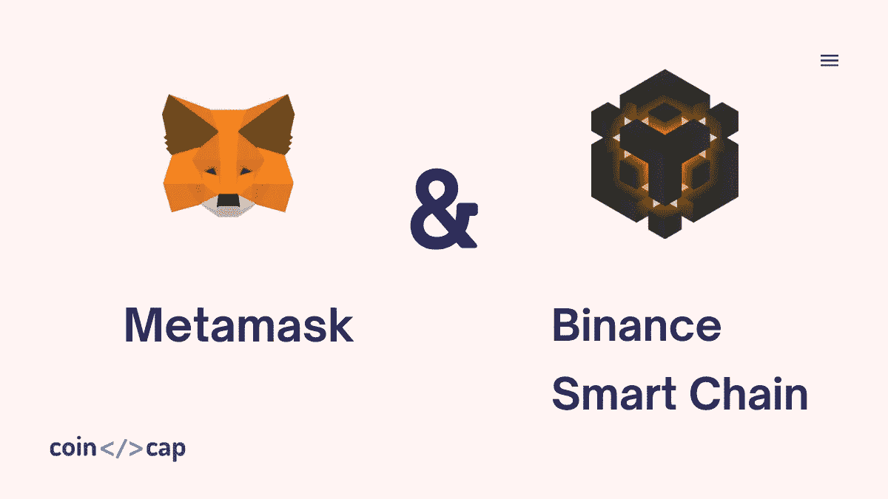

在本文中，我们将向您展示如何为[币安](https://blog.coincodecap.com/go/binance)智能链设置元掩码？在继续为[币安智能链](https://www.binance.org/en/smartChain) (BSC)设置[元掩码](https://metamask.io/download.html)的步骤之前，我想简单介绍一下元掩码和[币安](https://blog.coincodecap.com/go/binance)智能链(高级用户可以跳过这个)。

之后，我将讨论为[币安](https://blog.coincodecap.com/go/binance)智能链设置元掩码的步骤。最后，我还将分享将 BNB 从币安智能钱包(BSC 测试网络)转移到 MetaMask(BSC 测试网络)的步骤。

# 什么是 MetaMask？

没有[加密钱包](https://blog.coincodecap.com/tag/crypto-wallet)没人能发送基于加密货币的交易。钱包是一个平台或界面，允许用户存储私钥，并与多个公共分类帐进行交互，如[比特币](https://blog.coincodecap.com/a-candid-explanation-of-bitcoin)、以太坊。

MetaMask 是一个基于浏览器的插件，充当钱包，允许用户通过浏览器连接以太坊等区块链网络(他们也有移动应用程序)。通过 MetaMask，用户还可以与以太坊 [Dapps](https://blog.coincodecap.com/what-are-dapps-an-ultimate-guide) 进行交互。

# 什么是币安智能链(BSC)？

币安是一个快速安全的加密货币交易所。

币安智能链(BSC)是来自币安的区块链系统。BSC 遵循双链架构，允许用户在一个区块链上构建其分散的应用程序和数字资产，并在另一个上保持快速交易的优势。

BSC 使用赌注证明授权协议，任何用户都可以通过下注他们的 BNB 硬币来加入验证节点。在每次验证中，21 个节点将根据它们的利害关系选择作为验证者。

那么，我们来看看为 BSC 设置元掩码的步骤吧！

# 为币安智能链(BSC)设置元掩码的步骤

如果您已经创建了元掩码钱包，可以直接跳到步骤 2。

## 步骤 1-设置元掩码 wallet

**a.** 给 chrome 添加元掩码扩展([从此处添加](https://chrome.google.com/webstore/detail/metamask/nkbihfbeogaeaoehlefnkodbefgpgknn?hl=en))。

**b.** 在 chrome 工具栏上找到 MetaMask 标志，点击它。

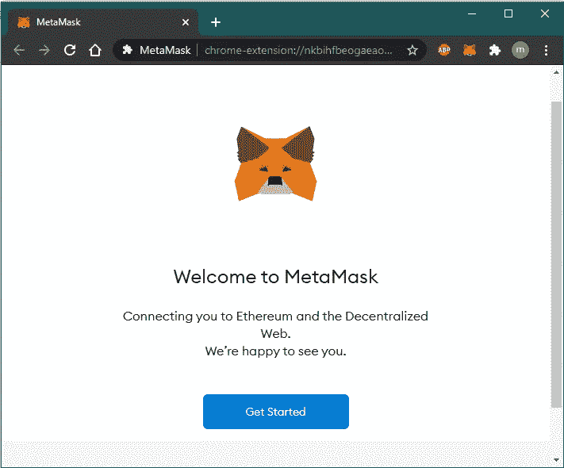

**c.** 点击“开始”

**d.** 点击“创建钱包”,您也可以导入现有的钱包(如果有的话)。

**e.** 现在，您将看到帮助我们改进元掩码页面。您可以决定是否要共享用户数据，如用户体验、带有元掩码的事件。我会说“我同意”

**f.** 接下来，它会要求设置访问钱包的密码。输入您选择的八个字符的密码，并同意条款&条件。点击“创建”

你会找到秘密备份短语。请将其保存到您的本地系统，以便稍后恢复您的帐户。点击“下一步”

**h.** 将机密短语的所有单词按原始顺序排列。点击“确认”

**一、**恭喜！！！您已经成功设置了 MetaMask 钱包。点击“全部完成”

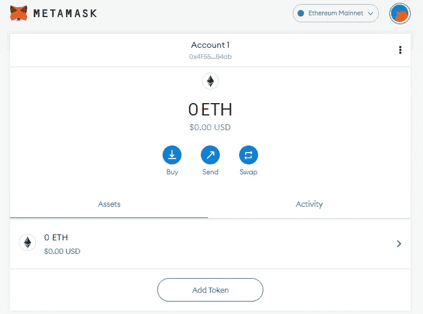

## 步骤 2-为 BSC Mainnet 设置元掩码。

**答:**点击右侧顶部的“账户简介”。

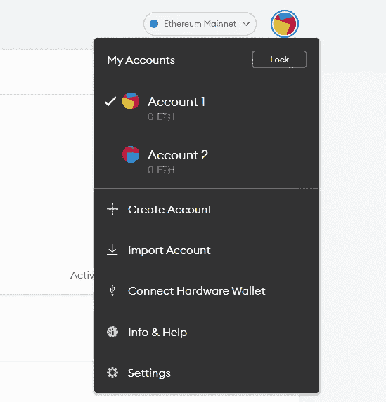

**b.** 点击“设置”

**c.** 转到“网络”

**d.** 点击“添加网络”

**e.** 输入详情添加“币安智能连锁 Mainnet”

**网络名称**:币安智能连锁

**新的 RPC URL**:[https://bsc-dataseed.binance.org/](https://bsc-dataseed.binance.org/)

**链条 ID** : 56

**货币符号** : BNB

**屏蔽浏览器网址**:【https://bscscan.com 

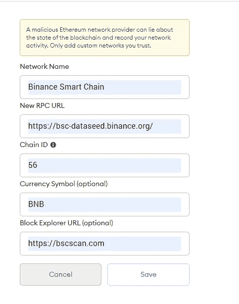

替代币安智能链 RPC URL:

*   [https://bsc-dataseed1.ninicoin.io/](https://bsc-dataseed1.ninicoin.io/)
*   [https://bsc-dataseed1.defibit.io/](https://bsc-dataseed1.defibit.io/)
*   [https://bsc-dataseed2.defibit.io/](https://bsc-dataseed2.defibit.io/)
*   [https://bsc-dataseed3.defibit.io/](https://bsc-dataseed3.defibit.io/)
*   [https://bsc-dataseed4.defibit.io/](https://bsc-dataseed4.defibit.io/)
*   [https://bsc-dataseed2.ninicoin.io/](https://bsc-dataseed2.ninicoin.io/)
*   https://bsc-dataseed3.ninicoin.io/
*   【https://bsc-dataseed4.ninicoin.io/ 
*   [https://bsc-dataseed1.binance.org/](https://bsc-dataseed1.binance.org/)
*   [https://bsc-dataseed2.binance.org/](https://bsc-dataseed2.binance.org/)
*   [https://bsc-dataseed3.binance.org/](https://bsc-dataseed3.binance.org/)
*   [https://bsc-dataseed4.binance.org/](https://bsc-dataseed4.binance.org/)

现在，单击网页左侧顶部的 MetaMask 徽标。你将能够看到 BNB 作为一种货币，如下所示。这里，我们完成了 BSC Mainnet 的元掩码设置。

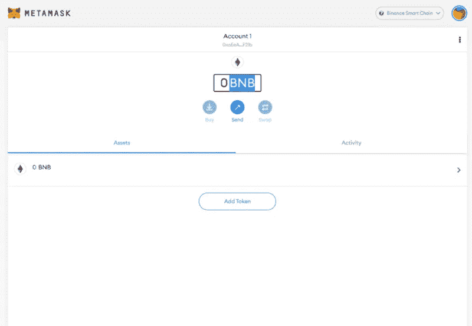

# 使用元掩码转移 BNB

现在，让我们通过将 **BSC Testnet** 添加到 MetaMask 并将 BNB 从币安智能钱包转移到 MetaMask 来看一个场景。

## 步骤 1 —为 BSC 测试网设置元掩码

**答:**点击右侧顶部的“账户资料”。

**b.** 点击“设置”

前往“网络”

**d.** 点击“添加网络”

**e.** 输入详情，添加如图所示的“币安智能链测试网”并保存。

**网名**:币安智能链测试

**新的 RPC URL**:[https://bsc-dataseed.binance.org/](https://bsc-dataseed.binance.org/)

**链条 ID** : 97

**货币符号** : BNB

**屏蔽浏览器网址**:[https://testnet.bscscan.com](https://testnet.bscscan.com)

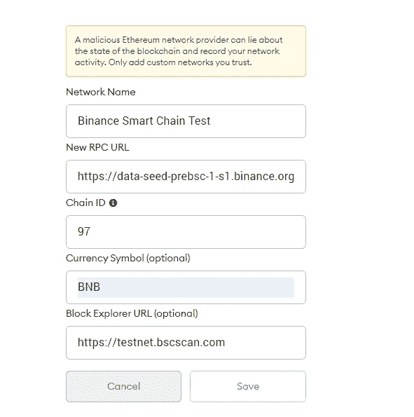

备选 BSC Testnet RPC URLs:

*   【https://data-seed-prebsc-2-s1.binance.org:8545/ 
*   [https://data-seed-prebsc-1-s2.binance.org:8545/](https://data-seed-prebsc-1-s2.binance.org:8545/)
*   [https://data-seed-prebsc-2-s2.binance.org:8545/](https://data-seed-prebsc-2-s2.binance.org:8545/)
*   [https://data-seed-prebsc-1-s3.binance.org:8545/](https://data-seed-prebsc-1-s3.binance.org:8545/)
*   https://data-seed-prebsc-2-s3.binance.org:8545/

这里，我们完成了 BSC Testnet 的元掩码设置。

## 步骤 2-设置币安链钱包

**答.**给 chrome 添加币安链钱包扩展([从此处添加](https://chrome.google.com/webstore/detail/binance-chain-wallet/fhbohimaelbohpjbbldcngcnapndodjp?hl=en))。

**b.** 在 chrome 工具栏上找到币安链钱包标志，点击它。

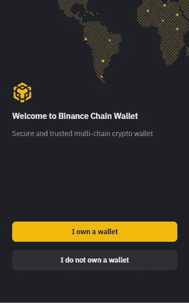

c. 点击“我没有钱包”

**d.** 接下来，它会要求设置访问钱包的密码。输入密码。点击“继续”

你会找到一个种子短语。“点击复制”并将其保存到您的本地系统，以便以后恢复您的帐户。点击“继续”

**f.** 通过为每个位置键入正确的单词来确认您的种子短语。

**g.** 您已经成功设置了您的币安链式钱包。

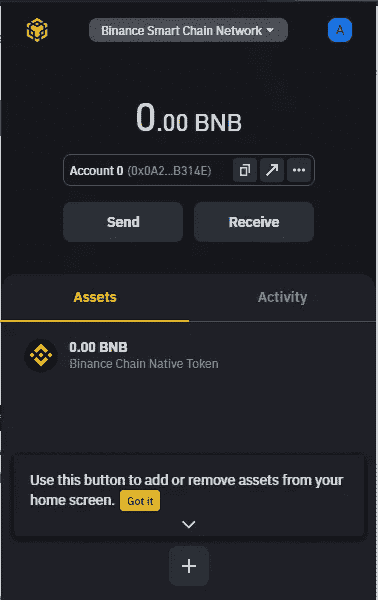

**h.** 出于测试目的，我们必须从币安智能链网络切换到币安智能链测试网络。

因此，点击顶部的“币安智能连锁网络”下拉菜单。选中“显示测试网络”并选择币安智能链测试网络。

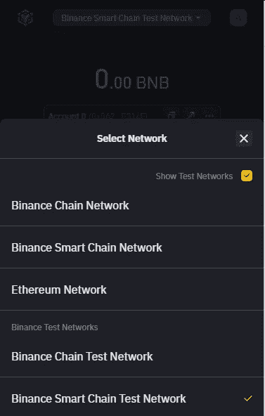

## 第 3 步-将 BNB 硬币添加到币安链钱包的 0 号账户进行测试

**a.** 从币安链家钱包复制一个账号 0 的地址。会像—0x0a 209 b 53 dab 5701d 751573118070 b 143 Bab 314 e

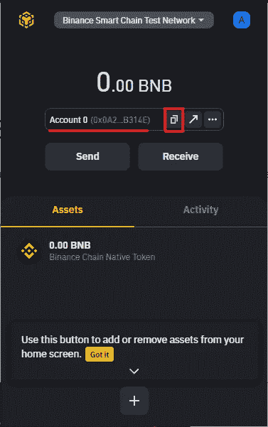

**b.** 去[币安智能连锁水龙头](https://testnet.binance.org/faucet-smart)。

**c.** 粘贴复制的地址，选择 6.25 BNBs 进行传输。

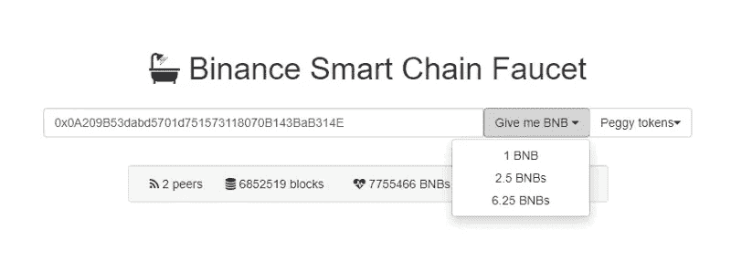

**d.** 前往币安智能钱包，查看账户 0 的 BNB 硬币余额和活动。

**现在，我们将 BNB 从币安智能钱包转移到元掩码地址。在这里，**

**发送方** —币安智能钱包账户 0

**收款方**—meta mask 钱包账户 1

## 步骤 4-将 BNB 从币安链钱包转移到 MetaMask

a.从元掩码复制帐户 1 的地址(接收者的)

**答:**转到 MetaMask。

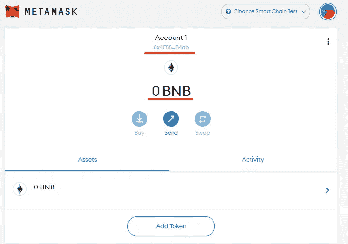

**b.** 注意账户 1 的余额(0 BNB)，复制账户 1 的地址。

为了前任。是 0x4f 5513 aee 82d 86b 313 ea 4464 f 208433 E3 ce 6b 4 ab

**c.** 现在进入币安智能钱包，选择账户 0。点击“发送”转移 BNB。

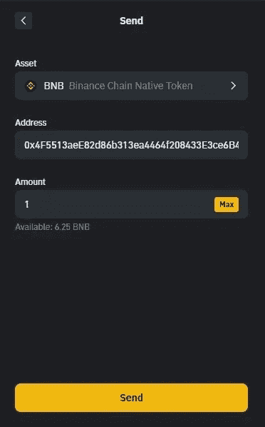

**b.** 粘贴复制的账户地址。

**c.** 输入金额 1(BNB)并点击“发送”

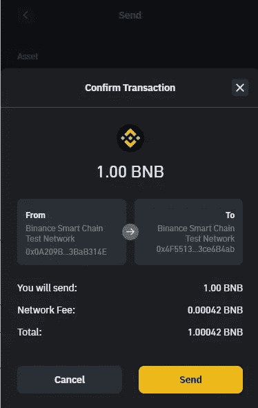

## 第 5 步—验证交易

**答:**转到 MetaMask。

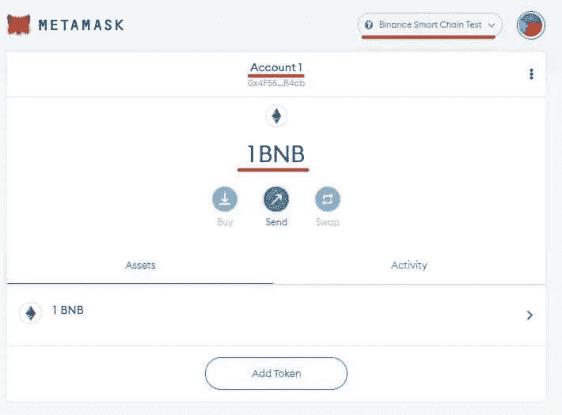

**b.** 验证，你在币安智能链测试网。检查帐户 1 的余额。这将是 1 BNB。以前是 0 BNB。

因此，我们成功地将 1 个 BNB 从币安智能钱包(测试网络)转移到 MetaMask 钱包(测试网络)。

让我们知道你对我们[电报频道](https://t.me/joinchat/Trz8jaxd6xEsBI4p)的文章的看法。

> 加入 coin monks[Telegram group](https://t.me/joinchat/EPmjKpNYwRMsBI4p)学习加密交易和投资

## 另外，阅读

*   什么是[闪贷](https://blog.coincodecap.com/what-are-flash-loans-on-ethereum)？
*   最好的[密码交易机器人](/coinmonks/crypto-trading-bot-c2ffce8acb2a) | [网格交易](https://blog.coincodecap.com/grid-trading)
*   [3 商业评论](/coinmonks/3commas-review-an-excellent-crypto-trading-bot-2020-1313a58bec92) | [Pionex 评论](/coinmonks/pionex-review-exchange-with-crypto-trading-bot-1e459d0191ea) | [Coinrule 评论](https://blog.coincodecap.com/coinrule-review-a-perfect-trading-bot)
*   [AAX 交易所评论](/coinmonks/aax-exchange-review-2021-67c5ea09330c) | [德里比特评论](/coinmonks/deribit-review-options-fees-apis-and-testnet-2ca16c4bbdb2) | [FTX 交易所评论](/coinmonks/ftx-crypto-exchange-review-53664ac1198f)
*   [n 零审核](/coinmonks/ngrave-zero-review-c465cf8307fc) | [Phemex 审核](/coinmonks/phemex-review-4cfba0b49e28) | [PrimeXBT 审核](/coinmonks/primexbt-review-88e0815be858)
*   [Bybit Exchange 审查](/coinmonks/bybit-exchange-review-dbd570019b71) | [Bityard 审查](https://blog.coincodecap.com/bityard-reivew) | [CoinSpot 审查](https://blog.coincodecap.com/coinspot-review)
*   [3 commas vs crypto hopper](/coinmonks/3commas-vs-pionex-vs-cryptohopper-best-crypto-bot-6a98d2baa203)|[赚取加密利息](/coinmonks/earn-crypto-interest-b10b810fdda3)
*   最好的比特币[硬件钱包](/coinmonks/the-best-cryptocurrency-hardware-wallets-of-2020-e28b1c124069?source=friends_link&sk=324dd9ff8556ab578d71e7ad7658ad7c) | [BitBox02 回顾](/coinmonks/bitbox02-review-your-swiss-bitcoin-hardware-wallet-c36c88fff29)
*   [莱杰 vs n rave](https://blog.coincodecap.com/ngrave-vs-ledger)|[莱杰 nano s vs x](https://blog.coincodecap.com/ledger-nano-s-vs-x)
*   [加密拷贝交易平台](/coinmonks/top-10-crypto-copy-trading-platforms-for-beginners-d0c37c7d698c) | [比特码拷贝交易](https://blog.coincodecap.com/bityard-copy-trading)
*   [Vauld Review](https://blog.coincodecap.com/vauld-review)|[you hodler Review](/coinmonks/youhodler-4-easy-ways-to-make-money-98969b9689f2)|[BlockFi Review](/coinmonks/blockfi-review-53096053c097)
*   最好的[加密税务软件](/coinmonks/best-crypto-tax-tool-for-my-money-72d4b430816b) | [硬币追踪评论](/coinmonks/cointracking-review-a-reliable-cryptocurrency-tax-software-5114e3eb5737)
*   最佳[加密借贷平台](/coinmonks/top-5-crypto-lending-platforms-in-2020-that-you-need-to-know-a1b675cec3fa) | [杠杆代币](/coinmonks/leveraged-token-3f5257808b22)
*   [莱杰纳米 S vs 特雷佐 one vs 特雷佐 T vs 莱杰纳米 X](https://blog.coincodecap.com/ledger-nano-s-vs-trezor-one-ledger-nano-x-trezor-t)
*   [block fi vs Celsius](/coinmonks/blockfi-vs-celsius-vs-hodlnaut-8a1cc8c26630)|[Hodlnaut Review](https://blog.coincodecap.com/hodlnaut-review)
*   [Bitsgap 审查](https://blog.coincodecap.com/bitsgap-review) | [Quadency 审查](/coinmonks/quadency-review-a-crypto-trading-automation-platform-3068eaa374e1) | [Bitbns 审查](https://blog.coincodecap.com/bitbns-review)
*   [埃利帕尔泰坦评论](/coinmonks/ellipal-titan-review-85e9071dd029) | [赛克斯斯通评论](https://blog.coincodecap.com/secux-stone-hardware-wallet-review)
*   [DEX Explorer](https://explorer.bitquery.io/ethereum/dex) | [本地比特币评论](https://blog.coincodecap.com/localbitcoins-review)
*   最佳[区块链分析](https://bitquery.io/blog/best-blockchain-analysis-tools-and-software)工具| [赚比特币](https://blog.coincodecap.com/earn-bitcoin)
*   [加密套利](/coinmonks/crypto-arbitrage-guide-how-to-make-money-as-a-beginner-62bfe5c868f6)指南| [如何做空比特币](https://blog.coincodecap.com/short-bitcoin)
*   最佳[加密制图工具](/coinmonks/what-are-the-best-charting-platforms-for-cryptocurrency-trading-85aade584d80) | [最佳加密交易所](/coinmonks/crypto-exchange-dd2f9d6f3769)
*   [如何在印度购买比特币](https://blog.coincodecap.com/buy-bitcoin-app-india)？
*   [印度比特币交易所](/coinmonks/bitcoin-exchange-in-india-7f1fe79715c9) | [比特币储蓄账户](https://blog.coincodecap.com/bitcoin-savings-account)
*   [尤霍德勒 vs 科恩洛 vs 霍德诺特](https://blog.coincodecap.com/youhodler-coinloan-hodlnaut)

> [直接在您的收件箱中获得最佳软件交易](/coinmonks/newsletters/coinmonks)

*原载于 2021 年 3 月 8 日 https://blog.coincodecap.com**[*。*](https://blog.coincodecap.com/metamask-for-binance-smart-chain)*