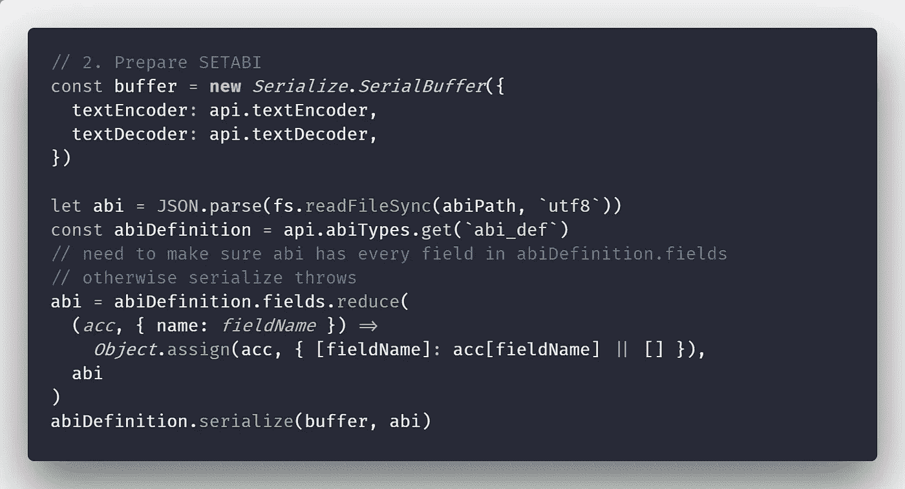

# 使用 EOS.js 部署 EOS 合同

> 原文：<https://medium.com/coinmonks/setcode-and-setabi-with-eos-js-dd83480ba234?source=collection_archive---------4----------------------->



这篇文章是关于使用 [eosjs](https://github.com/EOSIO/eosjs) 从 JavaScript 前端或节点后端以编程方式部署智能合约代码及其 ABI 的。

`eosio`系统契约的`setcode`动作接受`.wasm`文件作为十六进制字符串。要部署*代码*，我们需要做的就是将`.wasm`文件转换成十六进制字符串，然后调用动作。更困难的是调用`setabi`函数，因为它需要一个 ABI 的**打包二进制**表示。为此，我们需要[连载 ABI](https://github.com/EOSIO/eosjs/issues/421) 。

下面是使用`eosjs >= 20.0.0`的工作代码:

```
const fs = require(`fs`)
const path = require(`path`)
const { Serialize } = require(`eosjs`)
const { api } = require(`../config`)

function getDeployableFilesFromDir(dir) {
  const dirCont = fs.readdirSync(dir)
  const wasmFileName = dirCont.find(filePath => filePath.match(/.*\.(wasm)$/gi))
  const abiFileName = dirCont.find(filePath => filePath.match(/.*\.(abi)$/gi))
  if (!wasmFileName) throw new Error(`Cannot find a ".wasm file" in ${dir}`)
  if (!abiFileName) throw new Error(`Cannot find an ".abi file" in ${dir}`)
  return {
    wasmPath: path.join(dir, wasmFileName),
    abiPath: path.join(dir, abiFileName),
  }
}

async function deployContract({ account, contractDir }) {
  const { wasmPath, abiPath } = getDeployableFilesFromDir(contractDir)

  // 1\. Prepare SETCODE
  // read the file and make a hex string out of it
  const wasm = fs.readFileSync(wasmPath).toString(`hex`)

  // 2\. Prepare SETABI
  const buffer = new Serialize.SerialBuffer({
    textEncoder: api.textEncoder,
    textDecoder: api.textDecoder,
  })

  let abi = JSON.parse(fs.readFileSync(abiPath, `utf8`))
  const abiDefinition = api.abiTypes.get(`abi_def`)
  // need to make sure abi has every field in abiDefinition.fields
  // otherwise serialize throws
  abi = abiDefinition.fields.reduce(
    (acc, { name: fieldName }) =>
      Object.assign(acc, { [fieldName]: acc[fieldName] || [] }),
    abi
  )
  abiDefinition.serialize(buffer, abi)

  // 3\. Send transaction with both setcode and setabi actions
  const result = await api.transact(
    {
      actions: [
        {
          account: 'eosio',
          name: 'setcode',
          authorization: [
            {
              actor: account,
              permission: 'active',
            },
          ],
          data: {
            account: account,
            vmtype: 0,
            vmversion: 0,
            code: wasm,
          },
        },
        {
          account: 'eosio',
          name: 'setabi',
          authorization: [
            {
              actor: account,
              permission: 'active',
            },
          ],
          data: {
            account: account,
            abi: Buffer.from(buffer.asUint8Array()).toString(`hex`),
          },
        },
      ],
    },
    {
      blocksBehind: 3,
      expireSeconds: 30,
    }
  )
}
```

请注意，在将 JS ABI 对象转换为原始 ABI 时，我们如何利用 eosjs 的`api`对象的一些内部字段，如`api.abiTypes.get(`abi_def`)`。下面是如何在`eosjs`中创建`api`对象并为本地 EOS 网络进行配置的:

```
// config.js
const { Api, JsonRpc, JsSignatureProvider } = require(`eosjs`)
const fetch = require(`node-fetch`) // node only; not needed in browsers
const { TextEncoder, TextDecoder } = require(`util`) // node only; native TextEncoder/Decoder

const signatureProvider = new JsSignatureProvider([
    `5KQwrPbwdL6PhXujxW37FSSQZ1JiwsST4cqQzDeyXtP79zkvFD3`,
    /* other private keys for your contract account */,
])
const rpc = new JsonRpc(`http://127.0.0.1:7777`, { fetch })
const api = new Api({
    rpc,
    signatureProvider,
    textDecoder: new TextDecoder(),
    textEncoder: new TextEncoder(),
})

module.exports = {
    api,
}
```

现在，您只需要用合同帐户名调用`deployContract`函数，并配置`signatureProvider`以包含该帐户的私有密钥用于`active`权限:

```
deployContract({ account: `test`, contractDir: `./contract` })
```

最初发表于 [cmichel.io](https://cmichel.io/setcode-and-setabi-with-eos-js/)

> [直接在您的收件箱中获得最佳软件交易](https://coincodecap.com/?utm_source=coinmonks)

[](https://coincodecap.com/?utm_source=coinmonks)