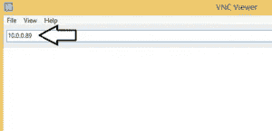
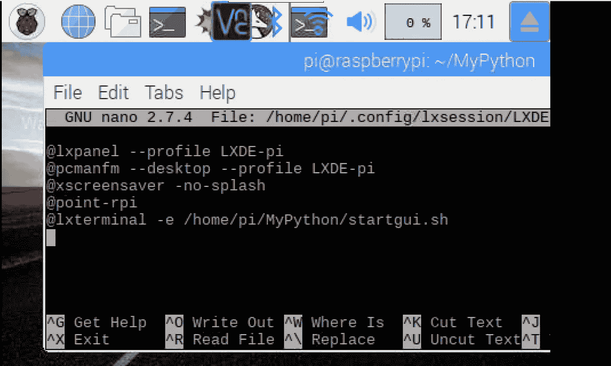

# 搭建“闪电椅”——第 1 部分

> 原文：<https://medium.com/coinmonks/setting-up-a-lightning-chair-part-1-e4b12d3f918b?source=collection_archive---------7----------------------->


在这个由两部分组成的系列文章中，我将描述如何设置一个可以显示比特币闪电支付请求二维码的设备，并在支付后打开连接设备的电源。我会将控制器连接到按摩椅上，这样就可以在公共场所或 Airbnb 上使用。

**先决条件**

*   比特币全节点(比特币-qt 或 bitcoind)
*   淋巴结

一个例子设置见我以前的教程[这里](/@martinschrer/installing-a-mainnet-lnd-node-on-windows-and-accessing-it-on-an-iphone-da1e63a613cb)。

**所用材料(针对本部分教程)**

*   树莓派 3B+(约 40 美元)
*   3.5 英寸液晶显示屏，例如[这款](https://www.aliexpress.com/item/Best-Price-Original-3-5-LCD-TFT-Touch-Screen-Display-for-Raspberry-Pi-2-Model-B/32508151978.html?spm=a2g0s.9042311.0.0.689b4c4dgh1DLE)(17 美元)

## **设置树莓派**

根据屏幕的说明手册将 LCD 屏幕连接到树莓，然后使用屏幕附带的操作系统启动树莓 Pi。

从菜单栏打开一个 shell，然后键入:

```
sudo raspi-config
```

转到网络选项。将 SSID 设置为 WIFI 网络，然后将密码设置为 WIFI 密码。

接下来，转到接口选项。然后选择“VNC”，启用 VNC

使用以下命令重新启动覆盆子:

```
sudo reboot
```

接下来，我们需要在您想要访问 Pi 的计算机上安装 RealVNC Viewer。在此下载 RealVNC 查看器[并打开。exe 文件。这是一个可移植的应用程序，所以你不需要安装它:](https://www.realvnc.com/download/viewer/)


如果您知道您的 Pi 的 IP 地址，请将其输入到窗口顶部的地址栏中。如果不知道，可以用[高级 IP 扫描器](http://www.advanced-ip-scanner.com/index.php)找到。



现在按 Enter 键，系统会提示您输入 Pi 的用户名和密码。输入 pi 和 raspberry(如果您没有更改默认凭据)。


如果这是第一次使用 RealVNC 连接到 Pi，您将得到一个安全警告。只需按下“继续”即可跳过它:


Raspbian 桌面将在 VNC 浏览器窗口中以非常低的分辨率打开:


打开终端窗口，输入以下命令:

```
mkdir MyPythoncd /home/pi/MyPythonpython3 -m venv lndsource lnd/bin/activate
```

您的命令行现在应该带有前缀

```
(lnd) pi@raspberrypi:~/MyPython $
```

接下来输入以下命令来安装缺失的软件包(这可能需要一段时间):

```
pip install googlesudo pip install --upgrade google-cloud-pubsubsudo pip install --upgrade oauth2clientpip install grpcio grpcio-tools googleapis-common-protosgit clone [https://github.com/googleapis/googleapis.git](https://github.com/googleapis/googleapis.git)curl -o rpc.proto -s [https://raw.githubusercontent.com/lightningnetwork/lnd/master/lnrpc/rpc.proto](https://raw.githubusercontent.com/lightningnetwork/lnd/master/lnrpc/rpc.proto)python -m grpc_tools.protoc --proto_path=googleapis:. --python_out=. --grpc_python_out=. rpc.protopip install guizeropip install pyqrcodepip install pypngpip install RPi.GPIOnano ~/.config/lxsession/LXDE-pi/autostart
```

最后一个命令在 nano 文本编辑器中打开自动启动文件。在底部添加以下一行:

```
[@lxterminal](http://twitter.com/lxterminal) -e /home/pi/MyPython/startgui.sh
```

自动启动文件的内容应该如下所示:



按 Control+O，然后按 enter。然后按 Control+X。

```
nano ~/MyPython/startgui.sh
```

输入以下文本:

```
#!/bin/bash
source /home/pi/MyPython/lnd/bin/activate
cd /home/pi/MyPython
python /home/pi/MyPython/control.py
```

按 Control+O，然后按 enter。然后按 Control+X。

然后输入:

```
chmod +x startgui.sh
```

接下来，从 Github 下载 Python 控制代码 [control.py](https://github.com/toxonaut/LightningChair/blob/master/control.py) 。将其转移到文件夹/home/pi/MyPython/

将 admin.macaroon 和 tls.cert 文件从 PC 复制到 raspberry 的~/MyPython/lnd 文件夹中

复制一张自己喜欢的 jpg 格式的图片说“付费”或者类似于这个位置~/MyPython/。名字应该是 paid.jpg。

然后你可以重启树莓。如果一切安装正确，过一会儿屏幕上会显示一个二维码。

[**本教程的第二部分**](/@martinschrer/setting-up-a-lightning-chair-part-2-318ffe10dc40) 将展示如何将树莓包装在定制的盒子中，以及如何安装连接的电子设备。

[](http://bit.ly/2G71Sp7)

> [直接在您的收件箱中获得最佳软件交易](https://coincodecap.com/?utm_source=coinmonks)

[](https://coincodecap.com/?utm_source=coinmonks)