# 搭建“闪电椅”——第二部分

> 原文：<https://medium.com/coinmonks/setting-up-a-lightning-chair-part-2-318ffe10dc40?source=collection_archive---------6----------------------->

[在上一部分](/coinmonks/setting-up-a-lightning-chair-part-1-e4b12d3f918b)中，我已经描述了如何设置一个带有 3.5 英寸 LCD 屏幕的 Raspberry Pi 来运行一个显示闪电二维码的程序，并可以检测(和反应)支付。在这篇文章中，我将展示我如何设计和 3D 打印树莓的外壳，以及我如何将电子设备与按摩椅连接起来。

1.  **设计案例**

作为一个 3D 设计和 3D 打印的初学者，我必须首先了解哪些程序常用于设计 3D 模型。在测试了几个程序后，我决定使用 Autodesk Fusion 360，它可以免费使用，使用起来非常直观。

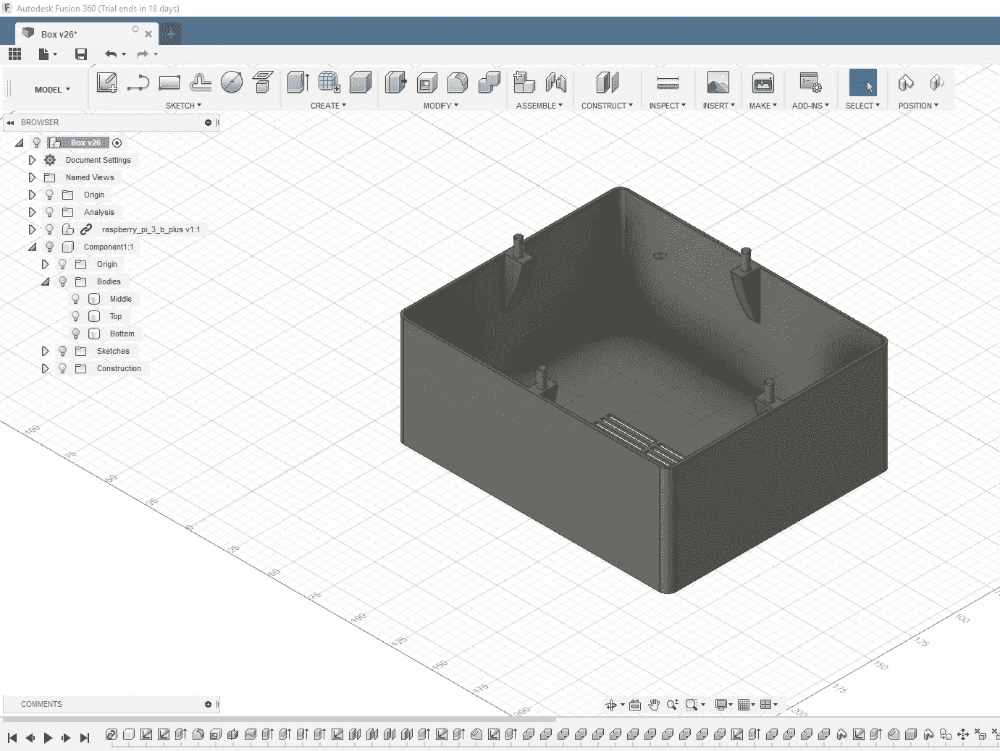

Lower part for placing power supply and relay

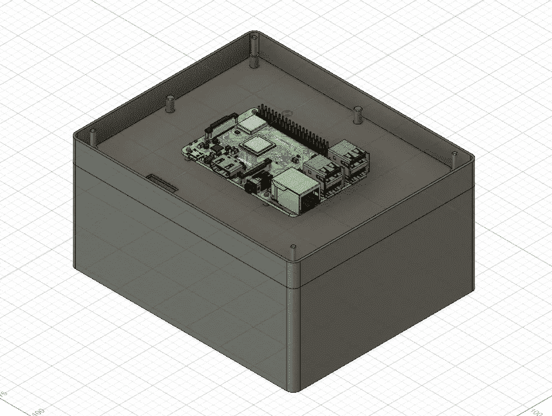

Middle part holding the Raspberry Pi

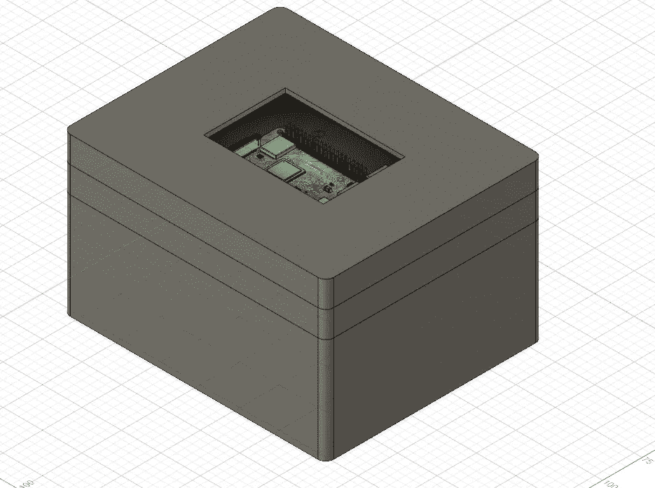

Top part with hole for LCD screen

我找到了一个树莓 Pi 3+的 3D 模型，并围绕这个模型建立了一个包含小别针的盒子，以放置它。我还试验了一些针和空心管，使外壳的三个部分装配在一起。由于我没有 3D 打印的经验，我不知道这是否可行。

**2。3D 打印**

将 3D 模型作为三个个体发送后。stl 文件到印刷服务，4 天后我收到了以下回复:

总的来说，三个部分都很好，只有中间部分的小别针设计得太薄，很容易折断。因此，我不得不把顶部粘在中间。下半部分的插脚正好插入中间部分的孔中，不用胶水就能粘住。

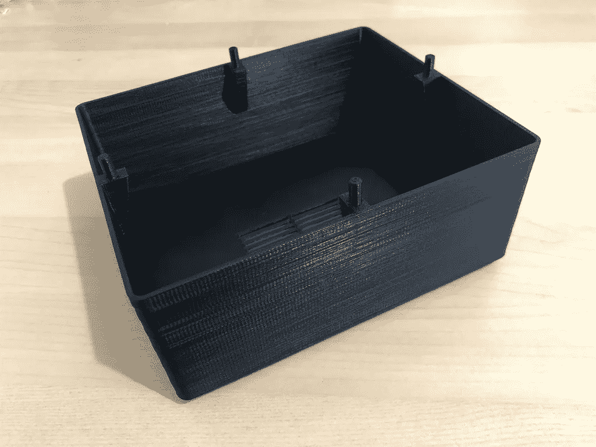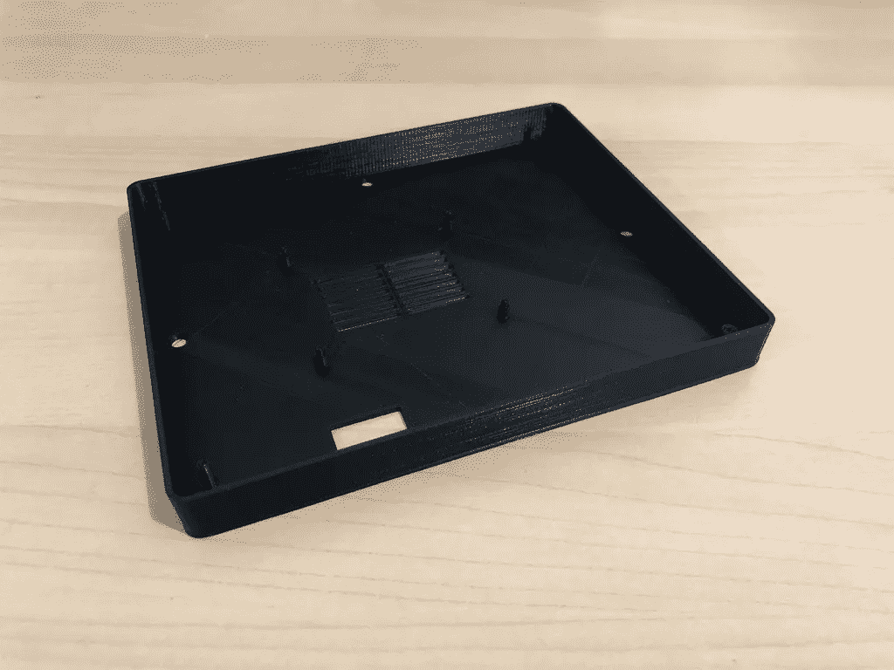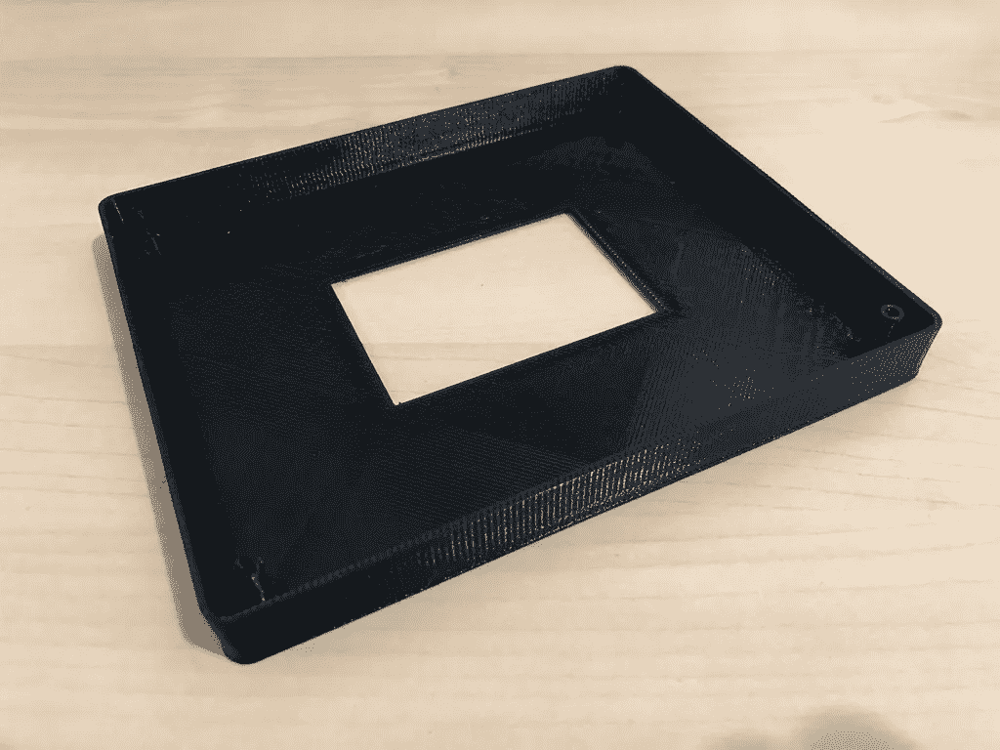

**3。连接一切**

为了能够打开和关闭按摩椅的电源，树莓皮需要控制一个继电器。继电器必须通过 3 根电缆连接至标有 GND、VCC 和 SIG 的引脚，连接至 Pi，如下所示:

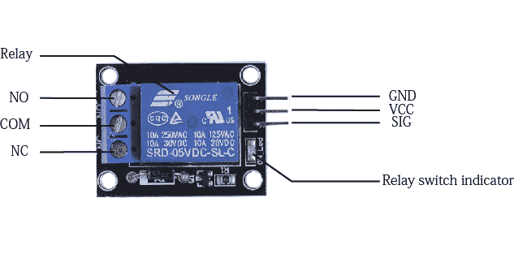

由于 LCD 显示器通过粘贴到一些 GPIO 引脚而连接到 Raspberry Pi，因此继电器必须连接到未被 LCD 屏幕遮挡的引脚。

引脚 39(地)连接到 GND，引脚 40 (GPIO 29)连接到 SIG，引脚 17 (3.3V 电源)连接到 VCC。

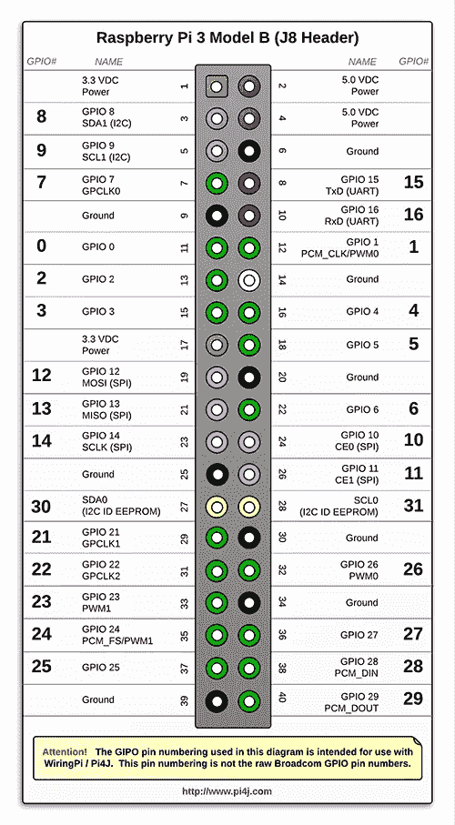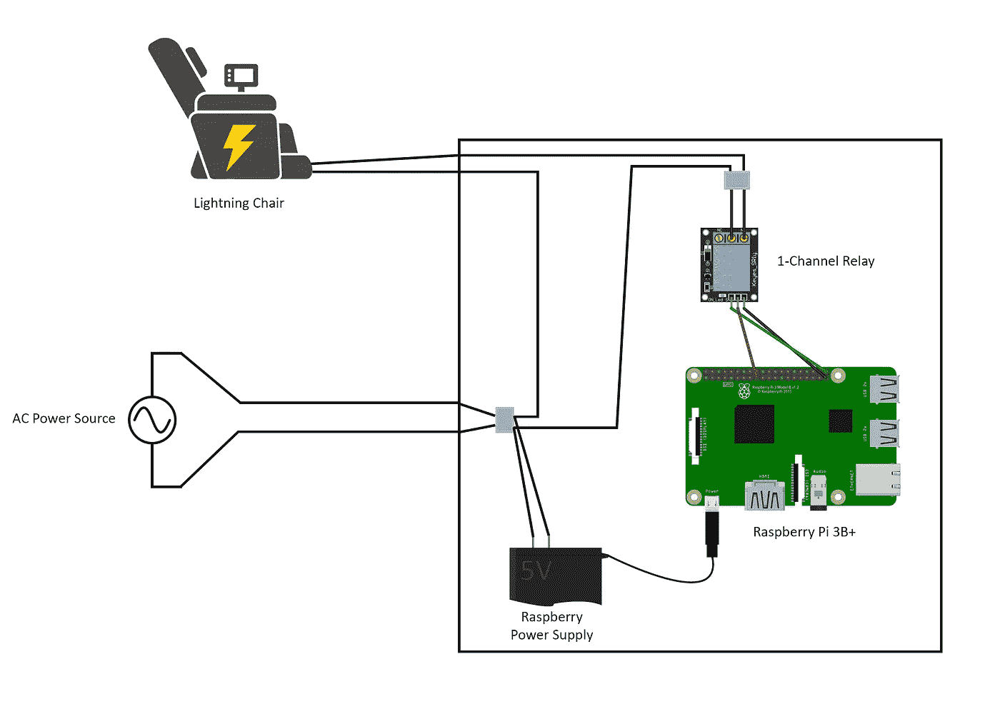

椅子的主电源被布线，以便一端直接连接到那里，另一端被继电器中断(连接到 COM 和两个 NO 连接中的一个)。

警告:我不精通电子，所以这可能是不安全的。风险自担(或做得更好)，不要在通电时工作。

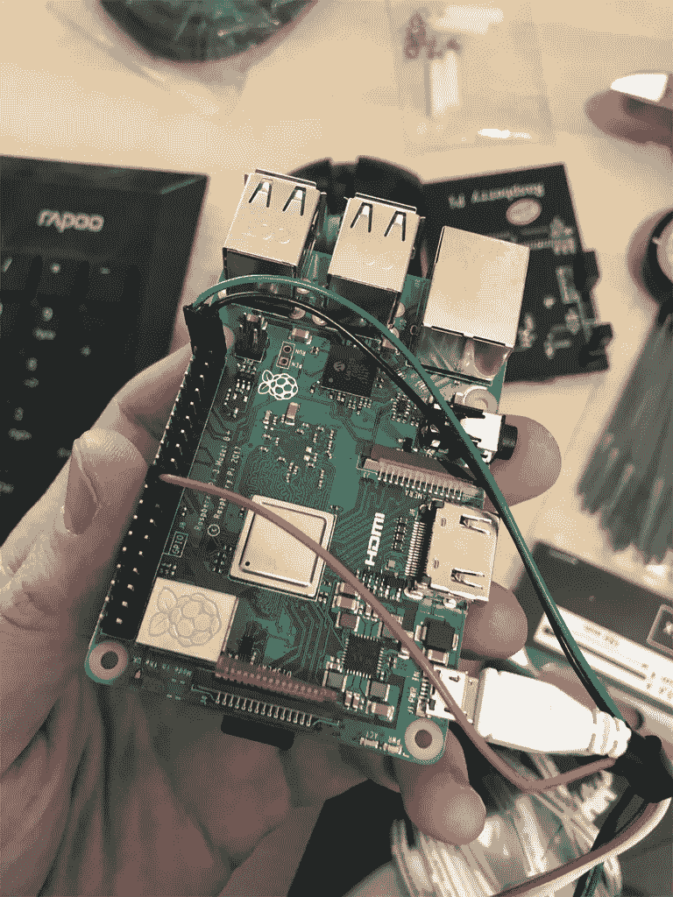

连接引脚电缆后，LCD 屏幕被粘在 Pi 上:

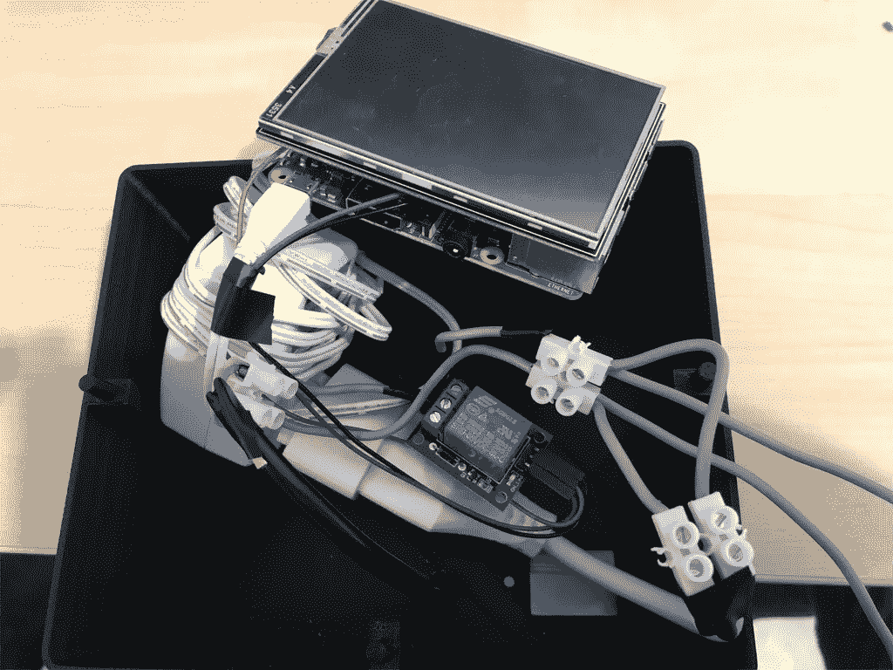

在小心翼翼地把所有乱七八糟的东西扔进箱子，合上箱子，然后把它连接到按摩椅上之后，我得到了这个美丽的东西:

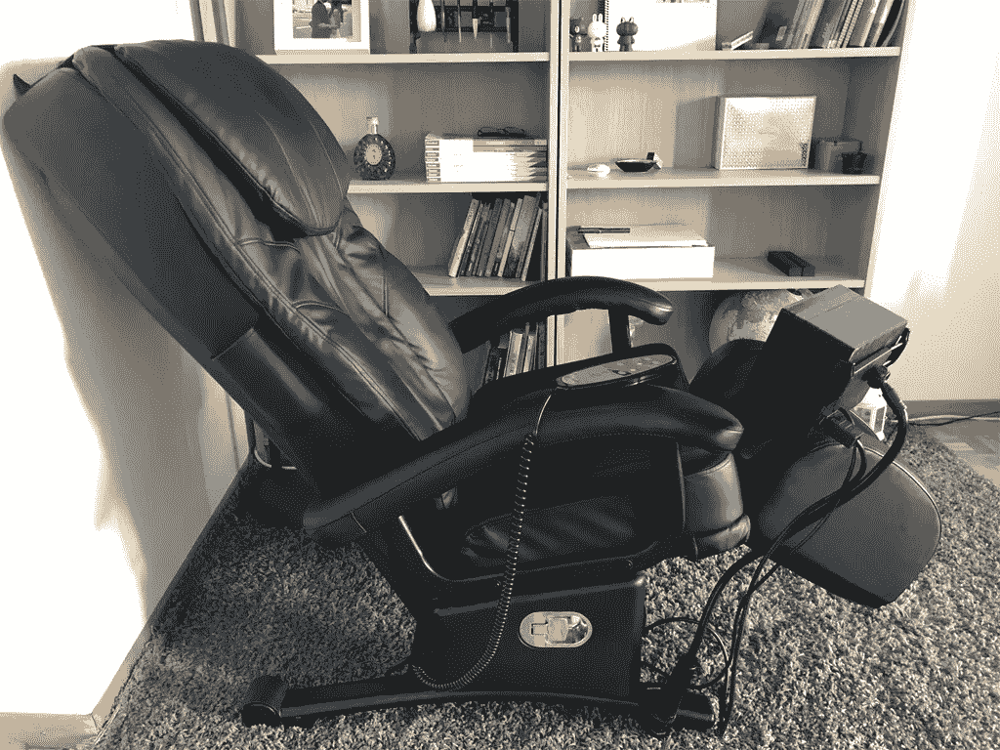

带有覆盆子的盒子被安装在一个普通的平板支架上，并连接到椅子的底座上。

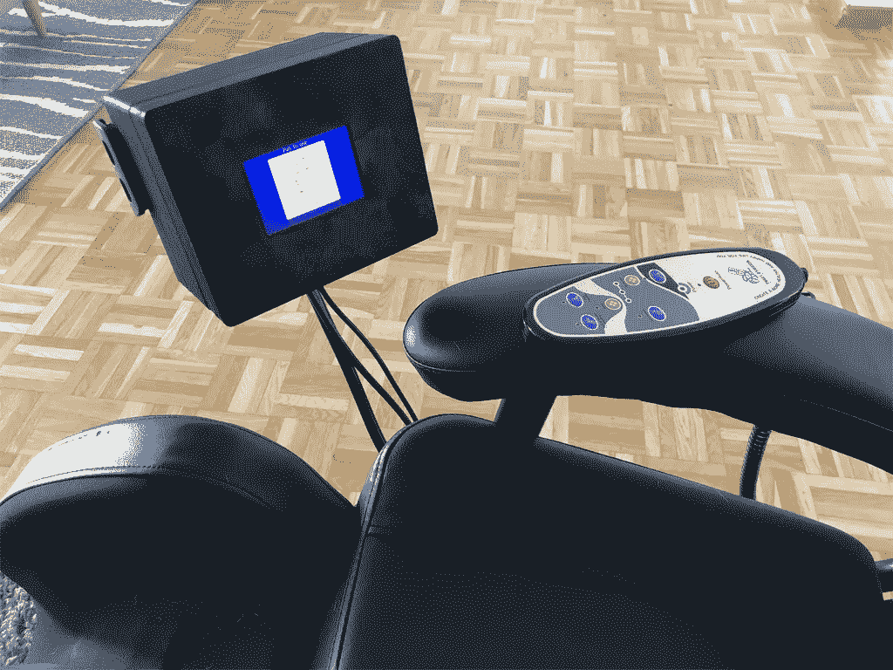

下面的视频展示了椅子的使用过程:

> [直接在您的收件箱中获得最佳软件交易](https://coincodecap.com/?utm_source=coinmonks)

