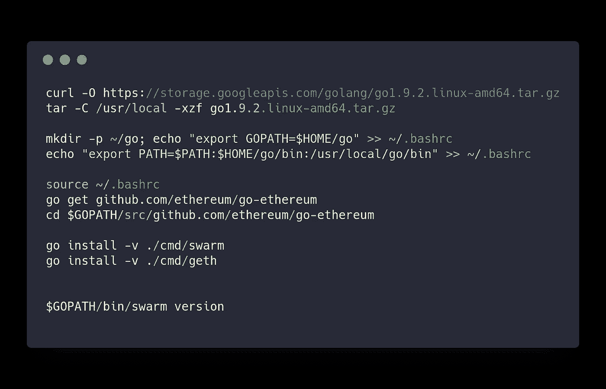
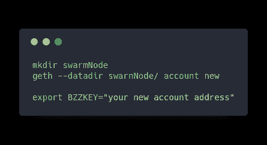
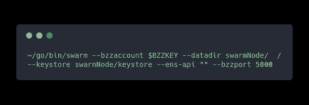
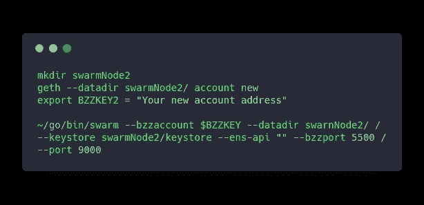
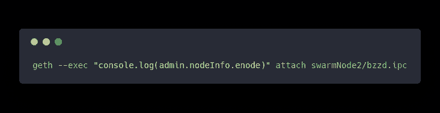
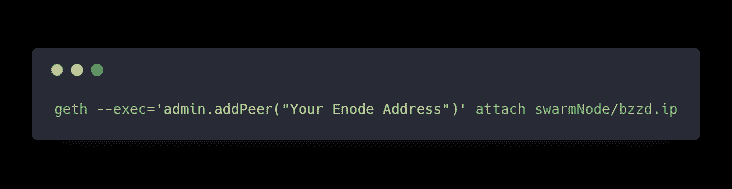
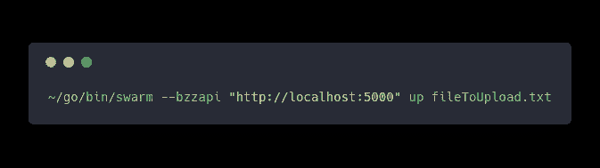
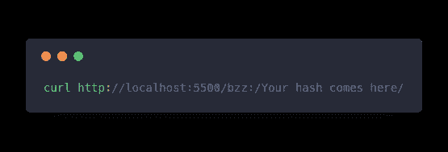

# 建立一个没有区块链的多节点私有以太群网络

> 原文：<https://medium.com/coinmonks/setting-up-a-multi-node-private-ethereum-swarm-network-without-a-blockchain-e3fd55873887?source=collection_archive---------3----------------------->

“Fans and wires on the back of a computer server” by [Thomas Kvistholt](https://unsplash.com/@freeche?utm_source=medium&utm_medium=referral) on [Unsplash](https://unsplash.com?utm_source=medium&utm_medium=referral)

在浏览完 [swarm 的](http://swarm-guide.readthedocs.io/en/latest/introduction.html)之后，我发现多节点 swarm 网络的设置令人困惑，所以我写这篇文章来帮助那些可能正在考虑开发一个的人。

## 以太坊群是什么？

以太坊群是一个点对点的文件存储系统，允许用户数据的分布式和加密存储。类似于 [Bittorrent](https://en.wikipedia.org/wiki/BitTorrent) 如何存储文件或者 [IPFS](https://ipfs.io/) 如何存储文件。由于区块链上的数据存储非常昂贵，所以正在开发这种技术。swarm 与众不同的一点是，它将在不久的将来鼓励用户存储其他人的数据。类似于 Filecoin 在不久的将来会怎样。虽然 swarm 的激励层还没有最终确定

这个定义是对 swarm 的一个非常简短的介绍，请阅读下面的参考资料以了解更多信息

 [## Swarm alpha 公共试验和 Swarm - Ethereum 博客的基础

### 随着期待已久的 geth 1.5(“让蜜蜂发光”)的发布，Swarm 成为了官方的 go-ethereum 发布版…

blog.ethereum.org](https://blog.ethereum.org/2016/12/15/swarm-alpha-public-pilot-basics-swarm/)  [## 简介- swarm 0.2rc5 文档

### 从最终用户的角度来看，Swarm 与 WWW 没有太大的不同，除了上传不是针对特定的…

虫群指南](http://swarm-guide.readthedocs.io/en/latest/introduction.html) 

## 安装群

你可以在这里找到详细的安装说明,但是我会给你一些与 linux 相关的说明，因为如果你不注意的话，这是一个会引起麻烦的小问题:)

## 组建群体专用网络

即使要运行 swarm，你也需要创建/使用一个以太坊账号，这样你就可以将账号密钥传递给你将要运行的 swarm 节点。

我们将创建一个新的 geth 节点，并在 in 中创建一个帐户。然后将给定的键导出到一个环境变量中，供以后使用。请确保您已经安装了[geth](https://github.com/ethereum/go-ethereum/wiki/Installing-Geth)。

现在用下面的命令启动 swarm 节点。之后我会解释每面旗的含义

*   **bzza account**:在这里您可以设置上传到 bzza account 的密钥。
*   数据目录:你的群节点将存储数据的目录
*   **keystore:** 存储您的密钥的目录。这样 swarm 就可以使用你设置的账户密码来解锁你 bzzaccount 的私钥。
*   ens-api :将此项设置为" " swarm 将不会连接到您的区块链，没有它也不会运行。
*   **bzzport** :你设置的端口，可以用来上传和下载群节点。

这就是运行单个节点所需的全部内容，但是两个节点运行多个节点时，您需要执行以下操作。

**设置更多的群节点**

现在，如果您像以前一样运行相同的命令，但认为只需更改 bzzport 就可以了。事实并非如此。您还需要更改文档中没有提到的 UDP 端口。如果您不这样做，那么您将得到以下错误。

> 致命错误:启动协议栈时出错:监听 udp :30399:绑定:地址已在使用中

这是我困惑的主要原因，也是我写这篇文章的原因。

因此，为了运行第二个节点，您需要运行以下命令。

## 连接 Swarn 节点

现在，即使节点正在运行，您也需要将它们连接在一起，以便它们能够相互通信。

为此，您可以手动将一个群节点的 bootnode 连接到另一个群节点的 IPC。下面我们将把 swarnNode2 的 bootnode 连接到 swarnNode 的 IPC。

首先找到 swarnNode2 的 bootnode 地址。运行以下命令。

复制结果并添加到以下命令中，以将两个节点连接在一起。

## 测试网络连接

现在测试这两个节点是否连接。您可以通过 bzzport 使用以下命令将文件上传到第一个节点。你会得到一个类似 url 的文件散列。

现在复制提供的散列，并使用第二个节点的 bzzport 查询文件。

现在，这应该会输出您的 txt 文件，并确认您的两个节点都已连接。就是这样:)

请查看 [swarm 的](http://swarm-guide.readthedocs.io/en/latest/)文档了解更多细节。

***感谢阅读！***