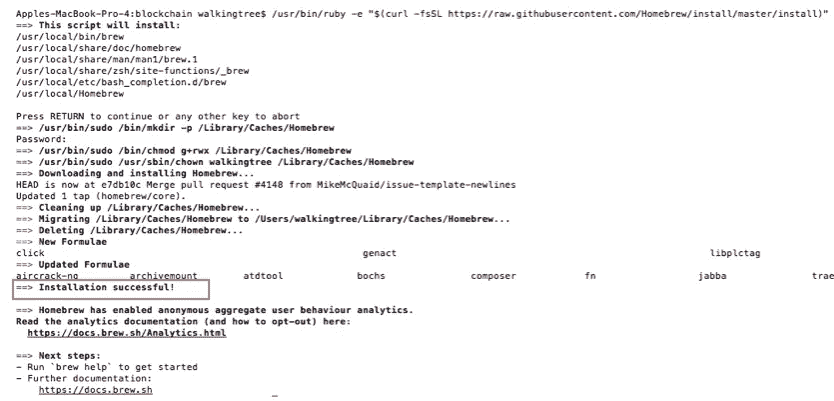

# 在 MacOS 上设置以太坊开发环境

> 原文：<https://medium.com/coinmonks/setting-up-ethereum-development-environment-on-macos-22c96a136ac4?source=collection_archive---------0----------------------->

以太坊是区块链流行的去中心化平台。作为本文的一部分，您将了解如何在 macOS 平台上设置以太坊。

# 先决条件

对区块链和以太坊的基本理解，即以太坊是什么&为什么？

> [发现并回顾最佳以太坊开发工具](https://coincodecap.com/category/blockchain-node-and-api)

# 工具箱

以太坊开发生态系统包括以下工具列表。

*   **家酿:**家酿是 macOS 的软件包管理器。它可以帮助你安装苹果没有提供的包
*   **XCode 命令行工具:**安装 HomeBrew 之前需要安装 XCode。我们需要 Xcode 命令行工具，包括编译器，家酿执行其活动所需的实用程序
*   **Go-以太坊:** Geth 或 Go-以太坊是一个命令行界面，允许你运行和操作以太坊节点。Geth 在 Go 中实现。它允许您执行以下功能:
*   开采区块
*   生成醚
*   创建和管理帐户
*   部署智能合约并与之交互
*   转移资金
*   检查块历史
*   连接到公共以太网(mainnet)或创建自己的专用网络
*   Ganache: Ganache 是一个以太坊区块链仿真器，您可以将其用于开发目的。为了替换 testRPC，您可以使用 Ganache。
*   **NodeJS 和 NPM:** NodeJS 是一个服务器端 JavaScript 平台，用于创建有助于与以太坊节点通信的应用程序。
*   **Truffle:** Truffle 是一个构建框架，用于编译、测试和部署您的智能合约。它有助于加快开发生命周期
*   要编写您的智能合同，请安装 Atom(您可以使用您喜欢的文本编辑器)

# 在 Mac OS 上设置/安装以太坊的步骤

## 步骤 1:安装自制软件

*   要安装自制软件，打开[https://brew.sh/](https://brew.sh/)
*   复制如下图所示的命令

*   打开终端并粘贴命令，然后输入

> /usr/bin/ruby-e " $(curl-fsSL https://raw . githubusercontent . com/home brew/install/master/install)"

*   成功安装后，您应该能够在终端中看到以下消息:

*   检查版本的家酿安装类型下面的命令，在标准，它将只安装最新版本。

> brew —版本

## 步骤 2: XCode 安装

*   打开 Mac app store 并搜索 XCode
*   点击列表中的 Xcode 搜索项，然后点击安装
*   如果它已经安装在您的机器上，然后更新或跳过这一步
*   安装后，接受许可条款

*   若要安装 Xcode 命令行工具，请运行以下命令，

> xcode-选择—安装

## 第三步:安装 go-以太坊

*   现在安装以太坊让我们使用上一步安装的自制软件
*   使用以下命令将自制软件连接到提供 Geth(即更新自制软件的软件包目录)的存储库，

> brew 更新

*   家酿更新后，使用以下命令将以太坊包添加到目录中，

> 酿造龙头以太坊/以太坊

*   现在我们准备用自制软件安装以太坊。使用以下命令安装，

> brew 安装以太坊

*   如果以太坊已经安装在你的机器上，那么只需使用下面的命令将其升级到最新版本，

> brew 升级以太坊

## 步骤 4:安装 Ganache

*   要下载 Ganache 框架，请在浏览器中打开下面的链接，

[http://truffleframework.com/ganache/](http://truffleframework.com/ganache/)

*   为 macOS 下载 Ganache
*   像安装其他 mac 软件一样安装它
*   发射它

## 步骤 5:安装 NodeJS 和 NPM

*   如果您已经安装了最新版本，则跳过此步骤，或者如果您有旧版本，则计划将其更新到最新版本。
*   要安装 NodeJS，请使用以下命令，

> brew 安装节点

*   要检查下面命令安装类型版本，
*   对于节点，使用以下命令

> 节点 v

*   对于 NPM，使用以下命令

> npm -v

## 第六步:放入松露

*   如果你已经安装了 Truffle，并且它不是最新的，那么我会建议删除它以避免任何问题，使用下面的命令从你的机器中删除 Truffle。

> npm 卸载-g 松露

*   现在要安装 Truffle，使用下面的命令，

> npm 安装-f 块菌

## 步骤 7:安装 Atom

*   要安装 Atom 文本编辑器，请在浏览器中打开以下 url

https://github.com/atom/atom

*   进入**发布**，下载 Mac 可安装文件 **— atom-mac.zip**
*   提取文件并像安装其他 Mac 软件一样安装它
*   打开已安装的 Atom，从菜单中点击—“**安装 Shell 命令**
*   现在打开终端，键入下面的命令，在 Atom 中安装扩展，以获得可靠性支持

> apm 安装语言-以太坊

**恭喜恭喜！**您的以太坊设置已经完成，可以使用了。

**现在，为了验证设置是否有效，让我们进行一些资金转账并检查余额，**

*   打开终端，用任意名称创建一个目录

> mkdir < name of directory >

例如:马克迪尔·区块链

*   现在改变目录

> cd 区块链

*   现在使用下面的命令创建 truffle 项目

> 块菌初始化

*   完成上述语句后，您应该能够看到下面的文件结构，
*   truffle.js — Truffle 配置文件
*   测试—用于测试应用程序和合同的测试文件的目录
*   迁移—可编写脚本的部署文件的目录
*   合同——可靠性合同目录
*   要使用开发帐户，请使用以下命令，

> 块菌发育

*   执行上述命令后，你会看到 truffle 创建了 10 个默认账户，每个账户的初始余额为 100 乙醚

*   现在让我们检查一下第一个账户的余额

第一个帐户地址–

**0x 627306090 abab 3 a6 e 1400 e 9345 BC 60 c 78 A8 bef 57**

第二个帐户地址–

**0 xf 17 f 52151 ebef 6 c 7334 fad 080 c 5704d 77216 b 732**

使用 web3 api 检查余额，如下所示

**第一笔账**

> web 3 . from Wei(web 3 . eth . get balance(' 0x 627306090 abab 3 a6 e 1400 e 9345 BC 60 c 78 A8 bef 57 ')，' ether ')。toNumber()

**第二笔账**

> web 3 . from Wei(web 3 . eth . get balance(' 0x f17 f 52151 ebe F6 c 7334 fad 080 c 5704d 77216 b 732 ')，' ether ')。toNumber()

*   现在，让我们使用下面的命令将 1 个以太网从帐户 1 转移到帐户 2，

> EB 3 . eth . send transaction({ from:' 0x 627306090 abab 3 a6 e 1400 e 9345 BC 60 c 78 A8 bef 57 '，to:' 0x f17 f 52151 ebe F6 c 7334 fad 080 c 5704d 77216 b 732 '，valu ' ether ')))

**上图显示 1 ether 的资金从一个账户成功转移到另一个账户。**

**关注我们:** [**https://www.facebook.com/walkingtreetech/**](https://www.facebook.com/walkingtreetech/)[T21](https://www.linkedin.com/company/walking-tree-Technologies)[**https://twitter.com/walkingtreetech**](https://twitter.com/walkingtreetech)[**https://www.youtube.com/channel/UCH5y9upqT2M7uWwgRWjCWBg**](https://www.youtube.com/channel/UCH5y9upqT2M7uWwgRWjCWBg)

来源:[https://walking tree . tech/setting-以太坊-开发-环境-macos/](https://walkingtree.tech/setting-ethereum-development-environment-macos/)

> 加入 Coinmonks [电报频道](https://t.me/coincodecap)和 [Youtube 频道](https://www.youtube.com/c/coinmonks/videos)获取每日[加密新闻](http://coincodecap.com/)

## 另外，阅读

*   [复制交易](/coinmonks/top-10-crypto-copy-trading-platforms-for-beginners-d0c37c7d698c) | [加密税务软件](/coinmonks/crypto-tax-software-ed4b4810e338)
*   [网格交易](https://coincodecap.com/grid-trading) | [加密硬件钱包](/coinmonks/the-best-cryptocurrency-hardware-wallets-of-2020-e28b1c124069)
*   [密码电报信号](http://Top 4 Telegram Channels for Crypto Traders) | [密码交易机器人](/coinmonks/crypto-trading-bot-c2ffce8acb2a)
*   [SmithBot 评论](https://coincodecap.com/smithbot-review) | [4 款最佳免费开源交易机器人](https://coincodecap.com/free-open-source-trading-bots)
*   [杠杆令牌](/coinmonks/leveraged-token-3f5257808b22) | [最佳密码交易所](/coinmonks/crypto-exchange-dd2f9d6f3769) | [Paxful 点评](/coinmonks/paxful-review-4daf2354ab70)
*   [加密套利](/coinmonks/crypto-arbitrage-guide-how-to-make-money-as-a-beginner-62bfe5c868f6)指南| [如何做空比特币](/coinmonks/how-to-short-bitcoin-568a2d0b4ae5)
*   [密码交易机器人](/coinmonks/crypto-trading-bot-c2ffce8acb2a)|[P2E NFT 15 大游戏](https://coincodecap.com/p2e-nft-games)
*   [币安期货交易](https://coincodecap.com/binance-futures-trading)|[3 commas vs Mudrex vs eToro](https://coincodecap.com/mudrex-3commas-etoro)
*   [如何购买 Monero](https://coincodecap.com/buy-monero) | [IDEX 评论](https://coincodecap.com/idex-review) | [BitKan 交易机器人](https://coincodecap.com/bitkan-trading-bot)
*   [最佳加密交易所](/coinmonks/crypto-exchange-dd2f9d6f3769) | [印度最佳加密交易所](/coinmonks/bitcoin-exchange-in-india-7f1fe79715c9)
*   [面向开发人员的最佳加密 API](/coinmonks/best-crypto-apis-for-developers-5efe3a597a9f)
*   最佳[密码借贷平台](/coinmonks/top-5-crypto-lending-platforms-in-2020-that-you-need-to-know-a1b675cec3fa)
*   [杠杆代币](/coinmonks/leveraged-token-3f5257808b22)终极指南