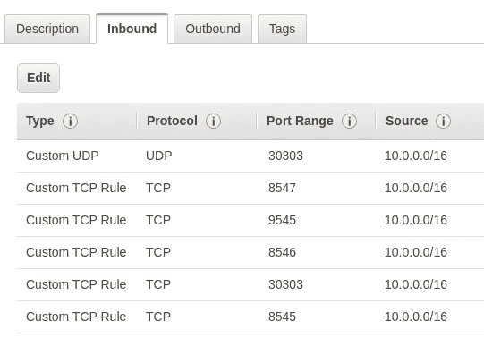

# 使用 IBFT2 在 Amazon Web Services 上设置 Hyperledger Besu

> 原文：<https://medium.com/coinmonks/setting-up-hyperledger-besu-on-amazon-web-services-using-ibft2-fa8d5f3a1aa3?source=collection_archive---------1----------------------->

这周我学习了如何在[区块链](https://blog.coincodecap.com/tag/blockchain/)中使用 AWS。我将使用 IBFT2 共识算法创建一个私有区块链。我将在私有/公共子网中使用 VPC，并创建八个 t2.micro 类型的 EC2 实例。两个实例将在私有子网中使用，其余的将在公共子网中使用。

# 我的议程

1.  设定 VPC。
2.  创建安全组。
3.  在专用子网上安装 bootnodes。
4.  在公共子网上安装节点。
5.  改进。
6.  资源。

# 设置 VPC

VPC 用于部署私有区块链的隔离实例。

> 虚拟私有云( **VPC** )是在公共云环境中分配的按需可配置的共享计算资源池，在使用资源的不同组织之间提供一定程度的隔离。

如果你不知道如何部署 VPC，我推荐这篇 AWS 短片[教程](https://docs.aws.amazon.com/AmazonECS/latest/developerguide/create-public-private-vpc.html)。

在创建实例之前，我需要初始化它们之间的通信。因此，我将为我的 VPC 创建一个安全组。

## 创建安全组

安全组是实例间通信的规则列表，如端口 22 接受我的设备 IP 地址。如果你不知道如何让一个安全组检查这个[链接](https://docs.aws.amazon.com/vpc/latest/userguide/VPC_SecurityGroups.html)。对于我的情况，我将使用这些规则



Note that IP 10.0.0.0 is for the private subnet

我在 PEGASYS 网站上找到了以上端口。这是 besu 网络需要的所有端口。不要忘记为 SSH 添加端口 22。现在，我将创建两个实例，作为专用子网上的引导节点。

## 访问私有子网

专用子网是没有到互联网网关的路由的子网。因此，不可能 SSH 它的实例。为了能够在您的实例上运行命令，您可以使用 [AWS 系统管理器会话管理器](https://aws.amazon.com/blogs/aws/new-session-manager/)或 [AWS 系统管理器运行命令](https://docs.aws.amazon.com/systems-manager/latest/userguide/execute-remote-commands.html)，但在我看来，SSh 您的实例的最快和最简单的方法是从公共子网上的另一个实例访问它，然后使用“ncat”打开端口 22。这些命令将是:

要为私有 IP 打开端口 22:

```
ncat --sh-exec "ncat PRIVATE.SUBNET.IP 22" -l 2222 &
```

然后，您需要将您的 keypair.pem 文件复制到 public 实例，瞧，就像您通常在本地机器上做的那样运行 ssh 命令。

```
**ssh -i "keyname.pem" ubuntu@10.0.0.24**
```

现在，我已经访问了实例，可以安装 bootnode 了。

我将从下载和安装 Hyperledger Besu 开始。然后，我将 ibft2 配置为共识算法。以下命令摘自官方文档和 PEGASYS 网站。请注意，这些命令是所有节点的标准。你可以在文章末尾找到解释它们的链接。

```
sudo apt-get update && sudo apt-get install openjdk-11-jdk
wget [https://bintray.com/api/ui/download/hyperledger-org/besu-repo/besu-1.3.6.tar.gz](https://bintray.com/api/ui/download/hyperledger-org/besu-repo/besu-1.3.6.tar.gz)
sudo mkdir -p /opt/besu/
sudo chown -R $USER:$USER /opt/besu/
tar -C /opt/besu/ -xvf besu-1.3.6.tar.gz 
cd /opt/besu/
touch ibftConfigFile.json
```

打开`ibftCongfigFile.json using nano command`

```
nano ibftConfigFile.json
```

然后写

```
{
 "genesis": {
   "config": {
      "chainId": 2018,
      "constantinoplefixblock": 0,
      "ibft2": {
        "blockperiodseconds": 2,
        "epochlength": 30000,
        "requesttimeoutseconds": 10
      }
    },
    "nonce": "0x0",
    "timestamp": "0x58ee40ba",
    "gasLimit": "0x47b760",
    "difficulty": "0x1",
    "mixHash": "0x63746963616c2062797a616e74696e65206661756c7420746f6c6572616e6365",
    "coinbase": "0x0000000000000000000000000000000000000000",
    "alloc": {
       "fe3b557e8fb62b89f4916b721be55ceb828dbd73": {
          "privateKey": "8f2a55949038a9610f50fb23b5883af3b4ecb3c3bb792cbcefbd1542c692be63",
          "comment": "private key and this comment are ignored.  In a real chain, the private key should NOT be stored",
          "balance": "0xad78ebc5ac6200000"
       },
       "627306090abaB3A6e1400e9345bC60c78a8BEf57": {
         "privateKey": "c87509a1c067bbde78beb793e6fa76530b6382a4c0241e5e4a9ec0a0f44dc0d3",
         "comment": "private key and this comment are ignored.  In a real chain, the private key should NOT be stored",
         "balance": "90000000000000000000000"
       },
       "f17f52151EbEF6C7334FAD080c5704D77216b732": {
         "privateKey": "ae6ae8e5ccbfb04590405997ee2d52d2b330726137b875053c36d94e974d162f",
         "comment": "private key and this comment are ignored.  In a real chain, the private key should NOT be stored",
         "balance": "90000000000000000000000"
       }
      }
 },
 "blockchain": {
   "nodes": {
     "generate": true,
       "count": 4
   }
 }
}
```

使用 besu 命令为节点生成密钥

```
besu-1.3.6/bin/besu operator generate-blockchain-config --config-file=ibftConfigFile.json --to=networkFiles --private-key-file-name=key
```

移动 gensis.json 文件

```
mv networkFiles/genesis.json /opt/besu/
```

然后制作一个文件夹名数据来添加节点的公钥和私钥

```
mkdir keys
mv networkFiles/keys/0x......./key  keys/
mv networkFiles/keys/0x......./key.pub  /keys/
```

好了，就这样吧！我们已经安装了 besu 网络，现在节点可以使用了。

## 初始化 Bootnode

Bootnode 是区块链创建的第一个节点，用于帮助其他同行找到你的区块链。

初始化 bootnode

```
besu-1.3.6/bin/besu --data-path=data --genesis-file=./genesis.json --rpc-http-enabled --rpc-http-api=IBFT --rpc-http-host=0.0.0.0 --host-whitelist="*" --rpc-http-cors-origins="all"  --metrics-enabled --metrics-host=0.0.0.0 --metrics-port=9545 --p2p-host=10.0.0.24 &
```

(不要忘记在`--p2p-host`上添加您自己的私人地址)

您可以在文档中找到相同的命令。刚换了私有 IP 的 p2p 主机。运行此命令后，您将需要搜索此行:

```
2020-03-28 18:21:47.836+00:00 | main | INFO  | DefaultP2PNetwork | Enode URL enode://d357bdefa4e6f6bdf99020707194823acd0f3d808ef259f47616a4154a7b4d8007b0573d6ebc02cb378f2f5f279205d2e537279a5987ef2a752733cd9cc2a5a1@10.0.0.24:30303
```

其他节点将使用 Enode URL 与您进行连接。好了，现在我们结束了。您可以创建任意数量 bootnode。在生产中通常是 2 个 bootnodes。

然后，对于公共子网上的实例，您将重复相同的过程，除了最后一步您将使用 Enode URL。

```
besu-1.3.6/bin/besu  --data-path=data --genesis-file=./genesis.json --node-private-key-file=/opt/besu/keys/key   --bootnodes=enode://ca6c54e4be70c38abbc2d05c4eaafcc057b9e38db33feb67a95ef37a7a5fcccde814e90573193a204502b8948336741fc5a47405a69a2a77f911245671f81c23@10.0.0.24:30303 --rpc-http-enabled --rpc-http-host=0.0.0.0 --host-whitelist="*" --rpc-http-api=ETH,NET,IBFT  --rpc-http-cors-origins="all" --metrics-enabled --metrics-host=0.0.0.0 --metrics-port=9545 --p2p-host=10.0.2.141 &
```

(别忘了在`--p2p-host`上添加自己的私人地址)

就是这样！现在您需要做的就是使用`scp`将‘besu’目录从第一个实例复制到其他实例。

```
scp -i besuvalidatornode.pem -r ubuntu@10.0.0.24:/opt/besu/data /opt/besu
```

不幸的是，仅使用两个节点无法实现拜占庭容错(尽管有节点，但仍能正确运行并达成共识的能力)。你可以找到关于 [ibft2](https://besu.hyperledger.org/en/stable/Concepts/Consensus-Protocols/Comparing-PoA/) 如何工作的细节。

# 丰富

*   最明显的就是增加实例的数量，或者使用比' t2.micro '更好的实例类型。
*   使用 Orion 作为私有事务管理器。它生成并维护私有/公共密钥对，提供一个用于 Orion 节点之间通信的 API，以及一个用于与以太坊客户端通信的 API 等等。你可以在 Orion [Orion 文档](https://docs.orion.pegasys.tech/en/latest/)上找到所有细节。
*   或者可以在 Docker 上使用 Besu。

> [直接在您的收件箱中获得最佳软件交易](https://coincodecap.com/?utm_source=coinmonks)

[](https://coincodecap.com/?utm_source=coinmonks)

## 在 Docker 上使用 Besu

您需要做的就是运行这个命令。然后在您的实例上运行带有 Orion 的 IBFT2。

```
./run-privacy.sh -c ibft2
```

Besu 样本网络容器为您提供了许多选项来运行所有类型的算法。您需要定制您的容器，以便只包含您需要的内容，并避免浪费资源。如果您运行上面的命令，它将创建 4 个节点:第一个节点是 bootnode，其他节点依赖于它。因此，如果 bootnode 失败，所有其他节点都会失败。为了在**生产**中使用 Besu 示例网络，您需要通过添加另一个 bootnode 并为其创建另外三个节点来修改`filedocker-compose_poa.yml`。请注意，我不必这样做，因为我出于教育目的使用了微实例，并且我自己实现了所有节点。

我希望我说清楚了。但是，如果你有任何问题，请随时问我。

# 资源

[Besu 创建 IBFT2 网络的官方文件](https://besu.hyperledger.org/en/stable/Tutorials/Private-Network/Create-IBFT-Network/)

[在 Aws 中设置 Hyperledger Besu](https://pegasys.tech/setting-up-hyperledger-besu-in-aws/)

[亚马逊 Web 服务表单到 SSH 的私有子网](https://forums.aws.amazon.com/thread.jspa?threadID=66103)

