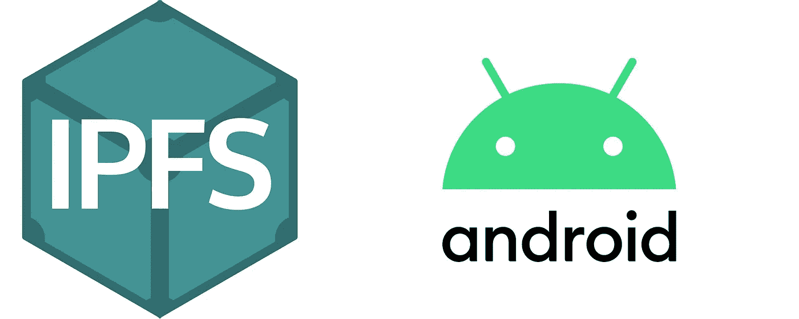

# 从 Android 设备连接到 IPFS

> 原文：<https://medium.com/coinmonks/setting-up-ipfs-with-android-sdk-a3f621125e47?source=collection_archive---------2----------------------->



虽然将 Web 应用程序与 IPFS 客户端连接起来相对容易，但从 Android SDK 上做同样的事情却有点棘手。在本教程中，我将带您完成设置阶段，向 IPFS 添加文档并查看其内容。

首先，导入以下 gradle 包:

在 **app.gradle** 文件中:

当试图实现 IPFS 方法时，其中一些方法可能不会像预期的那样工作。其中一个错误是:

```
java.lang.NoSuchMethodError: No static method metafactory
```

这是因为 Java 版本中没有一些方法< 8\. Switching to Java 8 compatibility might fix this issue:

Once the project dependencies are imported, **sync**gradle 文件来保存更改。

在 MainActivity.java(可以是任何活动文件)，导入以下包:

实例化 IPFS 客户端需要向构造函数传递一个多地址参数:

一旦设置好客户端，您就可以添加文件和检索散列。调用 ipfsClient.add()方法添加文件并返回 MerkleNode 结果:

由于 IPFS 是内容可寻址的分散文件托管，所以您需要的只是一个散列来检索文档。从上面的代码中，您可以观察到，如果一切顺利，您将能够在日志的“info”选项卡中找到散列。在 IPFS 找到该文档的有效 URL 是:

【https://ipfs.infura.io/ipfs/】T4<文档哈希>

就是这样。您已使用 Android SDK 成功将内容添加到 IPFS。