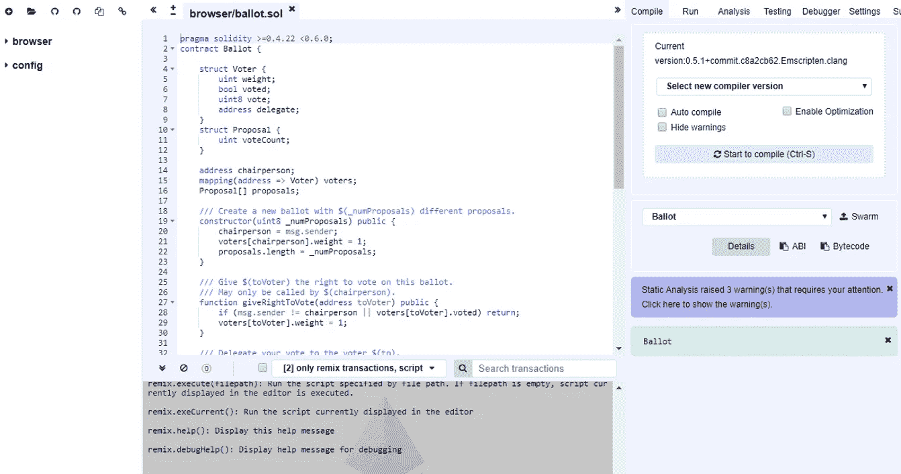

# 为 Solidity 开发设置 Remix IDE

> 原文：<https://medium.com/coinmonks/setting-up-remix-ide-for-solidity-development-1a30f227b600?source=collection_archive---------1----------------------->

这是一个在一个可以通过外部 IP 地址访问的服务器上设置 Remix IDE 的教程。


Photo by [Artem Sapegin](https://unsplash.com/photos/DErxVSSQNdM?utm_source=unsplash&utm_medium=referral&utm_content=creditCopyText) on [Unsplash](https://unsplash.com/search/photos/coding?utm_source=unsplash&utm_medium=referral&utm_content=creditCopyText)

当我写 Solidity Smart 合同时，我非常依赖在线的混合集成开发环境。偶尔，我会开一个[以太坊工作室](https://www.tp.edu.sg/courses/part-time-courses/skillsfuture/SkillsFuture-Series/finance-services-governance/beginners-introduction-to-blockchain-technology-with-ethereum-solidity-smart-contracts)，参与者也用 Remix IDE 编程。所以想到在某些不幸的日子里，网上的 Remix IDE 可能无法访问，我就不寒而栗。

所以我采取措施在一个云服务器上运行 Remix IDE 的副本，我可以通过一个外部 IP 地址用用户名和密码访问它。

我是这样做的。

**准备虚拟机**

我的虚拟机位于谷歌云，我大部分时间运行在 LTS 的 Ubuntu 16.04 上。这些是我运行来准备服务器的命令。

做一个更新

```
sudo apt-get update
```

安装节点

```
curl -sL https://deb.nodesource.com/setup_10.x -o nodesource_setup.sh
sudo apt-get install -y nodejs
```

降级到 npm 4。Remix 安装无法与最新版本的 npm 一起使用。

```
sudo npm install -g npm@4
```

安装必要的东西。

```
sudo apt-get install build-essential curl git m4 ruby texinfo libbz2-dev libcurl4-openssl-dev libexpat-dev libncurses-dev zlib1g-dev
sudo apt-get install build-essential checkinstall
```

安装 Apache

```
sudo apt-get install apache2
```

安装 Apache 模块，这将允许我稍后配置代理传递。我们将把流量从外部 IP 路由到本地主机，所以我们需要这些。

```
sudo a2enmod proxy
sudo a2enmod proxy_http
sudo a2enmod proxy_balancer
sudo a2enmod lbmethod_byrequests
```

安装 Apache 实用程序。我们将把我们的混音 IDE 放在用户名和密码后面，所以我们需要这个。

```
sudo apt-get install apache2-utils
```

**安装 Remix 及其依赖项**

接下来我安装 Git。Remix 需要 Git 作为依赖。

```
sudo apt install git-all
```

其次是屏幕。我使用 screen 在后台运行 Remix IDE，这样我就可以进行多任务处理，比如运行 Geth node 之类的。我们稍后将配置屏幕。

```
sudo apt-get update && sudo apt-get install screen -y
```

最后，我安装混音。Remix 在安装过程中需要 root 访问权限，因为它读写不同的根文件夹。

```
sudo npm install remix-ide -g --unsafe-perm=true --allow-root
```

你可以通过这样开始混音来测试混音是否有效

```
sudo remix-ide
```

如果你看到这个，那么一切都很好。

```
**Starting** Remix IDE at http://localhost:8080 and sharing /home/dragontigerdoor
**Sat** Dec 15 2018 02:10:12 GMT+0000 (Coordinated Universal Time) Remixd is listening on 127.0.0.1:65520
```

你可以通过输入 CTRL-C 来关闭它。

**后台运行混音**

下面是我如何配置 screen 在后台运行 remix。

编辑我的 bash 脚本。

```
sudo pico browser.sh
```

这是脚本代码。这里说 remix-ide 将以“remix”的名字执行。

```
**#!/usr/bin/env bash**
echo "Remix at work!"
screen -dmS remix sudo remix-ide
```

现在，我使 bash 脚本可执行。

```
sudo chmod +x browser.sh
```

然后我运行它。

```
bash browser.sh
```

如果您希望切换到 remix，请键入以下内容:

```
**screen** -x remix
```

要离开 remix 并让它在后台运行，请键入 CTRL-A-D。

**通过外部 IP 地址或域名访问 remix】**

前面的步骤让 remix 在 localhost:8080 上运行。如果你像我一样，在云上运行我的服务器，并且主要通过 ssh 控制台工作，你将需要通过你的服务器的外部 ip 地址或域来访问 remix。

我们刚刚安装了 Apache 的 mod_proxy 模块。我们现在将它配置为将外部流量路由到 localhost:8080。

但在此之前，让我们把 remix 放在用户名和密码后面，这样我们就不会把 Remix IDE 作为公共服务提供给其他 Solidity 开发者。用自己的替换< 【 > with the username you wish to use. You will be asked to provide a password.

```
sudo htpasswd -c /etc/apache2/.htpasswd <your username>
```

Next edit mod_proxy’s configuration file.

```
cd /etc/apache2/sites-enabledsudo pico 000-default.conf
```

Add the following script. Remember to replace <your server="" domain="" name="" or="" ip="" address="">。</your>

```
<VirtualHost *:80>
    **ProxyPreserveHost** On
    **ServerName** http://<your server domain name or ip address>
    **ProxyPass** / http://localhost:8080/
    **ProxyPassReverse** / http://localhost:8080/
    <Proxy *>
        **Order** deny,allow
        **Allow** from all
        **Authtype** Basic
        **Authname** "Password Required"
        **AuthUserFile** /etc/apache2/.htpasswd
        **Require** valid-user
    </Proxy>
</virtualhost>
```

最后，重启 apache 和 mod_proxy 模块。

```
**sudo** a2enmod proxy && sudo a2enmod proxy_http && sudo service apache2 restart
```

现在进入你的浏览器，开始在你的个人版 Remix IDE 上编码吧！



> [在您的收件箱中直接获得最佳软件交易](https://coincodecap.com/?utm_source=coinmonks)

[](https://coincodecap.com/?utm_source=coinmonks)