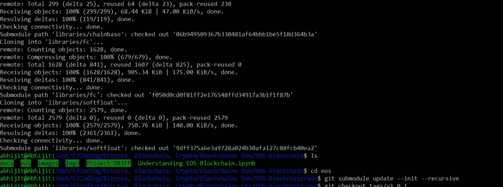

# 设置 EOS 区块链

> 原文：<https://medium.com/coinmonks/setting-up-the-eos-blockchain-5cd98f99eb84?source=collection_archive---------7----------------------->

# 背景

本文使您能够使用 EOSIO 软件安装来设置您的系统。在这之后，人们将能够把 C++合同编译成 ABI 文件并上传到区块链。

# 先决条件

*   打开 cmd。
*   `>pushd directory-where-eos-folder-is-to-be-kept`
*   `>bash`
*   现在，您已经准备好执行下面的步骤。

# 装置

*   **克隆 github 库**

`$ git clone https://github.com/EOSIO/eos.git --recursive`

*   **转到 eos 文件夹**

`$ cd eos`

*   **子模块检查**

`$ git submodule update --init --recursive`

*   **最新版本**

https://github.com/EOSIO/eos/releases/latest

它会将您带到最新的发布版本页面(如 1.0.3 版、1.0.2 版、1.0.1 版等)。从那里获取版本号。

`$ git checkout tags/v1.0.3`

*   **构建工具**

`$ ./eosio_build.sh`

*   *升压安装*

*   *Mongodb & Mongo C++驱动安装*

*   *secp256kl 安装*

*   *WASM 安装*

*   *EOSIO 安装*

*   *制作安装*

`$ cd build`

`$ sudo make install`

# EOSIO 系统架构

*   `cleos`

EOS 区块链的命令行(CLI)工具

*   `nodeos`

与区块链互动。

首先，找到“genesis.json”文件，然后运行命令。

*   `keosd`

用于访问钱包

现在，您可以继续在本地编译合同。

***就是这样！！..***

**敬请关注更多此类教程。**

https://github.com/abhi3700/My_Learning_EOS github-