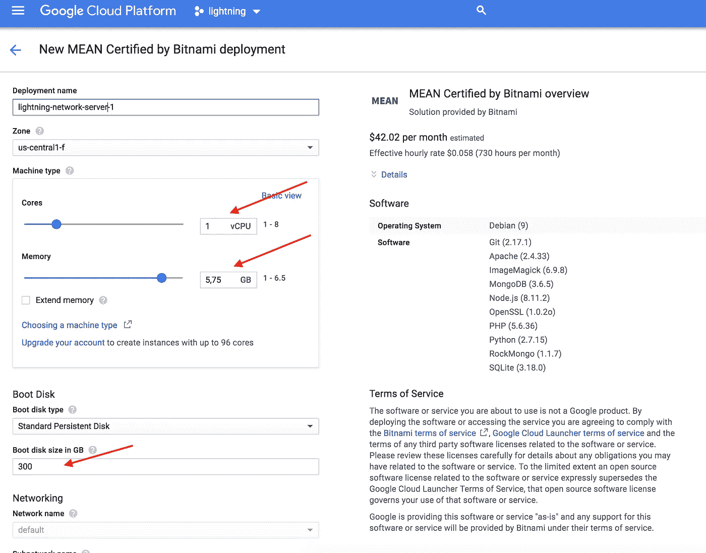
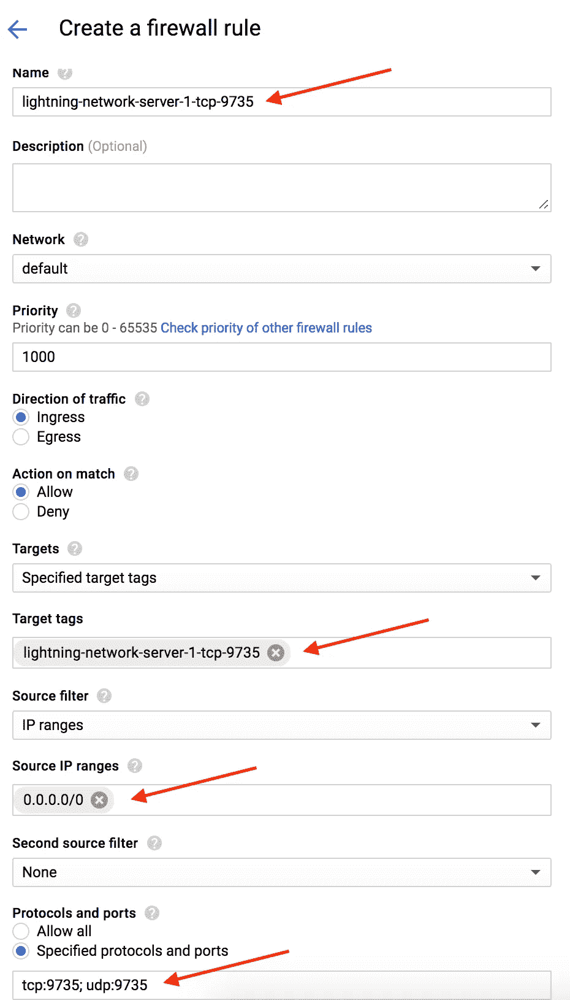
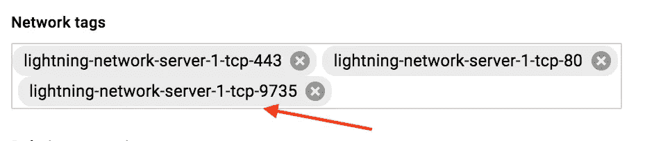
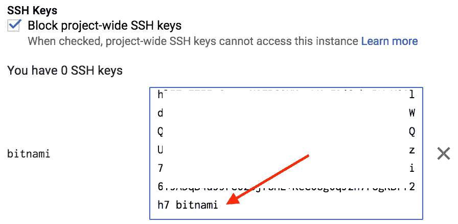

# 在谷歌云上设置比特币闪电服务器(指南)

> 原文：<https://medium.com/coinmonks/setup-bitcoin-lightning-server-on-google-cloud-guide-95811c439b32?source=collection_archive---------1----------------------->

闪电网络是有史以来打击比特币网络的最大规模解决方案之一，因为它最终使比特币成为一种日常货币，而不仅仅是一种价值储存手段。尽管它仍处于起步阶段，但它的工作速度快得惊人，一语双关。

有很多关于在家用电脑或 Raspberry Pi 上设置 lightning 网络的指南，但如果你想设置一个真正可靠且可扩展的服务器，并在将来用于你的业务，那么请继续阅读。我选择谷歌云服务是因为他们为你提供 300 美元的礼品奖励，这实际上应该足够你的服务器免费运行半年多！足够的时间真正做出有用的东西！

***本指南将指导您设置比特币全节点、闪电网络节点和一个平均堆栈服务器，以安全地与您的节点交互。***

## 创建您的谷歌云服务帐户并启动服务器

只需转到[谷歌云服务(GCS)](https://cloud.google.com/) 并创建一个免费试用账户，即可获得 300 美元奖励。是的，你必须放入你的信用卡，但是你可以在用完奖金之前取消订阅。你可以用不到 50 美元运行一个非常强大的服务器，这意味着你可以免费运行它半年以上！

一旦你建立了你的帐户，继续创建一个新的项目。在左上角，您将看到导航菜单，单击产品部分中的云启动器。在搜索栏中输入“MEAN”，然后选择“MEAN Certified by Bitnami”。

*以下是最适合我的设置:*



MEAN server settings

单击页面底部的部署按钮，等待几分钟…

一旦你的服务器部署完毕，在 GC 搜索栏中输入“外部 IP 地址”并设置一个静态 IP 地址，这样你就不会在每次服务器重启时都得到一个新的 IP 地址。

接下来你要做的是在你的防火墙设置中打开端口 9735，因为这个端口被 Lightning 网络节点使用。如果您关闭此端口，其他节点将无法打开通道或连接到您的节点。

***注意，如果您关闭节点，它仍然可以连接到其他节点！***

在 GC 控制台中，转到“VPC 网络”并选择“防火墙规则”，单击“创建防火墙规则”并使用以下设置:



Firewall rule

单击页面底部的“创建”,您的规则将被创建。

现在转到左侧的导航菜单，点击“计算”部分下的“计算引擎”。单击您的服务器名称，然后单击页面顶部的“编辑”。

在“网络标记”部分，添加您之前创建的防火墙规则的标记:



Add a firewall rule to the server

我还强烈建议您设置 SSH 密钥，这样您就可以安全地连接到您的服务器！

## 跟随这个[链接](https://docs.bitnami.com/virtual-machine/faq/#connecting-with-an-ssh-client)使用 Bitnami 设置 SSH



***重要！将您的 SSH 用户设置为“bitnami”***

点击页面底部的“保存”,您的服务器现在应该已经为有趣的内容做好准备了！

## 配置您的平均闪电服务器

打开您的终端，通过 SSH 连接到您新部署的服务器

我已经在 GitHub 上发布了一个一体化的安装脚本，所以这非常简单:

1.  前往您的个人文件夹:

```
cd ~
```

2.运行以下命令:

```
git clone [https://github.com/Moonbois/lightning-installer.git](https://github.com/Moonbois/lightning-installer.git)cd lightning-installer/scripts/gcs_mean_bitnami/sudo nano config
```

3.编辑配置文件。最重要的设置是:

```
bind-addr=YOUR_INTERNAL_IPannounce-addr=YOUR_EXTERNAL_IP
```

如果您转到左侧的导航菜单并单击“计算”部分下的“计算引擎”，您将找到正确的 IP 值。在那里，您将看到您的“内部 IP”和“外部 IP”，您应该将它们复制到您的配置文件中。

4.通过运行安装:

```
./install.sh
```

4.等待几分钟，安装完成。

## 现在你等得更久了！

比特币区块链完全同步大约需要 12 个多小时。

您可以通过以下方式检查进度:

```
tail -f ~/.bitcoin/debug.log
```

当您看到“progress=1.000”时，您的节点已完全同步。

## 最后一步:

运行以下命令，用您的令牌替换<mysecrettoken>:</mysecrettoken>

```
immortal lightningdimmortal charged --api-token <mySecretToken> --db-path /home/bitnami/chargedb/charge.db
```

让这些程序在系统重启时运行也很好，只需输入:

```
crontab -e
```

将这一行添加到文件的末尾:

```
@reboot immortal bitcoind --daemon
@reboot immortal lightningd
@reboot immortal charged --api-token <mySecretToken> --db-path /home/bitnami/chargedb/charge.db
```

# 全部完成！

您可以通过运行以下命令来测试节点:

```
lightning-cli getinfo
```

查看 GitHub 上的 [c-lightning](https://github.com/ElementsProject/lightning) 和 [lightning-charge](https://github.com/ElementsProject/lightning-charge) 了解使用说明！

# 总而言之:

希望你喜欢阅读本指南。我试图让它尽可能简单，安装脚本是已经被要求了一段时间，它是一个真正的时间节省者。希望对你的项目有帮助！

现在让光进来！

附言:如果你的节点运行成功，请在这里给我发一个闪电提示[！谢谢大家！](https://tippin.me/@Moonchacho)

# 编辑:

一些用户在设置他们的服务器时遇到了一些问题，这就是为什么我创建了一个专门的电报组，我们可以在那里聊天！

任何人都可以在这里加入！