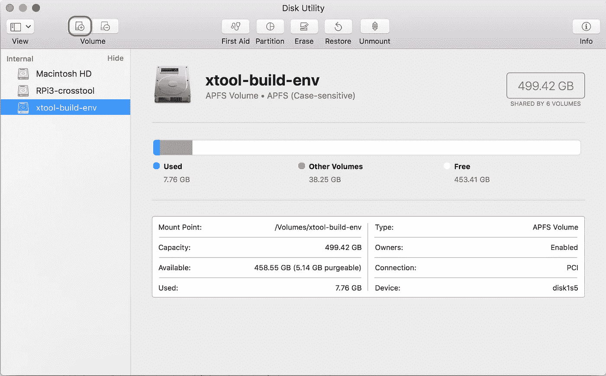

# 在 macOS High Sierra 上设置覆盆子 Pi 3 的 GCC 8.1 交叉编译器工具链

> 原文：<https://medium.com/coinmonks/setup-gcc-8-1-cross-compiler-toolchain-for-raspberry-pi-3-on-macos-high-sierra-cb3fc8b6443e?source=collection_archive---------0----------------------->


Photo by [Jordane Mathieu](https://unsplash.com/@mat_graphik?utm_source=medium&utm_medium=referral) on [Unsplash](https://unsplash.com?utm_source=medium&utm_medium=referral)

在今年的亚马逊黄金日期间，我发现了一本由德里克·莫洛伊先生写的书《T2 》( T3)。我认为这是开始系统学习嵌入式开发的好时机。所以我的旅程开始了。

有了一些使用 *AOSP* 平台的实践经验，我知道人们会在开发机器上使用 **gcc** 交叉编译器来为目标设备生成二进制文件。在一台功能强大的计算机上，编译一个需要超过 10 千兆字节硬盘空间，不低于 4 千兆字节内存的程序是有意义的。此外，在您最需要的操作系统上构建和侵入您最喜欢的文本编辑器/IDE 也很不错。因此，拥有一个支持最新的 *C/C++* 标准的*覆盆子 Pi* 的交叉编译器听起来是我的 *Pi* 冒险的一个好开始。

生活在互联网时代真是太棒了。你不必找百科全书来尝试你的想法。只需在*谷歌*搜索框中键入“ [*覆盆子 Pi* 交叉编译器 macOS](https://www.google.com/search?newwindow=1&rlz=1C5CHFA_enUS805US805&ei=ymReW5vtIKqB0wLqzreoDw&q=Raspberry+Pi+cross+compiler+macOS&oq=Raspberry+Pi+cross+compiler+macOS&gs_l=psy-ab.3..35i39k1j0i22i30k1l3.2749.11366.0.13239.11.9.2.0.0.0.305.995.7j1j0j1.9.0....0...1.1.64.psy-ab..0.4.229...0i30k1j0i8i30k1j0i13i30k1j0i8i13i30k1.0.pBZf0PNyZLc) ”就会得到一些[有希望的结果](https://www.jaredwolff.com/blog/cross-compiling-on-mac-osx-for-raspberry-pi/)(感谢沃尔夫先生这么好的博文:)。在我注意到它的出版日期是 2016 年 9 月之前，这篇文章的所有内容看起来都很精彩。当时，本文正在为“*arm V7-rpi 2-Linux-gnueabihf*”构建工具链，该工具链代表*覆盆子 Pi 2* (尽管它声明该指南支持 *RPi3* )。它只支持 **gcc** 5.2，没有 *C++17/C++20* 。虽然有一些限制，但该指南仍然是我的交叉编译器实验的黄金参考，因为它提供了如何使用 [**crosstool-ng**](https://crosstool-ng.github.io/) 的便捷技巧，这是一个为各种平台配置和编译 **GNU** 工具链的极好项目。

经过一整个周末对编译器/链接器/工具错误的沮丧，我能够在 *macOS High Sierra* 版本 10.13.6 上获得一个功能完整的 **GNU** 工具链，该工具链为平台“*arm V8-RP i3-Linux-gnueabihf*生成二进制文件。如果您想尝试二进制文件，构建工件托管在 [my GitHub repo](https://github.com/yc2986/armv8-rpi3-linux-gnueabihf-gcc-8.1.0-macos-high-sierra) 中。该项目包含一个用于 **crosstool-ng** 和以下 **GNU** 工具的[配置文件](https://github.com/yc2986/armv8-rpi3-linux-gnueabihf-gcc-8.1.0-macos-high-sierra/blob/master/.config):

*   ***GNU make****4 . 2 . 1*
*   ***GNU 编译器集合(gcc)*** *8.1.0*
*   ***GNU C 库(glibc)*** *2.27*
*   **GNU Binutils**2.28
*   **GNU M4T41*1 . 4 . 18***
*   ***GNU 调试器(gdb)*** *8.1*
*   ***GNU 构建系统:autoconf*** *2.69、****automake****1.15、****libtool****2 . 4 . 6*

现在我将向您展示如何从 **ct-ng** 编译器获得这些工具。在第一部分，我将列出使 **ct-ng** 工作所需的正确的依赖关系和程序。在第二部分，我将分享我使用 **crosstool-ng** 配置菜单界面的经验。在第三部分，我会给你看一些我遇到的错误和我的解决方法。

## 第 1 部分:成功的编译过程

安装**自制软件**来获得我们需要的对 *macOS* 的依赖

```
/usr/bin/ruby -e "$(curl -fsSL https://raw.githubusercontent.com/Homebrew/install/master/install)"
```

安装**十字工具-ng**

```
brew install crosstool-ng
```

找到**十字工具的安装目录**

```
brew info crosstool-ng
```

在我的例子中，该命令返回以下结果

```
crosstool-ng: stable 1.23.0 (bottled)Tool for building toolchainshttp://crosstool-ng.org*/usr/local/Cellar/crosstool-ng/1.23.0_1* (1,294 files, 7.7MB) *Poured from bottle on 2018-07-20 at 23:37:27From: https://github.com/Homebrew/homebrew-core/blob/master/Formula/crosstool-ng.rb
```

我们需要向 crosstool-NG.sh 脚本授予执行权限，以解决潜在的工作流错误。

```
chmod +x */usr/local/Cellar/crosstool-ng/1.23.0_1/lib/crosstool-ng-1.23.0/scripts/crosstool-NG.sh*
```

**libtool** 和 **gcc** 8.1 编译需要一些额外的依赖项。

```
brew install help2man bison
```

gcc 8.1 编译要求 **GNU bison** 比系统默认版本更高。我们需要链接 brew 版本的 **bison** ，因为 *macOS* 会从 */usr/bin/bison* 而不是 **brew 的***/usr/local/bin/bison*中选择系统默认的一个。

```
brew link --force bison# this linkage can be later reverted by running:
#   brew unlink bison# after the linking we should restart the console or run:
#   source *~/.bash_profile*
# to correctly apply the linkage. by running:
#   which bison
# the console should return something other than */usr/bin/bison*
```

接下来，我们需要创建一个区分大小写的磁盘卷来存放所有工具链编译工件。这可以通过简单地打开**磁盘实用程序**并点击红色圆圈按钮来实现。



有了 *macOS High Sierra* ，我们有了 *APFS* 磁盘格式，它具有更好的性能和文件大小优化。既然我们正在尝试最新的 **GNU** 工具链，为什么不在最新的文件系统上也尝试一下呢。我知道新的编译器+新的文件系统格式可能会让我四倍头痛，但为什么不呢:)。在我的例子中，我将其命名为*“xtool-build-env”*，它使用了“*(区分大小写)*”磁盘格式。我们将需要 10gb 的空间来存放所有中间对象文件，并在一个 *APFS* 卷上安装文件。使用“大小选项”按钮进行空间预分配工作。


现在在*/Volumes/xtool-build-env/*中已经准备好区分大小写的卷，是时候开始使用 **ct-ng** 构建系统了。配置该工具最简单的方法是直接使用我成功构建的[配置文件](https://github.com/yc2986/armv8-rpi3-linux-gnueabihf-gcc-8.1.0-macos-high-sierra/blob/master/.config)。将此配置放在

```
*/Volumes/xtool-build-env/.config*
```

然后打开它，编辑这些路径以匹配您的系统设置。您可以根据自己的喜好更改卷名或使用区分大小写的 *APFS* 卷下的任何文件夹。就我而言:

```
CT_WORK_DIR="*/Volumes/xtool-build-env/.build*"
CT_PREFIX_DIR="*/Volumes/xtool-build-env/${CT_TARGET}*"
CT_LOCAL_PATCH_DIR="*/Volumes/xtool-build-env/packages*"
```

请注意，在上述设置中，我已经在配置中设置了 **CT_LOCAL_PATCH_DIR** 以及捆绑补丁规则上的本地补丁。这需要我们复制 [**crosstool-ng** 的 packages 文件夹](https://github.com/crosstool-ng/crosstool-ng/tree/master/packages)下的所有内容，并将其放在*/Volumes/xtool-build-env/packages/*下。

让我们通过命令来检查 *macOS* 的用户限制:

```
ulimit -n
```

如果系统将资源限制为仅 256，请尝试使用以下命令将其增加到至少 1024:

```
ulimit -n 1024
# re-run "ulimit -n" to make sure this step succeeded
```

为了方便起见，我在配置文件中启用了选项 **CT_DEBUG_CT_SAVE_STEPS** 。这确保了无论何时一个构建步骤失败，我们都可以修复问题并从失败点重新开始。由于工具链构建是一个耗时的过程，启用保存步骤将为我们节省大量时间。

至此我们已经完成了编译 **gcc** 8.1.0 的所有先决条件。然而，需要对 **gcc** 8.1.0 源代码进行一些更改，以解决一个编译器错误。

让我们首先使用以下命令列出可用的构建步骤:

```
ct-ng list-steps
```

在我的本地环境**中，ct-ng** 返回以下构建步骤

```
Available build steps, in order:
- companion_tools_for_build
- companion_libs_for_build
- binutils_for_build
- companion_tools_for_host
- companion_libs_for_host
- binutils_for_host
- cc_core_pass_1
- kernel_headers
- libc_start_files
- cc_core_pass_2
- libc
- cc_for_build
- cc_for_host
- libc_post_cc
- companion_libs_for_target
- binutils_for_target
- debug
- test_suite
- finish
Use "<step>" as action to execute only that step.
Use "+<step>" as action to execute up to that step.
Use "<step>+" as action to execute from that step onward.
```

例如，如果构建在步骤 **cc_for_build** 失败，这意味着保存的最后一个成功步骤是步骤 **libc** ，我们可以排除故障并修复问题，然后使用命令重新开始构建:

```
ct-ng libc+
```

尾部的加号表示从 **libc** 步骤开始执行以下动作。

现在，我们将下载源代码，配置构建工具依赖项，并对 **gcc** 8.1.0 源代码进行一些更改。运行这个:

```
ct-ng +companion_tools_for_build
```

在第一步正确完成后，我们将使用*/Volumes/xtool-build-env/packages/*文件夹中的 git 补丁文件下载、解压缩并修补所有源代码。现在我们应该编辑这个文件:

```
vi */Volumes/xtool-build-env/.build/src/gcc-8.1.0/libatomic/configure*
```

搜索并更改以下行

```
XCFLAGS="$XCFLAGS -Wall -Werror"
```

到

```
XCFLAGS="$XCFLAGS -Wall"
```

这是解决编译 **gcc libatomic 时生成的警告错误的一种方法。**警告消息是关于-mcpu 与-march 编译器标志冲突。这不是一个好的解决方案，任何合适的建议都是值得赞赏的。

一切就绪后，让我们开始构建。下面的命令将从最后一个保存点恢复我们的构建，并修改我们编辑过的源代码。

```
ct-ng companion_tools_for_build+
```

是时候喝杯茶，等待我们闪亮的编译器在 40 分钟内准备好了。

如果一切顺利，工具链应该可以在*/Volumes/xtool-build-env/arm V8-RP i3-Linux-gnueabihf/*中找到。让我们用一个[示例项目](https://github.com/yc2986/CMakeRPiExample)来测试一下最新的 *C++17/C++20* 特性。该项目需要 **CMake** 进行配置，因此获得依赖关系:

```
brew install cmake
```

然后克隆到 git repo 中，运行以下命令来构建交叉工具链:

```
cd build
cmake .. && make
```

测试应用程序将在*cmakepiexample/build/executable/executable*中提供。使用下面的 rsync 命令将这个应用程序复制到您的 RPi3 设备上。我已经给了我的 Raspberry Pi 主机名 pi0，所以我的命令将是

```
rsync -rtzh *CMakeRPiExample/build/executable/executable* pi@pi0:/home/pi
```

然后 ssh 到您的设备，并从主目录执行应用程序。它将创建 10 个 *std::thread* 对象，其中几个 std:: *any* 对象被初始化并用于存储整数变量。一个*c++ 20*style*_ _ VA _ OPT _ _*宏用于测试 *C++2a* 的功能。如果一切编译正常，应用程序应该会返回类似下面的内容

```
thread 0 finished
thread 8 finished
thread 1 finished
thread 2 finished
thread 3 finished
thread 4 finished
thread 5 finished
thread 6 finished
thread 7 finished
thread 9 finished
double params foo: static c1 optional c2 param
single param foo: static c1
```

我们已经通过一个小样本项目成功测试了 *C++11/C++17/C++20* 的特性:)该编译器已经准备好用于我们激动人心的未来项目了！

## 第 2 部分:使用 crosstool-ng 配置文件

在第 1 部分中，我提供了一个微调过的配置文件，它支持构建最新的 **gcc** ，设置补丁应用规则，并使用逐步构建。在本节中，我将解释如何使用 **crosstool-ng** 的 *menuconfig* 以及如何修改配置文件以采用最新的 *gcc/gdb* 和其他工具集。

首先，我将开始为目标平台初始化一个配置文件。可用目标可以在[样本目录](https://github.com/crosstool-ng/crosstool-ng/tree/master/samples)下从 **crosstool-ng** 的 Git repo 中找到。在我们的例子中，目标为 *RPi3，*让我们在目录*/Volumes/xtool-build-env/*中运行下面的 init 命令

```
ct-ng armv8-rpi3-linux-gnueabihf
```

然后为 **ct-ng** 启动*菜单配置*。运行以下命令启动界面:

```
ct-ng menuconfig
```


**ct-ng** menuconfig interface

基本上，*路径/补丁/调试*相关选项将驻留在*路径和杂项选项*子菜单中。 *C 库*用于配置 **glibc** 相关参数。 *C 编译器*菜单为 **gcc** 编译器提供选项。*调试工具*让你为 *RPi3* 选择 **gdb** 和你想要的内存跟踪工具。

对于路径配置，我使用了以下菜单项:

```
Paths and misc options
-- (*/Volumes/xtool-build-env/src*) Local tarballs directory
-- (*/Volumes/xtool-build-env/.build*) Working directory
-- (*/Volumes/xtool-build-env/${CT_TARGET}*) Prefix directory
```

对于补丁应用:

```
Paths and misc options
-- Patches origin (Local only, bundled if no local)
-- (*/Volumes/xtool-build-env/packages*)   Local patch directory
```

对于调试选项:

```
Paths and misc options
[*] Debug crosstool-NG
[*]   Save intermediate steps
[*]     gzip saved states
```

对于 **glibc** 和 **gcc** 与当前 *menuconfig* 在 **crosstool-ng** 1.23.0 下，我们只能有以下选项:

```
C-library
-- glibc version (2.25)C compiler
-- gcc version (6.3.0)
```

这意味着我们可以从官方 **ct-ng** config 接口得到的 **glibc** 和 **gcc** 的最新版本是**glibc**2.25 和**gcc**6 . 3 . 0。不算太老，但也不是最新的。其他工具也是如此，如 **gdb** 等…

有了官方支持的 **ct-ng** 配置工具，如果你做的一切都正确的话，你应该可以得到部分 *C++17* 支持的 **gcc** 6.3.0 周围的工具链。

要获得一个更“现代”的编译器版本，是时候打开配置文件，自己动手弄乱它了:)。在编辑并保存了 *menuconfig* 之后，您应该能够在*/Volumes/xtool-build-env/*下找到一个. config 文件。用您喜欢编辑器打开配置，确定这些选项:

```
CT_CC_GCC_VERSION="6.3.0"
CT_LIBC_VERSION="2.25"
CT_GDB_VERSION="7.12.1"
```

这些是版本字符串， **ct-ng** 将使用它们从 *sourceforge* 中提取源代码 tarball。我们可以用最新的可用版本来替代它们。找到带补丁支持的工具链的正确版本的一个好地方是 [**crosstool-ng** 的补丁包](https://github.com/crosstool-ng/crosstool-ng/tree/master/packages)目录。例如打开这个 [**gcc** patch](https://github.com/crosstool-ng/crosstool-ng/tree/master/packages/gcc) 文件夹，你会看到 **crosstool-ng** 已经正式带来了对 8.1.0 版本的补丁支持。在这种情况下，我们可以安全地将我们的 **CT_CC_GCC_VERSION** 更改为“8.1.0 ”,因为这意味着 **crosstool-ng** 正在积极支持 **gcc** 8.1.0。同样规则适用于所有其他工具链组件。

只要有补丁可用，您总是可以尝试不同的组合。即使没有补丁支持，我们也可以把它作为本地资源，应用我们自己的补丁，使它与 ct-ng 兼容！我对这个地区不熟悉。很高兴看到有人发布这样的文章来玩定制工具链。

在修改了配置文件之后，我们可以用命令进行测试了

```
ct-ng build
```

启用调试步骤保存后，解析构建日志并修复问题，然后从故障点恢复就很简单了。

## 第 3 部分:故障排除

在这一节中，我将记录可能阻碍编译过程的错误，并提供解决方法。通过 *Google* 可以找到很多 **ct-ng** 相关的故障排除文章。这里我只重点讲一下编译 **gcc** 8.1.0 提出的问题。

我的本地环境参数:

*   **crosstool-ng** 路径:*/usr/local/Cellar/cross tool-ng/1 . 23 . 0 _ 1/*
*   区分大小写 *APFS* 卷根:*/Volumes/xtool-build-env/*
*   配置文件路径: */Volumes/xtool-build-env/。配置*
*   **crosstool-ng** 构建日志路径:*/Volumes/xtool-build-env/build . log*
*   工具链源 tarball 路径: */Volumes/xtool-build-env/。build/tarballs/*
*   工具链源路径: */Volumes/xtool-build-env/。build/src/*
*   工具链安装路径:*/Volumes/xtool-build-env/arm V8-RP i3-Linux-gnueabihf*

问题和解决方案列表:

1.  运行 **ct-ng** build 命令后出现权限被拒绝错误

> **错误信息:**
> 
> /bin/bash:/usr/local/Cellar/cross tool-ng/1 . 23 . 0 _ 1/lib/cross tool-ng-1 . 23 . 0/scripts/cross tool-ng . sh:权限被拒绝
> 
> **解决方案:**
> 
> 授予 crosstool-NG.sh 脚本执行权限:

```
chmod +x /usr/local/Cellar/crosstool-ng/1.23.0_1/lib/crosstool-ng-1.23.0/scripts/crosstool-NG.sh
```

2.**编译 **libtool** 期间，crosstool-ng** 构建失败

> **错误信息:**
> 
> [EXTRA]Building libtool
> [ERROR]make[3]:* * *[Makefile:2328:/Volumes/Unix/CT-ng/。build/src/libtool-2 . 4 . 6/doc/libtool . 1]错误 127
> 
> **构建日志错误消息:**
> 
> [ALL ]警告:您的系统中缺少“help2man”。
> [ALL ]只有在修改了手册页的依赖项时才需要它。
> 【全部】你可能要安装 GNU Help2man 包:
> 【全部】<[http://www.gnu.org/software/help2man/](http://www.gnu.org/software/help2man/)>
> 
> **解决方案:**
> 
> 安装 help2man with Homebrew:

```
brew install help2man
```

3. **crosstool-ng** 构建在步骤*安装 pass-1 core C gcc 编译器时失败*

> **错误信息:**
> 
> [信息]安装 pass-1 core C gcc 编译器
> [EXTRA]配置 core C gcc 编译器
> [EXTRA]构建 gcc
> [错误] clang:错误:链接器命令失败，退出代码为 1(使用-v 查看调用)
> 
> **构建日志错误消息:**
> 
> [全部] ld:找不到框架../libiberty/pic/libiberty.a
> 
> **解决方案:**
> 
> 确保在构建开始时下载所有补丁并应用于源代码。具体来说，补丁来自 crosstool-ng 的官方 Github repo [包目录](https://github.com/crosstool-ng/crosstool-ng/tree/master/packages)。这些补丁应该放在与配置文件中的 **CT_LOCAL_PATCH_DIR** 选项相匹配的本地文件夹中。
> 
> 请注意，如果构建在这一步失败，我们应该使用上面的解决方案，并通过以下方式从头开始构建:

```
ct-ng build
```

4. **crosstool-ng** 构建在步骤*为多库*构建时失败

> **错误信息:**
> 
> [错误]> >在步骤“为多库 1/1 构建”中构建失败
> 
> **构建日志错误消息:**
> 
> [CFG ]正在检查 bison 的版本… 2.3，不好
> 
> **解决方案:**
> 
> 用家酿安装 bison 并强制 link 使用 brew 版本:

```
brew install bison
brew link --force bison# this linkage can be later reverted by running:
#   brew unlink bison# after the linking we should restart the console or run:
#   source *~/.bash_profile*
# to correctly apply the linkage. by running:
#   which bison
# the console should return something other than */usr/bin/bison*
```

5. **crosstool-ng** 构建在步骤*安装最终 gcc 编译器时失败*

> **错误信息:**
> 
> [错误]> >在“安装最终 gcc 编译器”步骤中构建失败
> 
> **构建日志错误消息:**
> 
> [错误] cc1:错误:开关-mcpu=cortex-a53 与-march=armv7-a 开关[-Werror]冲突
> 
> **解决方案:**
> 
> 这是一个通过从配置文件中禁用 Werror 的暴力解决方案。如果有人能想出一个好的解决方案来解决这个错误，请在下面评论，谢谢！
> 
> 要禁用 Werror，请编辑 */Volumes/xtool-build-env/。build/src/gcc-8 . 1 . 0/libatomic/configure*文件。替代线

```
XCFLAGS="$XCFLAGS -Wall -Werror"
```

> 到

```
XCFLAGS="$XCFLAGS -Wall"
```

6.其他错误

> **解决方案:**
> 
> 直接搜索错误信息，或者忽略它，如果它不会破坏您的构建:)

## **结局**

现在我们有了 RPi3 的交叉编译器，无限的可能性在我们手中，使这个小设备成为家庭自动化、物联网、嵌入式计算机视觉等的强大工具…

至于我，我会很高兴地使用我自己构建的交叉编译器继续阅读我的书。如果在我的嵌入式 Linux 学习中发生了有趣的故事，我会随时通知你:)

## 参考

[1] [贾里德·沃尔夫](https://www.jaredwolff.com/blog/cross-compiling-on-mac-osx-for-raspberry-pi/)[在 Mac OSX 上为树莓 Pi](https://www.jaredwolff.com/) 进行交叉编译

[2][**cross tool-ng**Github repo](https://github.com/crosstool-ng/crosstool-ng)

[3] [**crosstool-ng** 官方文档](http://crosstool-ng.github.io/docs/)

> 加入 Coinmonks [电报频道](https://t.me/coincodecap)和 [Youtube 频道](https://www.youtube.com/c/coinmonks/videos)获取每日[加密新闻](http://coincodecap.com/)

## 另外，阅读

*   [复制交易](/coinmonks/top-10-crypto-copy-trading-platforms-for-beginners-d0c37c7d698c) | [加密税务软件](/coinmonks/crypto-tax-software-ed4b4810e338)
*   [网格交易](https://coincodecap.com/grid-trading) | [加密硬件钱包](/coinmonks/the-best-cryptocurrency-hardware-wallets-of-2020-e28b1c124069)
*   [密码电报信号](http://Top 4 Telegram Channels for Crypto Traders) | [密码交易机器人](/coinmonks/crypto-trading-bot-c2ffce8acb2a)
*   [币安交易机器人](/coinmonks/binance-trading-bots-d0d57bb62c4c) | [OKEx 审查](/coinmonks/okex-review-6b369304110f) | [阿塔尼审查](https://coincodecap.com/atani-review)
*   [最佳加密交易信号电报](/coinmonks/best-crypto-signals-telegram-5785cdbc4b2b) | [MoonXBT 评论](/coinmonks/moonxbt-review-6e4ab26d037)
*   [如何在 Bitbns 上购买柴犬(SHIB)币？](https://coincodecap.com/buy-shiba-bitbns) | [购买 Floki](https://coincodecap.com/buy-floki-inu-token)
*   [CoinFLEX 评论](https://coincodecap.com/coinflex-review) | [AEX 交易所评论](https://coincodecap.com/aex-exchange-review) | [UPbit 评论](https://coincodecap.com/upbit-review)
*   [十大最佳加密货币博客](https://coincodecap.com/best-cryptocurrency-blogs) | [YouHodler 评论](https://coincodecap.com/youhodler-review)
*   [最佳加密交易所](/coinmonks/crypto-exchange-dd2f9d6f3769) | [印度最佳加密交易所](/coinmonks/bitcoin-exchange-in-india-7f1fe79715c9)
*   开发人员的最佳加密 API
*   最佳[密码借贷平台](/coinmonks/top-5-crypto-lending-platforms-in-2020-that-you-need-to-know-a1b675cec3fa)
*   [免费加密信号](/coinmonks/free-crypto-signals-48b25e61a8da) | [加密交易机器人](/coinmonks/crypto-trading-bot-c2ffce8acb2a)
*   [杠杆代币的终极指南](/coinmonks/leveraged-token-3f5257808b22)