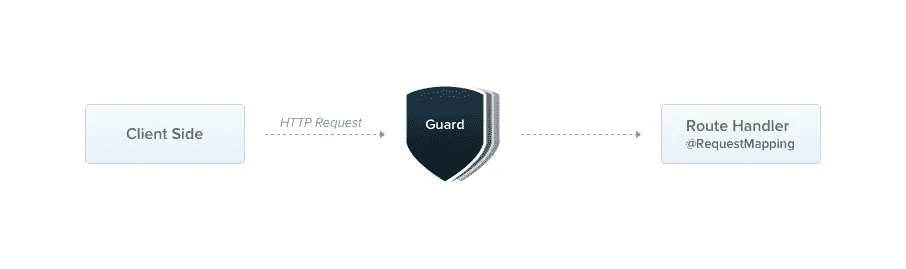
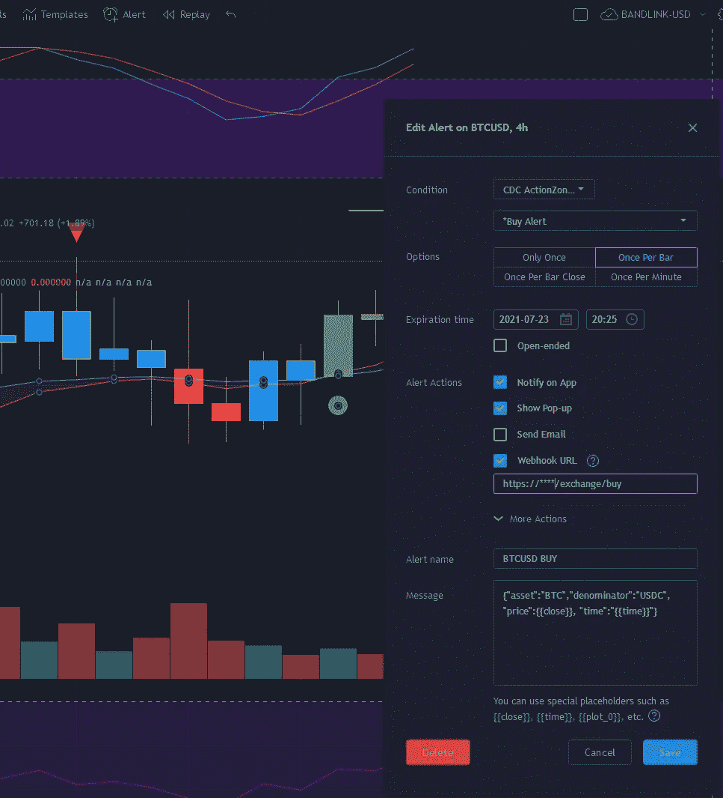

# 设置指南:使用 gcp-cryptobot 自动购买交易视图信号

> 原文：<https://medium.com/coinmonks/setup-guide-automate-buy-on-tradingview-signals-with-gcp-cryptobot-a6941b70924?source=collection_archive---------1----------------------->

我假设您现在已经对如何设置您的 GCP 项目并让 gcp-cryptobot 在云中运行有了一个基本的想法。如果你想重温基础知识，你可以点击这里访问本系列的第 2 部分[！](/coinmonks/setup-guide-automate-dca-and-plan-for-liquidation-wicks-with-gcp-cryptobot-32414ef72251)

> 还是那句话，请在使用之前仔细查看[源代码](https://github.com/kalanyuz/gcp-cryptobot)，了解它的工作原理。


We’ll cover the Trading setup part today. You will need an active Tradingview subscription for this Tutorial.

# 先决条件

我们将需要类似的服务/工具启用。这一次，我们将为活动的 Tradingview 订阅关闭 Cloud Scheduler。

*   [Docker](https://docs.docker.com/get-docker/)
*   [gcloud 命令行工具](https://cloud.google.com/sdk/gcloud)
*   [秘密经理](https://cloud.google.com/secret-manager)
*   [云容器注册中心](https://cloud.google.com/container-registry)
*   [云运行](https://cloud.google.com/run)
*   [Tradingview 订阅](https://www.tradingview.com/gopro/?share_your_love=sufficientLead92664) (≥ Pro 才能访问 Webhook)

# 安全设置

在本指南的前一部分中，我们让我们的 bot 接收来自云调度程序的交易请求。这允许我们通过使用服务帐户权限来阻止来自您项目的虚拟专用网络之外的 IP 地址的所有传入连接。

但是，由于我们将收到来自 Tradingview 指示器警报的此类请求，我们将不得不接受外部连接。这就是`GUARD` env 变量出现的地方。让我们看看我们在 gcp-cryptobot 的`main.ts`中的`bootstrap()`函数:


main.ts is located in /src directory.

第 27 行在这里做的是告诉应用程序将名为`TradingViewGuard`的请求拦截器应用到应用程序创建的每个端点。当它收到一个购买或出售资产的请求时，它将截取传入的请求头，并验证该请求是否是从 Tradingview 服务器发送的，否则将丢弃它。你可以在这里查看`tradingview.guard.ts`的实现细节以及 Tradingview 如何管理它的 webhook [。](https://www.tradingview.com/support/solutions/43000529348-about-webhooks/)



Guard concept illustration. You can learn more about Guard [here](https://docs.nestjs.com/guards#binding-guards). (Image from [nest.js](https://docs.nestjs.com/guards#binding-guards))

除了使用`Guard`之外，我**强烈建议你永远不要授予重要的特权，比如撤销或者转移给你的机器人的 API 密匙。**

我们将重复与之前指南相同的步骤。你将把你的 API 密匙和来自币安的秘密放到秘密管理器上。这些键名将在后面的 app' `s config.binance.sample.yaml`配置文件中使用。我会相应地把它们命名为`BINANCE_SECRET`和`BINANCE_APIKEY`。

# 重新访问配置文件


What my config file looks like for active trading on Binance.

让我们再次检查配置文件。

*   `secret_keyname`:你在秘密管理器中使用的键名。
*   `api_keyname`:您在 Secret Manager 中使用的键名。
*   `trade_with`:这次不需要。
*   `rebalance`:用于下单购买时，重新平衡资产。**这些数字表明您的可用资产(自动转换为买入货币)的百分比将用于按市场汇率发出买入指令**。上次这个选项是不必要的，因为我们指定了我们想要购买的数量。
*   `trading_pairs`:接收指标调用时允许交易的资产。**如果您使用此处未指定的货币提出请求，您的应用程序将会拒绝这些请求。**

# 在 GCP 上构建和部署

一旦确认已经正确设置了配置文件，就该构建 docker 映像并将其放入云映像注册表(再次)。

```
# if this is your first time pushing a docker image to GCP
# additional steps with 
# auth login / auth application-default login may be neccessarygcloud auth configure-docker
gcloud set project [YOUR_GCP_PROJECT_NAME]# in the app directory
docker build . -t gcr.io/[YOUR_GCP_PROJECT_NAME]/[YOUR_IMAGE_NAME]:latestdocker push gcr.io/[YOUR_GCP_PROJECT_NAME]/[YOUR_IMAGE_NAME] --all-tags
```

不要忘记您必须配置的 3 个环境变量:`GUARD`、`EXCHANGE`和`CONFIGFILE`。由于这次我们将收到来自 Tradingview webhook 的在币安交易所交易的请求，我们将使用以下[命令](https://cloud.google.com/sdk/gcloud/reference/run/deploy)部署该应用程序:

```
gcloud run deploy [SERVICE_NAME] \
--image=gcr.io/[YOUR_GCP_PROJECT_NAME]/[YOUR_IMAGE_NAME]:latest \
--concurrency=1 --max-instances=2 --timeout=60 --region=[REGION] \ --memory=128Mi --port=8080 \  
--set-env-vars=GUARD=tradingview,EXCHANGE=binance,\
CONFIGFILE=[CONFIG_FILE] \ --no-allow-unauthenticated --[service-account=](mailto:service-account=gcp-cryptobot@winston-ai.iam.gserviceaccount.com)[SERVICE_ACCOUNT_EMAIL_ADDRESS] --platform=managed
```

> PS 1:如果你有 DCA bot 在运行，你就要想出另一个`[SERVICE_NAME]`。
> 
> PS 2:如果你忘了如何得到`[SERVICE_ACCOUNT_EMAIL_ADDRESS]`，现在可能是一个回到[第二部分](/coinmonks/setup-guide-automate-dca-and-plan-for-liquidation-wicks-with-gcp-cryptobot-32414ef72251)的好时机。

这将应用程序部署到最低层实例类型的云运行(以节省成本)，拒绝任何不是来自 Tradingview 的请求，并连接到币安交易所。

要检查您的部署状态，包括您可以访问服务的 URL，请访问云运行菜单并选择您的服务。


Note the URL right next to your service name. We’ll be needing that in the next step.

**同样，不要将此网址分享给任何人。**

# 创建指标预警:一些示例

我们将重温我用 [Piriya Sambandaraksa](https://medium.com/u/46f509fcc598?source=post_page-----17c9a869d0c7--------------------------------) 的 CDC-Actionzone 创建的一些警报。您可以将该器件适用于您想要使用的任何指示器信号。


A few alerts that I have for my bot. (Not a financial advice)

由于我在 4 小时的时间框架内交易，CDC-Actionzone 必须按照下面的截图进行相应的配置(如果您的图表上没有指标，请单击顶部菜单栏上的指标按钮，然后搜索 CDC ActionZone V3 2020):


How to configure CDC-Action zone to fit the trading time frame you want.

要为 gcp-cryptobot 创建交易视图指示器警报，您可以转到您感兴趣的资产的任何图表，然后单击带有小“+”号的“警报”按钮。然后填写弹出窗口中的字段:

*   `Condition` : CDC ActionZone，*买入提醒(您必须为*卖出提醒创建另一个提醒)
*   `Option`:每条一次
*   `Expiration time`:如果你使用的是专业版服务，在你不得不重新设置提醒之前，2 个月是最长的提醒期限。
*   `Alert actions`:这里唯一重要的部分是 Webhook URL。如果你正在购买，那么它就是`[YOUR_CLOUDRUN_SERVICE_URL]/exchange/buy`。如果您正在销售，则使用`/exchange/sell`。
*   `Message`:这将是您的云运行应用程序的请求主体。我的设置为`{"asset":"BTC","denominator":"USDC","price":{{close}},"time": "{{time}}"}`(注意，这里的`price`和`time`不是由 bot 使用的，但是我在请求体中使用它来记录下订单时的资产价格。)



When you see the big green circle, it’s time to buy.

一旦设置好提醒，就该等待了！如果订单通过，你可以从你的云运行日志或币安的交易记录中看到。

# 结束语

这就是关于使用 gcp-cryptobot 的教程！谢谢你通读我所有的教程。我希望你发现这个项目有助于把你的时间从过多地盯着图表中解放出来。)

如果你喜欢这个机器人的想法，并愿意做出贡献，请随时创建一个问题或提交一份公关。你可以随时通过我的 Twitter 账户 [@](https://medium.com/u/c059f35f57d6?source=post_page-----a6941b70924--------------------------------) kalanyuz 联系我。DMs 打开了！

下次见。

本文是关于我创建加密货币交易的无服务器应用程序的旅程的 3 部分系列的最后一部分。你可以在下面找到我以前的文章:

*   第 1 部分:[我编写了一个无服务器的应用程序来自动购买加密货币](/coinmonks/i-wrote-a-serverless-app-to-automate-my-cryptocurrency-purchases-17c9a869d0c7)
*   第 2 部分:[安装指南:使用 gcp-cryptobot 自动执行 DCA 和清算 wicks 计划](/coinmonks/setup-guide-automate-dca-and-plan-for-liquidation-wicks-with-gcp-cryptobot-32414ef72251)
*   *第 3 部分:设置指南:使用 gcp-cryptobot 自动购买交易视图信号*

> 加入 [Coinmonks 电报小组](https://t.me/joinchat/uiLERCQL1fQ5ZjA1)并了解加密交易和投资

## 另外，阅读

*   [网格交易机器人](https://blog.coincodecap.com/grid-trading) | [加密交易机器人](/coinmonks/cryptohopper-review-a388ff5bae88) | [加密交易机器人](https://blog.coincodecap.com/best-crypto-trading-bots)
*   [加密复制交易平台](/coinmonks/top-10-crypto-copy-trading-platforms-for-beginners-d0c37c7d698c) | [如何在 WazirX 上购买比特币](/coinmonks/buy-bitcoin-on-wazirx-2d12b7989af1)