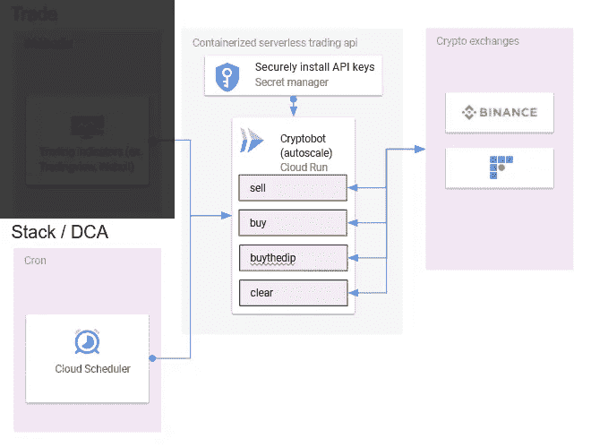
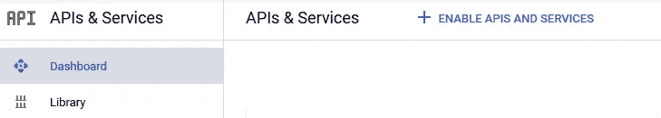
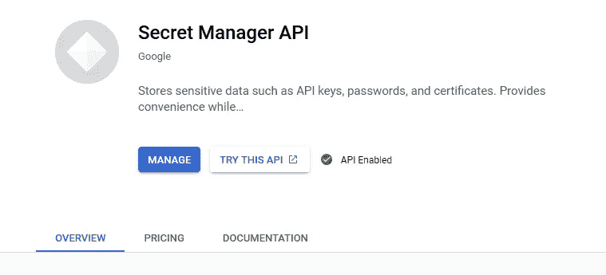
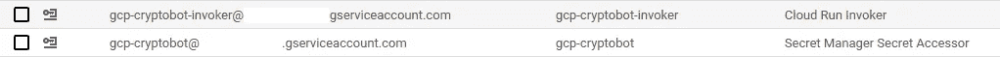
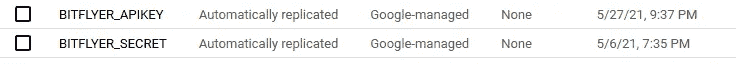
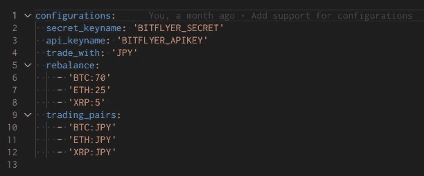
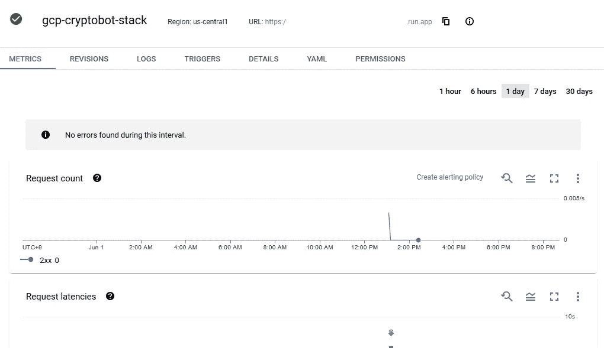

# 设置指南:使用 gcp-cryptobot 自动执行 DCA 和清算 wicks 计划

> 原文：<https://medium.com/coinmonks/setup-guide-automate-dca-and-plan-for-liquidation-wicks-with-gcp-cryptobot-32414ef72251?source=collection_archive---------2----------------------->


Photo by [Alexander Schimmeck](https://unsplash.com/@alschim?utm_source=medium&utm_medium=referral) on [Unsplash](https://unsplash.com?utm_source=medium&utm_medium=referral)

这篇文章延续了我之前的博文，讲述了[我如何编写一个无服务器应用程序来自动化我的加密货币购买。](/coinmonks/i-wrote-a-serverless-app-to-automate-my-cryptocurrency-purchases-17c9a869d0c7)如果您还没有通读这篇文章，我建议您快速阅读一下，以了解架构和设计决策。

这一次我们将更深入地解释在 GCP(谷歌云平台)上将应用程序设置为美元平均成本的步骤，并计划在加密货币交易所如 [Bitflyer](https://bitflyer .com/invitation?id=4cjf5hxe&lang=en-JP) 上购买(如果你住在日本)。你需要一些编程和使用 docker 的背景知识才能继续。

> 请仔细查看[源代码](https://github.com/kalanyuz/gcp-cryptobot)以了解它在任何服务上运行之前是如何工作的。

首先，我们需要一个 GCP 项目。如果你还没有，你可以试用 3 个月[这里](https://cloud.google.com/free/?utm_source=google&utm_medium=cpc&utm_campaign=japac-AU-all-en-dr-bkws-all-all-trial-b-dr-1009882&utm_content=text-ad-none-none-DEV_c-CRE_498553313004-ADGP_Hybrid%20%7C%20BKWS%20-%20BMM%20%7C%20Txt%20~%20GCP%20~%20Trial%20_%20Free%20Tier-KWID_43700060832204675-kwd-1180531753169&userloc_1009343-network_g&utm_term=KW_%2Bgcp%20%2B300%20%2Bfree&gclid=Cj0KCQjwktKFBhCkARIsAJeDT0i02OTjHziPZO5q5MyzAXMJ0AL3qX5siFh6Q8DvQFjBN_7einTODgAaAvI3EALw_wcB&gclsrc=aw.ds)。因为云运行比例为零。谷歌提供的 300 美元信用对于这个应用程序来说绰绰有余，并允许您探索其他 GCP 服务。



We’ll be covering the stacking / DCA setup part today and you won’t be needing any 3rd party indicator alert subscription.

# 先决条件

*   [码头工人](https://docs.docker.com/get-docker/)
*   [gcloud 命令行工具](https://cloud.google.com/sdk/gcloud)

然后确保您已经在 GCP 启用了这些服务。(我有帮助解释每个产品的链接，如果你想了解更多的话。)

*   [云调度器](https://www.google.com/url?sa=t&rct=j&q=&esrc=s&source=web&cd=&cad=rja&uact=8&ved=2ahUKEwjx37HA-fPwAhWu3mEKHZdcBJUQFjABegQICRAE&url=https%3A%2F%2Fcloud.google.com%2Fscheduler%2F%3Fhl%3Dja&usg=AOvVaw30C0x53bpeF0oWpZZfgh_l)
*   [秘密经理](https://cloud.google.com/secret-manager)
*   [云容器注册表](https://cloud.google.com/container-registry)
*   [云运行](https://cloud.google.com/run)

为此，请使用侧边菜单或顶部的搜索栏从 Google Cloud 控制台访问 API & Services 菜单。寻找显示“启用 API 和服务”的按钮



然后使用上面列出的名称搜索服务并启用它们。一旦启用，您将会看到这样的屏幕。



Once you see the green checkmark for all the services above, you are almost good to go!

接下来，我们将需要两个服务帐户:
-云运行:w/role*Secret Manager Secret Accessor*
-云调度器 w/ role *云运行调用者*



What you’ll see in your IAM & Admin page after you have created both service accounts.

也可以用你的电子邮件作为服务帐户做任何事情，因为它拥有“*所有者*”角色，允许你访问每一个资源，这不是一个好的安全实践。

# 将您的 API 密钥放入 Secret Manager

您将把来自 [bitflyer](https://bitflyer .com/invitation?id=4cjf5hxe&lang=en-JP) 的 API 密钥和秘密放在这里，并相应地命名它们。这些键名稍后将在应用程序'`s config.bitflyer.sample.yaml`配置文件中使用。我们把它们分别命名为`BITFLYER_APIKEY`和`BITFLYER_SECRET`。



These names will be referred to by our app code. Remember to not give these keys more rights than necessary.

# 创建应用程序的容器映像

假设您已经克隆了存储库，并确认测试运行正常，现在我们将应用程序放在云上运行。既然我们讨论的是 Bitflyer，那么在部署之前让我们先来看看`config.bitflyer.sample.yaml`。



What my config file looks like.

下面是对配置文件功能的简要描述:

*   secret_keyname:您在 GCP 的秘密管理器中使用的密钥名称。
*   api_keyname:你在 GCP 的秘密管理器中使用的密钥名。
*   trade_with:应用程序将交易的货币。如果你住在日本，并且正在使用 Bitflyer，那么只能使用 JPY。
*   再平衡:用于活跃交易中的资产再平衡，本次不需要**。**
*   trading_pairs:收到指标调用时允许交易的资产。**如果您使用此处未指定的货币提出请求，将会被拒绝。**

一旦您确认您已经在配置文件设置中正确地获得了秘密名称，让我们构建 docker 映像并把它放到云映像注册表中。

```
# if this is your first time pushing a docker image to GCP
# additional steps with 
# auth login / auth application-default login may be neccessarygcloud auth configure-docker
gcloud set project [YOUR_GCP_PROJECT_NAME]# in the app directory
docker build . -t gcr.io/[YOUR_GCP_PROJECT_NAME]/[YOUR_IMAGE_NAME]:latestdocker push gcr.io/[YOUR_GCP_PROJECT_NAME]/[YOUR_IMAGE_NAME] --all-tags
```

# 将应用程序放在云上运行

完成上述步骤后，应用程序的容器图像将被上传到 Google 的云图像注册表，您可以使用可配置的风格进行部署。

部署应用程序时，目前有 3 个环境变量需要配置:

```
# if the app should intercept and reject requests from unknown source
- GUARD
# the exchange the app will be connecting to
- EXCHANGE
# name of the config file to load in src/services/config/
- CONFIGFILE
```

由于我们没有从交易视图接收到任何交易信号，并且将专门从 Cloud Scheduler 调用该应用程序，因此我们将使用以下[命令](https://cloud.google.com/sdk/gcloud/reference/run/deploy)部署该应用程序:

```
gcloud run deploy [SERVICE_NAME] \
--image=gcr.io/[YOUR_GCP_PROJECT_NAME]/[YOUR_IMAGE_NAME]:latest \
--concurrency=1 --max-instances=2 --timeout=60 --region=[REGION] \ --memory=128Mi --port=8080 \  
--set-env-vars=GUARD=none,EXCHANGE=bitflyer,\
CONFIGFILE=[CONFIG_FILE] \ --no-allow-unauthenticated --[service-account=](mailto:service-account=gcp-cryptobot@winston-ai.iam.gserviceaccount.com)[SERVICE_ACCOUNT_EMAIL_ADDRESS] --platform=managed
```

这将应用程序部署到最低层实例类型的云运行(以节省成本)，不使用任何拦截器，并连接到 Bitflyer exchange。

如果部署命令通过，那么恭喜你！您的第一个加密货币机器人安全地运行在 Cloud Run 上。要检查您的部署状态，包括您可以访问服务的 URL，请访问云运行菜单并选择您的服务。我们将需要 URL 来设置自动购买的云调度程序。

**不要将此 URL 分享给任何人。**



Note the URL right next to your service name. We’ll be needing that in the next step.

现在，你们中的一些人可能想直接发送请求来测试应用程序是否正常工作，结果却收到了错误代码。这是因为我们在部署应用程序时使用的`--no-allow-unauthenticated`将阻止所有传入的连接，只要它们不是由您的`SERVICE_ACCOUNT_EMAIL_ADDRESS`调用的。如果向它发出请求的实体也在你的 GCP 项目中(例如云调度器)。

# 使用云调度程序自动购买

现在到了点睛之笔！让我们转到云调度页面，实现购买自动化。我将演示两个场景，但是您可以修改它来制定您自己的策略！

## **每周 0.001 比特币周一早上 7 点买 DCA。**

在“云调度程序”页面中，单击“创建作业”并填写这些字段

*   姓名:你的工作名称(例如。cryptobot-dca)
*   频率:0 7 * * 1(如果您是 crons 新手，请访问 [crontab.guru](http://crontab.guru/) 以获得帮助)
*   时区:您所在的时区，以匹配上面的 cron
*   目标类型:HTTP
*   网址:你的云跑 app 的网址，带`/exchange/buy`路径
*   HTTP 方法:POST
*   HTTP 头:`Content-Type: application/json`
*   认证头:OIDC 令牌
*   服务账户:您拥有*云运行调用者*角色的服务账户
*   受众:您的云跑应用的 URL
*   正文:`{"asset":"BTC","denominator":"JPY","amount":0.001}`

## **Grid bids 每天下午 1 点重新计算，为甜蜜的闪电暴跌买入做计划。**

*   姓名:你的工作名称(例如。cryptobot-dip)
*   频率:0 13 * * *
*   时区:您所在的时区，以匹配上面的 cron
*   目标类型:HTTP
*   URL:您的云跑 app 的 URL，带`/exchange/buythedip`路径
*   HTTP 方法:POST
*   HTTP 头:`Content-Type: application/json`
*   认证头:OIDC 令牌
*   服务账号:您的*云运行调用者*角色的服务账号
*   受众:您的云跑应用的 URL
*   正文:`{"asset":"BTC","denominator":"JPY","dip":[{"percent":20,"allocation":"20"},{"percent":30,"allocation":40}]}`

这将产生 2 个买入订单:第一个订单将在比特币价格下跌 20%时，用你可用的 20%的法定货币买入比特币。第二个会在比特币价格下跌 30%时，用 40%的可用法定货币购买比特币。这将每天重新计算，旧的购买订单将在下新订单之前清除。

你可能会注意到没有自动销售的例子？那是因为…


Insert diamond hands meme here.

如果您想创建一个退出市场的 DCA 计划，请参考源代码中的`/sell`端点，了解如何创建销售请求。


Click “RUN NOW” to test your scheduler

创建两个调度器后，您可以通过按下“ **RUN NOW** ”按钮来测试它是否正常工作，并查看您的云运行实例日志或 [Bitflyer](https://bitflyer .com/invitation?id=4cjf5hxe&lang=en-JP) 本身。例如，如果对`/buythedip`的请求成功，您应该会看到在您的 Bitflyer 帐户上创建了两个购买订单。

# 享受堆叠的时间到了！

这就是自动化 DCA 的教程。下一次，我们将讨论如何设置 gcp-cryptobot 根据交易视图中的指标信号对币安采取买入和卖出行动。

同样，如果你喜欢机器人的想法，并愿意做出贡献，请随时创建一个问题或提交一份公关！

## 也阅读

*   [什么是融资融券交易](https://blog.coincodecap.com/margin-trading) | [成本平均法](https://blog.coincodecap.com/dca)
*   [3 商业评论](/coinmonks/3commas-review-an-excellent-crypto-trading-bot-2020-1313a58bec92) | [Pionex 评论](/coinmonks/pionex-review-exchange-with-crypto-trading-bot-1e459d0191ea) | [Coinrule 评论](/coinmonks/coinrule-review-2021-a-beginner-friendly-crypto-trading-bot-daf0504848ba)
*   [莱杰 vs n 格拉夫](/coinmonks/ledger-vs-ngrave-zero-7e40f0c1d694) | [莱杰纳诺 s vs x](/coinmonks/ledger-nano-s-vs-x-battery-hardware-price-storage-59a6663fe3b0) | [币安评论](/coinmonks/binance-review-ee10d3bf3b6e)