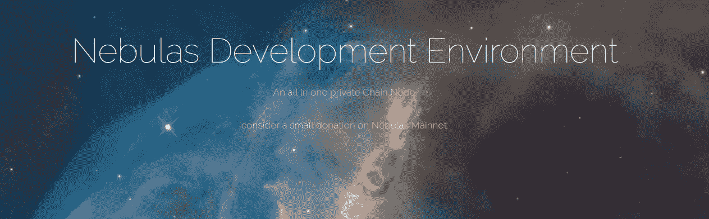
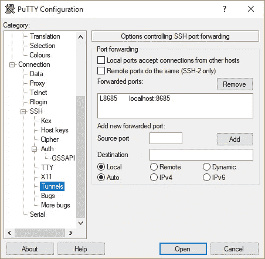
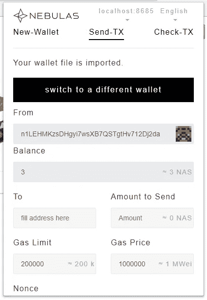
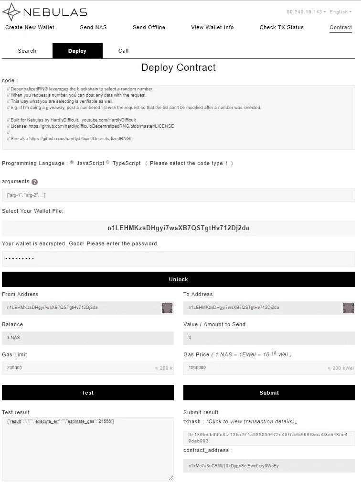

# 设置 Nebulas 开发环境

> 原文：<https://medium.com/coinmonks/setup-nebulas-development-environment-b8f8f022b170?source=collection_archive---------5----------------------->



# 第一次部署 dApp 的演练

我最近发现了 Nebulas，这是第三代区块链，已经成为一个功能性的 mainnet，以及世界各地数量惊人的代码/应用程序/dapp 和开发者。

撰写本文时， [Nebulas 激励计划](https://nebulas.io/incentive.html)仍在进行中。虽然距离我最后一次开发代码已经过去了一段时间，但是我想我应该试一试。成功提交一个 dApp 给程序将会得到至少 100 个 NAS 的奖励(现在大约 550 美元)。所以，值得一试。

Nebulas 位于中国，所以很多文档还没有翻译。我花了很长时间才真正开始编写代码。因此，我将为你在星云上部署的第一个 dApp 提供详细的指南。

我在一台 Windows 10 电脑上，但是 Nebulas-Node 的 Windows 代码还没有发布，所以我们需要覆盖它。我想做快速开发/测试，所以在本地文件上工作会很棒。

本指南将涵盖以下几点:

1.  指出信息/代码的重要来源
2.  设置虚拟机，运行“私有网络”
3.  设置“私人网络”的地址
4.  为开发设置您的电脑
5.  将一个简单的 dApp 部署到“Privatenet”
6.  编辑部署的 dApp 的前端

# 1.信息/代码的重要来源

目前，有大量的资源可以了解星云。但是它们分布在整个网络中。

以下是我发现的最重要的几个:

*   [星云 Github](https://github.com/nebulasio)::D 所有代码的来源
*   [Nebulas Github Wiki](https://github.com/nebulasio/wiki) :这份文档已经比大多数其他区块链项目都要好。特别是 [FAQ](https://github.com/nebulasio/wiki/blob/master/FAQ_nebulas_development_en.md) 解决了很多问题。
*   这里有非常好的解释和样本代码。
*   [视频教程#1](https://www.youtube.com/watch?v=cQBM4xwcGZw&t=1095s) :这个由[提供的视频几乎不难](https://www.youtube.com/channel/UC3bHnBF2Q-u-1NEYG0Xwgeg)展示了一个 dApp 在 Mainnet 上的完整部署。事实上，我们将部署相同的 [dApp](https://github.com/hardlydifficult/DecentralizedRNG) ！
*   如何在星云上建造 DApp(第一部分)
*   [星云 Howto 第二部分](/nebulasio/how-to-build-a-dapp-on-nebulas-part-2-5424789f7417):如何在星云上建造 DApp(第三部分)
*   [星云 Howto 第三部分](/nebulasio/how-to-build-a-dapp-on-nebulas-part3-3586126aa124):如何在星云上建造 DApp(第三部分)
*   如何在你的 Dapp 中使用 NebPay
*   Nebulas Reddit 部分:适合一般信息和新闻
*   [Nebulas Dev Reddit](https://www.reddit.com/r/nasdev/) :询问开发问题
*   [星云电报群](https://t.me/nebulasio):大聊天群
*   [stack exchange 上的 Nebulas](https://area51.stackexchange.com/proposals/117966/nebulas/118001):面向开发者的 Q & A

# 2.设置虚拟机，运行“私有网络”

最初，我想在 Testnet 上测试，但后来我认为在 pricatechain 上开始测试会很好。这样，我就可以拥有一个快速的专用网络，并能够在区块链上看到控制台输出，并在以后将其部署到 testnet。所以我设置了一个虚拟机来运行 priave 和 testnet。

最简单的方法是在本地或 VPS 上安装一个运行 Ubuntu 16.04 的虚拟机。我选择 Vultr.com[进行测试。一个 10 美元/月的计划可以为节点做到这一点，但 blockexplorer 是在 java 中，它需要 20 美元以上的计划。](https://www.vultr.com/?ref=7097618)

为此，我设置了两个安装脚本。

*   [只安装 Nebulas Node](https://github.com/mirei83/NebNode):如果你已经有了 Ubuntu 系统就可以用这个。它将安装一个全功能 Nebulas 节点所需的所有软件包，如果手动启动，它将作为“Privatenet”或 Testnet/Mainnet 的一个实例运行 Nebulas 的两个实例(私有链所需的)。
*   安装一个“完整的”开发节点:这是一个为星云开发提供更完整环境的尝试。它还会启动一个“Privatenet ”,并为你的 Privatenet 安装 Nebulas wallet、Webfronend 和 Blockexplorer。
    要让它运行，通过 SSH 连接到你的 VPS，让脚本运行:

```
curl -sSL [https://raw.githubusercontent.com/mirei83/NebuEnv/master/SetupEnvironment.sh](https://raw.githubusercontent.com/mirei83/NebuEnv/master/SetupEnvironment.sh) | bash
```

这将基本上做所有的工作。在双核机器上大约需要 15 分钟。您可以简单地检查脚本。目前包括以下任务:

*   安装所有需要的软件包
*   安装 GO
*   安装 RocksDB
*   安装 dep
*   安装星云
*   修改星云，使其能够在单个 VPS 上运行 Privatenet
*   安装 Nebulas 网络钱包
*   为 Privatenet 准备 WebWallet
*   安装 Blockexplorer
*   为 Privatenet 准备 Blockexplorer
*   将 Nebulas + Blockexplorer 置于自动启动模式

这是第一次发布。总有一天会更大。脚本完成后，您可以重启 VPS 或键入

```
./start-nebulas-privatenet.sh
./explorer-privatenet.sh
```

现在，您应该可以通过“ps aux | grep neb”和 log/neb.log 中的条目看到一些“neb”进程

设置完成后，您可以访问 [http://YOUR。NODE.IP.ADD](http://YOUR.NODE.IP.ADD)

# 3.设置“私人网络”的地址

现在我们有了我们的私人网络，我们需要钱包来发送一些私人网络。Privatenet 配置为最初向地址 n1 ff 1 NZ 6 tarkdvwwqkmnnwfpupkuaktpte 提供 5.000.000 个硬币。此外，所有 blockrewards 都将发送到这个地址。该地址的私钥已经在节点上。我们可以从这里分发硬币。但是要做到这一点，我们需要测试地址。

因此，让我们与我们的新区块链互动吧！

去星云目录。这最大限度地减少了未解决的变量问题。

```
cd $GOPATH/src/github.com/nebulasio/go-nebulas
```

从这里，我们可以创建一些测试网地址:

```
./neb account new
```

输入密码并记下新地址。输出应该如下所示:

```
root@Nebulas_Autoinstall:~/go/src/github.com/nebulasio/go-nebulas# ./neb account new
Your new account is locked with a passphrase. Please give a passphrase. Do not forget this passphrase.
Passphrase:
Repeat passphrase:
Address: n1LEHMKzsDHgyi7wsXB7QSTgtHv712Dj2da
```

根据需要经常重复这个动作。

密钥库文件(和一些预设文件)存储在 keydir 文件夹中。在本地复制新创建的钱包(使用 WinSCP)。

```
$GOPATH/src/github.com/nebulasio/go-nebulas/keydir
```

让我们用这个命令检查新钱包的余额:

```
curl -i -H Accept:application/json -X POST http://localhost:8685/v1/user/accountstate -d '{"address":"n1LEHMKzsDHgyi7wsXB7QSTgtHv712Dj2da"}'
```

答案是:

```
{
    "result": {
        "balance": "0",
        "nonce": "0",
        "type": 87
    }
}
```

现在让我们进行第一笔[交易](http://nebulearn.com/official-docs/transactions)！我们将从主钱包中发送 1NAS 到新创建的钱包 n1 lehmkzsdhgyi 7 wsxb 7 qstgthv 712 DJ 2 da。

```
curl -i -H 'Content-Type: application/json' -X POST http://localhost:8685/v1/admin/transactionWithPassphrase -d '{"transaction":{"from":"n1FF1nz6tarkDVwWQkMnnwFPuPKUaQTdptE","to":"n1LEHMKzsDHgyi7wsXB7QSTgtHv712Dj2da", "value":"1000000000000000000","nonce":1,"gasPrice":"1000000","gasLimit":"2000000"},"passphrase":"passphrase"}'
```

现在再次检查余额。

```
curl -i -H Accept:application/json -X POST http://localhost:8685/v1/user/accountstate -d '{"address":"n1LEHMKzsDHgyi7wsXB7QSTgtHv712Dj2da"}'
```

答案是:

```
{
    "result": {
        "balance": "1000000000000000000",
        "nonce": "0",
        "type": 87
    }
}
```

叶哈！区块链起作用了！

# 4.为开发设置您的电脑

现在我们需要一些颜色。我说过了，我在 Windows 上。要开始，需要做一些技巧。所以我会让你免受发现自己的痛苦。

1.  安装 [Chrome 浏览器](https://www.google.de/chrome/index.html)
2.  在 Chrome 上安装 [NebulasExtensionWallet](https://chrome.google.com/webstore/detail/nasextwallet/gehjkhmhclgnkkhpfamakecfgakkfkco) (不是网络钱包)
3.  允许访问 NebulasExtensionWallet 的本地文件，如此处的[所示](https://github.com/nebulasio/WebExtensionWallet)。否则，NebExtWallet 无法正确访问本地前端文件。
4.  在 Chrome 启动时添加“— allow-file-access-from-files”，如图[此处](https://stackoverflow.com/questions/18586921/how-to-launch-html-using-chrome-at-allow-file-access-from-files-mode)。您需要添加这个属性来打开本地 Javascipt 文件。
5.  安装一个代码编辑器( [Visual Code Studio](https://code.visualstudio.com/) 不错)
6.  连接到我们的节点:

为了能够在我们的 Privatenet 中与 WebExtensionWallet 和 NebPay 进行交互，我们需要一个小技巧。
WebExtensionWallet 只能连接到 Mainnet、Testnet 和 localhost。但是我们没有在本地主机上运行的节点，但是我们有一个远程节点。因此，我们需要设置一个端口，通过 SSH 隧道将端口 8685 转发到我们的节点。你可以用[油灰](https://www.chiark.greenend.org.uk/~sgtatham/putty/latest.html)轻松做到这一点，只要保持连接打开:



Putty Portforwarding of port 8685

激活后，WebExtensionWallet 将连接到本地主机，本地主机连接到我们的 Privatenet。酷！

现在，您应该能够在 WebExtensionWallet 中选择“localhost:8685 ”,并打开 privatenet 的 Keystorefile，这是前面复制的。



WebExtensionWallet connects to Privatenet

# 5.将一个简单的 dApp 部署到“Privatenet”

首先:看 HardlyDifficult 的 [Youtube 视频](https://www.youtube.com/watch?v=cQBM4xwcGZw&t=1095s)！这是一个很好的视频。我们将把“[去中心化的”](https://hardlydifficult.github.io/DecentralizedRNG/)”dApp(它也已经在 mainnet 上)部署到您的私有网络上。

1.  从[这里](https://codeload.github.com/hardlydifficult/DecentralizedRNG/zip/master)下载源代码，解压到某处。
2.  有一个文件叫“分散 dRNGContract.js”。该文件包含区块链的智能合约。在编辑器中打开该文件并复制其内容。
3.  签订合同最简单的方式是通过网络钱包，可以从我们在 http://IP.TO.YOUR.VPS/web-wallet 的副总裁那里获得。节点上的 Web-Wallet 将只连接到节点上的 privatenet。
4.  转到合同->部署，并选择一个装有 NAS 的钱包。现在将智能合约粘贴到“代码”中。
5.  单击 Test，结果应该如下所示:

```
{"result":"\"\"","execute_err":"","estimate_gas":"21566"}
```

6.现在按 Submit，合同已经部署好了！

7.记下“合同地址”，我们在本地文件中需要它。



Submitted SmartContract

# 6.编辑部署的 dApp 的前端

现在，我们需要编辑前端，以与我们的智能合同进行交互。

1.  打开文件“分散 dRNG.js”，将合同地址更改为我们刚刚创建的新地址。
2.  打开 results.html，改变

```
var is_mainnet = true;
        var nebulas_chain_id, nebulas_domain; 
        var gas_price = 1000000;
        var gas_limit = 200000;if(is_mainnet) {
            nebulas_chain_id = 1;
            nebulas_domain = "[https://mainnet.nebulas.io](https://mainnet.nebulas.io)";
        } else {
            nebulas_chain_id = 1001;
            nebulas_domain = "[https://testnet.nebulas.io](https://testnet.nebulas.io)";
        }
```

到

```
var is_mainnet = false;
        var nebulas_chain_id, nebulas_domain; 
        var gas_price = 1000000;
        var gas_limit = 200000;if(is_mainnet) {
            nebulas_chain_id = 1;
            nebulas_domain = "[https://mainnet.nebulas.io](https://mainnet.nebulas.io)";
        } else {
            nebulas_chain_id = 100;
            nebulas_domain = "[http://localhost:8](https://testnet.nebulas.io)685";
        }
```

就是这样！我们现在有了与 NebPay 的本地 html/JavaScript 文件交互，以及与我们自己的 privatenet 交互的 NebPay。

# 7.测试 dApp

现在在 chrome 中打开 index.html，与 NebExtentsionWallet 进行交互。

确保 Chrome 以前面提到的属性启动！

如果这篇文章对你有帮助，可以考虑一个小捐赠:n 1 hlsuo 2h 689 wshknwuneamhqixq 7 eeqbek