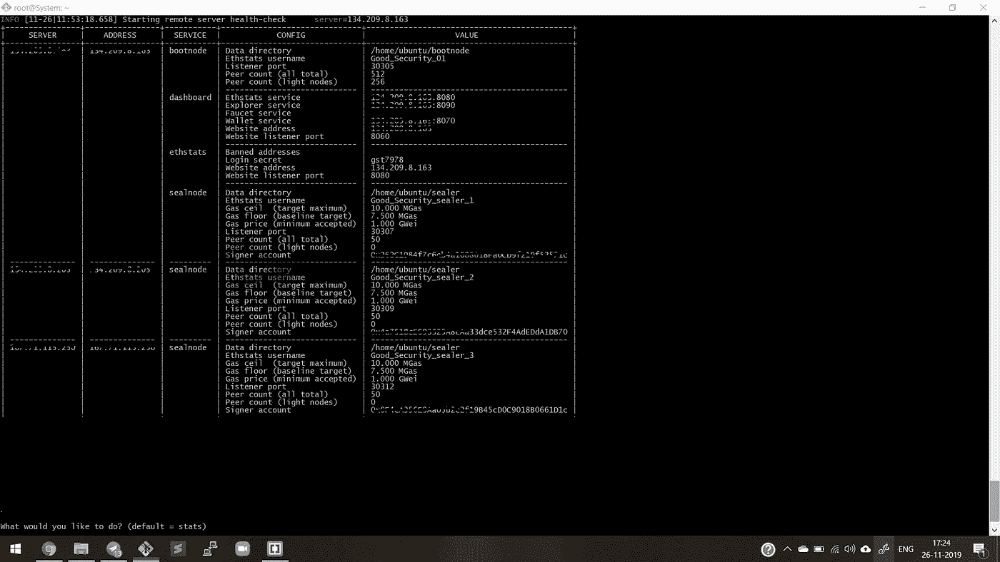

# 使用 Puppet 在数字海洋上建立私有以太网。

> 原文：<https://medium.com/coinmonks/setup-private-ethereum-network-poa-on-degital-ocean-using-puppeth-164b869567a2?source=collection_archive---------1----------------------->

在这篇文章中，我将解释在数字海洋服务器上建立一个私有的区块链以太网的简单方法。在讨论细节之前，我们需要了解什么是权威证明，我不打算解释，但分享一个链接来了解细节[https://www . binance . vision/区块链/Proof-of-Authority-explained](https://www.binance.vision/blockchain/proof-of-authority-explained)

我用的是 Windows 10 系统和 git bash(下载)【https://git-scm.com/downloads T2

让我们开始，我们正在经历一步一步的过程。所以在这篇文章中，我将列出以下清单。

1.  Digital Ocean Droplet 为 1 个控制器和 3 个节点创建并安装必要的包。
2.  PoA 网络、Ethstats & Explorer

**1。数字海洋水滴设置:**在本教程中，我们将在数字海洋上提供 4 个水滴:3 个水滴用于节点，1 个水滴用于控制器。控制器是我们使用 puppeth 进行所有设置的地方。

控制器:最低 1 GBram / 25 GB 磁盘

节点 1: 16 GB 内存/ 320 GB 磁盘

节点 2: 16 GB 内存/ 320 GB 磁盘

节点 3: 16 GB 内存/ 320 GB 磁盘


Controller Droplet configuration


3 Droplet Same configuration

如何创建水滴:[https://www.digitalocean.com/docs/droplets/how-to/create/](https://www.digitalocean.com/docs/droplets/how-to/create/)。使用此链接创建一个 droplet。

```
Controller Ip : <........>
Node1 Ip: <........>
Node2 Ip: <........>
Node3 Ip: <........>Node1: I am going to setup stats , explorer. 
```

**1.1。防火墙设置:**对于 3 个 droplets，我们需要设置名称，如 Node1、Node2、Node3，然后需要打开端口，为此，请转到数字海洋侧边栏，管理- >联网- >防火墙- >创建防火墙，并设置入站。请注意测试 POA 区块链设置的所有设置。


**1.2。准备控制器:**首先，从您的本地机器，打开 git bash 终端 ssh 进入控制器 droplet:

ssh root@ <controller ip="">输入然后键入密码。</controller>

*   **所需的软件包安装:**

```
sudo apt-get update
sudo apt-get upgrade
sudo apt-get install build-essential bison
```

*   **安装 g 版本(Go 版本管理器)**

```
bash < <(curl -s -S -L [https://raw.githubusercontent.com/moovweb/gvm/master/binscripts/gvm-installer](https://raw.githubusercontent.com/moovweb/gvm/master/binscripts/gvm-installer))source ~/.gvm/scripts/gvm
```

*   **去安装**

```
$ gvm install go1.4 --binary 
$ gvm use go1.4 
$ export GOROOT_BOOTSTRAP=$GOROOT 
$ gvm install go1.10.1 
$ gvm use go1.10.1
```

*   **获取克隆体，构建并验证傀儡运行**

```
$ git clone https://github.com/ethereum/go-ethereum.git 
$ cd go-ethereum 
$ make all // if error comes then google "build-essential bison",  and install it install properly.
$ cd build/bin 
$ ./puppethIf puppeth runs normally ctrl + C, press to exit
```


Your Terminal looks like this.

1.  **3。准备节点:**打开 3 git bash 终端，输入 droplet IP

```
1st git bash terminal NODE1 : ssh root@<droplet1 ip>enter , password
2nd git bash terminal NODE2 : ssh root@<droplet2 ip>enter , password
3rd git bash terminal NODE3 : ssh root@<droplet3 ip>enter , password
```

在每个终端(节点 1、节点 2 和节点 3)中运行以下命令

```
**Get the latest package list**sudo apt-get update 
sudo apt-get upgrade**Install Docker related packages**sudo apt-get install \
 apt-transport-https \
 ca-certificates \
 curl \
 software-properties-common**Add and verify Docker official GPG**curl -fsSL https://download.docker.com/linux/ubuntu/gpg | sudo apt-key add -sudo apt-key fingerprint 0EBFCD88**Add Docker repository**sudo add-apt-repository \ 
"deb [arch=amd64] https://download.docker.com/linux/ubuntu \         $(lsb_release -cs) \    
stable"sudo apt-get update**Docker CE, Compose installation**sudo apt-get install docker-ce docker-compose**Add Docker Group and Add Current User** sudo groupadd Docker
sudo usermod -aG docker $USERdocker ps // if this command run perfectly then your nodes are ready.
```

到目前为止，如果你为节点设置了 3 个 Droplet，为控制器设置了 1 个 Droplet，并且所有的包都安装得很好，那么我们现在已经完成了 50%的工作，我们可以开始在以太坊专用网络上工作了。所以让我们开始吧……

**2。POA 网络:**在创建 PoA 网络之前，需要完成一些任务。我们需要 5 个以太坊帐户，为此我们必须创建一个钱包，可以保存帐户的详细信息。为什么我们在建立网络之前需要这个帐号？我们的第一项工作是在控制器中创建一个钱包。

**2.1 钱包**

打开 git bash 并为我的案例键入您的控制器 IP

```
**Log in Controller** ssh root@167.71.122.20
password "your password "**Create Wallet Password** cd ~
nano passfile // set password inside passfile 
sudo perl -pi -e 'chomp if eof' passfile
chmod 700 passfile**Create Account:** i am using for loop to create 7  account using geth.for ((n=0;n<7;n++)); do ./go-ethereum/build/bin/geth account new --password ~/passfile; done
```


Accounts details.

您可以看到创建了 7 个额外的帐户，并分别打开文本编辑器来记录它们。在我的案例中，以下 7 个帐户被分配了与密封者和水龙头相同的角色。

```
**Save in text editor**public address: 0xE214608fAB19971C02f65681B83dD6182b37D98f Keyfile:UTC--2019-11-25T14-23-51.645631116Z--e214608fab19971c02f65581b83dd6182b37d98fsave all 6 account address like this in text editor .**We need Json format key files** $ cd ~/.ethereum/keystore
$ cat UTC--2019-11-25T14-23-51.645631116Z--e214608fab19971c02f65581b83dd6182b37d98f // Example do same things for all 6 key files and save it in text editor so you can use it Sealer 1:
public address: "Your public address
json file : "Your json file " Sealer 2:
public address: "Your public address
json file : "Your json file "Sealer 3:public address: "Your public address
json file : "Your json file "Save like this 
```

## 使用 Puppet 定义 POA 网络

```
Launch puppeth :  ./go-ethereum/build/bin/puppeth
```

木偶运行屏幕

```
+-----------------------------------------------------------+ |Welcome to puppeth, your Ethereum private network manager  |                                                          | This tool lets you create a new Ethereum network down to  |       | the genesis block, bootnodes, miners and ethstats servers |       | without the hassle that it would normally entail.         |       | Puppeth uses SSH to dial in to remote servers, and builds |       | its network components out of Docker containers using the |        | docker-compose toolset.                                   | 
+-----------------------------------------------------------+ Please specify a network name to administer (no spaces or hyphens, please) > poa     // name this 
```

## Genesis 块设置


```
Which consensus engine to use? (default = clique) 
1\. Ethash - proof-of-work  
2\. Clique - proof-of-authority 
> 2How many seconds should blocks take? (default = 15) 
> 5Which accounts are allowed to seal? (mandatory at least one)
0xE214608fAB19971C02f65581B83dD6182b37D98f
0x type your public address you save in a editor//Note:  i am using one public addressWhich accounts should be pre-funded? (advisable at least one)
>0xE214608fAB19971C02f65581B83dD6182b37D98f // i am using one
>0X 'Type more then one public address for pre- funding'Specify your chain/network ID if you want an explicit one (default = random)> 
INFO [11-25|14:50:26.561] Configured new genesis blockWhat would you like to do? (default = stats) 
1\. Show network stats  
2\. Manage existing genesis  
3\. Track new remote server  
4\. Deploy network components 
> 21\. Modify existing fork rules  
2\. Export genesis configuration  
3\. Remove genesis configuration 
> 2Which file to save the genesis into? (default = poa.json)  
> genesis.jsonWhat would you like to do? (default = stats)  
1\. Show network stats  
2\. Manage existing genesis  
3\. Track new remote server  
4\. Deploy network components
>2What would you like to do? (default = stats)  
1\. Show network stats  
2\. Manage existing genesis  
3\. Track new remote server  
4\. Deploy network components 
> 4
```

**使用傀儡进行 Ethstats 设置**

```
What would you like to deploy? (recommended order)  
1\. Ethstats  - Network monitoring tool  
2\. Bootnode  - Entry point of the network  
3\. Sealer    - Full node minting new blocks  
4\. Explorer  - Chain analysis webservice (ethash only)  
5\. Wallet    - Browser wallet for quick sends  
6\. Faucet    - Crypto faucet to give away funds  
7\. Dashboard - Website listing above web-services 
> 1# Choose where to deploy (no list since there are no servers connected yet) choice 1Which server do you want to interact with?  
1\. Connect another server 
> 1 What is the remote server's address       ([username[:identity]@]hostname[:port])?                
> [ip of Node1]The authenticity of host '[ip of poa-worker01]:22 ([ip of poa-worker01]:22)' can't be established. SSH key fingerprint is ba:...5e [MD5]Are you sure you want to continue connecting (yes/no)? yesWhich port should ethstats listen on? (default = 80) 
> 8080Allow sharing the port with other services (y/n)? (default = yes) 
> nWhat should be the secret password for the API? (must not be empty) > api7080#now you can see the magic .
#open the google crome and type   http://<ip of Node1>:8080
```


## 在节点 1 上部署 Bootnode

引导节点的唯一目的是帮助节点发现彼此。节点可以有动态 IP，关闭后再打开。引导节点通常运行在静态 IP 上，因此就像一个酒馆，节点知道它们会在那里找到自己的伙伴。

```
What would you like to do? (default = stats)  
1\. Show network stats  
2\. Manage existing genesis  
3\. Manage tracked machines  
4\. Manage network components 
> 4#Don't chose 1 
1\. Tear down Ethstats on [ip of poa-worker01]  
2\. Deploy new network component 
> 2What would you like to deploy? (recommended order)  
1\. Ethstats  - Network monitoring tool  
2\. Bootnode  - Entry point of the network  
3\. Sealer    - Full node minting new blocks  
4\. Explorer  - Chain analysis webservice (ethash only)  
5\. Wallet    - Browser wallet for quick sends  
6\. Faucet    - Crypto faucet to give away funds  
7\. Dashboard - Website listing above web-services 
> 2Which server do you want to interact with?  
1\. [ip of Node1]  
2\. Connect another server 
> 1Where should data be stored on the remote machine? 
> /home/ubuntu/bootnode/Which TCP/UDP port to listen on? (default = 30303) 
> 30306How many peers to allow connecting? (default = 512) 
>How many light peers to allow connecting? (default = 256) 
>What should the node be called on the stats page? 
> poabootnode#open the google crome and type   **http://<ip of Node1>:8080**
#You can see the bootnode added in ethstats.
# log in Node1 qhbhuji09
```

## 将密封器部署到节点 1

现在，我们将为节点 1 部署密封器，并为节点 2 和节点 3 做同样的事情。

```
#after deployment of boot node you can see down comments list.What would you like to do? (default = stats)  
1\. Show network stats  
2\. Manage existing genesis  
3\. Manage tracked machines  
4\. Manage network components 
> 41\. Tear down Ethstats on [ip of Node1]  
2\. Tear down Bootnode on [ip of Node1]  
3\. Deploy new network component 
> 3What would you like to deploy? (recommended order)  
1\. Ethstats  - Network monitoring tool  
2\. Bootnode  - Entry point of the network  
3\. Sealer    - Full node minting new blocks  
4\. Explorer  - Chain analysis webservice (ethash only)  
5\. Wallet    - Browser wallet for quick sends  
6\. Faucet    - Crypto faucet to give away funds  
7\. Dashboard - Website listing above web-services 
> 3Which server do you want to interact with?  
1\. [ip of Node1]  
2\. Connect another server 
> 1Where should data be stored on the remote machine? 
> /home/ubuntu/sealer Which TCP/UDP port to listen on? (default = 30303) 
> 30307How many peers to allow connecting? (default = 50) 
>How many light peers to allow connecting? (default = 0) 
> What should the node be called on the stats page?
> "Type any name "Please paste the signer's key JSON:
>  "paste Sealer one Jeson "What's the unlock password for the account? (won't be echoed) 
> "Type password you save in nano file"What gas limit should empty blocks target (MGas)? (default = 7.500) >What gas limit should full blocks target (MGas)? (default = 10.000) >What gas price should the signer require (GWei)? (default = 1.000)
># now see the magic "**http://<ip of Node1>:8080"**
```

## poa-worker02、poa-worker03 上的密封器展开

*   上述过程应该执行两次，分别是节点 2 和节点 3。完成节点 1、节点 2、节点 3 缩放器设置后，输出如下。



You can see This kind of out put

## **创建一个块**

在 3 个节点设置后，您可以看到在 <ip of="" node1="">:8080 中创建的一些块。但是一段时间后，块的创建停止了。</ip>

您必须使用 add Peer 命令手动添加节点。

```
Connect to Node1\. #open bash terminal $ssh root@<Node1 IP>
$ password$docker ps
```


```
$docker exec -it <put container_id> geth attach ipc:/root/.ethereum/geth.ipc> admin.nodeInfo.enode 
"enode://e21..........@[ip of Node1]: 30307" 
> exit#do same things for Node2 and Node3# save all 3re Node admin.nodeInfo.enode out put 
# Node1 : "enode://e21..........@[ip of Node1]: 30307"
# Node2 : "enode://...................................
# Node3 : "enode://...................................Help: [https://github.com/ethereum/go-ethereum/wiki/Connecting-to-the-network](https://github.com/ethereum/go-ethereum/wiki/Connecting-to-the-network)
```

输入在 poa-worker02，03 上运行的 sealnode 的 enode 地址。

```
#Node1 $docker exec -it <put container_id> geth attach ipc:/root/.ethereum/geth.ipc> admin.addPeer("Node2 enode")
> admin.addPeer("Node3 enode")
> net.peerCount##Some useful Eth Geth Commands# net.listening
# net.peerCount
# admin.peers
# eth.getBalance(eth.coinbase)
# personal.unlockAccount(eth.coinbase, "password")
# eth.sendTransaction({from:eth.coinbase, to: "address", value: web3.toWei(10, "ether")}) 
```


**Explorer:** 使用历史余额图表和交易、交易散列、令牌、块计时、账户历史等跟踪以太坊地址的投资组合。

```
# go to controller Launch puppeth :  ./go-ethereum/build/bin/puppeth> poaWhat would you like to do? (default = stats)1\. Show network stats2\. Manage existing genesis3\. Manage tracked machines4\. Manage network components> 41\. Tear down Sealnode on Node1 Ip
2\. Tear down Sealnode on Node2 Ip
3\. Tear down Ethstats on Node1 Ip
4\. Tear down Bootnode on Node1 Ip
5\. Tear down Sealnode on Node3 Ip
9\. Deploy new network component> 9What would you like to deploy? (recommended order)1\. Ethstats  - Network monitoring tool
2\. Bootnode  - Entry point of the network
3\. Sealer    - Full node minting new blocks
4\. Explorer  - Chain analysis webservice
5\. Wallet    - Browser wallet for quick sends
6\. Faucet    - Crypto faucet to give away funds
7\. Dashboard - Website listing above web-services> 4Which server do you want to interact with?1\. Node1 Ip
2\. Node2 Ip
3\. Node3 Ip
4\. Connect another server> 1Which port should the explorer listen on? (default = 80)> 8090Allow sharing the port with other services (y/n)? (default = yes)> nWhere should node data be stored on the remote machine?>  /home/ubuntu/explorerWhere should postgres data be stored on the remote machine?> /home/ubuntu/dataWhich TCP/UDP port should the archive node listen on? (default = 30303)> 30309What should the explorer be called on the stats page?> Explorer#  now see the magic "**http://<ip of Node1>:8090"**
```


## 剩余组件

还有更多的组件可以通过木偶部署。在你身边使用和测试。

```
1\. Ethstats  - Network monitoring tool 
2\. Bootnode  - Entry point of the network 
3\. Sealer    - Full node minting new blocks 
4\. Explorer  - Chain analysis webservice (ethash only) 
5\. Wallet    - Browser wallet for quick sends 
6\. Faucet    - Crypto faucet to give away funds 
7\. Dashboard - Website listing above web-services
```

接下来，我们将把我们的 eth 私有区块链连接到 meta mask，并部署智能合约。

## **参考**

[](/@collin.cusce/using-puppeth-to-manually-create-an-ethereum-proof-of-authority-clique-network-on-aws-ae0d7c906cce) [## 使用 puppet 在 AWS 上手动创建以太坊授权证明(Clique)网络

### Puppet 使得部署和管理一个小团体的权威网络变得不那么痛苦。

medium.com](/@collin.cusce/using-puppeth-to-manually-create-an-ethereum-proof-of-authority-clique-network-on-aws-ae0d7c906cce) [](https://steemit.com/ethereum/@dlgusdn616/aws-puppeth-ethereum-private-blockchain-poa) [## 구축하기 -斯蒂米特 AWS와 Puppeth를 활용한以太坊私人区块链(POA)

### 포스팅 목적: 일반적으로列兵 network를구축할때필요한까다롭고다소번거로운작업들을빠르고효율적으로할수있는puppeth의사용법과·奥斯·ec2에게각역할(faucet…

steemit.com](https://steemit.com/ethereum/@dlgusdn616/aws-puppeth-ethereum-private-blockchain-poa) 

> 加入 Coinmonks [电报频道](https://t.me/coincodecap)和 [Youtube 频道](https://www.youtube.com/c/coinmonks/videos)了解加密交易和投资

# 另外，阅读

*   [比特币基地 vs 瓦济克斯](https://coincodecap.com/coinbase-vs-wazirx) | [比特鲁点评](https://coincodecap.com/bitrue-review) | [波洛涅克斯 vs 比特克斯](https://coincodecap.com/poloniex-vs-bittrex)
*   [德国最佳加密交易所](https://coincodecap.com/crypto-exchanges-in-germany) | [Arbitrum:第二层解决方案](https://coincodecap.com/arbitrum)
*   [币安交易机器人](/coinmonks/binance-trading-bots-d0d57bb62c4c) | [OKEx 评论](/coinmonks/okex-review-6b369304110f) | [Atani 评论](https://coincodecap.com/atani-review)
*   [最佳加密交易信号电报](/coinmonks/best-crypto-signals-telegram-5785cdbc4b2b) | [MoonXBT 评论](/coinmonks/moonxbt-review-6e4ab26d037)
*   如何在 Bitbns 上购买柴犬(SHIB)币？ | [买弗洛基](https://coincodecap.com/buy-floki-inu-token)