# 在 macOS 上设置私有以太坊节点

> 原文：<https://medium.com/coinmonks/setup-private-ethereum-node-on-macos-9c825da455d8?source=collection_archive---------8----------------------->

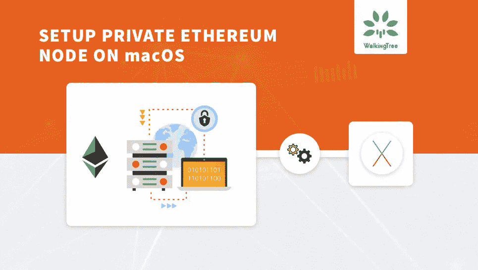

**以太坊**是加密货币的流行平台。为了确保你的合同能在主网络上完美运行，通过设置一个合适的私有节点在**以太坊**节点上测试它们是很重要的。

作为我的[上一篇文章](https://walkingtree.tech/setting-ethereum-development-environment-macos/)的一部分，您学习了如何在 macOS 上设置**以太坊**开发环境。接下来，在本文中，你将学习如何在 macOS 上设置私有**以太坊**节点。

# 先决条件

*   对区块链和以太坊的基本了解
*   [Geth](https://github.com/ethereum/go-ethereum/wiki/geth) (如何安装，参见[篇](https://walkingtree.tech/setting-ethereum-development-environment-macos/))

# 细节

**设置私有以太坊节点的步骤如下:**

1.  创建创世块
2.  私有节点的初始化
3.  创建帐户
4.  正在启动私有节点
5.  正在初始化私有节点的控制台
6.  geth 控制台的常用命令
7.  在两个账户之间进行交易并检查其余额
8.  停止私有节点

**您将在下面看到每个步骤的详细信息:**

为了存储私有节点的帐户和数据库，我们需要创建一个如下所示的目录，

```
***mkdir <directory name>***
```

作为本文的一部分，我将创建目录名为' **private**

```
***mkdir private***
```

将目录更改为区块链，

```
***cd private***
```

# 1.创造创世块

*   创世纪区块是区块链的第一块
*   它定义了私有节点的初始行为
*   为了使 genesis block 与 geth 兼容，我们将使用 **Puppeth** 工具
*   [Puppeth](https://github.com/puppeth) —命令行工具，默认情况下随 geth 一起提供
*   从上面创建的私有目录在终端中运行以下命令:

```
***puppeth***
```

这将在终端中显示以下输出:

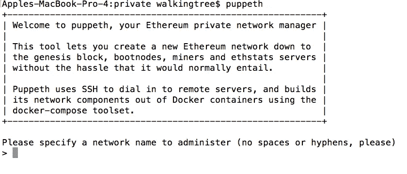

*   下图将向您展示不同的选项及其正确的值，请查看这些图片了解更多详细信息:

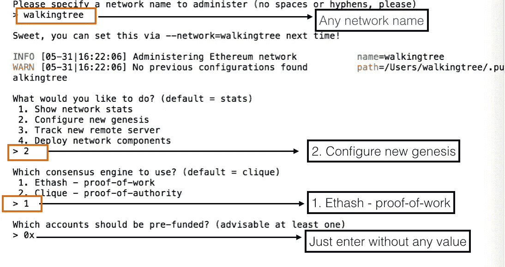

*   现在键入 **control + c** 退出工具。
*   这样，你的创世纪模块就成功创建了
*   要查看私有目录的内容，请键入以下命令:

***ls***

*   这将显示你的名为 **walkingtree.json:** 的创世纪块

# 2.私有节点的初始化

*   要初始化私有的**以太坊**节点，您需要 genesis 文件，让我们使用在前面步骤中创建的 **walkingtree.json**
*   使用以下命令创建私有节点:

***geth–data dir。init walking tree . JSON***

*   **以下是对各个参数选项**的解释
*   –datadir 参数代表数据目录，用于存储将要保存的私有节点数据
*   。(点号)代表当前目录
*   Init 参数，用于指定初始化私有节点的源块
*   **注意** —确保从私有目录运行上述命令
*   执行上述命令后，将创建以下两个新目录
*   **geth** —存储区块链实例数据
*   **密钥库** —在节点上存储您的帐户
*   键入以下命令以查看私有目录的内容:

***ls***

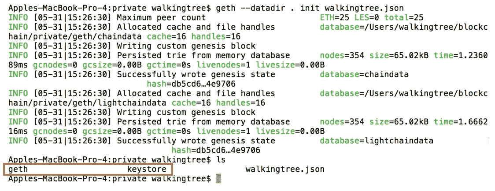

# 3.创建帐户

*   使用以下命令创建新帐户:

***geth–data dir。*账号新建**

*   执行上述命令后，它会要求您输入密码，并提供密码，请参考下图:
*   以上步骤将创建一个新的帐户，你可以运行以上命令，次数不限。
*   作为本文的一部分，我将创建另一个帐户，以便我们可以将一些乙醚转移到另一个帐户。
*   请参见下面创建的另一个帐户的图片:
*   您新创建的帐户存储在密钥库目录中，运行以下命令查看密钥库目录的内容:

***ls 密钥库/***

输出见下图:

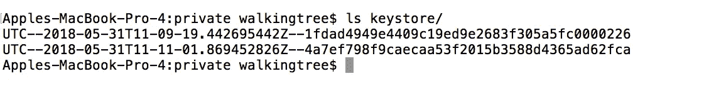

# 4.正在启动私有节点

*   为了启动我们的私有**以太坊**节点，在**私有**目录中创建一个名为 **startmynode.sh** 的文件。
*   将以下命令复制到文件中并保存

```
***geth –networkid 4224 –mine –minerthreads 1 –datadir “~/blockchain/private” –nodiscover –rpc –rpcport “8545” –port “30303” –rpccorsdomain “*” –nat “any” –rpcapi eth,web3,personal,net –unlock 0 –password ~/blockchain/private/password.sec –ipcpath “~/Library/Ethereum/geth.ipc”***
```

*   使用以下命令使 **startmynode.sh** 可执行:

```
***sudo chmod +x startmynode.sh***
```

*   要了解 geth 命令行选项，请参考下面的 URL:
    [https://github . com/ether eum/go-ether eum/wiki/Command-Line-Options](https://github.com/ethereum/go-ethereum/wiki/Command-Line-Options)
*   启动网络时，注意以下事项:
*   正在启动对等节点
*   已初始化的链配置(config = " { ChainID:4224 Homestead:1 DAO:<nil>DAO support:false EIP 150:2 EIP 155:3 EIP 158:3 拜占庭:4 君士坦丁堡:<nil>引擎:ethash} ")</nil></nil>
*   正在初始化以太坊协议(版本="[63 62]"网络=4224)
*   IPC 端点已打开(URL =/Users/walking tree/Library/ether eum/geth . IPC)
*   HTTP 端点已打开(url=http://127.0.0.1:8545)
*   未锁定的帐户(地址= 0x 1 fdad 4949 e 4409 c 19 ed 9 e 2683 f 305 a5fc 0000226)
*   交易池价格阈值已更新(价格=18000000000)
*   开始采矿作业
*   提交新的采矿工作(数量=1 事务=0 叔伯=0 已用时间=361.017 秒)
*   正在生成 DAG(epoch = 0 percentage = 99 elapsed = 2m 36.072s)
*   生成的 ethash 验证缓存(epoch=0 elapsed=2m36.075s)
*   成功密封新块(编号=1 哈希=314549…6cd344)
*   已开采的潜在区块(编号=1 哈希=314549…6cd344)
*   块到达规范链(number=2 hash=d1cb43…2c886f)

如果您在启动网络时观察到以上所有项目，那么，**太好了…！您的以太坊私有节点已成功设置**

# 5.正在初始化私有节点的控制台

*   要打开 geth 控制台，请打开终端的新标签/窗口(保持您的私有节点运行)
*   使用以下命令连接 geth 控制台:

**geth attach**

*   这将打开运行 geth 实例的控制台，它的 JavaScript 控制台:

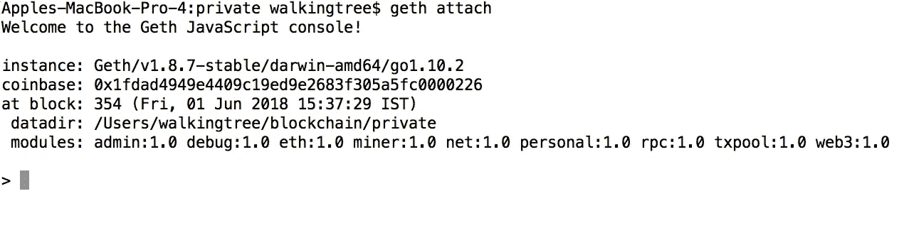

*   您可以从控制台执行各种 geth 命令。有关命令的更多详细信息，请参考下一节。

# 6.geth 控制台的常用命令

*   以下是最常用的命令列表:
*   **eth.accounts** —显示在以太坊节点注册的账户列表
*   **eth.coinbase** —显示用于采矿的主账户的地址
*   **eth . get balance(eth . accounts[1])**—显示节点上账户数组第一个索引处的账户余额
*   **miner.start()** —在节点上开始挖掘过程
*   **miner.stop()** —停止节点上的挖掘过程
*   有关更多命令，请参考以下链接:

[https://github.com/ethereum/wiki/wiki/JavaScript-API](https://github.com/ethereum/wiki/wiki/JavaScript-API)

# 7.在两个账户之间进行交易并检查其余额

*   现在让我们使用这个控制台在两个帐户之间进行一些交易
*   获取节点上的帐户列表:

```
***eth.accounts***
```

输出见下图:

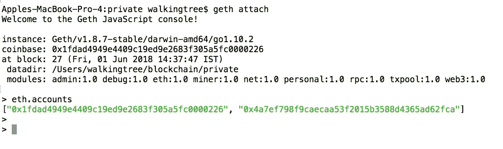

*   要获取 coinbase 帐户地址:

```
***eth.coinbase***
```

输出见下图:

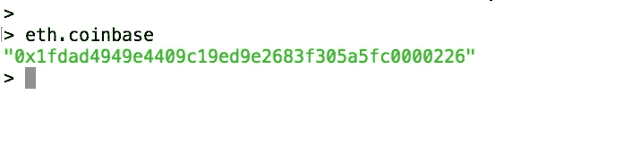

*   检查 coinbase 帐户的余额:

```
***web3.fromWei(eth.getBalance(eth.coinbase),”ether”)***
```

以下是上述命令的输出:

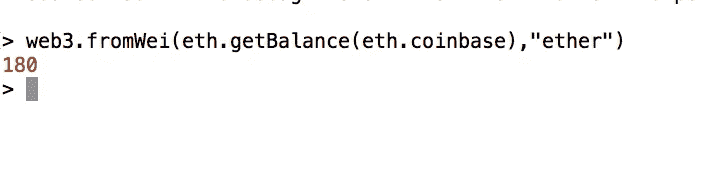

*   现在获取另一个帐户的余额:

```
***web3.fromWei(eth.getBalance(eth.accounts[1]),”ether”)***
```

以下是运行上述命令后的输出:

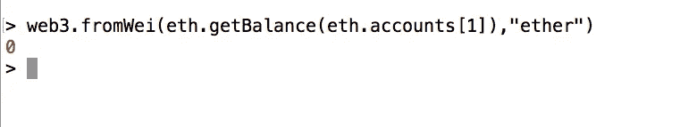

*   为了交换加密货币，即在帐户之间发送以太网，请使用以下命令:

```
***web3.sendTransaction( {from:eth.accounts[0], to:eth.accounts[1], value:web3.toWei(10,”ether”) })***
```

下图显示了上述命令的输出:

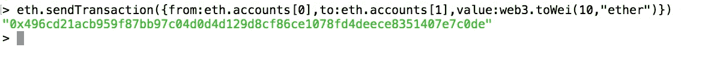

*   您可以在运行 geth 节点的终端上观察事务，hash 与上图所示相同。

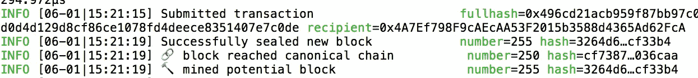

*   现在检查两个账户的余额，如下图所示:

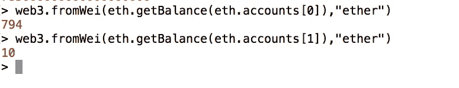

如果您能够进行交易，那么您的设置工作正常。

# 8.停止私有节点

*   要停止您的私有节点，您可以按下 **Ctrl + C**

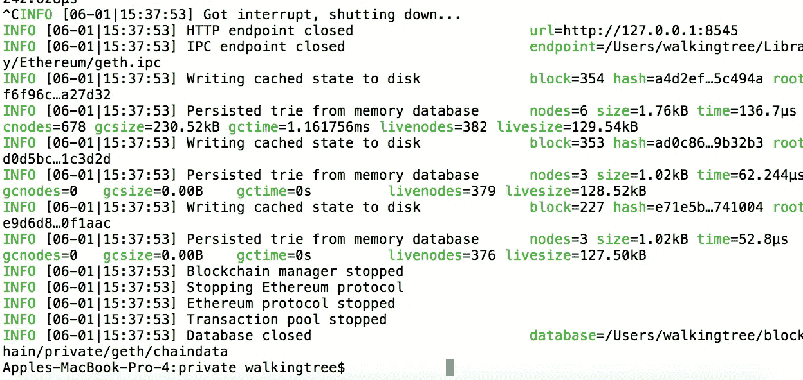

*   上述命令将中断并开始关闭私有节点。
*   它还关闭了 HTTP 和 IPC 端点，并关闭了以太坊协议、事务池和数据库等其他项目。

**来源:** [**在 macOS 上设置私有以太坊节点**](https://walkingtree.tech/setup-private-ethereum-node-on-macos/)