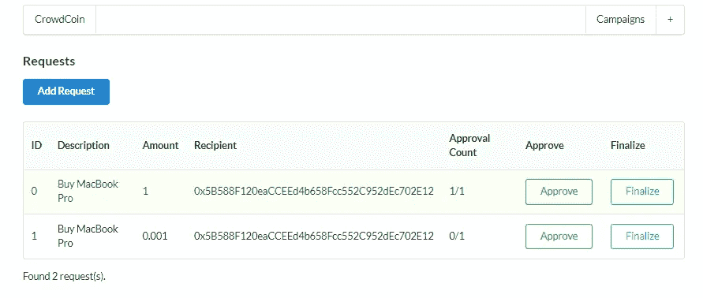
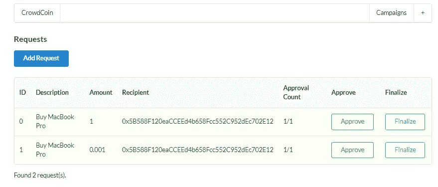

# 与以太坊合作的第一个区块链项目

> 原文：<https://medium.com/coinmonks/setup-the-campaign-project-on-ethereum-1-f542e5a00051?source=collection_archive---------3----------------------->

*活动项目的简要设置步骤。活动应用程序允许经理(活动所有者)创建一个活动，并让人们为他们感兴趣的活动捐款。该活动需要获得足够的批准者和资金，以便经理最终确定该活动。*

我想把所有的荣誉都给**斯蒂芬·格里德**，他是[的导师 **Udemy 课程**来建造这个项目。](https://www.udemy.com/share/101rjU3@nMBieXXtpGkcdP56qbxQJTYvdJufh7AoRrVkMjagA2Hknoba3R1_7QcttzV4Y5snDA==/)

## 我将只解释如何在编辑器上设置项目，但我暂时不会解释其中的任何可靠性代码。

# 应用模型

## 登录页面


## 创建活动页面


## 作出贡献


Only the manager or a campaign owner can create a request with address of the recipient.



I entered too much Ether, so I create a new request.

## 批准请求

您只有在向活动捐款后才能批准请求，因此请确保您已经向活动捐款，否则会出现错误。



## 完成请求

一旦请求被最终确定，钱将被发送给接收者。


Only the manager can finalize a request

> 首先，在 VScode 上安装 [ganache](https://www.trufflesuite.com/ganache) ，solidity 扩展，在 chrome 上安装 Metamask 扩展。确保使用测试网络 ex。林克比测试网络

首先，使用命令提示符创建一个新的项目目录: **mkdir kickstart**

下一个目录改变: **cd kickstart**

然后打了一大串回车…

现在安装软件包: **npm 安装 ganache-CLI mocha solc @ . 4.17 fs-extra web 3**

然后在 VScode 或您首选的 IDE 上打开 kickstart 目录。

在终端运行 **npm install web3，npm install solc@0.4.17**

在 Kickstart 目录下，创建一个**以太坊**文件夹，创建一个 **compile.js** 和 **deploy.js** 文件。接下来在以太坊文件夹中创建另外两个文件夹，名为 **build** 和 **contracts。**

在 contracts 文件夹中，创建一个文件 **Campaign.sol**

并粘贴一个合同代码(如果你有)，如果没有，你可以尝试从 remix 编辑器默认代码。


> 我们应该只运行一次编译脚本，并且应该能够运行我们的应用程序任意多次，而不必再次运行编译脚本。

运行编译脚本后的输出将是构建文件夹中的 CampaignFactory 和 Campaign factory 文件。然后，每当我们想访问 ab 时，我们可以在构建目录中读取它们，而无需重新编译我们的契约。

在综合终端打开以太坊文件夹，运行 **node compile.js** ，等待输出。

## **测试文件设置**

在根项目目录中创建一个**测试**文件夹。接下来创建一个 **Campaign.test.js** 文件，并在脚本部分编辑 package.json 文件，指定“mocha”进行测试。

> "脚本":{
> 
> “测试”:“摩卡”
> 
> }

运行 **npm 运行测试**


## **部署流程**

将部署脚本复制粘贴到 deploy.js 文件中。

安装模块，打开 kickstart 目录中的终端并运行

**NPM install @ truffle/HD wallet-provider**

## **重构部署**

重构 deploy.js 文件的代码，从

const { interface，bytecode } = require('。/compile . js’)；

把它改成

```
**const compiledFactory = require('./build/CampaignFactory.json');**
```

在合同创建过程中， **JSON.parse(interface)** 和**deploy({ data:bytecode })**

将其更新为

const result = wait new web 3 . eth . contract(

JSON . parse(**compiled factory . interface**))

。部署({ data:**compiled factory . bytecode**})

。发送({ gas: '1000000 '，from:accounts[0]})；

console.log('合同部署到'，result . options . address)；

在以太坊目录下的终端上运行 **node deploy.js** 。

一旦部署成功，它将返回

> *试图从帐户 0x7546 部署..
> 合同部署到* ***0xb3b45..***

保留契约部署到的地址，并首先将其粘贴到其他地方，我们将在将来使用它。

## 创建 React App vs. Next.js

创建 react 应用程序只建立一个简单的 react 应用程序不包括任何导航，数据，加载和我们需要的更多功能。

Next.js 是 react 的一个框架，围绕它构建了一系列功能。我们需要 Nect.js 用于多页面应用程序，它还内置了对服务器端渲染和热模块重载的支持。

## 为我们的应用程序设置 Next

打开 Kickstart 目录中的终端并安装模块，

**npm 安装下一个反应反应对象**


在根目录下创建一个 **pages** 文件夹。接下来特别期待看到一个名为“ **pages** 的文件夹。如果你叫它别的什么，它不会工作。然后创建一个文件 **index.js** →此页面显示列出所有活动

启动 next.js 并在 package.json 中添加入口脚本

> "脚本":{
> 
> 《考》:“摩卡”，
> 
> “开发”:“下一个开发”
> 
> }

在这些文件中，**创建一个导出单个 react 组件。**

> 从“React”导入 React；
> 
> export default () => {
> 
> 返回
> 
> # 这是显示页面。
> 
> ；
> 
> };

开始一个项目，看看我们是否能访问这些网页。在 kickstart 目录终端**中执行该命令，npm 运行 dev** 并访问 localhost:3000

在以太坊文件夹中创建 **web3.js** 和 **factory.js** 文件。

## web3.js

创建一个 web3 的新实例，一个由 Metamask 提供的提供者，我们可以通过

web 3 = new web 3(window . web 3 . current provider)；

如果用户在他们的浏览器中没有**元掩码**，它将抛出一个错误，所以我们必须向他们指定这个应用程序需要**元掩码**。

> 从“Web3”导入 web 3；
> 
> 让 web3
> 
> if(窗口类型！== '未定义' && typeof window.web3！== '未定义'){
> 
> //我们在浏览器中，如果元掩码已经在 web3 中注入(用户有元掩码扩展)→元掩码正在运行。
> 
> web 3 = new web 3(window . web 3 . current provider)；
> 
> }否则{
> 
> //我们在服务器上*或者*用户没有运行元掩码
> 
> const provider = new web 3 . providers . http provider(
> 
> '您的 infura 链接'
> 
> );
> 
> web3 =新 web3(提供商)；
> 
> }
> 
> 导出默认 web3

## 工厂. js

> 从'导入 web3。/web 3’；
> 
> 从“”导入 CampaignFactory。/build/campaign factory . JSON '；//已编译的合同:abi
> 
> const instance = new web 3 . eth . contract(
> 
> JSON . parse(campaign factory . interface)，
> 
> '我们上次部署的地址'
> 
> );
> 
> 导出默认实例；

现在我们已经有了 CampaignFactory 实例，可以用来检索已部署活动的列表，并在 react 组件中显示列表。

在 pages 目录中，将 newcampaign.js 文件重命名为 **index.js.**

编辑内容以向用户显示此页面。创建组件文件夹并创建 Layout.js 和 Header.js 文件。因为这些布局和标题，我们希望它出现在我们的应用程序的每一页。

**next . js 在为我们做什么？**


Next.js 使用了一个叫做“**服务器端渲染**的过程。

每当有人访问 next 服务器时，服务器将获取我们的 React 应用程序，而不是将所有的 JS 发送到浏览器，Next 将自己呈现整个 React 应用程序。(所有 JS 代码将在下一个服务器上执行)

该服务器构建 HTML 文档，并将完整呈现的 HTML 文档发送给用户，特别是如果我们的用户在移动设备上。最终 JS 代码被加载到浏览器中。

这种方法让用户比使用 create-react-app 更快地看到屏幕上的内容。

**如果我们不为 next.js 指定要渲染的窗口对象，就会出现错误。**

## 嵌套路由

创建一个新文件夹，并在其中创建新组件。

## 使用 Next.js 导航

用户发起活动后。用户应该能够自动重定向回我们的应用程序的根目录，并看到一个包括他们的新活动已经创建的所有活动的列表。

## npm 安装下一个路由—传统对等 dep

自定义 Next.js 启动什么先转到 server.js。

> "脚本":{
> 
> 《考》:“摩卡”，
> 
> " dev": "node server.js "
> 
> }

## 带有地址(令牌)的自定义路由


## 重新部署战役工厂

这是我们可能会做很多次的事情，更新合同，用新的功能重新部署合同，以返回关于单个活动的所有单独的详细信息。


当你想重新部署合同时，在以太坊文件夹中，运行**节点 compile.js**

然后**节点 deploy.js**

以获取新版本的新协定地址，并确保将此新地址协定更新到 factory.js 中的代码编辑器。

*这只是一个关于如何使用 React 和 Next.js 设置项目以在 web 应用程序上显示的概述。因此，我可以对它如何工作有一个基本的想法，但没有去详细了解里面的代码。*

> 加入 Coinmonks [电报频道](https://t.me/coincodecap)和 [Youtube 频道](https://www.youtube.com/c/coinmonks/videos)了解加密交易和投资

## 另外，阅读

*   [网格交易机器人](https://blog.coincodecap.com/grid-trading) | [Cryptohopper 审查](/coinmonks/cryptohopper-review-a388ff5bae88) | [Bexplus 审查](https://blog.coincodecap.com/bexplus-review)
*   [印度的加密交易所](/coinmonks/bitcoin-exchange-in-india-7f1fe79715c9) | [比特币储蓄账户](/coinmonks/bitcoin-savings-account-e65b13f92451)
*   [币安费用](/coinmonks/binance-fees-8588ec17965) | [僵尸加密审查](/coinmonks/botcrypto-review-2021-build-your-own-trading-bot-coincodecap-6b8332d736c7) | [热点审查](/coinmonks/hotbit-review-cd5bec41dafb)
*   [我的密码交易经验](/coinmonks/my-experience-with-crypto-copy-trading-d6feb2ce3ac5) | [AAX 交易所评论](/coinmonks/aax-exchange-review-2021-67c5ea09330c)
*   [逐位融资融券交易](/coinmonks/bybit-margin-trading-e5071676244e) | [币安融资融券交易](/coinmonks/binance-margin-trading-c9eb5e9d2116) | [超位审核](/coinmonks/overbit-review-9446ed4f2188)
*   [有哪些交易信号？](https://blog.coincodecap.com/trading-signal) | [比特斯坦普 vs 比特币基地](https://blog.coincodecap.com/bitstamp-coinbase)
*   [ProfitFarmers 回顾](https://blog.coincodecap.com/profitfarmers-review) | [如何使用 Cornix 交易机器人](https://blog.coincodecap.com/cornix-trading-bot)
*   [如何匿名购买比特币](https://blog.coincodecap.com/buy-bitcoin-anonymously) | [比特币现金钱包](https://blog.coincodecap.com/bitcoin-cash-wallets)
*   [币安 vs FTX](https://blog.coincodecap.com/binance-vs-ftx) | [最佳(SOL)索拉纳钱包](https://blog.coincodecap.com/solana-wallets)
*   [如何在 Uniswap 上交换加密？](https://blog.coincodecap.com/swap-crypto-on-uniswap) | [A-Ads 审查](https://blog.coincodecap.com/a-ads-review)
*   [加密货币储蓄账户](/coinmonks/cryptocurrency-savings-accounts-be3bc0feffbf) | [YoBit 审核](/coinmonks/yobit-review-175464162c62)
*   [Botsfolio vs nap bots vs Mudrex](/coinmonks/botsfolio-vs-napbots-vs-mudrex-c81344970c02)|[gate . io 交流回顾](/coinmonks/gate-io-exchange-review-61bf87b7078f)
*   [CoinFLEX 评论](https://blog.coincodecap.com/coinflex-review) | [AEX 交易所评论](https://blog.coincodecap.com/aex-exchange-review) | [UPbit 评论](https://blog.coincodecap.com/upbit-review)