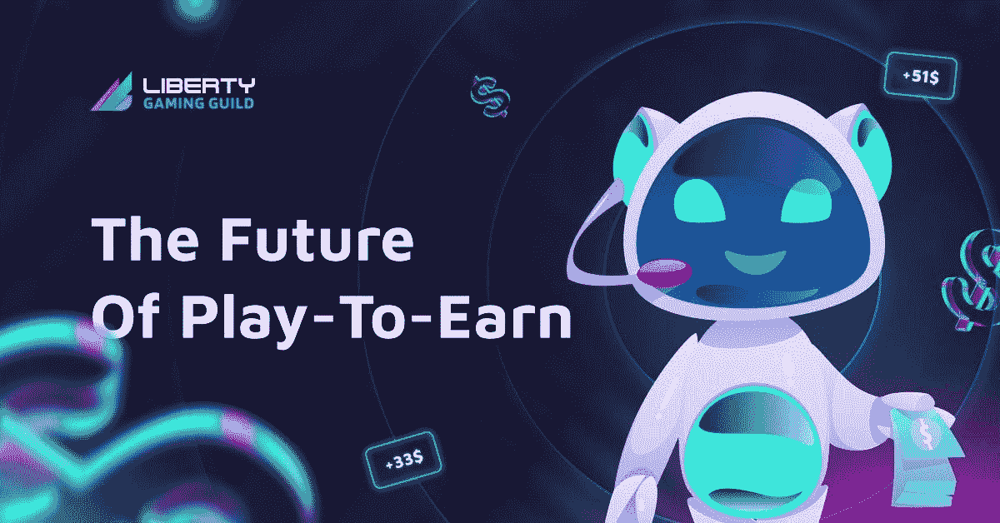

# 用自由塑造游戏赚钱的未来

> 原文：<https://medium.com/coinmonks/shaping-the-future-of-plan-to-earn-with-liberty-43730bdf9750?source=collection_archive---------11----------------------->

## 游戏玩家进入元宇宙的门户

**Source:** [**https://libertygaming.io/**](https://libertygaming.io/)

游戏利基是娱乐业中的顶级利基之一，因为它是玩家的主要乐趣来源，并且它也已经发展成为顶级营销策略。2020 年游戏收入超过 1593 亿美元，全球游戏玩家数量逐年增加，预计将持续增长，2023 年将超过 T2 的 30 亿活跃游戏玩家。

难怪区块链科技也在利用这种增长来建立更可持续和分散的游戏模式，通过推出“玩到赚”模式来让玩家和游戏公司都受益。

“边玩边赚”的游戏模式让世界大吃一惊，因为它利用加密货币、NFT 和区块链技术来创建游戏，玩家可以边玩边赚。他们不仅花费时间、精力和资源做自己喜欢的事情，还能为自己赚取额外的收入。

一个令人惊讶的事实是，这是一种被动收入的方式，即使对于那些有着正常的朝九晚五工作的人来说也是如此，因为他们可以赚取加密货币和 NFT，这些货币和 NFT 可以出售并兑换成菲亚特。随着博彩业的发展和变得更加有利可图，曾经被视为娱乐和闲人的冒险不再是人们追求的机会，因为他们也可以从中获利。

尽管游戏行业的统计数据不断增长，玩赚游戏的兴起，但玩家在玩赚模式中面临两个常见的挑战。对于一个普通人来说，冒险进入其中并享受其中的乐趣可能相当昂贵。新玩家也会发现，要完全理解“玩到赚”的模式，以及加密货币、NFT 和区块链技术在将这些游戏带入生活中的作用。

因此，越来越需要一个生态系统来迎合这一点，并为玩家提供正确的知识。这导致了自由游戏公会的成立。

## **什么是自由游戏公会？**

[Liberty Gaming Guild](https://libertygaming.io/) 是一个突破性的项目，旨在为游戏玩家提供一个进入区块链游戏界之前昂贵且难以进入的 NFT 的入口，并为他们在新游戏时代的学习和发展提供一个生态系统。

它旨在通过降低参与门槛，将全球所有年龄和背景的所有基于加密的游戏玩家引入游戏赚钱世界。

作为一个以社区为中心的项目，它急切地建立一个繁荣的社区，通过 CeFi、Defi、加密货币和区块链技术等相关主题的培训和教育计划来奖励和激励学者。

它向游戏玩家提供奖学金计划，通过购买这些游戏 NFT 并将它们借给符合奖学金计划标准的游戏玩家，将他们带入元宇宙。

有了 Liberty Gaming Guild，希望通过玩 Axie Infinity、Splinterlands、Sandbox 和其他顶级游戏赚取额外收入的玩家可以这样做，并获得更多关于区块链技术如何运作及其给当今世界带来的机遇的知识。