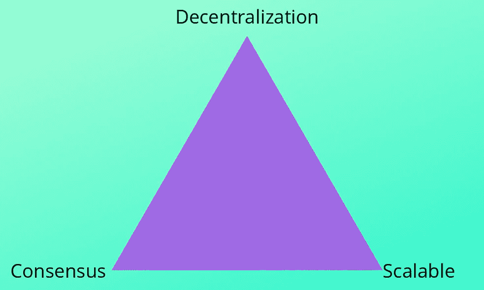
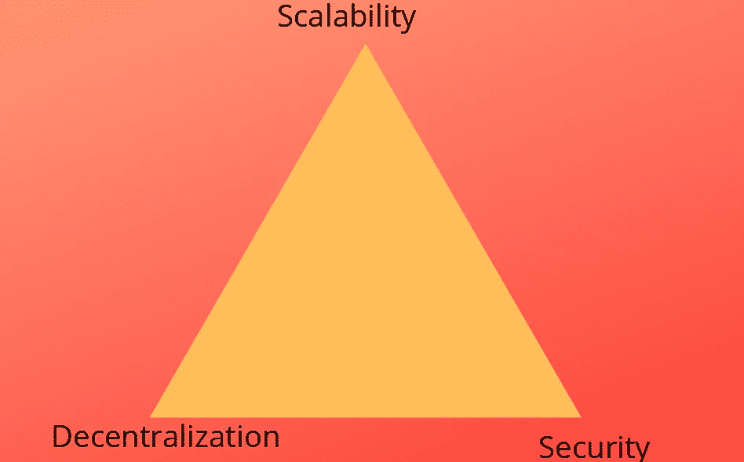
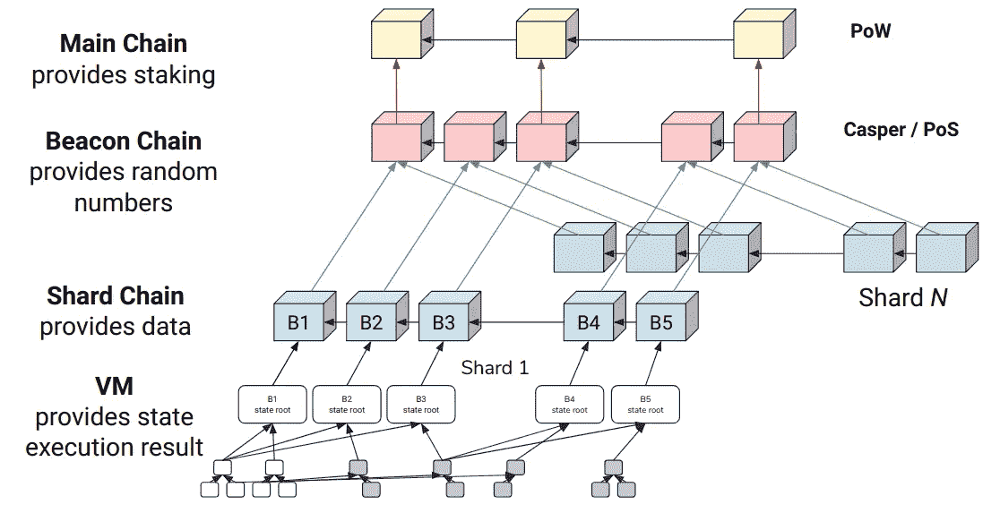
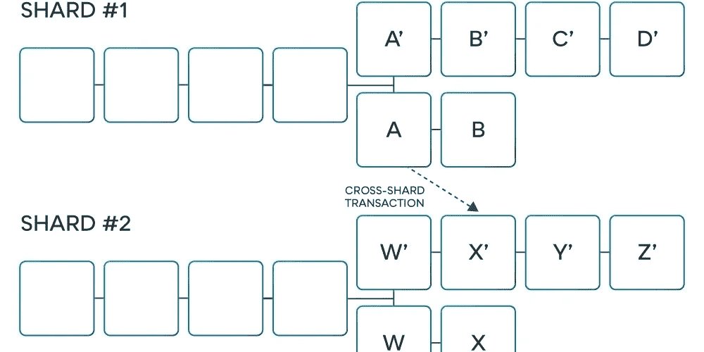

# 切分:以太坊 2.0 的大脑

> 原文：<https://medium.com/coinmonks/sharding-the-brain-of-ethereum-2-0-458c04b2bb5e?source=collection_archive---------1----------------------->

在我们之前的文章中，我们谈到了[信标链](https://blog.coincodecap.com/ethereum-beacon-chain/)。对于心脏，你需要记忆来储存信息。这就是**分片**出现的原因。分片是以太坊 2.0 的记忆中心。让我们来讨论一下 sharding 试图解决的问题。

# DCS 三角形

理想的区块链是不集中的，集中的，可计算的。但在现实中，一个[区块链](https://blog.coincodecap.com/what-is-blockchain-a-simple-guide-for-dummies/)不可能同时拥有这三个。总是有一个或多个特征的折衷，也就是说，你可以拥有任意两个特征，但不能拥有所有三个特征。

比如以太坊和[比特币](https://blog.coincodecap.com/a-candid-explanation-of-bitcoin/)是去中心化的，一致(共识)但不可扩展。同样，Hyperledger Fabric 是一致的、可扩展的，但不是分散的。它用 DCS 三角形直观表示。

# 可伸缩性三元悖论

以太坊团队已经引入了一个名为**可伸缩性三难困境**的三难困境。根据这一点，一个区块链系统最多只能有以下三种性质中的两种:

1.  分散
2.  安全性
3.  可量测性

目前，以太坊每秒可以处理 12-30 笔交易。它优于比特币(每秒可处理 7-10 笔交易)，但远不及 Visa(每秒可处理约 1700 笔交易)。

以太坊中的每个节点都必须处理网络中发生的事务。他们还必须在电脑上存储整个以太坊区块链(大约 300 GB)。这些就是以太坊 1.0 不适合微交易，并且饱受可扩展性问题困扰的原因。

因此，sharding 是以太坊试图通过整合所有三个特性来击败 trilemmas，而没有任何折衷。

从数据库的角度来看，分片是将大型数据库划分为更小的、可管理的、可扩展的数据库片段(称为数据分片)的过程。这就像不是一个人负责所有的任务，而是在多人之间分配任务。我们来看看以太坊 2.0 是如何实现分片功能的。

# 以太网 2.0 中的分片实现

在继续之前，让我们先了解一些重要的术语。

**状态**:状态一般是描述系统在任一时间点的一组信息。在以太坊中，这是包含当前余额的当前账户集，给定时间内的智能合约代码。对于每个新的事务，状态都会发生变化。

**事务**:用户发出的改变系统状态的操作。它可以是以太网转移或部署智能合同。

**Merkle Tree:** 它是一种数据结构，可以通过加密哈希存储大量数据。

**Receipt:** 它是从一个事务中生成的对象，不存储在系统的状态中，而是保存在 Merkle 树中，以便其他节点可以很容易地验证它的存在。

在分片中，整个以太坊区块链的历史和状态被划分成称为**分片**的独立分区。每个碎片都有自己的状态和事务历史。

正如维塔利克所说，“一个简单的思考方式是想象一下，如果以太坊被分割成几千个岛屿。每个岛都可以做自己的事，可以有自己的特色，每个属于那个岛的人都可以享受。如果他们想联系其他岛屿，他们将不得不使用某种协议”。

## 以太坊 2.0 中不同类型的节点

*   **超满节点**-这些节点下载信标链的全部数据
*   **顶层节点** —这些节点只处理信标链块，但不下载分片块的所有数据。
*   **单分片节点** —它们充当顶级节点，但也完全下载和验证它更关心的特定分片上的每个排序规则。
*   **Light node** —仅下载并验证主链块的块头；不处理任何排序规则头或事务，除非它需要读取某个特定碎片状态中的某个特定条目，在这种情况下，它将 Merkle 分支下载到该碎片的最新排序规则头，并从那里下载该状态中所需值的 Merkle 证明。

# 碎片分组

现在你一定想知道分片会在什么基础上发生？一种这样的方案是基于地址划分碎片。

例如，以 0x0 开头的地址将形成一个碎片，以 0x1 开头的地址将形成另一个碎片，以此类推。

对于简单的用例，事务可以发生在一个分片中。一些高级用例可以是跨分片交易，即从分片 A 到分片 b 发生的交易，在这种情况下，收据被用作验证工具。

这是 Vitalik 的一个例子，解释了跨碎片通信

“如果 Bob 在碎片 B 上有 50 个硬币，并且 Alice 从碎片 A 向 Bob 发送 20 个硬币，但是碎片 B 还不知道碎片 A 的状态，因此不能完全认证该转账，Bob 的账户状态暂时变为‘如果来自 Alice 的转账是真实的，则为 70 个硬币，否则为 50 个硬币’能够认证碎片 A 和碎片 B 的客户端可以确定传输的“终结性”(即一旦转账可以在链内被验证，Bob 的账户状态*将*最终解析为 70 个硬币的事实)几乎立即发生，因此他们的钱包可以简单地表现为 Bob 已经有了 70 个硬币。"

从我们之前关于[信标链](https://blog.coincodecap.com/ethereum-beacon-chain/)的文章中，我们知道有一些验证器负责基于利害关系证明来生成块。在每个时间段中，将为特定的碎片随机选择一个验证者(提议者)。

在那之后，验证器将会提出一个包含在碎片中的块。与他/她一起，99 个其他验证者(证明者)将证明该块。一个块的头，连同至少 67 个证明签名(投票)，可以作为包含在碎片中的对象发布。类似地，在第二个槽中，随机选择另一个验证器，该过程继续。

目前，shards 还不支持智能合约。但随着 EVM 的进一步发展，智能合约也将进入碎片市场。分片的最大问题之一是**单分片接管攻击**，在这种攻击中，单个攻击者将他所有的散列能力集中在一个分片上来创建一个恶意分片。以太坊提出通过随机性来克服。分片的第二个问题是欺诈检测，尤其是在跨分片通信的情况下。如果有人发现无效的块，目前还没有标准的协议让其他节点知道它。

**一些有用的链接:**

*原载于 2020 年 5 月 10 日 https://blog.coincodecap.com**的* [*。*](https://blog.coincodecap.com/sharding-in-ethereum/)

> [直接在您的收件箱中获得最佳软件交易](https://coincodecap.com/?utm_source=coinmonks)

