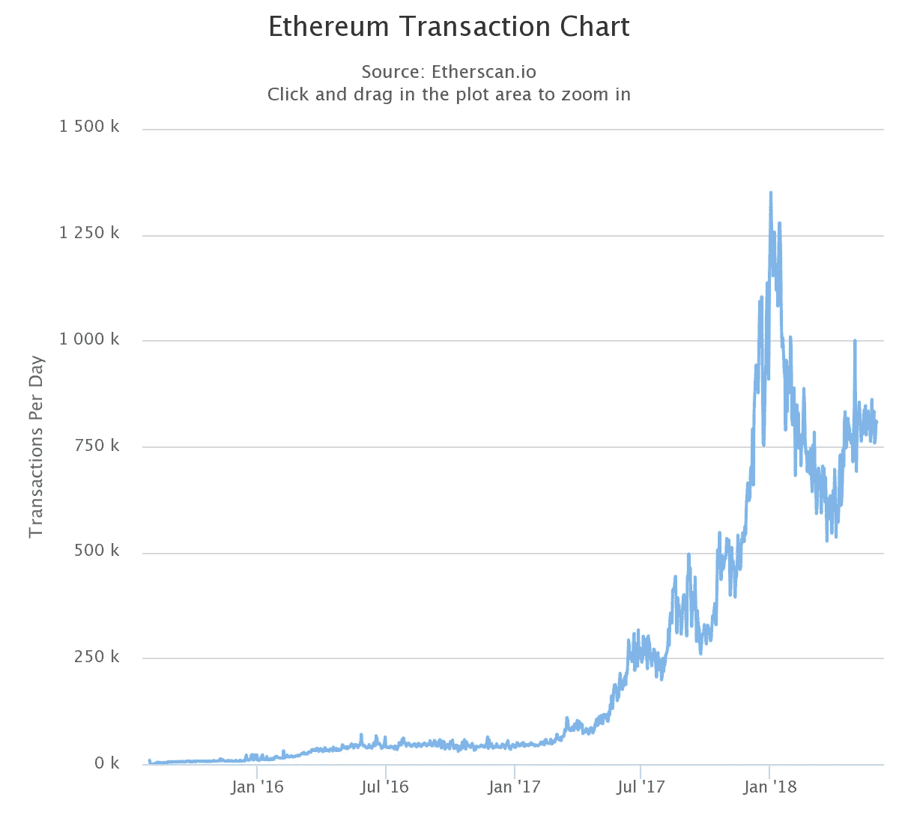
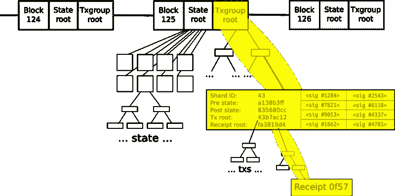

# 碎片，到处都是碎片。

> 原文：<https://medium.com/coinmonks/shards-shards-everywhere-ab28f40cce28?source=collection_archive---------3----------------------->

每秒一百万笔交易:这是维塔利克·布特林昨天对以太坊的碎片和等离子项目发表公开评论后，在过去一天的新闻[文章](http://bitcoinist.com/vitalik-buterin-sharding-plasma-scale-ethereum-10000-times/)中的[承诺](https://smartereum.com/17074/ethereum-eth-will-soon-hit-1-million-transactions-every-second-vitalik-buterin/)。它甚至可以支持每秒一亿次交易，这是惊人的，因为以太坊的瘫痪只需要 130 万次交易。一天之内。

The Cryptokitties spike.

但是什么是分片？什么是血浆？他们真的会有帮助吗？

分片是数据库中数据的水平分区。(如果数据库不是你的管辖范围，这里有一个关于不同类型数据库的[快速入门](/@DanaFLove/blockchain-relational-or-unstructured-a-cio-guide-to-databases-in-the-bitcoin-world-3b25fed9f6f4)。)水平分区意味着数据库表的行保存在数据库的每个实例中，或称为 shard。如果数据库是垂直分区的，那么数据库表的列将保存在不同的实例中。由于每个碎片都保存在一个单独的数据库服务器实例上，因此存在负载分布，这提高了事务速度。

分片的好处通常来自于服务器性能的提高，因为它只包含整个数据库的一小部分。由于数据库分布在大量的机器上，搜索性能可以大大提高。如果数据库设计良好，分片可以减少执行搜索的查询次数(例如，一个分片包含美国客户，另一个包含加拿大客户——搜索加拿大客户根本不需要查询美国客户分片)。)

在数据库理论中，分片通常不被看好。这是一种复杂的方法，具有显著的性能影响，**以至于你通常会发现，只有在尝试了所有其他选项之后，教科书才会建议使用分片**。分片面临的最大挑战是“在哪里切割数据库”的问题。由于数据和索引被分割成不同的块，这显然改善了一些搜索，并使其他搜索更具挑战性。例如，美国和加拿大客户在每个国家都有一个碎片。对特定国家的搜索处理速度非常快；搜索卖给任何客户的产品都非常慢，因为他们需要查询每一个碎片。

另一个不祥的问题是，一个碎片的损坏会导致整个表的故障。随着自动化接管分片，这种情况得到了缓解——但这种缓解是以越来越多的控制软件元素为代价的。

Does anyone remember how bad Master Control Program was in TRON?

分片的另一个问题是增加了对连通性的依赖。服务器必须(并且必须保持)互连，以便在每个点都能看到整个数据库。虽然这可能是不言而喻的，但它是我们考虑在区块链分羹的一个重要条件。

切分在今天的数据库中有效。块范围索引(BRIN)是 Oracle 数据库云服务器系统中使用的一种技术，它与分片有一些重要的相似之处，自动分片用于大型非结构化数据系统，如 MonetDB、Apache HBase 和 Hive。Elasticsearch 在实践中也使用了分片。这些都是重要的例子，说明企业已经很好地利用了分片，并且它在今天的大型环境中也能工作。

切割区块链提出了一些有趣的挑战。Prysmatic Labs 对这些挑战进行了很好的阐述。(我特别感兴趣的是他们的评估，即社区发展如此之快，以至于社区成员可能不愿意参与解决问题。)我不会涉及他们所做的事情，而是尝试观察不同的挑战。

One possible model for sharding: essentially, sidechains. Meh.

虽然区块链使用分布式方法，但它不是一个分布式计算环境。当您打开一个节点时，以太坊会将整个数据库发送给您，节点会“分发”数据库。但是以太坊中没有集中的处理资源，而这是分布式计算的核心。虽然分割以太坊将如何工作还不清楚，但实践是使用分布式计算。

除了简单的架构变化，还有一个实际的变化:交易被验证，挖掘发生在区块链的末尾。谁会想要存储那些仅仅从挖掘能力中获取处理能力的“旧东西”呢？

除了实际的变化，还有一个哲学上的变化:如果不是每个人都能统一、透明地进入区块链，它还是民主的吗？谁拥有主控程序？

布特林在他的[《AMA》中引发了这场新闻狂潮](https://www.youtube.com/watch?v=qD-IbiVpcT8)，提出性能要提高 100 倍。这种说法背后没有数学，但他对自己工作的评估通常是可靠的。尽管如此，这种方法本身(它有许多障碍需要克服)仍然没有解决伸缩问题:它会将 15 TPS(每秒事务数)提升到 1500。

额外的性能提升来自于[等离子](http://plasma.io/)，这是一个始于 2017 年年中的以太坊项目，可能即将就绪。Plasma 是一个让以太坊成为哈希树的模型，考虑到退出故障链。如果你控制管理错误的过程，这是一个迷人的模型。如果你不坐在电脑前，它就没那么迷人了。

*关于达纳洛夫:我目前是两个 ico 的密码经济顾问:*[*eLocations*](https://elocations.io/)*和*[*Intellos*](http://intellos.com)*和总裁兼首席技术官，*[*Radpay*](https://radpay.com/)*的创始人。2011 年首次参与区块链工作，我拥有经济学博士学位(格拉斯哥大学，最高荣誉)、市场营销 MBA 学位(哈佛商学院，贝克学者)和物理学学士学位(里士满大学，Phi Beta Kappa)。自从我年轻时在 MORTRAN 和 ALGOL68G 开始编写代码以来，我已经与人共同创立了五家公司，其中四家成功退出，包括思科资本支持的 Metacloud 和华平投资支持的 Radnet，并领导了包括 GTE(现为威瑞森)、韵律互动(现为凯捷)和 ADC 在内的上市公司部门。我的研究方向是公共政策，最近的研究方向是区块链和大数据对新兴经济体的影响。我过去的一些工作包括构建第一个基于云的 ERP 系统(在 90 年代中期)，开发世界上第一个电信级 VoIP 和统一通信平台(在 GTE，现在的威瑞森)，以及大数据系统的早期工作(作为甲骨文的合作伙伴)。)我在大数据、机器学习、区块链和 VoIP 方面的工作已经在《连线》、甲骨文的《利润》杂志、《金融时报》和《电话》杂志上发表。*