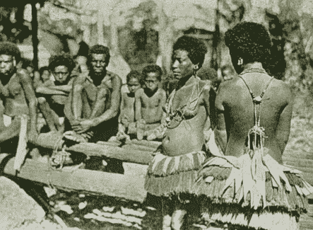

# 给钱:钱的起源

> 原文：<https://medium.com/coinmonks/shelling-out-the-origins-of-money-9311118f3b62?source=collection_archive---------2----------------------->

## ⚠️ 🚨下一次衰退敲门，买比特币。🚨 ⚠️

一个名为 Quant-Network 的项目在 [Twitter](https://twitter.com/coincodecap/status/1161958575037505536) 上给我们发消息，告诉我们如果我们不将他们从 [CoinCodeCap](https://coincodecap.com/scamcoins) 上的诈骗硬币列表中删除，他们将起诉我们。他们试图在推特上欺负我们，像往常一样，我们给了他们🖕🖕

> *多反抗，少服从。*——***沃尔特·惠特曼***

*我们围绕比特币的发展创造了一些美丽的可视化效果，请查看并在 Twitter 上关注 [CoinCodeCap](https://twitter.com/coincodecap) 。*

*   *[4 分钟不到的 10 年比特币发展历程](https://twitter.com/coincodecap/status/1163831437478354944)。*
*   *[过去两年的比特币贡献者](https://twitter.com/coincodecap/status/1163362262431571968)*

*本周故事👇 👇*

*我们大多数人都知道如何挣钱，但我们从来不问“钱是什么”？让我们也明白这一点。我强烈推荐尼克·萨博佐的这篇文章，它是纯粹的“比特币”😄*

## *[脱壳:金钱的起源](https://nakamotoinstitute.org/shelling-out/)*

**

*从一开始，英国在美国的 17 世纪殖民地就有一个问题——硬币短缺。英国人的想法是种植大量的烟草，为他们的全球海军和商船砍伐木材，等等，以此回报他们认为美国人工作所需的物资。实际上，早期的殖民者既要为公司工作，又要在公司商店购物。投资者和政府更喜欢这种方式，而不是以农民可能要求的硬币支付，让农民自己购买供应品——但愿不会如此，还能保留一些利润……[***点击此处阅读全文***](https://nakamotoinstitute.org/shelling-out/)*

*尼克·萨博佐(在推特上关注他)*

> *[直接在您的收件箱中获得最佳软件交易](https://coincodecap.com/?utm_source=coinmonks)*

****

***在 Coinmonks 上发表***

*如果你喜欢在 crypto/区块链空间上写教育文章，并且想在 Coinmonks 出版物上发表。请在***gaur av @*coincodecap*给我发邮件。com*** *或 DM me**[***推特***](https://twitter.com/coinmonks)**

> ***“我们是一份非宣传性、非营利性的教育刊物，如果您喜欢阅读* [*【造反派】*](https://medium.com/coinmonks)*[*您也可以捐助我们*](/coinmonks/monks-need-your-help-7440418d67ec) *。****

******暂时就这样吧，送我❤️，下次再说。******