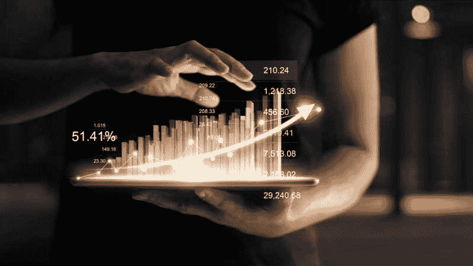

# 柴犬币:最大的数字货币之一

> 原文：<https://medium.com/coinmonks/shiba-inu-coin-meme-to-one-of-the-biggest-digital-currency-573b14ee9f23?source=collection_archive---------7----------------------->

## 找出为什么柴叶 INU 已经成功，仍然是一个高风险的投资，以及投资者的下一步是什么

在过去十年中，加密货币作为一种资产类别变得越来越重要。由于全球广泛采用以及埃隆·马斯克和维塔利克·布特林等知名人士的推文，一些数字资产经历了指数级增长。

在过去的 15 个月里，一种名为“INU”的加密货币的价值飙升了 5 万倍，将 100 美元的投资转化为 500 万美元。柴犬 INU 是一种迷因硬币，于 2020 年 8 月推出，并被宣传为 Dogecoin 的竞争对手。一枚志巴 INU 硬币在交易的第一天定价为每枚 0.0000000051 美元，现在交易价格为每枚 0.00002571 美元。

上月，INU 交易所在全球最大的加密交易所比特币基地上市，导致其象征性价格在接下来的两天里飙升 40%。SHIBA INU 目前的市值为 156.8 亿美元，是世界第 13 大加密货币。

Businessman holding tablet and showing a growing virtual hologram of statistics, graph and chart with an arrow upon the dark background. Business growth, planning and strategy concept. Source: The Motley Fool.

## 是什么推动了 INU 柴草的价格？

虽然有 2100 万个比特币可供挖掘，但 INU 币的总量被限制在一千万亿个。埃隆马斯克的特斯拉今年早些时候表示，它现在的资产负债表上有比特币，导致加密货币价值上升。Mush 还收养了一只柴犬，他在几个场合发了推特，为数字资产的惊人增长做出了贡献。

ShibaSwap 也是一个分散的交易所，于 2021 年初开始运营。投资者现在可以通过押注他们的 INU 柴犬币来赚取利息，这将鼓励交易员更长时间地持有他们的投资，降低市场波动性。

## **为什么柴犬 INU 仍然是高风险投资？**

尽管利润可观，但投资者应该意识到，将 INU 柴犬加入他们的加密货币投资组合充满了危险。比特币市场不受监管，容易受到欺诈。然而，鉴于这种代币在现实世界中缺乏实用性，柴犬 INU 的这些担忧被放大了。

根据 Cryptwerk 的分析，尽管仅在美国就有 3000 多万家企业，但只有 91 家企业接受 SHIB 作为支付手段。另一方面，Dogecoin 被超过 1700 家公司接受，包括 AMC 娱乐公司。

此外，根据比特币基地的数据，代币的平均持有期约为 13 天，这表明交易者购买数字资产的主要目的是快速赚钱，而不是作为长期投资。

## **投资者的下一步**

柴犬 INU 的低持有期和不太令人印象深刻的采用率并没有激发太多的信心。大约有 13，000 种加密货币在流通，预计这一数字在未来还会增加，这给 INU 柴湾带来了保持相关性的额外压力。

就交易成本或处理时间而言，INU 柴草不具备竞争优势。目前，只有超过 75 万人拥有令牌，相比之下，以太坊有 1000 万人，比特币有 7600 万人。此外，排名前 100 位的账户拥有 82%的 SHIB 代币，这削弱了货币去中心化的概念，并使之成为目前一个危险的赌注。

> 加入 Coinmonks [电报频道](https://t.me/coincodecap)和 [Youtube 频道](https://www.youtube.com/c/coinmonks/videos)了解加密交易和投资

## 另外，阅读

*   [Exness 点评](https://blog.coincodecap.com/exness-review)|[moon xbt Vs bit get Vs Bingbon](https://blog.coincodecap.com/bingbon-vs-bitget-vs-moonxbt)
*   [如何开始通过加密贷款赚取被动收入](https://blog.coincodecap.com/passive-income-crypto-lending)
*   [Coldcard 评论](https://blog.coincodecap.com/coldcard-review) | [BOXtradEX 评论](https://blog.coincodecap.com/boxtradex-review)|[uni swap 指南](https://blog.coincodecap.com/uniswap)
*   [阿联酋 5 大最佳加密交易所](https://blog.coincodecap.com/best-crypto-exchanges-in-uae) | [SimpleSwap 评论](https://blog.coincodecap.com/simpleswap-review)
*   购买 Dogecoin 的 7 种最佳方式 | [ZebPay 评论](https://blog.coincodecap.com/zebpay-review)
*   [如何在 Bitbns 上购买柴犬(SHIB)币？](https://blog.coincodecap.com/buy-shiba-bitbns)
*   [最佳期货交易信号](https://blog.coincodecap.com/futures-trading-signals) | [流动性交易所评论](https://blog.coincodecap.com/liquid-exchange-review)
*   [最佳加密交易信号电报](/coinmonks/best-crypto-signals-telegram-5785cdbc4b2b) | [MoonXBT 评论](/coinmonks/moonxbt-review-6e4ab26d037)
*   [OKEx 评论](/coinmonks/okex-review-6b369304110f) | [Coinswitch 俱吠罗评论](/coinmonks/coinswitch-kuber-review-1a8dc5c7a739) | [比特币基地收费](/coinmonks/coinbase-fees-831e77d4f2c5)
*   [AscendEX 审查](/coinmonks/ascendex-review-53e829cf75fa) | [OKEx 交易机器人](/coinmonks/okex-trading-bots-234920f61e60) | [OKEx 交易机器人](/coinmonks/okex-trading-bots-234920f61e60)
*   [火币交易机器人](https://blog.coincodecap.com/huobi-trading-bot) | [如何购买 ADA](https://blog.coincodecap.com/buy-ada-cardano) | [Geco。一篇评论](https://blog.coincodecap.com/geco-one-review)